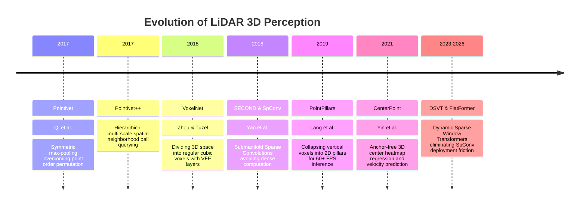
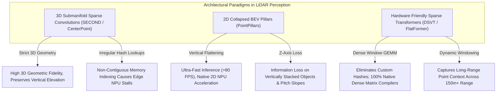

# 📜 LiDAR Perception: Historical Evolution & Paradigms

A didactic overview tracing the progression of 3D point cloud perception: from geometric KD-trees and PointNet permutation-invariant networks to Submanifold Sparse Convolutions (SpConv), Pillar BEV projection, and modern Dynamic Sparse Voxel Transformers.

Related notes: [[topics/lidar-perception/00-lidar-perception-moc|LiDAR Perception MOC]], [[topics/sensor-fusion/00-sensor-fusion-moc|Sensor Fusion MOC]].

---

## 1. Evolution Timeline: From PointNet to Sparse Voxel Transformers

---

## 2. Core Paradigm Breakthroughs Explained

### Breakthrough A: Permutation Invariance (PointNet, 2017)
A point cloud is an unordered set $\{p_1, \dots, p_N\}$. If the order of points is shuffled in memory, the underlying physical geometry remains unchanged. PointNet solved this using a symmetric aggregation function:
$$f(\{p_1, \dots, p_N\}) \approx g\left(\max_{i=1 \dots N} \{h(p_i)\}\right)$$
Where $h$ is a per-point multi-layer perceptron (MLP) and $\max$ is a channel-wise max pooling operation invariant to all $N!$ possible permutations.

---

### Breakthrough B: Submanifold Sparse Convolutions (SECOND / SpConv, 2018)
Standard 3D convolutions dilate sparse features into neighboring empty voxels. Within 2–3 convolutional layers, the entire 3D volume becomes dense, exhausting GPU memory.

Yan et al. introduced **Submanifold Sparse Convolutions**:
- An output site is computed **if and only if** the corresponding input site was non-empty.
- Maintains strict spatial sparsity throughout deep feature backbones, enabling training 20x faster than standard 3D CNNs.

---

### Breakthrough C: The 2D Pillar Representation (PointPillars, 2019)
Instead of operating in 3D, PointPillars collapses the vertical $Z$-axis into vertical columns (pillars):
1. Assign points to infinite vertical 2D grid cells $(x, y)$.
2. Compute a simplified PointNet on each pillar.
3. Scatter features back to a dense 2D Bird's-Eye-View (BEV) image.
4. Apply standard 2D CNN backbones.
- **Impact**: Enabled 60+ FPS 3D detection on embedded automotive hardware.

---

### Breakthrough D: Hardware-Friendly Sparse Transformers (DSVT, 2023–2026)
While SpConv dominated research, compiling custom sparse hash tables onto edge AI chips (e.g. automotive NPUs or FPGAs) was a deployment bottleneck. DSVT organizes sparse active voxels into uniform dynamic windows that compile natively into standard dense matrix multiplication operations (GEMM) supported by all hardware runtimes.

---

## 3. Intensive Architectural Taxonomy: Convolutional vs Transformer vs Hybrid Sub-Modules

3D point cloud perception has progressed from permutation-invariant point MLPs to submanifold sparse 3D convolutional networks, 2D collapsed BEV pillar representations, and hardware-friendly dynamic sparse window transformers.

### Comparative Sub-Module Architectural Matrix

| Model Name & Year | Architectural Paradigm | Backbone Sub-Module | Neck / Feature Aggregator | Encoder Sub-Module | Decoder / Head Sub-Module | Primary Bottleneck & Edge Suitability |
| :--- | :--- | :--- | :--- | :--- | :--- | :--- |
| **PointNet / PointNet++** (2017) | Pure Point MLP | Shared Point-wise MLPs ($h(p_i)$) with symmetric max-pooling | Hierarchical Multi-Scale / Multi-Resolution Set Abstraction grouping | Hierarchical Ball Query Neighborhood Aggregation | Fully Connected Classification / Per-Point Segmentation MLP Head | **Memory Bandwidth & Ball Query Bound**: Extremely slow on large automotive scenes ($>100k$ points); $k$-NN / ball query searches dominate CPU/GPU execution time. |
| **VoxelNet** (2018) | Hybrid Point-3D ConvNet | Regular 3D Voxel Partitioning + Voxel Feature Encoding (VFE) layers | Dense 3D Convolutional Middle Layers (Strided $3\times3\times3$ Convs) | Dense 3D Convolutional Residual Stages | 2D Region Proposal Network (RPN) Anchor-Based 3D Bounding Box Head | **Compute & Memory Blowup Bound**: Dense 3D convolutions dilate into empty voxels; massive memory footprint (>10 GB VRAM); unsuitable for real-time edge use. |
| **SECOND / SpConv** (2018) | Pure Sparse ConvNet | Hard Voxelization ($0.05\text{m}$ grid) + Mean Voxel Feature Extractor | Sparse-to-Dense 2D BEV Feature Compression Layer | Submanifold Sparse 3D Convolutions (SparseConv3D with hash map coordinate indexing) | 2D Convolutional RPN with Sine/Cosine Box Angle Regression Loss | **Memory Access Bound**: Solves 3D memory blowup (20x speedup); custom sparse hash table lookups create non-contiguous DRAM memory access stalls on edge NPUs. |
| **PointPillars** (2019) | 2D Collapsed ConvNet | Pillar VFE (Collapses vertical $Z$-axis into $0.16\text{m}\times0.16\text{m}$ infinite vertical pillars) | 2D Dense Scatter to Bird's-Eye-View (BEV) pseudo-image ($H \times W \times C$) | Standard 2D Convolutional Residual Stages (ResNet-like multi-scale blocks) | Single-Shot 2D Convolutional SSD Anchor-Based Detection Head | **Compute & Edge Friendly**: Global standard for automotive edge deployment; runs at >60–100 FPS on embedded NPUs; slight accuracy loss on small pedestrians/bicycles. |
| **CenterPoint** (2021) | Sparse Conv / Pillar Hybrid | 3D Sparse Voxel Backbone (SpConv) or 2D PointPillars Backbone | Multi-Scale 2D BEV Feature Aggregation (FPN / PANet) | 3D Submanifold Sparse Convolutions or 2D Depthwise Convs | Anchor-Free 2D Center Heatmap Head (Predicts 3D bounding box dimensions, orientation, and 2D velocity vectors $\mathbf{v}$) | **Compute & Accuracy Balanced**: Eliminates hand-crafted 3D rotated anchors; dominant paradigm across autonomous driving benchmarks (nuScenes/Waymo). |
| **Voxel-R-CNN** (2021) | 3D Two-Stage Sparse ConvNet | 3D Submanifold Sparse Convolutional Backbone (SpConv) | 2D BEV Feature Map Generation + 2D RPN Proposal Generator | Voxel RoI Pooling (Directly aggregates 3D voxel features from proposals) | 2-Stage Box Refinement Subnet (Iterative 3D IoU and coordinate refinement) | **Latency Bound**: Matches Point-based 3D accuracy with pure voxel efficiency; 2-stage RoI pooling adds ~15 ms latency, limiting embedded deployment. |
| **DSVT (Dynamic Sparse Voxel Transformer)** (2023–2024) | Pure Sparse Window ViT | Dynamic Sparse Voxel Partition (Dynamic voxelization with zero point padding) | Dense 2D BEV Reshape and Scatter Layer | Dynamic Window Multi-Head Attention (3D W-MHA with dynamic rotated window shifts) | Anchor-Free 3D CenterPoint Detection Head | **Dense GEMM Optimized**: Completely eliminates custom SpConv hash tables; reformulates sparse attention into standard dense GEMM; compiles seamlessly to edge NPUs and TensorRT. |
| **FlatFormer** (2023) | Equal-Size Window Transformer | Equal-Size Dynamic Voxel Tokenizer | Lightweight Cross-Scale BEV Scatter Neck | Equal-Size Window Self-Attention with Fast Spatial Voxel Sorting | Decoupled Center-based 3D Detection Head | **Memory Bandwidth Optimized**: Balances compute across all attention windows; eliminates thread divergence on GPUs; runs at 45 FPS on edge automotive platforms. |
| **Sparse4D / StreamPETR** (2023–2025) | Sparse Anchor Transformer | Dual Modality (Sparse 3D Voxel LiDAR + Camera Feature Pyramid) | Sparse 4D Temporal Anchor Deformable Projection | Spatial-Temporal Cross-Attention over persistent 3D structural queries | Fully Sparse Set Prediction Head (Direct 3D box output, NMS-free) | **KV-Cache & Bandwidth Bound**: Unified end-to-end multi-modal spatial perception; constant-time query complexity; high memory footprint during temporal sequence batching. |

### Didactic Architectural Trade-Off Analysis

#### 1. 3D Submanifold Convolutions (SpConv) vs. 2D Collapsed BEV Pillars
- **Point Density & 3D Voxel Sparsity**: Autonomous driving point clouds contain over 95% empty spatial air. Standard 3D convolutions perform unnecessary floating-point operations over empty space. **Submanifold Sparse Convolutions (SpConv)** evaluate convolutional filters *only* when the center of the kernel coincides with an active non-empty voxel:
  $$y_u = \sum_{k \in \mathcal{K}} W_k \cdot x_{u + k}, \quad \text{for } u \in \mathcal{C}_{\text{in}}$$
  where $\mathcal{C}_{\text{in}}$ is the active coordinate hash table. While this preserves true metric 3D height information, managing the dynamic hash index creates severe memory fragmentation on fixed-function hardware accelerators.
- **2D Pillar Approximation (PointPillars)** collapses all 3D points within a vertical column $(x, y)$ into a single 2D grid cell. By bypassing 3D convolutions completely, the downstream network executes standard 2D convolutions on a dense pseudo-image, running at >100 FPS on automotive edge microprocessors.

#### 2. NPU Compilation Friction: Hash Tables vs. Dense Window Transformers (DSVT)
- **The Sparse Memory Bottleneck**: Dedicated automotive NPUs (e.g. Horizon Journey 5, Qualcomm Ride, Texas Instruments TDA4VM) are designed for contiguous tensor matrix multiplication (GEMM). SpConv's dynamic rule-book generation and gather/scatter operations trigger high DRAM latency due to uncoalesced memory reads.
- **Dynamic Sparse Window Transformers (DSVT)** resolve this by dynamically grouping variable numbers of sparse voxels into fixed-length sequential windows. This maps sparse 3D self-attention directly onto standard dense tensor engines without generating irregular intermediate hash indices, bridging the gap between research accuracy and production edge deployment.

#### 3. Range Degradation ($1/R^2$ Sparsity Decay) and Attention Receptive Fields
- Physical LiDAR point density decays inversely with the square of the distance from the sensor ($D \propto 1/R^2$). At a range of $80\text{--}120\,\text{m}$, a pedestrian may reflect only 2 to 5 isolated beam points.
- Local convolutional kernels ($3\times3\times3$) lack sufficient spatial context to classify these isolated points accurately. In contrast, sparse window transformers dynamically attend to context from nearby road surfaces, curbs, and traffic signs, significantly improving distant object recall.

