# 🛠️ LiDAR Perception: Production Pipeline, Traps & Workarounds

A practitioner's guide to engineering, packetizing, and optimizing 3D point cloud pipelines for autonomous vehicles, mobile robotics, and edge deployment.

Related notes: [[topics/lidar-perception/00-lidar-perception-moc|LiDAR Perception MOC]], [[topics/real-time-systems/00-real-time-systems-moc|Real-Time Systems MOC]].

---

## 1. End-to-End Production Pipeline Architecture

```mermaid
flowchart LR
    Sensor["LiDAR UDP Packets: 100 Mb/s"] --> Kernel["AF_XDP Kernel Bypass Zero-Copy Driver"]
    Kernel --> RingBuf["Lock-Free Circular Point Ring Buffer"]
    RingBuf --> Deskew["Motion Deskewing via IMU High-Rate Spline: 200 Hz"]
    Deskew --> Voxelize["CUDA Hash Dynamic Voxelization"]
    Voxelize --> TRT["TensorRT Engine: DSVT / PointPillars"]
    TRT --> BoxFilter["3D NMS / CenterPoint Velocity Association"]

```



---

## 2. Common Traps, Edge Cases & Hardware Bottlenecks

### Trap 1: Rolling-Shutter Motion Distortion (Skewing)
- **Problem**: Mechanical spinning LiDARs fire beams sequentially over a 100 ms revolution (10 Hz). If the vehicle travels at 100 km/h ($27.7\text{ m/s}$), the vehicle moves **2.77 meters** between the start and end of a single scan. Raw point clouds are heavily warped and sheared.

### Trap 2: Rain, Fog & Airborne Dust Backscatter
- **Problem**: Moisture droplets, dense fog, or exhaust fumes reflect near-field laser pulses ($<3\text{ meters}$), creating thousands of phantom false-positive obstacles that trigger emergency braking.

### Trap 3: Socket Dropouts Under Multi-Gigabit Ethernet Load
- **Problem**: Standard Linux UDP network sockets (`recvfrom`) invoke kernel-to-user memory copies. At 2.5 million points/sec, the Linux networking stack drops up to 15% of UDP packets due to buffer overflow.

---

## 3. Battle-Tested Engineering Workarounds

### Workaround 1: High-Rate IMU Linear Motion Deskewing
Every individual point $p_i$ recorded by a LiDAR includes an exact microsecond timestamp offset $\Delta t_i$. Interpolate vehicle ego-motion using high-rate IMU transforms to project every point into the coordinate frame of the scan's final timestamp $T_{\text{end}}$:

```python
import numpy as np

def deskew_point_cloud(points_xyz: np.ndarray, timestamps: np.ndarray, imu_transforms: dict):
    """
    Deskews 3D points by applying interpolated SE(3) ego-motion transforms
    relative to the scan termination timestamp.
    """
    t_end = timestamps[-1]
    deskewed_points = np.zeros_like(points_xyz)
    
    for i in range(len(points_xyz)):
        dt = t_end - timestamps[i]
        # Interpolate translation and rotation delta from IMU spline
        delta_R = imu_transforms.get_rot(dt)
        delta_T = imu_transforms.get_trans(dt)
        deskewed_points[i] = delta_R @ points_xyz[i] + delta_T
        
    return deskewed_points
```

### Workaround 2: Intensity-Distance Atmospheric Clutter Filtering
Rain and fog droplets produce a distinct signature: extremely low laser return intensity combined with close radial distance:
$$\text{Filter Out if } (\text{Intensity} < \tau_{\text{noise}}) \text{ and } (X^2 + Y^2 + Z^2 < R_{\text{near}}^2)$$

### Workaround 3: Kernel-Bypass Ingestion (AF_XDP)
Bypass the standard Linux TCP/IP network stack entirely using **AF_XDP (eXpress Data Path)** sockets. Packets stream from the Network Interface Card (NIC) directly into a memory-mapped user-space ring buffer with zero copy overhead ($<10\mu\text{s}$ latency).
