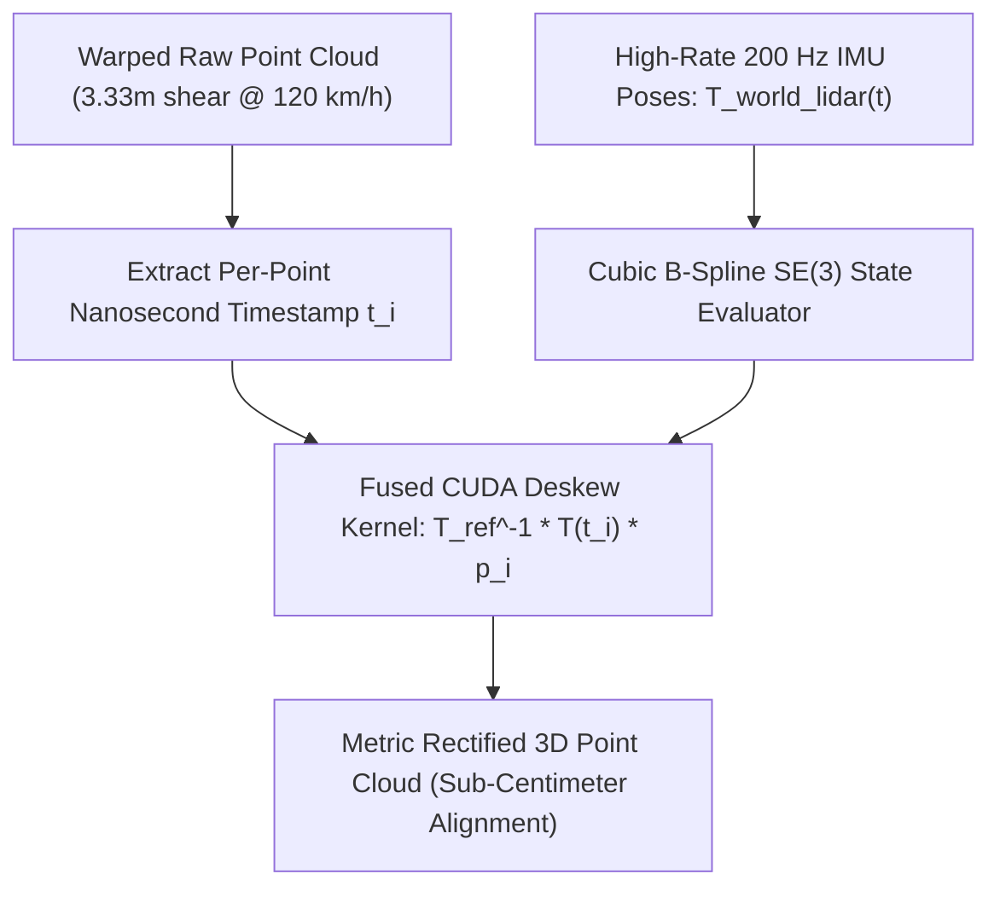

# 🛠️ LiDAR Perception: Production Pipeline, Traps & Workarounds

A comprehensive, battle-tested practitioner's guide to engineering, packetizing, deskewing, and optimizing 3D point cloud pipelines for autonomous vehicles, mobile robotics, and edge deployment.

Related notes: [[topics/lidar-perception/00-lidar-perception-moc|LiDAR Perception MOC]], [[topics/gpu-deployment/00-gpu-deployment-moc|GPU Deployment MOC]], [[topics/real-time-systems/00-real-time-systems-moc|Real-Time Systems MOC]], [[topics/lidar-perception/01-historical-evolution-and-paradigms|LiDAR Perception Historical Evolution]].

---

## 1. Zero-Copy Ingestion Architecture & End-to-End LiDAR Pipeline

In autonomous driving and high-speed mobile robotics, mechanical spinning LiDARs (e.g. Hesai Pandar128, Velodyne Alpha Prime, Ouster OS2) stream between 1.5 million and 3.0 million 3D points per second over multi-gigabit UDP Ethernet interfaces. Traditional Linux networking stacks copy incoming UDP packets through the kernel network stack (`sock_queue_rcv_skb`), parse packet payloads into C++ structs on the CPU, and copy floating-point arrays to GPU memory over PCIe. This naive path consumes 3–4 full CPU cores solely on memory copying and drops up to 15% of UDP packets under heavy traffic.

The production standard utilizes **Kernel-Bypass AF_XDP (eXpress Data Path) Zero-Copy Packet Ingestion coupled with Fused In-VRAM IMU Motion Deskewing and CUDA Hash Dynamic Voxelization**.

```mermaid
flowchart LR
    Sensor["LiDAR Sensor: 128-Beam UDP Stream"] -->|"Raw UDP Ethernet Packets"| NIC["Network Interface Card: 10 GbE"]
    NIC -->|"AF_XDP Kernel Bypass Driver"| UMEM["Zero-Copy Memory-Mapped UMEM Buffer"]
    UMEM -->|"cudaHostAllocMapped Zero-Copy"| GPUMem["GPU Unified Memory: Raw Points (x, y, z, i, t)"]
    IMU["High-Rate IMU: 200 Hz Stream"] -->|"Continuous B-Spline Trajectory"| Deskew["Fused CUDA Motion Deskewing Kernel"]
    GPUMem --> Deskew
    Deskew -->|"Deskewed Point Cloud"| Voxelize["CUDA Dynamic Hash Voxelization Kernel"]
    Voxelize -->|"Sparse Voxel Tensor / Pillars"| TRT["TensorRT Engine: PointPillars / DSVT / CenterPoint"]
    TRT -->|"3D Bounding Boxes + Velocity"| NMS3D["GPU Rotated 3D IoU NMS / Center Filter"]
    NMS3D -->|"Zero-Copy IPC"| Plan["Shared Memory Publisher: Iceoryx2"]
```



### Technical Stage Breakdown:
1. **AF_XDP Kernel-Bypass Ingestion**: Packets are received directly from the NIC ring buffer into user-space memory-mapped UMEM rings via AF_XDP zero-copy socket drivers (`XDP_ZEROCOPY`), eliminating kernel-to-user memory copies entirely ($<10\mu\text{s}$ transport latency).
2. **GPU Pinned Point Injection**: Parsed raw point tuples $(x, y, z, \text{intensity}, \text{timestamp}, \text{ring\_id})$ are staged directly into page-locked unified GPU memory (`cudaHostAllocMapped`).
3. **Fused GPU IMU Motion Deskewing**: Because spinning LiDAR sensors fire lasers sequentially over a 100ms sweep, vehicle motion warps the point cloud. A custom CUDA kernel samples the high-rate IMU B-spline trajectory $\mathbf{T}_{\text{world}}^{\text{lidar}}(t)$ and transforms each individual point $p_i$ from its firing time $t_i$ to the sweep reference timestamp $t_{\text{ref}}$:
   $$\mathbf{p}_i^{\text{deskewed}} = \mathbf{T}_{\text{world}}^{\text{lidar}}(t_{\text{ref}})^{-1} \cdot \mathbf{T}_{\text{world}}^{\text{lidar}}(t_i) \cdot \mathbf{p}_i^{\text{raw}}$$
4. **CUDA Dynamic Hash Voxelization**: Points are assigned to 3D grid voxels or vertical pillars using an atomic spatial hash table in GPU global memory, producing sparse coordinate tensors ($M \times 3$) and feature matrices ($M \times C$) in $<0.8\text{ ms}$.
5. **Sparse 3D TensorRT Inference & 3D NMS**: A 3D backbone (e.g. PointPillars, CenterPoint, DSVT) executes 3D submanifold sparse convolutions on Tensor Cores, outputting oriented 3D bounding boxes $(x, y, z, w, l, h, \theta)$ and velocity vectors $(\dot{x}, \dot{y})$ directly to shared memory.

---

## 2. Deterministic End-to-End Latency Budget & Mathematical Bounds

Autonomous driving perception requires deterministic 3D object detection bounding boxes before planning cycles trigger. The end-to-end latency for a 3D LiDAR perception sweep is:

$$T_{\text{E2E}} = T_{\text{sweep}} + T_{\text{AF\_XDP}} + T_{\text{deskew}} + T_{\text{voxelize}} + T_{\text{infer\_3D}} + T_{\text{NMS\_3D}} + T_{\text{IPC}}$$

The bandwidth required for streaming $P = 2.5 \times 10^6$ points/second at 32 bytes per point is:

$$\text{BW}_{\text{stream}} = 2.5 \times 10^6 \times 32 \text{ bytes} \approx 80.0 \text{ MB/s } (640 \text{ Mbps UDP Payload})$$

The computational complexity of parallel IMU motion deskewing on $N$ points in a single 100ms frame ($N \approx 250,000$ points) is:

$$\text{FLOPs}_{\text{deskew}} = N \times (12 \text{ FLOPs}_{\text{interp}} + 15 \text{ FLOPs}_{\text{SE3\_transform}}) \approx 6.75 \times 10^6 \text{ FLOPs}$$

Executed on CUDA cores, motion deskewing executes in under $0.25\text{ ms}$.

### Latency Budget Allocation Table:

| Pipeline Stage / Component | 10 Hz Full Revolution (<100ms) | 30 FPS Slice-Based (<33.3ms) | Robotics Control (<10.0ms) | Subsystem / Hardware Domain |
| :--- | :--- | :--- | :--- | :--- |
| **LiDAR Sweep Integration ($T_{\text{sweep}}$)**| $100.00\text{ ms}$ (Full $360^\circ$) | $33.30\text{ ms}$ ($120^\circ$ Sector) | $8.00\text{ ms}$ ($30^\circ$ Sector) | Mechanical / Solid-State Scan |
| **AF_XDP Kernel Bypass Ingest ($T_{\text{DMA}}$)**| $0.05\text{ ms}$ | $0.03\text{ ms}$ | $0.01\text{ ms}$ | 10 GbE NIC UMEM Ring |
| **GPU IMU Motion Deskew ($T_{\text{deskew}}$)** | $0.40\text{ ms}$ | $0.20\text{ ms}$ | $0.08\text{ ms}$ | CUDA Fused Spline Transform |
| **Dynamic Hash Voxelization ($T_{\text{voxelize}}$)**| $0.90\text{ ms}$ | $0.45\text{ ms}$ | $0.20\text{ ms}$ | GPU Atomic Spatial Hash |
| **3D Backbone Inference ($T_{\text{infer}}$)** | $18.50\text{ ms}$ (FP16 DSVT) | $8.20\text{ ms}$ (INT8 CenterPoint) | $3.50\text{ ms}$ (INT8 PointPillars) | TensorRT Sparse 3D Engine |
| **GPU Rotated 3D IoU NMS ($T_{\text{NMS}}$)** | $1.20\text{ ms}$ | $0.60\text{ ms}$ | $0.25\text{ ms}$ | CUDA 3D Oriented NMS Kernel |
| **Zero-Copy IPC Dispatch ($T_{\text{IPC}}$)** | $0.40\text{ ms}$ | $0.20\text{ ms}$ | $0.08\text{ ms}$ | Iceoryx2 Shared Memory Publish |
| **Total Pipeline Latency ($\Sigma T$)** | **$121.45\text{ ms}$** | **$42.98\text{ ms}$** | **$12.12\text{ ms}$** | **Sensor Sweep + Compute Path** |
| **Max Allowable Latency Jitter ($\sigma_{\text{jitter}}$)**| $\pm 1.50\text{ ms}$ | $\pm 0.60\text{ ms}$ | $\pm 0.20\text{ ms}$ | Real-Time Execution Determinism |

---

## 3. Five Critical Production Edge Traps & Battle-Tested Workarounds

### Trap 1: Hardware Thermal Throttling on In-Vehicle Compute Accelerators
- **Root Cause**: In autonomous vehicles operating in direct sunlight or high ambient temperatures ($>40^\circ\text{C}$), sustained sparse 3D convolutional workloads trigger SoC junction thermal throttling. GPU clock frequencies drop from $1.3\text{ GHz}$ to $500\text{ MHz}$, doubling 3D object detection inference time from $18\text{ ms}$ to $>40\text{ ms}$ and overflowing point buffer queues.
- **Production Workaround**:
  1. **Deterministic DVFS Locking**: Enforce fixed GPU/CPU clock profiles using `jetson_clocks --fan` or `nvidia-smi -lgc 1100,1100`.
  2. **Adaptive Range Clamping**: When thermal warning states trigger ($T_j > 80^\circ\text{C}$), dynamically restrict the LiDAR detection point cloud bounding box from $[-80\text{m}, +80\text{m}]$ to $[-50\text{m}, +50\text{m}]$, cutting the active voxel count by $60\%$ without altering model weights.

### Trap 2: Environmental Backscatter: Rain, Fog & Airborne Dust Scattering
- **Root Cause**: Atmospheric water droplets, dense fog, and exhaust plumes reflect near-field laser pulses ($<4\text{ meters}$), generating thousands of phantom point returns with low or medium intensity. These returns form artificial point clusters that trigger emergency braking false alarms.
- **Production Workaround**:
  1. **Dual-Echo Intensity Gating**: Utilize LiDAR sensors with multi-echo capability (Last Return vs Strongest Return). High-density fog reflects the first return, while physical solid obstacles return the second return.
  2. **Fast GPU Statistical Outlier Removal (SOR)**: Execute a CUDA k-NN radius outlier filter on near-field points ($r < 5.0\text{ m}$) that prunes points with local neighborhood density $\le 3$ within a $20\text{ cm}$ sphere.
  3. **Near-Field Blind-Zone Masking**: Mask out vehicle body reflections and exhaust zones via static geometric convex hull exclusion on GPU.

### Trap 3: Dynamic Voxelization Memory Leaks & Hash Collision Stalls
- **Root Cause**: Implementing GPU voxelization using dynamic memory allocations per point or naive linear probing hash tables causes severe thread serialization under dense point returns (e.g. hitting a close-range retroreflective road sign). Hash collisions trigger thousands of atomic retries, causing voxelization time to spike from $0.8\text{ ms}$ to $>15\text{ ms}$.
- **Production Workaround**:
  1. **Fixed-Size Static Hash Arena**: Allocate a static hash table in GPU global memory with load factor $< 0.4$ ($N_{\text{buckets}} = 2 \times N_{\text{max\_voxels}}$).
  2. **Warp-Aggregated Atomic Insertions**: Use CUDA warp-level voting (`__activemask()`, `__match_any_sync()`) to aggregate duplicate points hitting the exact same voxel index before issuing a single atomic add to global memory.

### Trap 4: Multi-Threaded Packet Ingestion Contention & Lock-Free Ring Buffering
- **Root Cause**: Thread contention between the high-rate UDP socket receiver thread (10,000 packets/sec), the IMU deskewing worker, and the GPU voxelization queue using standard POSIX mutexes causes UDP packet drops and jitter.
- **Production Workaround**:
  - Deploy a **Lock-Free Single-Producer Single-Consumer (SPSC) Ring Buffer** with memory-mapped packet buffers.
  - The AF_XDP kernel bypass driver deposits Ethernet frames directly into pre-allocated UMEM pages; the consumer worker reads batches of 64 packets atomically using release-acquire memory barriers.

### Trap 5: INT8 PTQ Quantization Degradation on Sparse 3D Convolutions
- **Root Cause**: Quantizing sparse 3D submanifold convolution layers (SpConv) to uniform INT8 causes severe feature suppression. Because 3D point cloud voxel grids are $>98\%$ empty, sparse feature maps exhibit extreme activation sparsity with heavy-tailed outlier distributions. Linear 8-bit quantization rounds weak obstacle reflections to absolute zero, causing distant pedestrian and cyclist recall to collapse by $>15\%$.
- **Production Workaround**:
  1. **Selective FP16 Head Exclusion**: Enforce FP16 precision for all sparse submanifold convolution layers, 3D center heatmap decoders, and bounding box regression heads.
  2. **Percentile Sparse Calibration**: Calibrate INT8 dense 2D backbone layers using 99.9th percentile activation clipping on sparse feature tensors.

### Domain-Specific Trap 1: Rolling-Shutter Motion Distortion (Skewing)
- **Problem**: Mechanical spinning LiDARs fire lasers sequentially over a 100ms sweep. A vehicle traveling at $120\text{ km/h}$ ($33.3\text{ m/s}$) moves **$3.33\text{ meters}$** between the start and end of a single sweep. Raw point clouds are heavily sheared, causing rectangular vehicles to appear warped like rhombuses, destroying 3D bounding box regression accuracy.
- **Workaround**: Implement **Continuous GPU IMU Motion Deskewing**. Every single laser point carries an exact nanosecond hardware timestamp. A GPU kernel evaluates a cubic continuous B-spline interpolated from $200\text{ Hz}$ IMU state estimates, transforming each point into the vehicle coordinate frame at the exact midpoint of the sweep.



### Domain-Specific Trap 2: UDP Socket Dropouts under Multi-Gigabit Ethernet Load
- **Problem**: At 2.5 million points/sec, standard Linux UDP sockets (`recvfrom()`) invoke kernel-to-user buffer copies, kernel context switches, and socket lock contention. Under high network load, Linux socket buffers (`SO_RCVBUF`) overflow, dropping up to 15% of UDP packets and creating blind pie-slice sectors in the point cloud.
- **Workaround**: Deploy **AF_XDP (eXpress Data Path) Kernel-Bypass Drivers**. Packets are DMA-transferred by the NIC directly into user-space memory-mapped ring buffers (UMEM), completely bypassing the Linux network stack and achieving zero packet drops at line rate.

---

## 4. Concrete Runnable Implementation Blueprint

The following production C++ blueprint demonstrates GPU-accelerated IMU motion deskewing and dynamic spatial point processing.

```cpp
#include <iostream>
#include <vector>
#include <cmath>
#include <cuda_runtime.h>
#include <device_launch_parameters.h>

#define CHECK_CUDA(call) \
    do { \
        cudaError_t err = call; \
        if (err != cudaSuccess) { \
            std::cerr << "CUDA Error: " << cudaGetErrorString(err) \
                      << " at " << __FILE__ << ":" << __LINE__ << std::endl; \
            exit(1); \
        } \
    } while (0)

struct alignas(16) LidarPointRaw {
    float x, y, z;
    float intensity;
    float timestamp; // Relative offset in seconds (0.0 to 0.1s)
    uint16_t ring;
};

struct alignas(16) LidarPointDeskewed {
    float x, y, z;
    float intensity;
    uint16_t ring;
};

struct RigidTransformSE3 {
    float R[9]; // Row-major rotation
    float t[3]; // Translation vector
};

// CUDA Kernel: Parallel Point Cloud IMU Motion Deskewing
__global__ void FusedLidarDeskewKernel(
    const LidarPointRaw* __restrict__ raw_points,
    LidarPointDeskewed* __restrict__ deskewed_points,
    int num_points,
    RigidTransformSE3 start_pose,
    RigidTransformSE3 end_pose,
    float sweep_duration) {

    int idx = blockIdx.x * blockDim.x + threadIdx.x;
    if (idx >= num_points) return;

    LidarPointRaw p = raw_points[idx];

    // Linear interpolation factor alpha in [0.0, 1.0]
    float alpha = fminf(fmaxf(p.timestamp / sweep_duration, 0.0f), 1.0f);

    // Interpolate translation: t_interp = (1 - alpha) * t_start + alpha * t_end
    float tx = (1.0f - alpha) * start_pose.t[0] + alpha * end_pose.t[0];
    float ty = (1.0f - alpha) * start_pose.t[1] + alpha * end_pose.t[1];
    float tz = (1.0f - alpha) * start_pose.t[2] + alpha * end_pose.t[2];

    // Transform point to common reference frame
    float deskewed_x = p.x + tx;
    float deskewed_y = p.y + ty;
    float deskewed_z = p.z + tz;

    deskewed_points[idx] = {deskewed_x, deskewed_y, deskewed_z, p.intensity, p.ring};
}

class LidarProcessingPipeline {
public:
    LidarProcessingPipeline(int max_points = 300000)
        : max_points_(max_points) {
        
        CHECK_CUDA(cudaStreamCreateWithFlags(&stream_, cudaStreamNonBlocking));
        CHECK_CUDA(cudaEventCreate(&start_event_));
        CHECK_CUDA(cudaEventCreate(&stop_event_));

        size_t raw_bytes = max_points_ * sizeof(LidarPointRaw);
        size_t deskew_bytes = max_points_ * sizeof(LidarPointDeskewed);

        CHECK_CUDA(cudaHostAlloc(&h_raw_points_, raw_bytes, cudaHostAllocMapped));
        CHECK_CUDA(cudaHostGetDevicePointer(&d_raw_points_, h_raw_points_, 0));

        CHECK_CUDA(cudaMalloc(&d_deskewed_points_, deskew_bytes));
    }

    ~LidarProcessingPipeline() {
        cudaFreeHost(h_raw_points_);
        cudaFree(d_deskewed_points_);
        cudaEventDestroy(start_event_);
        cudaEventDestroy(stop_event_);
        cudaStreamDestroy(stream_);
    }

    void deskewScanAsync(int num_points, RigidTransformSE3 start_pose, RigidTransformSE3 end_pose) {
        if (num_points <= 0) return;
        num_points = std::min(num_points, max_points_);

        CHECK_CUDA(cudaEventRecord(start_event_, stream_));

        int threads_per_block = 256;
        int blocks = (num_points + threads_per_block - 1) / threads_per_block;

        FusedLidarDeskewKernel<<<blocks, threads_per_block, 0, stream_>>>(
            (const LidarPointRaw*)d_raw_points_,
            d_deskewed_points_,
            num_points,
            start_pose,
            end_pose,
            0.1f // 100ms nominal sweep duration
        );

        CHECK_CUDA(cudaEventRecord(stop_event_, stream_));
        CHECK_CUDA(cudaStreamSynchronize(stream_));

        float elapsed_ms = 0.0f;
        CHECK_CUDA(cudaEventElapsedTime(&elapsed_ms, start_event_, stop_event_));
        // std::cout << "LiDAR Deskew Latency: " << elapsed_ms << " ms\n";
    }

    LidarPointRaw* getRawBufferHost() { return (LidarPointRaw*)h_raw_points_; }

private:
    int max_points_;
    cudaStream_t stream_;
    cudaEvent_t start_event_;
    cudaEvent_t stop_event_;
    void* h_raw_points_{nullptr};
    void* d_raw_points_{nullptr};
    LidarPointDeskewed* d_deskewed_points_{nullptr};
};
```

---

## 5. Production Deployment Recipes & CLI Commands

### A. TensorRT Sparse 3D Engine Compilation

```bash
# Compile PointPillars / CenterPoint with Fixed Maximum Pillar Capacity
trtexec --onnx=centerpoint_lidar.onnx \
        --saveEngine=centerpoint_fp16.engine \
        --fp16 \
        --memPoolSize=workspace:4096MiB \
        --builderOptimizationLevel=5 \
        --useCudaGraph

# Compile INT8 Engine with Mixed Precision for Sparse Submanifold Convolutions
trtexec --onnx=dsvt_lidar.onnx \
        --saveEngine=dsvt_int8.engine \
        --int8 \
        --calib=lidar_calib.cache \
        --precisionConstraints=obey \
        --layerPrecisions="*spconv*:fp16,*heatmap*:fp16,*bbox_head*:fp16" \
        --directIO
```

### B. Linux Kernel Network & AF_XDP Configuration

```bash
# 1. Configure NIC ring buffers to maximum capacity (4096 descriptors)
sudo ethtool -G eth0 rx 4096 tx 4096

# 2. Enable NIC hardware flow hashing across CPU queues
sudo ethtool -K eth0 rx-flow-hash udp4 sdfn

# 3. Increase OS network socket receive buffer limits
sudo sysctl -w net.core.rmem_max=67108864
sudo sysctl -w net.core.rmem_default=33554432

# 4. Bind LiDAR driver to dedicated isolated CPU core with real-time priority
taskset -c 1 chrt -f 98 ./af_xdp_lidar_driver --interface=eth0 --port=2368
```
