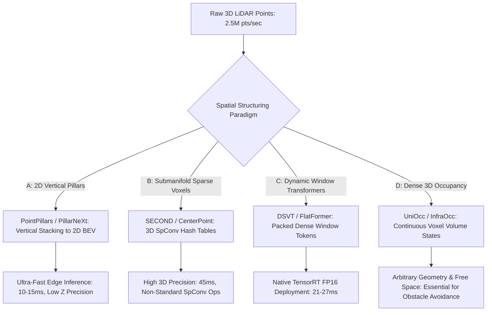

# ⚙️ LiDAR Perception: Voxelization, 3D Occupancy & Open Frontiers

A deep systems investigation into point cloud voxelization, hardware-friendly sparse transformers, 3D Occupancy Networks (OccNet), cross-sensor domain shift, and unsolved research frontiers in autonomous LiDAR perception.

Related notes: [[topics/lidar-perception/00-lidar-perception-moc|LiDAR Perception MOC]], [[architectures/3d-pointclouds-and-lidar/dsvt|DSVT & FlatFormer Deep-Dive]].

---

## 1. 3D Representation Paradigms Compared

### Representation Architecture Matrix
| Paradigm | SOTA Representative | Processing Latency | Native TensorRT Compilable? | Captures Arbitrary Obstacles? | Small Object Resolution |
| :--- | :--- | :--- | :--- | :--- | :--- |
| **2D Pillar Grid** | PillarNeXt | **14.5 ms** | **Yes** (Standard 2D Conv) | No (Bounding box only) | Moderate |
| **3D Submanifold Voxel** | CenterPoint (SpConv)| 45.0 ms | No (Requires SpConv plugins) | No (Bounding box only) | High |
| **Dynamic Sparse Window**| DSVT, FlatFormer | 21.0 - 27.0 ms | **Yes** (GEMM Window Attention)| No (Bounding box only) | **Highest** |
| **3D Occupancy Grid** | UniOcc, InfraOcc | 35.0 - 50.0 ms | **Yes** (Dense 3D Deconv) | **Yes** (Continuous geometry) | High |

---

## 2. The Shift to 3D Occupancy Networks (OccNet)

Bounding box detectors assume every object belongs to a predefined geometric class (Car, Pedestrian, Cyclist). In the real world, autonomous systems encounter **unclassified obstacles**:
- Overturned construction barriers, loose cargo on highways, tree branches hanging into roads.
- Bounding box detectors output zero detections, leading to collisions.

### The Occupancy Solution:
3D Occupancy Networks partition the complete physical volume into a discrete voxel grid ($256 \times 256 \times 32$), predicting two properties per voxel:
1. **Occupancy State**: $O(x, y, z) \in \{0, 1\}$ (Occupied vs. Free Space).
2. **Semantic Category**: $\{ \text{Drivable, Sidewalk, Vegetation, Vehicle, Debris, Unknown} \}$.

---

## 3. Current Open Problems in LiDAR Perception

### 🔴 Problem 1: Cross-Sensor Scan Pattern Domain Shift
- **The Failure Mode**: A model trained on a 128-beam spinning mechanical LiDAR (e.g. Ouster / Velodyne) with regular concentric rings fails completely when deployed on a solid-state MEMS or prism-scanning LiDAR (e.g. Livox / Hesai) with irregular non-repetitive flower-pattern scans.
- **Why Models Fail**: Learned convolutional spatial priors overfit to the exact angular ring distribution of the training sensor.
- **Recent Frontier Solutions (2025–2026)**:
  - **Sensor-Agnostic Density Normalization (DCGNN)**: Resampling incoming point clouds into continuous implicit distance fields before voxelization.

---

### 🔴 Problem 2: Small Object & Distant Pedestrian Detection at >150m
- **The Failure Mode**: At 150 meters, a 128-beam LiDAR returns only **1 to 3 isolated laser points** on a human pedestrian.
- **Why Voxel Transformers Fail**: With only 2 points, there is insufficient spatial geometry to compute local neighborhood covariance or window attention.
- **Recent Frontier Solutions**:
  - Multi-frame temporal accumulation using high-precision IMU deskewing (accumulating 5–10 consecutive scans) to reconstruct 20+ points on distant targets.

---

### 🔴 Problem 3: Adversarial Coordinate Perturbations & Structural Noise
- **The Failure Mode**: Shifting a tiny fraction of point coordinates by just 2 centimeters along high-gradient boundaries causes deep voxel networks to hallucinate ghost obstacles or delete real vehicles.
- **Active Research Direction**: Certifiable geometric smoothing and point-order randomized smoothing defenses.
