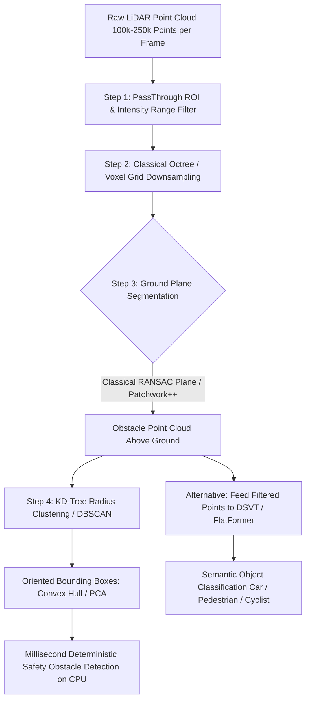

# 📐 LiDAR Perception: Classical Filtering, Clustering & Hybrids

A deep systems investigation into classical point cloud filtering (Voxel Grid, PassThrough, Statistical Outlier Removal), geometric ground plane segmentation (RANSAC / Patchwork++), KD-Tree Euclidean clustering, and modern hybrid LiDAR architectures.

Related notes: [[topics/lidar-perception/00-lidar-perception-moc|LiDAR MOC]], [[topics/lidar-perception/03-representations-and-open-problems|Voxelization & 3D Occupancy]].

---

## 1. Classical Geometric Point Cloud Processing vs. Deep 3D Detectors

### Point Cloud Processing Comparison Matrix
| Stage / Algorithm | Mechanism | Processing Latency | Deterministic? | Memory Requirement | Failure Mode |
| :--- | :--- | :--- | :--- | :--- | :--- |
| **Statistical Outlier Removal (SOR)** | Mean $k$-nearest neighbor distance threshold | $10-25\text{ ms}$ (CPU) | **Yes** | $\mathcal{O}(N)$ | Deletes distant sparse returns from dark vehicles |
| **RANSAC Ground Plane** | Randomly sample 3 points to fit $a x + b y + c z + d = 0$ | $2-5\text{ ms}$ | Stochastic | Minimal ($<1\text{ MB}$) | Fails on steep inclines and multi-level ramps |
| **Patchwork++ (SOTA Classical)** | Concentric Zone Model (CZM) + Ground Likelihood Estimation | **$<1.5\text{ ms}$** | **Yes** | Negligible | Extreme curb elevation transitions |
| **KD-Tree Euclidean Clustering**| BFS / DFS graph expansion on spatial radius $r$ | $8-15\text{ ms}$ | **Yes** | $\mathcal{O}(N \log N)$ | Merges distinct objects that physically touch |
| **DSVT / PointPillars** | Dynamic Sparse Voxel Transformer / Pseudo-Image 2D Conv| $12-25\text{ ms}$ (GPU) | Statistical (DL) | High ($>1\text{ GB}$ VRAM) | Beam-density sensitivity across sensor swaps |

---

## 2. Mathematical Formulations: Voxel Downsampling and RANSAC Ground Fitting

### 1. Centroid Voxel Grid Downsampling:
To prevent processing bottlenecks without losing structural geometry, space is partitioned into 3D voxel cubes of dimension $s_x, s_y, s_z$. For every point $p_i = (x_i, y_i, z_i)$, its voxel index is hashed via:
$$v(x_i) = \left\lfloor \frac{x_i - x_{\min}}{s_x} \right\rfloor, \quad v(y_i) = \left\lfloor \frac{y_i - y_{\min}}{s_y} \right\rfloor, \quad v(z_i) = \left\lfloor \frac{z_i - z_{\min}}{s_z} \right\rfloor$$
All $K$ points residing inside voxel $V_k$ are reduced to their centroid:
$$p_{\text{centroid}} = \frac{1}{K} \sum_{j=1}^K p_j$$

### 2. RANSAC Ground Plane Fitting:
A 3D plane satisfies $n \cdot p + d = 0$ where $\|n\|_2 = 1$.
1. Randomly draw 3 non-collinear points $p_1, p_2, p_3$.
2. Compute surface normal:
   $$n = \frac{(p_2 - p_1) \times (p_3 - p_1)}{\|(p_2 - p_1) \times (p_3 - p_1)\|_2}$$
3. Compute orthogonal distance for all points:
   $$\text{dist}(p_i) = |n \cdot p_i + d|$$
4. Points with $\text{dist}(p_i) \le \tau_{\text{thresh}}$ and normal vector alignment $|n_z| \ge 0.85$ are classified as ground inliers and subtracted from the obstacle map.

---

## 3. Production Hybrid Pattern: Classical Patchwork++ Ground Removal + Deep 3D Detector

Deep neural networks (such as CenterPoint or DSVT) waste over **$60\%$ of their GPU memory bandwidth and compute cycles** processing uninformative asphalt and flat ground point returns.

### The Production Optimization:
1. **Classical Patchwork++ Frontend**: Strip out the ground plane using concentric zone PCA ground estimation in $<1.5\text{ ms}$ on an ARM CPU thread.
2. **Dense Point Reduction**: Eliminates $70\%$ of the point cloud volume before passing to the GPU.
3. **GPU Deep Detection**: Run DSVT or PointPillars exclusively on the non-ground obstacle cloud.
4. **Result**: Accelerates deep 3D detection inference from **$38\text{ ms}$ to $14\text{ ms}$**, unlocking deterministic $60\text{ Hz}$ perception loops on automotive edge processors (NVIDIA Jetson Orin).
