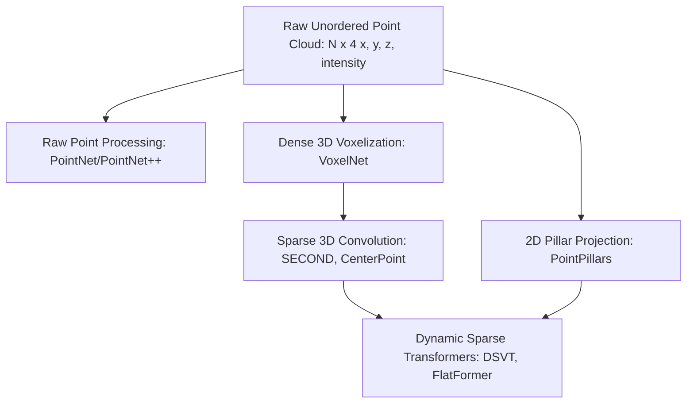
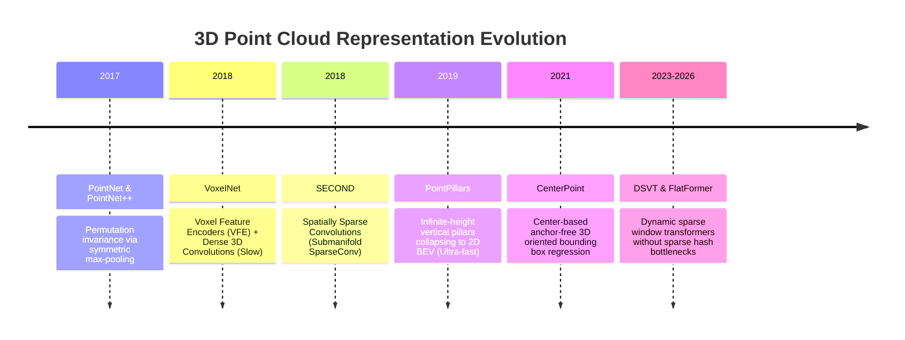

# LiDAR Perception: Historical Evolution & 3D Representations

A didactic guide detailing how 3D point cloud processing evolved: from raw point permutation-invariant networks (PointNet) to dense 3D voxels (VoxelNet), spatially sparse convolutions (SECOND/SpConv), 2D pseudo-image projection (PointPillars), and modern dynamic sparse 3D transformers (DSVT/FlatFormer).

Related notes: [[topics/lidar-perception/README|LiDAR Perception Playbook]], [[topics/sensor-fusion/README|Sensor Fusion]].

---

## 1. The Dimensional Dilemma of 3D Point Clouds

Unlike 2D images, raw LiDAR scans present three fundamental challenges:
1. **Unordered**: A point cloud of $N$ points is invariant to any permutation of its $N!$ ordering.
2. **Extreme Sparsity**: Over 99% of a $100\text{m} \times 100\text{m} \times 8\text{m}$ 3D bounding volume contains empty air. Standard dense 3D convolutions waste 99% of their FLOPs computing convolutions on empty zeros.
3. **Non-Uniform Density**: Point density decreases quadratically with distance ($1/r^2$). An object at 5 meters receives 10,000 points; at 60 meters it receives 4 points.

---

## 2. The Four Historical Representations

### Representation 1: Direct Point Networks (PointNet / PointNet++, 2017)
Qi et al. proved that symmetric functions (e.g. max pooling) satisfy permutation invariance:
$$f(\{x_1, \dots, x_n\}) \approx g(\max_{i=1\dots n} \{h(x_i)\})$$
Each individual point is mapped into a high-dimensional feature space via shared MLPs, followed by global max-pooling to extract a global scene descriptor.
- *Limitation*: Capturing local neighbor relationships requires expensive k-NN search ($O(N \log N)$), making it impractical for real-time 100k-point automotive scans.

---

### Representation 2: Dense Voxels to Sparse 3D Convolutions (SECOND & SpConv, 2018)
- **VoxelNet**: Divided 3D space into small cubes (voxels). But processing $200 \times 200 \times 16$ dense grids with 3D convolutions saturated GPU memory bandwidth immediately (~4 FPS).
- **SECOND (Yan et al., 2018)**: Introduced **Submanifold Sparse Convolution (SpConv)**:
  - Evaluates convolutions *only* at coordinates where active non-empty points exist.
  - Maintains a hash table of non-empty voxel coordinates, bypassing empty air calculations and accelerating inference by 10x.

---

### Representation 3: Pillar Projection (PointPillars, 2019)
- Discards vertical 3D voxelization. Instead, discretizes space into vertical columns (pillars) with infinite height along the z-axis.
- Learns a feature vector per pillar using a simplified PointNet and scatters them directly into a 2D Bird's-Eye-View (BEV) pseudo-image.
- Standard 2D CNNs can then be applied. Executes at **>60–100 FPS**, making it the benchmark for resource-constrained automotive ECUs.

---

### Representation 4: Dynamic Sparse Transformers (DSVT & FlatFormer, 2023–2026)
Modern architectures discard the reliance on irregular hash-table lookups inherent to sparse convolutions:
- **DSVT (Wang et al., CVPR 2023)**: Partitions sparse voxels into dynamic windows and rotates partitions across consecutive layers to facilitate global cross-window attention.
- Because operations are structured into uniform matrix multiplications, DSVT compiles directly into native TensorRT FP16/INT8 kernels without custom sparse runtime plugins.
