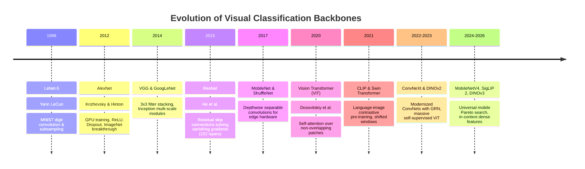
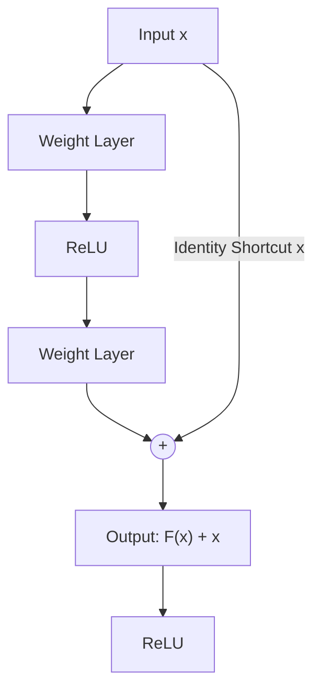
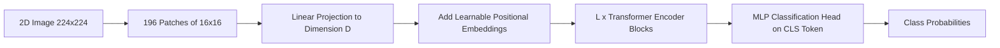
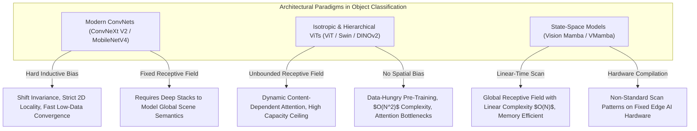

# 📜 Object Classification: Historical Evolution & Backbone Lineage

A didactic guide charting the evolution of visual feature extraction: from handcrafted texture descriptors to the deep residual revolution, the rise of Vision Transformers (ViT), modern modernized ConvNets (ConvNeXt), and self-supervised foundation backbones (CLIP to DINOv3).

Related notes: [[topics/object-classification/00-object-classification-moc|Object Classification MOC]], [[topics/gpu-deployment/00-gpu-deployment-moc|GPU Deployment MOC]].

---

## 1. Evolution Timeline: From Pixels to Foundation Encoders

---

## 2. Core Breakthroughs Explained

### Breakthrough A: The Residual Learning Framework (ResNet, 2015)
Prior to ResNet, stacking convolutional layers beyond 20 layers resulted in the **degradation problem**: training error increased due to vanishing/exploding gradients during backpropagation.

He et al. reformulated the mapping: instead of forcing stacked layers to fit an underlying mapping $\mathcal{H}(x)$, they explicitly let layers fit a residual mapping:
$$\mathcal{F}(x) = \mathcal{H}(x) - x \implies \mathcal{H}(x) = \mathcal{F}(x) + x$$

- **Why it matters**: If an identity mapping is optimal, the solver simply drives residual weights $\mathcal{F}(x) \to 0$, which is far easier than fitting identity weights from scratch. This allowed training networks with 1,000+ layers without gradient decay.

---

### Breakthrough B: Vision Transformers (ViT, 2020)
Dosovitskiy et al. questioned whether convolutions were truly indispensable for computer vision. They treated 2D images as sequences of 1D word tokens:
1. Divide an image $H \times W \times C$ into patches of size $P \times P$ (e.g. $16 \times 16$).
2. Flatten patches and linearly project them to embedding dimension $D$.
3. Prepend a learnable `[CLS]` token and add 1D position embeddings.
4. Process through standard Transformer Encoder blocks with Multi-Head Self-Attention (MHSA).

- **Trade-off**: ViTs possess weak inductive bias (no innate assumption of translation invariance or local 2D pixel locality). They require massive pre-training data (JFT-300M or ImageNet-21k), but scale with superior performance ceilings compared to standard CNNs.

---

### Breakthrough C: The ConvNeXt Renaissance (2022–2023)
Liu et al. modernized a standard ResNet by adopting Transformer design principles while maintaining pure convolutional operations:
- **Macro Design**: Inverted bottleneck ratios (expansion 4x like Transformers) and depthwise $7 \times 7$ convolutions.
- **Normalization & Activations**: Swapped BatchNorm for LayerNorm; replaced ReLU with GELU; used fewer activation layers.
- **ConvNeXt V2 (2023)**: Added **Global Response Normalization (GRN)** to prevent feature channel collapse when pre-training with Fully Convolutional Masked Autoencoders (FCMAE).

---

### Breakthrough D: Self-Supervised Foundation Encoders (DINOv2 / DINOv3 & SigLIP)
- **Contrastive Learning (CLIP / SigLIP)**: Maps visual patches and textual semantics into a shared multi-modal embedding space. SigLIP replaced cross-entropy softmax with sigmoid binary loss, eliminating memory-bound all-gather communication across distributed GPUs.
- **DINO Series (Self-Distillation with No Labels)**: Uses a Student-Teacher network architecture where the teacher network parameters are updated as an Exponential Moving Average (EMA) of student parameters. The dense patch tokens output from DINOv2/v3 capture fine-grained semantic masks and 3D geometry without a single manual label.

---

## 3. Intensive Architectural Taxonomy: Convolutional vs Transformer vs Hybrid Sub-Modules

Classification backbones serve as the foundational perceptual engine across all computer vision disciplines. The paradigm has shifted from hand-designed convolutional receptive fields to isotropic foundation transformers, modernized depthwise networks, and linear-time selective state-space architectures.

### Comparative Sub-Module Architectural Matrix

| Model Name & Year | Architectural Paradigm | Backbone Sub-Module | Neck / Feature Aggregator | Encoder Sub-Module | Decoder / Head Sub-Module | Primary Bottleneck & Edge Suitability |
| :--- | :--- | :--- | :--- | :--- | :--- | :--- |
| **ResNet-50 / ResNet-101** (2015) | Pure ConvNet | Hierarchical 4-stage residual convolutional pyramid ($1/4, 1/8, 1/16, 1/32$) | Global Average Pooling (GAP) collapsing spatial dimensions ($7\times7 \to 1\times1$) | Residual Bottlenecks ($1\times1 \to 3\times3 \to 1\times1$ Convs with BatchNorm + ReLU) | Single Linear Fully Connected Classification Layer ($D \to C$ logits) | **Compute Bound**: Industry standard baseline; exceptionally edge-friendly; high INT8 quantization stability; low latency on microcontrollers. |
| **MobileNetV3 / MobileNetV4** (2019–2024) | Pure / Hybrid Efficient ConvNet | Hierarchical Universal Inverted Bottleneck (UIB) with Depthwise Convs | Squeeze-and-Excitation (SE) / Mobile MQA attention modules | Depthwise Separable Convs ($3\times3 / 5\times5$) + Extra-Depth/Expansion layers with Hard-Swish | Pointwise Conv ($1\times1$) + GAP + Linear Projection Head | **Memory Bandwidth Bound**: Optimized specifically for DSPs/NPUs; low FLOP count (<400M FLOPs); bottlenecked by memory cache read/write bandwidth of inverted residual expansion tensors. |
| **ConvNeXt / ConvNeXt V2** (2022–2023) | Pure Modernized ConvNet | Hierarchical 4-stage Depthwise Convolutions with inverted bottleneck ratio (4x expansion) | Global Average Pooling + LayerNorm | $7\times7$ Depthwise Convs + Pointwise Convs + Global Response Normalization (GRN) | Single Linear Layer with LayerNorm Normalization | **Compute & Memory Balanced**: Matches Swin Transformer accuracy with pure convolutions; zero attention overhead; compiles natively to all edge runtimes with high INT8 throughput. |
| **ViT (Vision Transformer)** (2020) | Pure Isotropic ViT | Non-hierarchical Isotropic Patch Embedding ($16\times16$ patches linearly projected to dimension $D$) | None (Direct extraction of prepend `[CLS]` token embedding) | Standard Multi-Head Self-Attention (Pre-LN MHSA + MLP with GELU activations) | Multi-Layer Perceptron (MLP) Classification Head on `[CLS]` token | **Quadratic Compute & Memory Bound**: $O(N^2)$ complexity on token sequence length; weak inductive bias requires huge pre-training data; heavy Softmax memory traffic on edge devices. |
| **Swin Transformer / Swin V2** (2021–2022) | Hierarchical Vision Transformer | Hierarchical 4-stage Patch Partition ($4\times4$ patch) with Patch Merging downsampling | Stage-wise Feature Concatenation + GAP | Shifted Window Multi-Head Self-Attention (W-MSA & SW-MSA, $M\times M$ local windows) | Linear Classification Head with LayerNorm | **Compute & Cache Bound**: Achieves linear complexity $O(N)$ with respect to image size; shifted window memory indexing causes slight scheduling overhead on older edge NPUs. |
| **CoAtNet / MaxViT** (2021–2022) | Hybrid CNN-Transformer | Hierarchical 4-stage Hybrid (Early stages: Depthwise Convs; Late stages: Self-Attention) | Squeeze-and-Excitation + Multi-Axis Attention (Block + Grid Attention) | MBConv Convolutional Blocks + Multi-Head Self-Attention with Relative Positional Bias | Global Average Pooling + Linear Classification Head | **Compute Bound**: Combines fast early convolutional downsampling with global attention at deep stages; highly effective Pareto accuracy-latency trade-off. |
| **DINOv2 / DINOv3** (2023–2026) | Pure Foundation Isotropic ViT | Isotropic ViT-S/B/L/g (Patch14 Embedding + Register Tokens to eliminate feature artifacts) | Dense Multi-Layer Feature Extraction / SwiGLU FFN projections | Pre-LN Transformer Blocks with Rotary Position Embeddings (RoPE) and FlashAttention-2 | Linear Probe / Cosine Classifier Head or Direct Dense Patch Token Extraction | **Memory Bandwidth & Storage Bound**: Produces universal visual features for downstream zero-shot tasks; large parameter footprint (up to 1.1B params); requires weight quantization for edge deployment. |
| **Vision Mamba (Vim) / VMamba** (2024–2025) | State-Space Mamba | Isotropic / Hierarchical 2D Selective Scan State-Space (VSSM) blocks with Cross-Scan 4-way traversal | Bidirectional SSM Token Aggregation + GAP | 2D Selective Scan (SS2D) State-Space Blocks with hardware-aware parallel associative scans | Linear Classification Layer on Class Token | **Memory Bandwidth Bound**: Replaces attention with linear-time $O(N)$ selective state space; enables high-resolution image processing without memory blowup; requires custom NPU SSM kernels. |

### Didactic Architectural Trade-Off Analysis

#### 1. Inductive Bias vs. Universal Sequence Modeling
- **Convolutional Inductive Bias**: Standard convolutions enforce **translation equivariance** ($f(g(x)) = g(f(x))$) and **locality** (pixels close together are semantically correlated). This hard prior is mathematically baked into the convolutional operator:
  $$y[i, j] = \sum_{m=-k}^k \sum_{n=-k}^k w[m, n] \cdot x[i+m, j+n]$$
  Because weights $w$ are shared across all spatial coordinates, CNNs converge rapidly even on small training datasets (ImageNet-1K).
- **Transformer Sequence Modeling**: Vision Transformers discard spatial geometry by treating an image as an arbitrary set of 1D visual tokens. Positional relationships must be learned from scratch via positional encodings. While this demands massive training scale (JFT-300M or synthetic self-supervision in DINOv2), it removes the representational ceiling of fixed kernels, allowing the network to capture arbitrary long-range semantic dependencies.

#### 2. Computational Complexity Scaling: Quadratic ($O(N^2)$) vs. Linear ($O(N)$)
- For an input image of height $H$ and width $W$, divided into patches of size $P \times P$, the token count is $N = \frac{HW}{P^2}$.
- **Standard ViT Attention Complexity**:
  $$\text{Complexity}_{\text{ViT}} = \mathcal{O}\left(N^2 \cdot d + N \cdot d^2\right) = \mathcal{O}\left(\left(\frac{HW}{P^2}\right)^2 \cdot d\right)$$
  Doubling the image resolution increases the attention compute and memory footprint by $4\times$ ($16\times$ on full attention maps), causing out-of-memory errors on edge accelerators during high-resolution processing.
- **Linear Convolutions & State-Space Mamba**:
  $$\text{Complexity}_{\text{Conv / SSM}} = \mathcal{O}(H \cdot W \cdot C \cdot K^2) \quad \text{and} \quad \mathcal{O}(N \cdot d \cdot \Delta_{\text{state}})$$
  Both ConvNeXt and VMamba scale strictly linearly with image area, allowing high-resolution input inference with constant memory overhead.

#### 3. Edge Quantization and Accelerator Memory Bottlenecks
- **Activation Outliers in ViTs**: Vision Transformers frequently exhibit severe activation outliers in specific channel dimensions across LayerNorm and Softmax layers. When applying standard symmetric INT8 uniform quantization:
  $$X_{\text{quant}} = \text{round}\left(\frac{X}{S}\right)$$
  The quantization scale $S$ is forced to expand to accommodate the outliers, destroying the numerical precision of the remaining 99% of normal activations.
- **Edge Solutions**: ConvNeXt V2 uses Global Response Normalization (GRN) to stabilize channel dynamic range, enabling zero-degradation INT8 quantization on embedded NPUs. For ViTs, modern runtimes deploy SmoothQuant or mixed-precision integer architectures (INT8 weights and activations with FP16 LayerNorm/Softmax).

