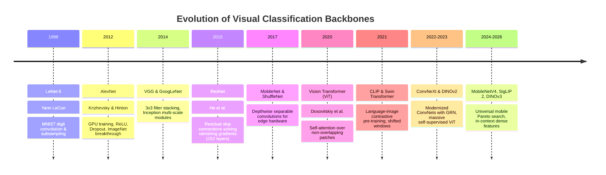
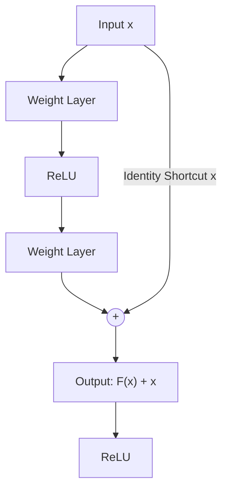
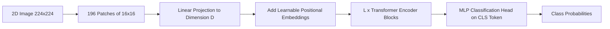

# 📜 Object Classification: Historical Evolution & Backbone Lineage

A didactic guide charting the evolution of visual feature extraction: from handcrafted texture descriptors to the deep residual revolution, the rise of Vision Transformers (ViT), modern modernized ConvNets (ConvNeXt), and self-supervised foundation backbones (CLIP to DINOv3).

Related notes: [[topics/object-classification/00-object-classification-moc|Object Classification MOC]], [[topics/gpu-deployment/00-gpu-deployment-moc|GPU Deployment MOC]].

---

## 1. Evolution Timeline: From Pixels to Foundation Encoders

---

## 2. Core Breakthroughs Explained

### Breakthrough A: The Residual Learning Framework (ResNet, 2015)
Prior to ResNet, stacking convolutional layers beyond 20 layers resulted in the **degradation problem**: training error increased due to vanishing/exploding gradients during backpropagation.

He et al. reformulated the mapping: instead of forcing stacked layers to fit an underlying mapping $\mathcal{H}(x)$, they explicitly let layers fit a residual mapping:
$$\mathcal{F}(x) = \mathcal{H}(x) - x \implies \mathcal{H}(x) = \mathcal{F}(x) + x$$

- **Why it matters**: If an identity mapping is optimal, the solver simply drives residual weights $\mathcal{F}(x) \to 0$, which is far easier than fitting identity weights from scratch. This allowed training networks with 1,000+ layers without gradient decay.

---

### Breakthrough B: Vision Transformers (ViT, 2020)
Dosovitskiy et al. questioned whether convolutions were truly indispensable for computer vision. They treated 2D images as sequences of 1D word tokens:
1. Divide an image $H \times W \times C$ into patches of size $P \times P$ (e.g. $16 \times 16$).
2. Flatten patches and linearly project them to embedding dimension $D$.
3. Prepend a learnable `[CLS]` token and add 1D position embeddings.
4. Process through standard Transformer Encoder blocks with Multi-Head Self-Attention (MHSA).

- **Trade-off**: ViTs possess weak inductive bias (no innate assumption of translation invariance or local 2D pixel locality). They require massive pre-training data (JFT-300M or ImageNet-21k), but scale with superior performance ceilings compared to standard CNNs.

---

### Breakthrough C: The ConvNeXt Renaissance (2022–2023)
Liu et al. modernized a standard ResNet by adopting Transformer design principles while maintaining pure convolutional operations:
- **Macro Design**: Inverted bottleneck ratios (expansion 4x like Transformers) and depthwise $7 \times 7$ convolutions.
- **Normalization & Activations**: Swapped BatchNorm for LayerNorm; replaced ReLU with GELU; used fewer activation layers.
- **ConvNeXt V2 (2023)**: Added **Global Response Normalization (GRN)** to prevent feature channel collapse when pre-training with Fully Convolutional Masked Autoencoders (FCMAE).

---

### Breakthrough D: Self-Supervised Foundation Encoders (DINOv2 / DINOv3 & SigLIP)
- **Contrastive Learning (CLIP / SigLIP)**: Maps visual patches and textual semantics into a shared multi-modal embedding space. SigLIP replaced cross-entropy softmax with sigmoid binary loss, eliminating memory-bound all-gather communication across distributed GPUs.
- **DINO Series (Self-Distillation with No Labels)**: Uses a Student-Teacher network architecture where the teacher network parameters are updated as an Exponential Moving Average (EMA) of student parameters. The dense patch tokens output from DINOv2/v3 capture fine-grained semantic masks and 3D geometry without a single manual label.
