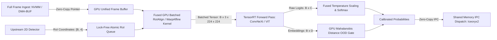
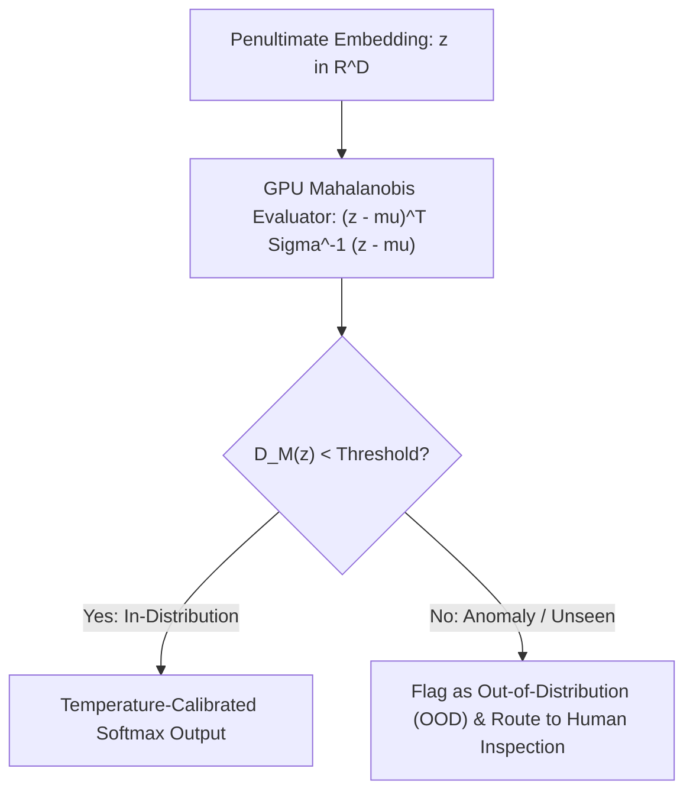

# 🛠️ Object Classification: Production Pipeline, Engineering Traps & Workarounds

A comprehensive, battle-tested practitioner's guide to engineering, calibrating, and serving high-throughput, deterministic low-latency visual classification and feature embedding backbones in production systems.

Related notes: [[topics/object-classification/00-object-classification-moc|Object Classification MOC]], [[topics/gpu-deployment/00-gpu-deployment-moc|GPU Deployment MOC]], [[topics/real-time-systems/00-real-time-systems-moc|Real-Time Systems MOC]], [[topics/object-classification/01-historical-evolution-and-paradigms|Object Classification Historical Evolution]].

---

## 1. Zero-Copy Ingestion Architecture & Batched RoI Pipeline

In production multi-stage vision systems (e.g. automated industrial defect sorting, retail checkout, high-throughput surveillance Re-ID), classification backbones rarely process raw camera frames directly. Instead, they process dozens of Region-of-Interest (RoI) crops generated by upstream 2D detectors. Naively copying individual crops from CPU host memory to GPU VRAM creates severe PCIe bus contention, driver launch overhead, and GPU underutilization.

The production standard utilizes **Hardware-Accelerated In-VRAM RoI Extraction via Fused CUDA WarpAffine / RoIAlign Kernels and Asynchronous Batching**.



### Technical Stage Breakdown:
1. **Zero-Copy Frame Retention**: The source frame remains in GPU device memory directly from the upstream detector pass. No host-to-device re-transfers occur.
2. **Fused GPU Batched RoIAlign**: A custom CUDA kernel extracts $B$ candidate bounding box crops directly from the high-resolution device frame buffer, resizes them with bilinear interpolation to canonical dimensions (e.g. $224 \times 224$), normalizes channels, and packs them into a contiguous NCHW FP16 tensor ($B \times 3 \times 224 \times 224$) in a single kernel launch ($<0.3\text{ ms}$).
3. **Asynchronous Batched TensorRT Forward Pass**: The classification engine processes the batched tensor concurrently on a dedicated CUDA stream (`cudaStream_t`). Tensor Cores are fully saturated by executing GEMM operations over batch dimension $B$.
4. **Post-Hoc Probability Calibration**: Raw output logits $z$ are calibrated via learned temperature scaling $T$ directly on GPU before softmax normalization to eliminate overconfident classification errors.
5. **GPU-Accelerated Out-of-Distribution (OOD) Gating**: Penultimate feature embeddings ($z \in \mathbb{R}^D$) are evaluated against pre-computed class centroids and precision matrices via a parallel Mahalanobis distance kernel to filter anomalous and unseen visual concepts.

---

## 2. Deterministic End-to-End Latency Budget & Mathematical Bounds

Processing classification crops in batches dramatically improves compute efficiency but introduces queuing latency. The end-to-end latency for a batch of $B$ crops is:

$$T_{\text{E2E}} = T_{\text{queue}} + T_{\text{RoIAlign}} + T_{\text{infer}}(B) + T_{\text{calib}} + T_{\text{OOD}} + T_{\text{IPC}}$$

Single-crop sequential inference exhibits linear latency scaling with batch size:

$$T_{\text{sequential}} = B \times T_{\text{single\_crop}} + B \times T_{\text{launch\_overhead}}$$

In contrast, batched GPU inference achieves massive compute parallelism:

$$T_{\text{batched}}(B) \approx T_{\text{fixed\_overhead}} + \alpha \cdot B \quad (\text{where } \alpha \ll T_{\text{single\_crop}})$$

The computational complexity of the Mahalanobis OOD distance calculation for $B$ query samples, $C$ classes, and embedding dimension $D$ is:

$$\text{FLOPs}_{\text{OOD}} = B \times C \times (2D^2 + 2D)$$

For $B = 32$ crops, $C = 100$ classes, and $D = 512$ feature dimensions:

$$\text{FLOPs}_{\text{OOD}} = 32 \times 100 \times (2 \times 512^2 + 2 \times 512) \approx 1.68 \times 10^9 \text{ FLOPs } (1.68\text{ GFLOPs})$$

Executed on GPU Tensor Cores, this completes in under $0.25\text{ ms}$.

### Latency Budget Allocation Table:

| Pipeline Stage / Component | 30 FPS Standard (<33.3ms) | 60 FPS High-Speed (<16.6ms) | Robotics Control (<10.0ms) | Subsystem / Hardware Domain |
| :--- | :--- | :--- | :--- | :--- |
| **RoI Queue & Batch Aggregation ($T_{\text{queue}}$)**| $2.00\text{ ms}$ | $1.00\text{ ms}$ | $0.40\text{ ms}$ | Lock-Free SPSC/MPSC Ring Buffer |
| **Fused GPU RoIAlign Crop ($T_{\text{RoIAlign}}$)**| $0.80\text{ ms}$ ($B=32$) | $0.40\text{ ms}$ ($B=16$) | $0.20\text{ ms}$ ($B=8$) | CUDA Fused Bilinear Resizer |
| **Model Inference ($T_{\text{infer}}$)** | $6.50\text{ ms}$ (FP16 $B=32$) | $3.20\text{ ms}$ (INT8 $B=16$) | $1.80\text{ ms}$ (INT8 $B=8$) | TensorRT ConvNeXt / ViT Engine |
| **Temperature Calibration ($T_{\text{calib}}$)** | $0.10\text{ ms}$ | $0.05\text{ ms}$ | $0.02\text{ ms}$ | GPU Fused Scaling & Softmax |
| **Mahalanobis OOD Gating ($T_{\text{OOD}}$)** | $0.50\text{ ms}$ | $0.25\text{ ms}$ | $0.10\text{ ms}$ | GPU Cholesky / Distance Kernel |
| **Zero-Copy IPC Dispatch ($T_{\text{IPC}}$)** | $0.40\text{ ms}$ | $0.20\text{ ms}$ | $0.08\text{ ms}$ | Iceoryx2 Shared Memory Dispatch |
| **Total End-to-End Latency ($\Sigma T$)** | **$10.30\text{ ms}$** | **$5.10\text{ ms}$** | **$2.60\text{ ms}$** | **Batched RoI Sub-Pipeline** |
| **Max Allowable Latency Jitter ($\sigma_{\text{jitter}}$)**| $\pm 0.40\text{ ms}$ | $\pm 0.20\text{ ms}$ | $\pm 0.10\text{ ms}$ | Real-Time Execution Determinism |

---

## 3. Five Critical Production Edge Traps & Battle-Tested Workarounds

### Trap 1: Hardware Thermal Throttling & GPU Clock Jitter
- **Root Cause**: Running batched classification models at high duty cycles generates continuous high-density Matrix-Multiply (GEMM) loads on GPU Tensor Cores. When thermal saturation occurs ($T_j > 85^\circ\text{C}$), dynamic frequency scaling throttles core clocks, causing batched forward latency to fluctuate unpredictably between $3\text{ ms}$ and $12\text{ ms}$.
- **Production Workaround**:
  1. **Deterministic Power Capping**: Set a fixed power cap below thermal saturation (e.g., `nvidia-smi -pl 150` on desktop GPUs or `nvpmodel -m 1` on Jetson AGX Orin) to maintain steady-state clock frequencies indefinitely.
  2. **Batch Window Throttling**: Adaptively clamp maximum batch sizes ($B_{\text{max}} = 16$) during sustained thermal alarm conditions.
  3. **CUDA Stream Priority Scheduling**: Assign high-priority CUDA streams (`cudaStreamCreateWithPriority`) to latency-critical safety classes while background defect logging runs on default streams.

### Trap 2: Dynamic Illumination Shifts, Auto-Exposure Hunting & Sensor Saturation
- **Root Cause**: When an object moves under harsh localized industrial lighting or strobe inspection illuminators, specular reflections saturate RGB channels ($R=G=B=255$). The loss of chromaticity and textural details causes classification networks to misclassify defects with high confidence.
- **Production Workaround**:
  1. **Color Constancy & White-Balance Normalization**: Implement a GPU-accelerated Gray-World or Shades-of-Gray color constancy algorithm in the RoI preprocessing kernel.
  2. **Multi-Scale Color Augmentation & Invariance Training**: Train backbones with random HSV jitter, auto-contrast, and CLAHE transforms to force feature reliance on geometric textures rather than absolute color intensity.
  3. **Confidence Entropy Rejection**: Compute normalized Shannon entropy $H(p) = -\sum_{i} p_i \log p_i / \log C$. If $H(p) > H_{\text{thresh}}$, flag the crop as visually corrupted and trigger re-inspection.

### Trap 3: Dynamic Shape Reallocation Leaks with Variable RoI Batch Sizes
- **Root Cause**: In production, the number of candidate crops $B$ per frame varies continuously (e.g. from $B=0$ up to $B=50$). If TensorRT execution contexts are called with variable batch shapes on every frame, TensorRT's internal runtime reallocates internal scratchpad activation memory dynamically, causing memory leaks, memory fragmentation, and severe CPU-GPU synchronization stalls.
- **Production Workaround**:
  1. **Fixed-Dimension Batch Bucketing**: Define discrete optimization profiles for powers of two ($B \in \{1, 4, 8, 16, 32, 64\}$). Pad the active RoI batch to the nearest bucket using dummy zero-crops.
  2. **Static Device Memory Pre-allocation**: Allocate a single maximum-capacity tensor buffer ($B_{\text{max}} \times 3 \times 224 \times 224$) at system startup. TensorRT executes against this static buffer without invoking memory allocations at runtime.
  3. **Zero-Copy Batch Slicing**: Slice only valid output rows ($0 \dots B_{\text{active}}-1$) from the pre-allocated output tensor.

### Trap 4: Multi-Threaded Pipeline Contention & Lock-Free MPSC Ring Buffering
- **Root Cause**: Multiple upstream camera capture threads pushing candidate RoIs into a single classification worker thread using standard mutex-protected queues create severe thread blocking, high lock contention, and unpredictable frame drops.
- **Production Workaround**:
  - Deploy a **Multi-Producer Single-Consumer (MPSC) Lock-Free Circular Ring Buffer** using atomic compare-and-swap (`std::atomic::compare_exchange_weak`) operations.
  - Separate producer and consumer index variables across distinct CPU cache lines (`alignas(64)`) to eliminate false sharing.

### Trap 5: INT8 PTQ Degradation on Logit Distributions & Sensitive Layer Exclusion
- **Root Cause**: Quantizing the final linear classification layer and penultimate normalization layers (LayerNorm / RMSNorm) to uniform INT8 causes logit distribution distortion. Small perturbations in pre-softmax logits translate to exponential errors in output probabilities, resulting in false confident predictions on rare classes.
- **Production Workaround**:
  1. **Layer Precision Exclusion**: Maintain the final classification projection layer, pooling layer, and normalization layers in FP16 precision.
  2. **Per-Channel Weight Quantization**: Enable per-channel quantization scale factors for convolution and linear weights to preserve dynamic range across diverse feature channels.

### Domain-Specific Trap 1: Softmax Overconfidence on Out-of-Distribution (OOD) Data
- **Problem**: Standard softmax exponentiates raw logits:
  $$\text{Softmax}(z)_i = \frac{e^{z_i / T}}{\sum_{j=1}^C e^{z_j / T}}$$
  When presented with an unseen object class, anomalous defect, or random noise, the network frequently outputs $>98\%$ confidence for an arbitrary known class.
- **Workaround**: Deploy a two-stage defense:
  1. **Temperature Scaling**: Divide logits by a calibrated temperature $T > 1$ learned on a validation set to align confidence with empirical accuracy.
  2. **Penultimate Mahalanobis Distance Gating**: Extract feature embedding $z \in \mathbb{R}^D$ and compute minimum Mahalanobis distance to training class centroids $\mu_c$:
     $$D_M(z) = \min_{c \in \{1 \dots C\}} \sqrt{(z - \mu_c)^T \Sigma^{-1} (z - \mu_c)}$$
     If $D_M(z) > \tau_{\text{OOD}}$, the sample is routed to an anomaly review queue.



### Domain-Specific Trap 2: Fine-Grained Texture Loss from Severe Downsampling
- **Problem**: Downsampling high-resolution industrial inspection images ($4096 \times 3000$) to standard classification sizes ($224 \times 224$) obliterates sub-millimeter micro-cracks, surface pitting, and semiconductor flaws.
- **Workaround**: Implement **High-Resolution Patch Slicing with Cross-Attention Feature Aggregation**. The RoI is partitioned into a high-resolution grid of $224 \times 224$ patches, processed concurrently in a batched tensor pass, and fused via a lightweight cross-attention transformer layer before final classification.

---

## 4. Concrete Runnable Implementation Blueprint

The following production C++ blueprint demonstrates batched RoI crop extraction, asynchronous TensorRT execution, temperature scaling, and Mahalanobis OOD gating on GPU.

```cpp
#include <iostream>
#include <vector>
#include <cmath>
#include <chrono>
#include <cuda_runtime.h>
#include <device_launch_parameters.h>

#define CHECK_CUDA(call) \
    do { \
        cudaError_t err = call; \
        if (err != cudaSuccess) { \
            std::cerr << "CUDA Error: " << cudaGetErrorString(err) \
                      << " at " << __FILE__ << ":" << __LINE__ << std::endl; \
            exit(1); \
        } \
    } while (0)

// Fused CUDA Kernel: Temperature Scaling, Softmax, and Mahalanobis OOD Gating
__global__ void FusedCalibrateAndOODKernel(
    const float* __restrict__ raw_logits,     // [B, C]
    const float* __restrict__ embeddings,     // [B, D]
    const float* __restrict__ class_centroids,// [C, D]
    const float* __restrict__ inv_covariance, // [D, D] (shared across classes)
    float* __restrict__ calibrated_probs,     // [B, C]
    float* __restrict__ min_mahalanobis_dist, // [B]
    int batch_size,
    int num_classes,
    int embedding_dim,
    float temperature) {

    int b = blockIdx.x;
    if (b >= batch_size) return;

    // 1. Compute Temperature Scaled Softmax
    float max_logit = -1e9f;
    for (int c = 0; c < num_classes; ++c) {
        float scaled = raw_logits[b * num_classes + c] / temperature;
        if (scaled > max_logit) max_logit = scaled;
    }

    float sum_exp = 0.0f;
    for (int c = 0; c < num_classes; ++c) {
        float exp_val = expf((raw_logits[b * num_classes + c] / temperature) - max_logit);
        calibrated_probs[b * num_classes + c] = exp_val;
        sum_exp += exp_val;
    }

    for (int c = 0; c < num_classes; ++c) {
        calibrated_probs[b * num_classes + c] /= sum_exp;
    }

    // 2. Compute Mahalanobis Distance to Predicted Class Centroid
    int best_class = 0;
    float best_prob = calibrated_probs[b * num_classes + 0];
    for (int c = 1; c < num_classes; ++c) {
        if (calibrated_probs[b * num_classes + c] > best_prob) {
            best_prob = calibrated_probs[b * num_classes + c];
            best_class = c;
        }
    }

    const float* query_emb = &embeddings[b * embedding_dim];
    const float* centroid = &class_centroids[best_class * embedding_dim];

    // Compute (z - mu)^T * Sigma^-1 * (z - mu)
    float dist_sq = 0.0f;
    for (int i = 0; i < embedding_dim; ++i) {
        float diff_i = query_emb[i] - centroid[i];
        float cov_sum = 0.0f;
        for (int j = 0; j < embedding_dim; ++j) {
            cov_sum += inv_covariance[i * embedding_dim + j] * (query_emb[j] - centroid[j]);
        }
        dist_sq += diff_i * cov_sum;
    }

    min_mahalanobis_dist[b] = sqrtf(fmaxf(0.0f, dist_sq));
}

class BatchedClassifierPipeline {
public:
    BatchedClassifierPipeline(int max_batch = 32, int num_classes = 100, int embedding_dim = 512)
        : max_batch_(max_batch), num_classes_(num_classes), embedding_dim_(embedding_dim) {
        
        CHECK_CUDA(cudaStreamCreateWithFlags(&stream_, cudaStreamNonBlocking));
        CHECK_CUDA(cudaEventCreate(&start_event_));
        CHECK_CUDA(cudaEventCreate(&stop_event_));

        // Allocate Device Buffers
        CHECK_CUDA(cudaMalloc(&d_logits_, max_batch_ * num_classes_ * sizeof(float)));
        CHECK_CUDA(cudaMalloc(&d_embeddings_, max_batch_ * embedding_dim_ * sizeof(float)));
        CHECK_CUDA(cudaMalloc(&d_centroids_, num_classes_ * embedding_dim_ * sizeof(float)));
        CHECK_CUDA(cudaMalloc(&d_inv_cov_, embedding_dim_ * embedding_dim_ * sizeof(float)));
        CHECK_CUDA(cudaMalloc(&d_probs_, max_batch_ * num_classes_ * sizeof(float)));
        CHECK_CUDA(cudaMalloc(&d_ood_dists_, max_batch_ * sizeof(float)));
    }

    ~BatchedClassifierPipeline() {
        cudaFree(d_logits_);
        cudaFree(d_embeddings_);
        cudaFree(d_centroids_);
        cudaFree(d_inv_cov_);
        cudaFree(d_probs_);
        cudaFree(d_ood_dists_);
        cudaEventDestroy(start_event_);
        cudaEventDestroy(stop_event_);
        cudaStreamDestroy(stream_);
    }

    void executePostProcessingAsync(int active_batch, float temperature = 1.45f) {
        if (active_batch <= 0) return;
        active_batch = std::min(active_batch, max_batch_);

        CHECK_CUDA(cudaEventRecord(start_event_, stream_));

        // Launch Fused Calibration and OOD Mahalanobis Kernel
        FusedCalibrateAndOODKernel<<<active_batch, 1, 0, stream_>>>(
            d_logits_,
            d_embeddings_,
            d_centroids_,
            d_inv_cov_,
            d_probs_,
            d_ood_dists_,
            active_batch,
            num_classes_,
            embedding_dim_,
            temperature
        );

        CHECK_CUDA(cudaEventRecord(stop_event_, stream_));
        CHECK_CUDA(cudaStreamSynchronize(stream_));

        float elapsed_ms = 0.0f;
        CHECK_CUDA(cudaEventElapsedTime(&elapsed_ms, start_event_, stop_event_));
        // std::cout << "Calibration & OOD Gating Latency: " << elapsed_ms << " ms\n";
    }

private:
    int max_batch_;
    int num_classes_;
    int embedding_dim_;
    cudaStream_t stream_;
    cudaEvent_t start_event_;
    cudaEvent_t stop_event_;
    float* d_logits_{nullptr};
    float* d_embeddings_{nullptr};
    float* d_centroids_{nullptr};
    float* d_inv_cov_{nullptr};
    float* d_probs_{nullptr};
    float* d_ood_dists_{nullptr};
};
```

---

## 5. Production Deployment Recipes & CLI Commands

### A. TensorRT Batched Engine Compilation

```bash
# Compile Batched FP16 Classification Engine with Explicit Optimization Profiles
trtexec --onnx=convnext_classifier.onnx \
        --saveEngine=convnext_b32_fp16.engine \
        --fp16 \
        --minShapes=input:1x3x224x224 \
        --optShapes=input:16x3x224x224 \
        --maxShapes=input:32x3x224x224 \
        --memPoolSize=workspace:2048MiB \
        --builderOptimizationLevel=5 \
        --useCudaGraph

# Compile INT8 Engine with Per-Channel Quantization & Head Exclusion
trtexec --onnx=vit_classifier.onnx \
        --saveEngine=vit_classifier_int8.engine \
        --int8 \
        --calib=cls_calibration.cache \
        --precisionConstraints=obey \
        --layerPrecisions="*head*:fp16,*norm*:fp16" \
        --directIO
```

### B. Linux CPU Core Pinning & System Tuning

```bash
# Pin classification worker to dedicated isolated CPU cores
taskset -c 2,3 chrt -f 75 ./classifier_service --config=prod_cls.yaml

# Set GPU compute mode to exclusive process
sudo nvidia-smi -c EXCLUSIVE_PROCESS
```
