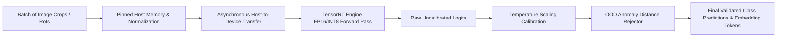
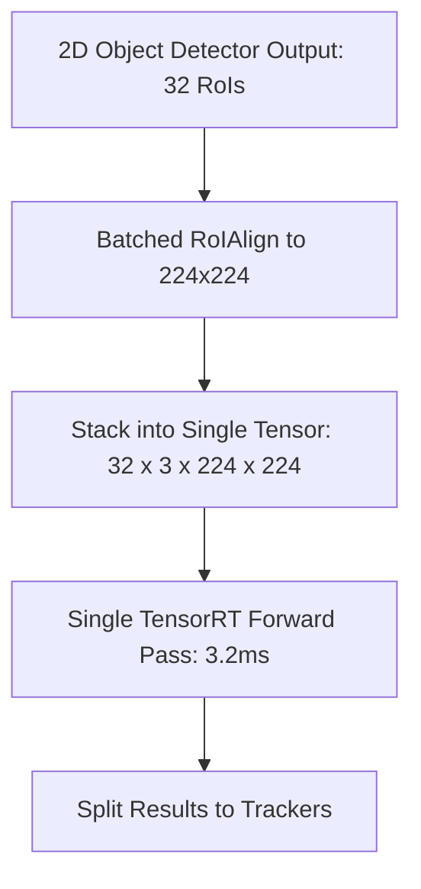

# 🛠️ Object Classification: Production Pipeline, Engineering Traps & Workarounds

A practitioner's guide to engineering, calibrating, and serving high-throughput, low-latency visual classification and feature embedding backbones in production.

Related notes: [[topics/object-classification/00-object-classification-moc|Object Classification MOC]], [[topics/gpu-deployment/00-gpu-deployment-moc|GPU Deployment MOC]].

---

## 1. End-to-End Production Pipeline Architecture



### Stage Breakdown:
1. **RoI Batching**: Group candidate region crops into fixed-dimension tensors (e.g. batch size $B=16$ or $B=32$) to saturate GPU compute cores.
2. **Asynchronous Preprocessing**: Normalize RGB channels on GPU using CUDA kernels rather than CPU OpenCV loops.
3. **Hardware-Accelerated Inference**: Execute FP16 or INT8 TensorRT engine on dedicated CUDA streams.
4. **Post-Hoc Probability Calibration**: Apply temperature scaling to ensure softmax outputs reflect true empirical probabilities.
5. **Out-of-Distribution (OOD) Rejection**: Threshold Mahalanobis distance from penultimate feature embeddings to prevent silent failure on anomalous objects.

---

## 2. Common Traps, Edge Cases & Hardware Bottlenecks

### Trap 1: Softmax Overconfidence on Out-of-Distribution (OOD) Data
- **Problem**: Standard softmax normalizes raw logits using exponentiation:
  $$\text{Softmax}(z)_i = \frac{e^{z_i}}{\sum_j e^{z_j}}$$
  Even when an image contains pure noise or an unseen class (e.g. an animal presented to an industrial defect classifier), the largest logit will still exponentiate to $>95\%$ confidence. The system claims absolute certainty on completely invalid data.

### Trap 2: Fine-Grained Texture Loss from Severe Downsampling
- **Problem**: Standard classification benchmarks downsample images to $224 \times 224$. For fine-grained industrial inspection (e.g. micro-cracks in turbine blades), $224 \times 224$ downsampling obliterates the sub-millimeter defects entirely.

### Trap 3: Unbatched Single-Crop CPU Inference Stalls
- **Problem**: Invoking a deep backbone sequentially on single RoI crops (e.g. 50 boxes detected in a frame) launches 50 independent GPU kernels with CPU synchronization stalls, multiplying latency by 10x.

---

## 3. Battle-Tested Engineering Workarounds

### Workaround 1: Temperature Scaling (Platt Scaling)
To fix overconfidence without changing model weights or accuracy, divide logits by a learned scalar temperature parameter $T > 1$:

```python
import torch
import torch.nn as nn

class TemperatureCalibratedModel(nn.Module):
    def __init__(self, model, temperature: float = 1.45):
        super().__init__()
        self.model = model
        self.temperature = nn.Parameter(torch.tensor([temperature]))

    def forward(self, x):
        logits = self.model(x)
        # Scaled softmax prevents overconfident false positives
        calibrated_probs = torch.softmax(logits / self.temperature, dim=1)
        return calibrated_probs
```

### Workaround 2: Deep Feature Mahalanobis Distance for OOD Detection
Extract the penultimate layer embedding vector $z \in \mathbb{R}^D$ and compute its Mahalanobis distance to pre-computed training class centroids $\mu_c$:
$$D_M(z) = \min_c \sqrt{(z - \mu_c)^T \Sigma^{-1} (z - \mu_c)}$$
If $D_M(z) > \text{threshold}$, flag the sample as **Out-of-Distribution / Anomaly** and reject automated classification.

### Workaround 3: Batched RoI Pipelining
Stack all detected RoI crops from a single frame into a contiguous tensor batch before calling the classification engine:



---

## 4. Production Deployment Recipes

### A. High-Throughput TensorRT Compilation with Fixed Batch Size
```bash
# Export timm model to ONNX with explicit batch size 32
python -c "
import timm, torch
m = timm.create_model('convnextv2_base', pretrained=True).cuda().eval()
torch.onnx.export(m, torch.randn(32, 3, 224, 224, device='cuda'), 'convnext_b32.onnx', opset_version=17)
"

# Compile with TensorRT
trtexec --onnx=convnext_b32.onnx \
        --saveEngine=convnext_b32.engine \
        --fp16 \
        --warmUp=200 \
        --iterations=1000
```
