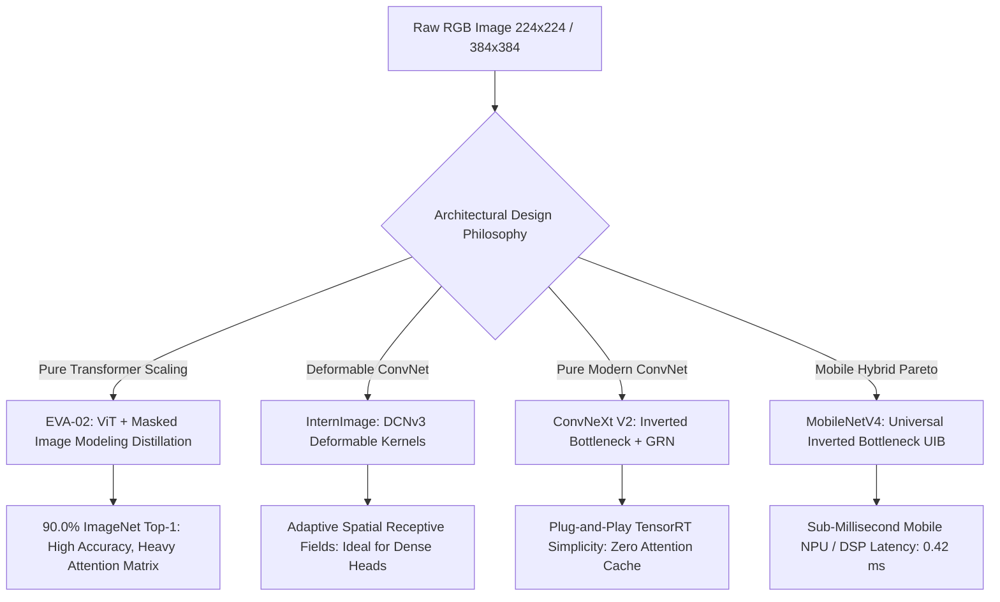
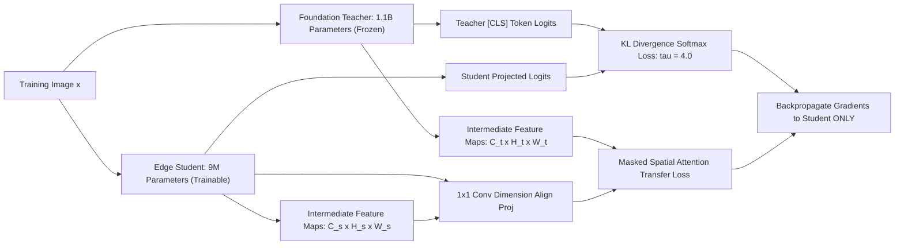

# ⚙️ Object Classification: Backbones, Feature Distillation & Open Frontiers

A deep systems investigation into foundation classification backbones, self-supervised distillation mechanics, out-of-distribution (OOD) uncertainty calibration, and unsolved research frontiers in visual representation learning.

Related notes: [[topics/object-classification/00-object-classification-moc|Object Classification MOC]], [[architectures/vision-foundation-models/dinov2-and-dinov3|DINOv2/v3 Deep-Dive]], [[architectures/backbones-and-edge-efficiency/convnext-and-mobilenet|ConvNeXt V2 & MobileNetV4]].

---

## 1. Modern Backbone Architecture Paradigms (2024–2026)

The visual backbone landscape has bifurcated between **pure attention scaling** and **hardware-friendly deformable convolutions**:

### Comparative Production Backbone Profile
| Backbone Model | Core Structural Operator | Parameters | ImageNet-1K Top-1 | Best-Fit Production Domain | License |
| :--- | :--- | :--- | :--- | :--- | :--- |
| **MobileNetV4-Conv-M** | Universal Inverted Bottleneck (UIB) | 9.7 M | 82.3% | Mobile phones, IoT microcontrollers | Apache-2.0 |
| **ConvNeXt V2-Base** | Depthwise 7x7 + GRN | 89.0 M | 86.8% | Real-time workstation / Jetson Orin | Apache-2.0 |
| **InternImage-XL** | Deformable Convolution v3 (DCNv3) | 335.0 M | 88.8% | Dense object detection / segmentation heads | Apache-2.0 |
| **EVA-02-Large (ViT)** | Masked Image Modeling (MIM) ViT | 304.0 M | **90.0%** (SOTA) | High-accuracy cloud inspection APIs | MIT |
| **DINOv2-Giant** | Multi-Crop Student-Teacher ViT | 1.1 B | 86.5% (Linear Probe)| Zero-shot nearest-neighbor visual search | Apache-2.0 |

---

## 2. Feature Distillation Mechanics: Teacher-Student Alignment

Transferring dense representations from a massive foundation teacher (e.g. EVA-02 or DINOv2) into a compact edge student (MobileNetV4 or ConvNeXt-Nano) requires multi-tier distillation:

### Mathematical Loss Formulation:
$$\mathcal{L}_{\text{total}} = (1 - \alpha) \mathcal{L}_{\text{CE}}(y_{\text{true}}, \sigma(z_s)) + \alpha \tau^2 \mathcal{L}_{\text{KL}}\left(\sigma\left(\frac{z_s}{\tau}\right), \sigma\left(\frac{z_t}{\tau}\right)\right) + \beta \sum_{l \in L} \| \phi_l(F_s^l) - F_t^l \|_2^2$$
Where $\tau$ is the distillation temperature (typically $\tau = 4.0$), $F^l$ are intermediate spatial feature tensors, and $\phi_l$ is a $1 \times 1$ convolutional projection layer matching student channel depth to the teacher.

---

## 3. Current Open Problems in Visual Classification

### 🔴 Problem 1: Unseen Anomaly & Out-of-Distribution (OOD) Generalization
- **The Failure Mode**: A classifier trained on pristine industrial parts outputs $99.8\%$ confidence for "Good Part" when presented with an unseen crack geometry, surface discoloration, or completely anomalous foreign debris.
- **Root Cause**: Softmax functions normalize relative logit differences rather than absolute feature density. Any feature activation that aligns slightly more with class $A$ than classes $B \dots K$ is forced to probability $\approx 1.0$.
- **Recent Frontier Solutions (2024–2026)**:
  - **Energy-Based OOD Scoring**: Replacing softmax probabilities with free energy values $E(x; f) = -T \cdot \log \sum_i \exp(f_i(x) / T)$. Out-of-distribution inputs exhibit markedly higher free energy without requiring retraining.
  - **Penultimate Feature Mahalanobis Envelopes**: Pre-calculating class centroid covariance matrices and rejecting test points where the minimum Mahalanobis distance $D_M(z) > \tau_{\text{cutoff}}$.

---

### 🔴 Problem 2: Long-Tailed Class Imbalance & Semantic Collapse
- **The Failure Mode**: Real-world datasets follow a Zipfian distribution (few dominant head classes with millions of samples; thousands of tail classes with $<5$ samples). Standard cross-entropy loss causes gradient updates to be dominated by the head classes, collapsing tail representations into degenerate clusters.
- **Recent Frontier Solutions**:
  - **Balanced Softmax & Logit Adjustment**: Subtracting class frequency priors $\tau \log \pi_y$ from predicted logits during training:
    $$\mathcal{L}_{\text{adjusted}} = - \log \frac{\exp(z_y + \tau \log \pi_y)}{\sum_j \exp(z_j + \tau \log \pi_j)}$$
  - **Zero-Shot Language Priors (SigLIP Anchoring)**: Freezing visual-language text embeddings of tail classes as static classifier heads, preventing representation decay.

---

### 🔴 Problem 3: Shortcut Learning & Spurious Background Correlation
- **The Failure Mode**: Models learn spurious background correlations instead of the true object semantics (e.g. predicting "Cow" only when green grass is present; predicting "Boat" only on blue water). When a boat is on dry dock, the model classifies it as a building or vehicle.
- **Active Research Direction**:
  - **Counterfactual Background Inpainting**: Generating synthetic training pairs using diffusion models where the object remains identical but the background is dynamically swapped.
