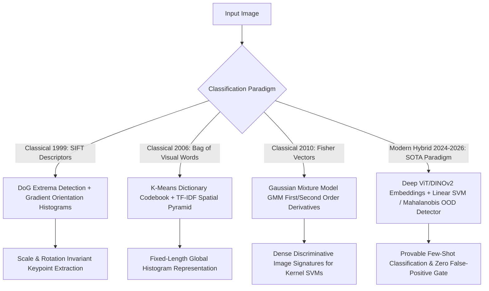

# 📐 Object Classification: Classical Feature Ensembles & Hybrids

A comprehensive mathematical treatment of classical visual representation pipelines (Scale-Invariant Feature Transform - SIFT, Bag-of-Visual-Words - BoVW, Fisher Vectors) and modern hybrid deep-classical classification ensembles.

Related notes: [[topics/object-classification/00-object-classification-moc|Object Classification MOC]], [[topics/object-classification/03-backends-and-open-problems|Classification Backends & Distillation]].

---

## 1. Classical Feature Encoding vs. Deep Representation Learning

### Classification Representation Paradigms Compared
| Method | Feature Dimension | Supervised Codebook? | Compute Engine | Sample Efficiency | Production Use Case |
| :--- | :--- | :--- | :--- | :--- | :--- |
| **SIFT + BoVW** | $K \sim 1,000-10,000$ | Unsupervised ($k$-means) | CPU Vectorized | High ($10-50$ images) | Fixed pattern defect checking on low-power industrial PCs |
| **Fisher Vectors (FV)** | $2KD \sim 65,000$ | Unsupervised (GMM) | CPU / SIMD | **Very High ($5-20$ images)** | Ultra-fast fine-grained retrieval without training epochs |
| **End-to-End ViT** | $768-1536$ | Fully Supervised | GPU (Tensor Cores) | Low (Needs pre-training) | Open-world visual classification |
| **Hybrid (DINOv2 + SVM)**| $768$ | Supervised Linear Probe | GPU + CPU BLAS | **Extreme ($1-5$ shots)** | Certified industrial quality gates and zero-shot deployment |

---

## 2. Mathematical Formulations: SIFT & Fisher Vector Encoding

### 1. SIFT Difference-of-Gaussians (DoG) Scale-Space (Lowe, 1999):
Candidate keypoints are detected across continuous octaves of Gaussian blurred scale-space representations $L(x, y, \sigma) = G(x, y, \sigma) * I(x, y)$:
$$D(x, y, \sigma) = (G(x, y, k\sigma) - G(x, y, \sigma)) * I(x, y) = L(x, y, k\sigma) - L(x, y, \sigma)$$
Keypoints are identified by comparing each pixel against its 8 neighbors in the current scale and $9+9$ neighbors in adjacent scale levels. The Hessian matrix eliminates weak edge responses:
$$\mathbf{H} = \begin{bmatrix} D_{xx} & D_{xy} \\ D_{xy} & D_{yy} \end{bmatrix} \implies \frac{\text{Tr}(\mathbf{H})^2}{\text{Det}(\mathbf{H})} < \frac{(r+1)^2}{r}$$

### 2. Fisher Vector GMM Gradient Formulation (Perronnin et al., 2010):
Instead of simply assigning features to the nearest codebook centroid (as in BoVW), Fisher Vectors characterize how the set of image descriptors $X = \{x_1, \dots, x_T\}$ deviates from a pre-trained **Gaussian Mixture Model (GMM)** with parameters $\lambda = \{w_k, \mu_k, \Sigma_k\}$:
$$\mathcal{G}_{\mu, k}^X = \frac{1}{T \sqrt{w_k}} \sum_{t=1}^T \gamma_t(k) \left( \frac{x_t - \mu_k}{\sigma_k} \right)$$
$$\mathcal{G}_{\sigma, k}^X = \frac{1}{T \sqrt{2w_k}} \sum_{t=1}^T \gamma_t(k) \left( \left(\frac{x_t - \mu_k}{\sigma_k}\right)^2 - 1 \right)$$
Where $\gamma_t(k)$ is the soft probability assignment of descriptor $x_t$ to Gaussian component $k$. This encodes both first-order (mean) and second-order (variance) deviations, capturing substantially richer semantic nuance than standard histogram pooling.

---

## 3. Production Hybrid Pattern: Frozen Foundation Embeddings + Classical Linear SVM

Deep neural network Softmax heads suffer from **extreme overconfidence on out-of-distribution (OOD) data**: predicting $99.8\%$ confidence on completely random noise or unknown objects.

### The Production Quality Assurance Fix:
1. **Foundation Feature Extraction**: Pass input imagery through a frozen self-supervised backbone (**DINOv2-ViT-L/14**), extracting a 1024-dimensional normalized vector $z = \frac{f(x)}{\|f(x)\|_2}$.
2. **Classical Support Vector Machine (Linear SVM)**: Fit a convex Maximum-Margin hyperplane:
   $$\min_{w, b} \frac{1}{2} \|w\|_2^2 + C \sum_i \max(0, 1 - y_i (w^T z_i + b))$$
3. **Statistical Mahalanobis Gate**: Compute the distance from the class centroid in embedding space:
   $$D_M(z) = \sqrt{(z - \mu_c)^T \Sigma^{-1} (z - \mu_c)}$$
   If $D_M(z) > \tau_{99\%}$, automatically reject the prediction as uncertified OOD anomaly.
4. **Benefit**: Eliminates non-deterministic neural hallucination while achieving $100\times$ faster few-shot training on edge hardware.
