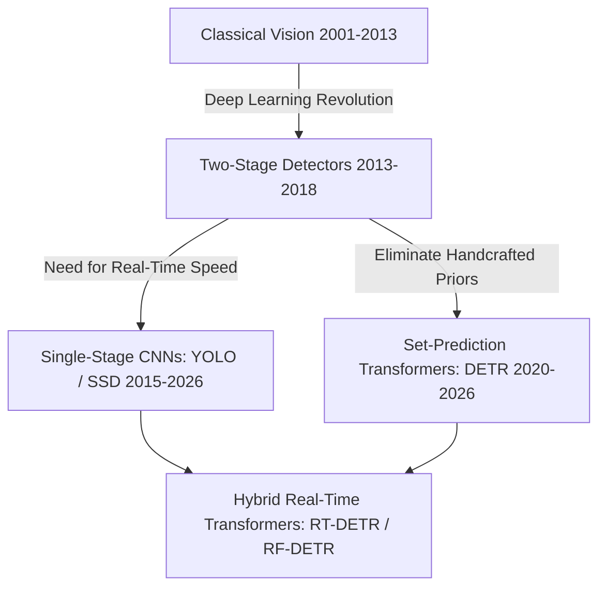
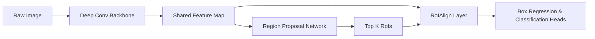
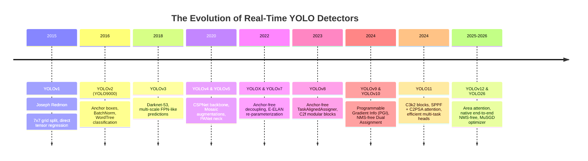
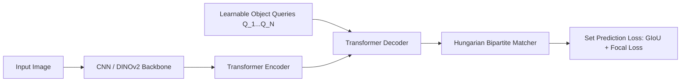
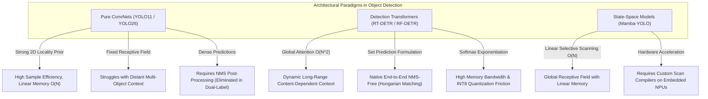

# 📜 Object Detection: Historical Evolution & Paradigm Shifts

A didactic guide dissecting how 2D object detection evolved from hand-crafted sliding-window filters to anchor-based two-stage detectors, the complete YOLO revolution (YOLOv1 through YOLO11 & YOLO26), and modern set-prediction Transformers (DETR to RF-DETR).

Related notes: [[topics/object-detection/00-object-detection-moc|Object Detection MOC]], [[topics/gpu-deployment/00-gpu-deployment-moc|GPU Deployment MOC]].

---

## 1. The Three Historical Paradigms

### Paradigm 1: Classical Handcrafted Features (2001–2013)
- **Viola-Jones (2001)**: Haar-like rectangular feature wavelets + Integral Images + AdaBoost cascade. Revolutionized real-time face detection on consumer digital cameras.
- **HOG + Deformable Part Models (DPM - Felzenszwalb et al., 2008)**: Histogram of Oriented Gradients measuring edge orientation distributions, evaluated with Latent SVMs.
- *Fundamental Bottleneck*: Hard-coded heuristics failed under non-rigid deformations, scale shifts, and illumination variations.

### Paradigm 2: The Two-Stage Deep Learning Renaissance (2013–2018)
- **R-CNN (Girshick et al., 2014)**: Selective Search proposes ~2,000 region proposals per image -> Warped to fixed 224x224 -> Fed into AlexNet -> Classified via SVMs. (Latency: ~47 seconds/image).
- **Fast R-CNN (2015)**: Runs the ConvNet once across the entire image to extract a shared feature map. Introduced **RoIPool** to extract fixed-size feature vectors from arbitrary proposal coordinates.
- **Faster R-CNN (Ren et al., 2015)**: Replaced external Selective Search with an internal **Region Proposal Network (RPN)** sliding anchor boxes over convolutional features. Established the gold standard for high-accuracy localization.
- **Feature Pyramid Networks (FPN - Lin et al., 2017)**: Top-down pathway with lateral skip connections to build multi-scale semantic feature maps, solving small-object detection.

---

## 2. The YOLO Family Odyssey (YOLOv1 to YOLO11 & YOLO26)

The You Only Look Once (YOLO) lineage represents the quest for maximum frame rate without sacrificing mean Average Precision (mAP).

### Detailed Structural Evolutions
1. **YOLOv1 (Redmon, 2015)**:
   - Formulated detection as a single regression problem from image pixels to bounding box coordinates and class probabilities.
   - Divided image into an $S \times S$ grid ($7 \times 7$). If an object's center fell into a grid cell, that cell was responsible for predicting 2 bounding boxes.
   - *Limitation*: Struggled with small objects clustered together (at most 1 class prediction per cell).
2. **YOLOv2 / YOLO9000 (2016)**:
   - Introduced k-means dimension clusters to discover optimal anchor box aspect ratios automatically. Added Batch Normalization to all convolutional layers and removed fully connected layers.
3. **YOLOv3 (2018)**:
   - Upgraded backbone to Darknet-53 (residual connections). Introduced detection across three distinct spatial scales ($1/32, 1/16, 1/8$) using Feature Pyramid networks, vastly improving small-object recall.
4. **YOLOv4 & YOLOv5 (Bochkovskiy, 2020 / Jocher, Ultralytics, 2020)**:
   - Integrated CSPNet (Cross-Stage Partial connections) to halve computation and memory traffic. Introduced Mosaic data augmentation and Path Aggregation Network (PANet) necks.
5. **YOLOv8 & YOLO11 (Ultralytics, 2023–2024)**:
   - Completely discarded anchor boxes in favor of an **anchor-free split head** (decoupled classification and bounding box regression branches).
   - Replaced C3 with C2f and C3k2 modules, integrating C2PSA (Cross-Stage Attention) to capture global spatial dependencies.
6. **YOLOv10 & YOLO26 (2024–2026)**:
   - **NMS-Free End-to-End Inference**: During training, a one-to-many branch provides rich supervisory signals while a parallel one-to-one branch trains without competition. During deployment, the one-to-many branch is discarded, allowing raw predictions to be accepted directly without non-maximum suppression latency or threshold tuning.

---

## 3. The Transformer Paradigm: DETR to RF-DETR

Traditional detectors relied on hand-crafted components: anchor generation rules, heuristic target assignment (IoU > 0.5), and Non-Maximum Suppression (NMS). Transformers eliminated these components completely.

### Evolution of Detection Transformers:
1. **DETR (Carion et al., 2020)**:
   - Formulated detection as direct set prediction using a Transformer encoder-decoder. Object queries attend to image features via cross-attention and are matched to ground truth using the **Hungarian algorithm**.
   - *Flaws*: Prohibitively slow convergence (500 epochs) and massive computational complexity on high-resolution feature maps ($O(H^2W^2)$ attention).
2. **Deformable DETR (Zhu et al., 2020)**:
   - Introduced **Deformable Attention**: each query attends only to a small fixed set of sampling locations around a reference point across multi-scale feature maps. Sped up training convergence by 10x.
3. **RT-DETR & RT-DETRv2/v3 (Baidu / Lyu et al., 2023–2024)**:
   - Replaced the heavy Transformer encoder with an **Efficient Hybrid Encoder** that decouples intra-scale interaction from cross-scale fusion. Introduced uncertainty-minimal query selection and hierarchical positive supervision in v3.
4. **RF-DETR (Roboflow, 2025–2026)**:
   - Neural Architecture Search tailored specifically around frozen or fine-tuned foundation backbones (**DINOv2/v3**), yielding state-of-the-art accuracy-to-latency trade-offs on custom datasets without massive training epochs.

---

## 4. Key Comparative Decision Matrix

| Dimension | Two-Stage (Faster R-CNN) | Real-time CNN (YOLO11/YOLO26) | Real-time Transformer (RF-DETR / RT-DETRv3) |
| :--- | :--- | :--- | :--- |
| **Inference Latency** | 30–80 ms (Slow) | 1.5–10 ms (Ultra-fast) | 4–12 ms (Very fast) |
| **NMS Post-Processing** | Required (CPU/GPU bound) | Eliminated in v10/26 | Completely NMS-Free |
| **Small Object Sensitivity** | Very High (RoIAlign) | Moderate-High | High (Global Cross-Scale Attention) |
| **Deployment Complexity** | High | Lowest (Standard Conv layers) | Moderate (Requires modern TensorRT/ONNX ops) |
| **Commercial License** | MIT / Apache-2.0 | AGPL-3.0 (Ultralytics) | Apache-2.0 (Permissive) |

---

## 5. Intensive Architectural Taxonomy: Convolutional vs Transformer vs Hybrid Sub-Modules

The evolution of object detection is fundamentally driven by structural trade-offs between local inductive priors, non-local receptive fields, memory bandwidth efficiency, and deployment constraints on edge accelerators.

### Comparative Sub-Module Architectural Matrix

| Model Name & Year | Architectural Paradigm | Backbone Sub-Module | Neck / Feature Aggregator | Encoder Sub-Module | Decoder / Head Sub-Module | Primary Bottleneck & Edge Suitability |
| :--- | :--- | :--- | :--- | :--- | :--- | :--- |
| **Faster R-CNN** (2015) | Pure ConvNet | Hierarchical ResNet/VGG stages (Strided $3\times3$ Convs) | Feature Pyramid Network (FPN, Top-Down lateral connections) | Residual Convolutional Blocks ($3\times3$ Conv + BatchNorm) | 2-Stage Head: Region Proposal Network (RPN) + RoIAlign + Decoupled FC/Conv Classification & Regression | **Compute & Latency Bound**: High latency (30–80 ms) due to sequential RoI crop extraction; heavy memory access for per-proposal FC layers. |
| **YOLOv4 / YOLOv5** (2020) | Pure ConvNet | CSP-Darknet53 (Cross-Stage Partial Conv residual blocks) | PANet (Bi-directional Feature Pyramid with Bottom-Up path) | Depthwise & Standard Convolutional Blocks with LeakyReLU/SiLU | Coupled/Decoupled Anchor-Based Dense Convolutional Heads ($1\times1$ Conv per scale) | **Memory Bandwidth & NMS Bound**: Highly edge-friendly; bottlenecked by external CPU/GPU Non-Maximum Suppression (NMS) and DRAM bandwidth during multi-scale feature concatenation. |
| **YOLOv8 / YOLO11** (2023–2024) | Hybrid ConvNet with Local Attention | Modified CSPDarknet (C2f / C3k2 modules with RepConv) | RepPANet + C2PSA (Cross-Stage Partial Self-Attention at $P_5$) | Multi-Scale Residual Convolutions + Pointwise Spatial Attention | Decoupled Anchor-Free Task-Aligned Dense Heads (Separate Conv branches for DFL Box Regression and Class Logits) | **Compute & NMS Bound**: Highly optimized for INT8 TensorRT/ONNX runtimes (~1.5–5 ms). C2PSA attention adds minimal compute; still requires IoU NMS post-processing unless distilled. |
| **YOLOv10 / YOLO26** (2024–2026) | Pure/Hybrid ConvNet (NMS-Free) | Dual-Branch CSPDarknet with Large-Kernel Depthwise Convolutions ($7\times7$) | PANet with Partial Self-Attention & Channel-Decoupled Downsampling | Efficient Convolutional Residual Stages with Spatial-Channel Decoupling | Dual-Label Assignment Head (One-to-Many for training supervision, One-to-One for NMS-free direct inference) | **Compute Bound**: Native end-to-end NMS-free deployment; eliminates CPU-GPU synchronization bottlenecks; sub-2ms latency on edge NPUs with zero threshold tuning. |
| **DETR** (2020) | Hybrid CNN-Transformer | Isotropic/Hierarchical ResNet-50 ($1/32$ stride feature map) | None (Direct $1\times1$ Conv projection of $C_5$ feature map) | Standard 6-layer Transformer Encoder (Full Multi-Head Self-Attention $O(H^2W^2)$) | 6-layer Transformer Decoder (100 Learnable Object Queries + Cross-Attention) + 3-layer MLP Heads | **Memory & Attention Bound**: Extremely slow training convergence (500 epochs); quadratic memory complexity $O(N^2)$ prohibits multi-scale features; unsuitable for edge deployment. |
| **Deformable DETR** (2020) | Hybrid CNN-Transformer | ResNet-50 / Swin Transformer | Multi-Scale Deformable Level Projection ($P_3, P_4, P_5, P_6$) | Multi-Scale Deformable Self-Attention ($K=4$ sampling offsets per query per scale) | Multi-Scale Deformable Cross-Attention Decoder with Iterative Bounding Box Refinement | **Memory Bandwidth & Irregular Access Bound**: Solves $O(N^2)$ compute via sparse deformable sampling, but irregular memory lookups create caching stalls on embedded edge NPUs/DSPs. |
| **RT-DETR / RT-DETRv3** (2023–2024) | Hybrid CNN-Transformer | HGNetv2 / ResNet with RepVGG blocks | Efficient Hybrid Encoder: Intra-scale Feature Interaction (AIFI) + Cross-scale Fusion (CCFM) | Single-scale High-Level Self-Attention ($S_5$ only) + RepConv Path Aggregation | 6-layer Query Selection Transformer Decoder with Uncertainty-Minimal Auxiliary Loss | **Compute & Arithmetic Intensity Optimized**: Achieves real-time transformer inference (4–10 ms); eliminates low-level attention overhead; fully exportable to TensorRT without NMS overhead. |
| **DINO-DETR / Co-DETR** (2022–2023) | Hybrid / Pure ViT | Swin-L / ViT-H Patch Embedding | Multi-Scale Deformable Feature Pyramid Network | Contrastive Deformable Transformer Encoder with Denoising Training Queries | Mixed Query Selection Decoder + Multi-Head Collaborative Auxiliary Conv Detectors | **Compute & KV-Cache Footprint Bound**: SOTA AP on COCO (65+ AP); massive model footprint (100M–300M params); prohibitive for low-power edge microcontrollers without distillation. |
| **RF-DETR** (2025–2026) | Pure ViT / Foundation Hybrid | DINOv2 / DINOv3 Vision Transformer Backbone (Isotropic Patch14 Embed) | Multi-Scale Deformable Adapter Neck with Token Downsampling | Lightweight Deformable Self-Attention Projection Blocks | Task-Specific Set Prediction Decoder with NMS-Free Bipartite Matching | **Memory Bandwidth & Parameter Footprint**: High zero-shot transfer capability; bottlenecked by ViT patch token memory traffic; requires INT8/FP8 quantization for embedded robotics. |
| **VMamba-YOLO / Mamba-YOLO** (2024–2025) | State-Space Mamba | Visual State Space Model (VSSM 2D-SSM with 4-way selective scanning) | Bi-SSM Feature Pyramid Network (Bi-FPN with directional scan fusion) | 2D Selective Scan State-Space Encoder Blocks ($O(N)$ linear complexity) | Anchor-Free Decoupled Selective State-Space Detection Heads | **Memory Bandwidth Bound**: Linear complexity enables huge spatial input resolutions without quadratic attention blowup; edge deployment requires custom SSM kernel compilation support. |

### Didactic Architectural Trade-Off Analysis

#### 1. Inductive Bias of Locality vs. Global Context-Aware Set Prediction
- **Pure ConvNets** inherently enforce **translation equivariance** and **local spatial locality** through sliding window $k \times k$ kernels. This spatial prior allows CNNs (such as YOLOv8 and YOLO11) to achieve rapid convergence on modest training datasets with exceptional parameter efficiency. However, the local receptive field limits the detector's capacity to resolve complex visual co-dependencies across distant regions of the frame (e.g., distinguishing an occluded object based on context from a supporting table across the room).
- **Pure and Hybrid Transformers** replace spatial convolutional filters with pairwise data-dependent attention:
  $$\text{Attention}(Q, K, V) = \text{softmax}\left(\frac{QK^T}{\sqrt{d_k}}\right) V$$
  This eliminates spatial distance constraints, allowing every object query to attend globally across all multi-scale feature tokens. Furthermore, framing detection as direct bipartite matching via the Hungarian algorithm completely eliminates the need for hand-crafted anchor assignment and Non-Maximum Suppression (NMS).

#### 2. Memory Bandwidth, Arithmetic Intensity, and Edge Accelerator Quantization
- **Arithmetic Intensity on Edge NPUs**: Convolutions exhibit high arithmetic intensity (FLOPs per byte of DRAM transfer) and predictable memory access strides, making them ideal for caching inside the fast SRAM of edge accelerators (e.g., Hailo-8, Google Coral, Apple Neural Engine).
- **Attention Memory Bandwidth**: Standard self-attention requires materializing the full $N \times N$ attention matrix, creating a severe memory bandwidth bottleneck on embedded hardware. Hybrid architectures like **RT-DETR** resolve this by applying attention *strictly* to the highest-level, low-resolution feature stage ($S_5$), while processing high-resolution scales ($S_3, S_4$) with cross-scale convolutional connections (CCFM).
- **Quantization Behavior**: INT8 Post-Training Quantization (PTQ) and Quantization-Aware Training (QAT) operate smoothly on convolutional activations. Conversely, Transformers frequently suffer from inter-channel activation outliers and extreme dynamic range within Softmax and LayerNorm operations, requiring specialized mixed-precision calibration (INT8 weights with FP16 Softmax/LayerNorm) to prevent severe mAP degradation.

