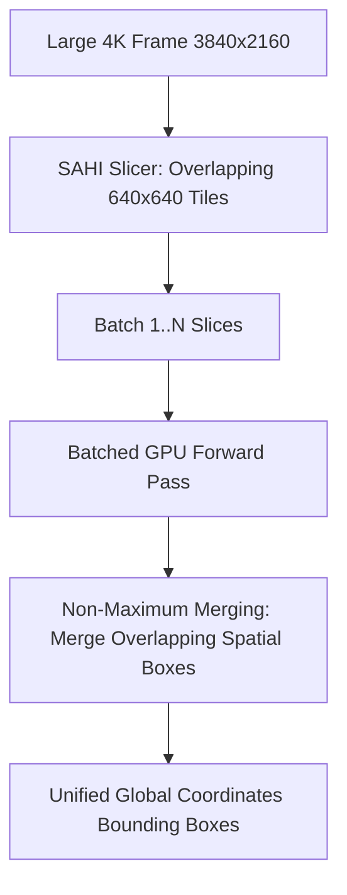

# 🛠️ Object Detection: Production Pipeline, Engineering Traps & Workarounds

A battle-tested practitioner's guide to engineering, debugging, and deploying high-throughput, low-latency 2D and oriented object detection pipelines in production environments.

Related notes: [[topics/object-detection/00-object-detection-moc|Object Detection MOC]], [[topics/gpu-deployment/00-gpu-deployment-moc|GPU Deployment MOC]].

---

## 1. End-to-End Production Pipeline Architecture


### Stage Breakdown:
1. **Frame Ingestion**: Capture via V4L2 or GStreamer hardware decoders (NVDEC) into pinned host memory (`cudaHostAlloc`) or DMA-BUF shared memory.
2. **Aspect-Preserving Letterbox**: Resize frames preserving the aspect ratio. Compute minimum padding in grey ($114, 114, 114$) to avoid aspect ratio distortions that degrade bounding box regression.
3. **Hardware-Accelerated Inference**: Execute FP16 or INT8 TensorRT engine asynchronously on dedicated CUDA streams (`cudaStream_t`).
4. **Post-Processing & NMS Fusion**: Decode box offsets from network output tensors back to original camera pixel coordinates. If using traditional detectors (YOLO11), execute NMS on GPU via `EfficientNMS_TRT`. If using NMS-free models (RF-DETR / RT-DETRv3 / YOLO26), directly stream valid detections.

---

## 2. Common Traps, Edge Cases & Hardware Bottlenecks

### Trap 1: Small-Object Pixel Obliteration
- **Problem**: When downsampling a 4K frame ($3840 \times 2160$) to standard $640 \times 640$, an object measuring $32 \times 32$ pixels shrinks to under $5 \times 5$ pixels. Deep backbone stride-32 stages collapse it into a single feature token, destroying recall.
- **Trap**: Increasing input size to $1920 \times 1920$ quadruples memory footprint and slows forward latency by 9x ($O(H \times W)$).

### Trap 2: CPU-Bound Non-Maximum Suppression (NMS) Bottleneck
- **Problem**: Running Python-based NMS or OpenCV `cv2.dnn.NMSBoxes` on CPU after a 2ms GPU forward pass takes 8–15ms on an embedded ARM processor (such as Jetson Orin Nano or Raspberry Pi), destroying real-time throughput.

### Trap 3: Host-to-Device Memory Bandwidth Stalls
- **Problem**: Copying unpinned, pageable host memory to GPU VRAM over PCIe can take 4–6ms per 1080p frame, exceeding the actual neural network inference time.

---

## 3. Battle-Tested Engineering Workarounds

### Workaround 1: SAHI (Slicing Aided Hyper Inference)
For high-resolution aerial, drone, or industrial defect inspection, partition the large image into overlapping slices, run batched inference, and merge detections using **Non-Maximum Merging (NMM)**:



### Workaround 2: Migration to NMS-Free Architectures
Replace traditional detectors with **RF-DETR** or **RT-DETRv3**. Because they formulate detection as 1-to-1 bipartite set prediction, predictions are naturally deduplicated. This completely eliminates CPU post-processing overhead and variance.

### Workaround 3: Pinned Memory & Pipelined CUDA Streams
Allocate camera frame memory using page-locked memory (`cudaHostAllocMapped`). Overlap host-to-device memory transfers of frame $t+1$ with GPU forward execution of frame $t$:

```python
# Pipelined asynchronous CUDA execution skeleton
import torch

stream1 = torch.cuda.Stream()
stream2 = torch.cuda.Stream()

with torch.cuda.stream(stream1):
    # Asynchronous memory copy
    d_input.copy_(h_input, non_blocking=True)

with torch.cuda.stream(stream2):
    # GPU inference execution
    output = model(d_input_prev)
```

---

## 4. Production Deployment Recipes

### A. TensorRT Engine Compilation (Fixed Shape)
```bash
# Export PyTorch model to clean ONNX
python tools/export_onnx.py --model model.pth --imgsz 640 --opset 17

# Build optimized TensorRT engine with FP16 precision and warm-up profiling
trtexec --onnx=model.onnx \
        --saveEngine=model.engine \
        --fp16 \
        --workspace=4096 \
        --warmUp=200 \
        --iterations=500
```

### B. Cross-Platform Vulkan NCNN Export (Mobile & Embedded)
```bash
# Convert ONNX graph to NCNN param and bin representation
onnx2ncnn model.onnx model.param model.bin

# Optimize and fuse operations for Vulkan compute shaders
ncnnoptimize model.param model.bin model_opt.param model_opt.bin 65536
```
