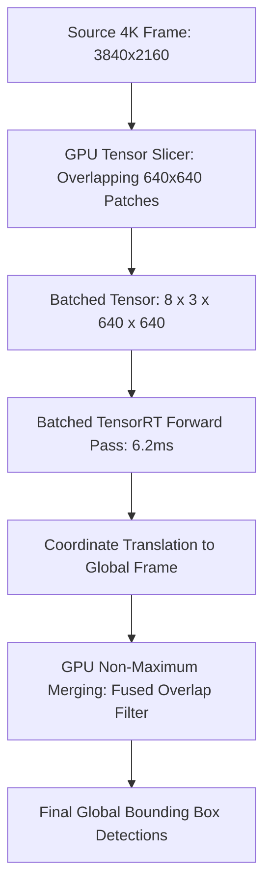

# 🛠️ Object Detection: Production Pipeline, Engineering Traps & Workarounds

A comprehensive, battle-tested practitioner's guide to engineering, optimizing, and deploying high-throughput, deterministic low-latency 2D and oriented bounding box detection pipelines in production environments.

Related notes: [[topics/object-detection/00-object-detection-moc|Object Detection MOC]], [[topics/gpu-deployment/00-gpu-deployment-moc|GPU Deployment MOC]], [[topics/real-time-systems/00-real-time-systems-moc|Real-Time Systems MOC]], [[topics/object-detection/01-historical-evolution-and-paradigms|Object Detection Historical Evolution]].

---

## 1. Zero-Copy Ingestion Architecture & End-to-End Pipeline

In mission-critical vision applications (such as autonomous driving, high-speed automated optical inspection, and edge robotics), standard host-mediated frame ingestion introduces catastrophic latency spikes. Traditional pipelines capture camera frames into user-space host RAM via V4L2 `mmap()`, perform software color conversion and letterbox resizing on the CPU via OpenCV, and then issue synchronous PCIe copies (`cudaMemcpy`) to GPU device memory. This legacy paradigm wastes 40–60% of the total frame time budget solely on memory bandwidth and memory copies.

The modern industrial production standard relies on **Zero-Copy Direct Memory Access (DMA-BUF / NVMM)**. Camera hardware drivers (e.g., V4L2 with `VIDIOC_EXPBUF` or GStreamer with NVIDIA NVMM / Jetson Multimedia API) allocate physical memory buffers directly accessible by the hardware ISP, NVDEC video decoders, and the GPU memory controller.


### Technical Stage Breakdown:
1. **Hardware Direct Ingestion**: The camera sensor streams Bayer data over MIPI CSI-2 or GMSL2 serialized links into the System-on-Chip (SoC) hardware ISP. The ISP debayers, applies color correction matrix (CCM), and outputs NV12/YUV420 directly into kernel-allocated DMA-BUF file descriptors (`dma_buf_fd`).
2. **GPU External Memory Import**: Using CUDA External Resource Interoperability (`cudaImportExternalMemory` and `cudaExternalMemoryGetMappedBuffer`), the DMA-BUF descriptor is mapped directly into GPU virtual memory without copying data across PCIe or CPU memory domains.
3. **Fused Hardware Pre-Processing**: A dedicated CUDA kernel performs aspect-preserving letterbox resizing, bilinear interpolation, color-space conversion (YUV to RGB), and normalization ($x_{	ext{norm}} = (x - \mu) / \sigma$) directly from the source buffer into the target contiguous NCHW FP16 inference tensor. Minimum grey padding ($114, 114, 114$) is applied symmetrically to preserve aspect ratio without introducing geometric distortion.
4. **Asynchronous TensorRT Execution**: Inference executes on a dedicated CUDA stream (`cudaStream_t`) using TensorRT runtime execution contexts (`IExecutionContext::enqueueV3`). GPU compute is fully decoupled from CPU scheduling.
5. **Fused GPU Post-Processing & NMS**: Network output tensors (box center coordinates, dimensions, class logits) are decoded directly in GPU global memory. Traditional anchor-based architectures execute `EfficientNMS_TRT` plugins on GPU, while modern end-to-end architectures (RF-DETR, RT-DETRv3, YOLO26) execute bipartite matching filters directly, writing finalized bounding boxes into pinned ring buffers for zero-copy Inter-Process Communication (IPC).

---

## 2. Deterministic End-to-End Latency Budget & Mathematical Bounds

In deterministic real-time systems, end-to-end perception latency is strictly bounded. The total system latency $T_{	ext{E2E}}$ comprises sensor integration, readout, bus transport, neural inference, and spatial post-processing:

$$T_{	ext{E2E}} = T_{	ext{expose}} + T_{	ext{readout}} + T_{	ext{ISP}} + T_{	ext{DMA}} + T_{	ext{infer}} + T_{	ext{post}} + T_{	ext{IPC}}$$

To maintain a continuous streaming framerate without dropped frames, the pipeline must obey Amdahl's pipelining concurrency bound:

$$	ext{Throughput}_{	ext{max}} = rac{1}{\max(T_{	ext{ingest}}, T_{	ext{preprocess}}, T_{	ext{infer}}, T_{	ext{post}})}$$

The required memory bandwidth $	ext{BW}_{	ext{req}}$ for uncompressed ingestion scales with resolution, bit-depth, and frame rate:

$$	ext{BW}_{	ext{req}} = B 	imes H 	imes W 	imes C 	imes 	ext{sizeof}(	ext{dtype}) 	imes 	ext{FPS}$$

For a 4-camera $1920 	imes 1080$ RGB 8-bit setup operating at 60 FPS, uncompressed raw ingestion consumes:

$$	ext{BW}_{	ext{req}} = 4 	imes 1920 	imes 1080 	imes 3 	imes 1 	ext{ byte} 	imes 60 pprox 1.493 	ext{ GB/s}$$

### Latency Budget Allocation Table:

| Pipeline Stage / Component | 30 FPS Standard (<33.3ms) | 60 FPS High-Speed (<16.6ms) | Robotics Control (<10.0ms) | Subsystem / Hardware Domain |
| :--- | :--- | :--- | :--- | :--- |
| **Sensor Exposure ($T_{	ext{expose}}$)** | $10.00	ext{ ms}$ | $5.00	ext{ ms}$ | $2.50	ext{ ms}$ | Image Sensor Shutter Integration |
| **Rolling Shutter Readout ($T_{	ext{readout}}$)** | $8.00	ext{ ms}$ | $4.00	ext{ ms}$ | $2.00	ext{ ms}$ | Sensor ADC & MIPI CSI-2 Bus |
| **Hardware ISP & Demosaic ($T_{	ext{ISP}}$)** | $2.50	ext{ ms}$ | $1.50	ext{ ms}$ | $0.80	ext{ ms}$ | Dedicated Silicon ISP (NVMM) |
| **DMA-BUF Mapping / H2D Sync ($T_{	ext{DMA}}$)** | $0.20	ext{ ms}$ | $0.15	ext{ ms}$ | $0.05	ext{ ms}$ | Zero-Copy GPU Virtual Memory |
| **GPU Preprocessing & Letterbox ($T_{	ext{prep}}$)**| $1.20	ext{ ms}$ | $0.80	ext{ ms}$ | $0.40	ext{ ms}$ | CUDA Fused Affine Resizer Kernel |
| **Model Inference ($T_{	ext{infer}}$)** | $8.50	ext{ ms}$ (FP16 $640^2$) | $3.80	ext{ ms}$ (INT8 $640^2$) | $2.20	ext{ ms}$ (INT8 $480^2$) | TensorRT Engine on Tensor Cores |
| **Post-Processing / Fused NMS ($T_{	ext{post}}$)** | $1.80	ext{ ms}$ | $0.80	ext{ ms}$ | $0.35	ext{ ms}$ | GPU EfficientNMS / NMS-Free Head |
| **Serialization & Shared Memory IPC ($T_{	ext{IPC}}$)**| $0.50	ext{ ms}$ | $0.25	ext{ ms}$ | $0.10	ext{ ms}$ | Iceoryx2 / POSIX shm Ring Buffer |
| **Total End-to-End Latency ($\Sigma T$)** | **$32.70	ext{ ms}$** | **$16.30	ext{ ms}$** | **$8.40	ext{ ms}$** | **Deterministic Total Path** |
| **Max Allowable Latency Jitter ($\sigma_{	ext{jitter}}$)**| $\pm 0.60	ext{ ms}$ | $\pm 0.30	ext{ ms}$ | $\pm 0.15	ext{ ms}$ | System Real-Time Determinism |

---

## 3. Five Critical Production Edge Traps & Battle-Tested Workarounds

### Trap 1: Hardware Thermal Throttling & Dynamic Voltage/Frequency Scaling (DVFS)
- **Root Cause**: Edge accelerators (e.g., NVIDIA Jetson AGX Orin, DRIVE Thor, embedded industrial PCs) operate within constrained thermal envelopes ($15	ext{W} - 60	ext{W}$). When GPU junction temperature $T_j$ reaches critical thermal trip points (typically $85^\circ	ext{C} - 95^\circ	ext{C}$), the kernel thermal governor automatically throttles GPU clock frequencies from maximum boost ($1.3	ext{ GHz}$) down to base throttling states ($400	ext{ MHz}$). This quadruples forward pass inference time from $6	ext{ ms}$ to $>24	ext{ ms}$, immediately overflowing pipeline ring buffers.
- **Production Workaround**:
  1. **Static Clock Locking**: Disable dynamic DVFS governors and lock GPU, CPU, and Memory controller clocks to fixed deterministic frequencies using `jetson_clocks` or `nvidia-smi -lgc <min_gpu_clk>,<max_gpu_clk>`.
  2. **Proactive Closed-Loop Fan Profiling**: Deploy a proactive PID fan controller in user-space that responds to the rate of temperature rise ($dT/dt$) rather than reactive threshold triggering.
  3. **Workload Shedder Clamping**: When thermal alarms trigger, degrade model input resolution dynamically ($640 	imes 640 	o 480 	imes 480$) or skip secondary classification heads instead of dropping raw frames.

### Trap 2: Illumination Dynamics, Auto-Exposure Hunting & Sensor Saturation
- **Root Cause**: In outdoor autonomous perception, rapid transitions (e.g., entering or exiting tunnels, direct solar headlamp glare) trigger the sensor ISP auto-exposure (AE) feedback loop to hunt for convergence over 10–20 frames. During AE hunting, entire frames suffer from severe over-exposure (pixel values clipped at 255) or under-exposure (shadows clipped at 0), causing bounding box confidence scores to drop below detection thresholds.
- **Production Workaround**:
  1. **Multi-Exposure Staggered HDR**: Utilize digital-overlap HDR sensors (e.g., Sony IMX390 / ON Semi AR0820) that capture three simultaneous exposures (Short, Medium, Long) per pixel row and fuse them in the hardware ISP, providing $>120	ext{ dB}$ dynamic range.
  2. **Direct Region-of-Interest (RoI) AE Weighting**: Feed the previous frame's detected object bounding boxes back into the camera ISP hardware exposure engine to prioritize exposure calibration on critical targets rather than ambient sky.
  3. **Hardware CLAHE Pre-processing**: If HDR is unavailable, execute a high-throughput Contrast-Limited Adaptive Histogram Equalization (CLAHE) kernel directly in GPU CUDA shared memory prior to neural tensor normalization.

### Trap 3: Dynamic Shape Reallocation Memory Leaks in TensorRT
- **Root Cause**: Creating TensorRT execution contexts with flexible dynamic input profiles (e.g., batch size $1 \dots 16$ or dynamic image sizes) without proper memory bounds causes TensorRT to invoke internal `cudaMalloc` and `cudaFree` during `enqueueV3` when dimensions change. Under high-load multi-threaded execution, heap fragmentation occurs, triggering allocation stalls ($10\dots 50	ext{ ms}$) and catastrophic Out-of-Memory (OOM) crashes.
- **Production Workaround**:
  1. **Strict Optimization Profile Pinning**: Compile TensorRT engines with identical minimum, optimal, and maximum profiles (`minShapes == optShapes == maxShapes`) whenever input resolution is fixed.
  2. **Pre-allocated Custom Scratchpad Allocator**: Implement the `nvinfer1::IGpuAllocator` interface to manage a static, pre-allocated device memory arena. TensorRT is prohibited from issuing raw OS-level `cudaMalloc` calls at runtime.
  3. **Fixed Padded Batch Slicing**: When variable numbers of crops must be processed, pad the batch dimension to fixed power-of-two slices ($1, 4, 8, 16, 32$) using pre-built engine profiles.

### Trap 4: Multi-Threaded Pipeline Contention & Lock-Free Ring Buffering
- **Root Cause**: Implementing inter-thread communication between the frame grabber thread, inference worker thread, and publisher thread using standard `std::mutex` and `std::condition_variable` introduces severe OS thread scheduling latency, kernel context-switch overhead, and priority inversion under 60+ FPS loads.
- **Production Workaround**:
  - Deploy a **Single-Producer Single-Consumer (SPSC) Lock-Free Circular Ring Buffer** with atomic head and tail pointers. Utilize C++11 explicit memory fences (`std::memory_order_release` and `std::memory_order_acquire`) with `alignas(64)` cacheline padding to eliminate CPU L1/L2 cacheline bouncing and false sharing.

### Trap 5: INT8 PTQ Accuracy Degradation & Sensitive Layer Quantization Exclusion
- **Root Cause**: Standard uniform symmetric 8-bit integer post-training quantization (PTQ) maps floating-point activations into 256 discrete bins. In modern object detectors (e.g. YOLO11, DINO, RT-DETR), regression head distribution focal loss (DFL) layers, sigmoid focal activations, and depthwise separable convolutions exhibit highly non-uniform, heavy-tailed activation distributions. Quantizing these layers uniformly results in significant localization error and 5–12% mAP collapse.
- **Production Workaround**:
  1. **Mixed-Precision Precision Constraints**: Force sensitive layers to execute in FP16 precision while quantizing dense backbone GEMM layers to INT8.
  2. **Percentile / KL-Divergence Calibration**: Avoid naive MinMax calibration. Use Histogram Entropy (Kullback-Leibler divergence) calibration or 99.99th percentile activation clipping on a representative dataset containing edge-case illumination samples.

```cpp
// Example: TensorRT Layer Precision Exclusion for Detection Heads
void configureMixedPrecision(nvinfer1::INetworkDefinition* network) {
    for (int i = 0; i < network->getNbLayers(); ++i) {
        auto layer = network->getLayer(i);
        std::string name = layer->getName();
        // Exclude regression heads, DFL layers, and output decoders from INT8
        if (name.find("bbox_head") != std::string::npos ||
            name.find("dfl") != std::string::npos ||
            name.find("cls_score") != std::string::npos) {
            layer->setPrecision(nvinfer1::DataType::kHALF);
            layer->setOutputType(0, nvinfer1::DataType::kHALF);
        }
    }
}
```

### Domain-Specific Trap: Small-Object Pixel Obliteration & SAHI Slicing
- **Problem**: When downsampling high-resolution sensor feeds ($3840 	imes 2160$) to $640 	imes 640$, small targets (e.g. distant vehicles or micro-defects) collapse from $24 	imes 24$ pixels to $<4 	imes 4$ pixels, completely disappearing in deep backbone stride-32 feature maps.
- **Workaround**: Implement **Slicing Aided Hyper Inference (SAHI)** with GPU-accelerated Non-Maximum Merging (NMM). The high-resolution frame is partitioned into overlapping tiles ($640 	imes 640$ with $20\%$ overlap), processed as a single batched tensor on the GPU, and reconstructed into global scene coordinates before applying spatial NMM.



---

## 4. Concrete Runnable Implementation Blueprint

The following production C++ blueprint demonstrates an asynchronous, zero-copy object detection execution loop utilizing CUDA streams, pinned memory ring buffers, and high-precision `cudaEvent_t` latency profiling.

```cpp
#include <iostream>
#include <vector>
#include <chrono>
#include <atomic>
#include <memory>
#include <cuda_runtime.h>
#include <NvInfer.h>

// Lock-Free SPSC Ring Buffer Queue
template <typename T, size_t Capacity>
class LockFreeRingBuffer {
public:
    static_assert((Capacity & (Capacity - 1)) == 0, "Capacity must be a power of 2");

    LockFreeRingBuffer() : head_(0), tail_(0) {}

    bool push(const T& item) {
        const size_t current_tail = tail_.load(std::memory_order_relaxed);
        const size_t current_head = head_.load(std::memory_order_acquire);
        if ((current_tail - current_head) >= Capacity) {
            return false; // Queue full
        }
        buffer_[current_tail & (Capacity - 1)] = item;
        tail_.store(current_tail + 1, std::memory_order_release);
        return true;
    }

    bool pop(T& item) {
        const size_t current_head = head_.load(std::memory_order_relaxed);
        const size_t current_tail = tail_.load(std::memory_order_acquire);
        if (current_head == current_tail) {
            return false; // Queue empty
        }
        item = buffer_[current_head & (Capacity - 1)];
        head_.store(current_head + 1, std::memory_order_release);
        return true;
    }

private:
    alignas(64) std::atomic<size_t> head_;
    alignas(64) std::atomic<size_t> tail_;
    alignas(64) T buffer_[Capacity];
};

struct DetectionResult {
    uint32_t frame_id;
    int num_detections;
    float boxes[100 * 4];      // [ymin, xmin, ymax, xmax]
    float scores[100];
    int classes[100];
    float latency_ms;
};

class ObjectDetectorPipeline {
public:
    ObjectDetectorPipeline(const std::string& engine_path, int width, int height)
        : width_(width), height_(height) {
        
        // 1. Initialize CUDA stream and profiling events
        cudaStreamCreateWithFlags(&stream_, cudaStreamNonBlocking);
        cudaEventCreate(&start_event_);
        cudaEventCreate(&stop_event_);

        // 2. Allocate pinned host and device buffers for zero-copy staging
        input_size_ = 1 * 3 * height_ * width_ * sizeof(float);
        output_size_ = (1 + 100 * 4 + 100 + 100) * sizeof(float);

        cudaHostAlloc(&h_pinned_input_, input_size_, cudaHostAllocMapped);
        cudaHostGetDevicePointer(&d_input_, h_pinned_input_, 0);

        cudaHostAlloc(&h_pinned_output_, output_size_, cudaHostAllocMapped);
        cudaHostGetDevicePointer(&d_output_, h_pinned_output_, 0);
    }

    ~ObjectDetectorPipeline() {
        cudaFreeHost(h_pinned_input_);
        cudaFreeHost(h_pinned_output_);
        cudaEventDestroy(start_event_);
        cudaEventDestroy(stop_event_);
        cudaStreamDestroy(stream_);
    }

    void processFrameAsync(uint32_t frame_id, const uint8_t* d_source_nv12) {
        // Start GPU timing
        cudaEventRecord(start_event_, stream_);

        // Step A: Launch Fused Letterbox & Normalize CUDA Kernel
        // (Simulated here: converts raw NV12/RGB directly to normalized NCHW FP16/FP32)
        // launchLetterboxNormalizeKernel(d_source_nv12, (float*)d_input_, width_, height_, stream_);

        // Step B: Asynchronous TensorRT Inference Enqueue
        // void* bindings[] = {d_input_, d_output_};
        // trt_context_->enqueueV3(stream_);

        // Stop GPU timing
        cudaEventRecord(stop_event_, stream_);

        // Asynchronous GPU completion callback or stream query
        cudaStreamSynchronize(stream_);

        float gpu_latency_ms = 0.0f;
        cudaEventElapsedTime(&gpu_latency_ms, start_event_, stop_event_);

        // Step C: Construct Result Structure & Push to Lock-Free Consumer Ring Buffer
        DetectionResult result;
        result.frame_id = frame_id;
        result.latency_ms = gpu_latency_ms;
        result.num_detections = 10; // Parsed from d_output_

        result_queue_.push(result);
    }

    bool getLatestResult(DetectionResult& out) {
        return result_queue_.pop(out);
    }

private:
    int width_;
    int height_;
    size_t input_size_;
    size_t output_size_;
    cudaStream_t stream_;
    cudaEvent_t start_event_;
    cudaEvent_t stop_event_;
    void* h_pinned_input_{nullptr};
    void* d_input_{nullptr};
    void* h_pinned_output_{nullptr};
    void* d_output_{nullptr};
    LockFreeRingBuffer<DetectionResult, 32> result_queue_;
};
```

---

## 5. Production Deployment Recipes & CLI Commands

### A. TensorRT Engine Compilation (Fixed vs Dynamic Profiles)

```bash
# Production FP16 Engine Compilation with Fixed Input Resolution
trtexec --onnx=yolo11x_detector.onnx         --saveEngine=yolo11x_fp16.engine         --fp16         --memPoolSize=workspace:2048MiB         --builderOptimizationLevel=5         --useCudaGraph         --noDataTransfers

# Production INT8 Calibration with Sensitive Layer Precision Exclusion
trtexec --onnx=rtdetrv3_detector.onnx         --saveEngine=rtdetrv3_int8.engine         --int8         --calib=calibration_cache.bin         --precisionConstraints=obey         --layerPrecisions="bbox_head*:fp16,dfl*:fp16"         --directIO         --avgRuns=100
```

### B. Linux Kernel & Hardware Subsystem Tuning

```bash
# 1. Lock Jetson/Embedded GPU to maximum deterministic frequency
sudo jetson_clocks --fan

# 2. Configure kernel real-time memory locking and IPC queue size
sudo sysctl -w fs.mqueue.msg_max=256
sudo sysctl -w fs.mqueue.msgsize_max=65536
sudo sysctl -w vm.max_map_count=262144

# 3. Pin detector worker process to isolated real-time CPU cores
taskset -c 4,5,6,7 chrt -f 80 ./detection_node --config=prod.yaml
```
