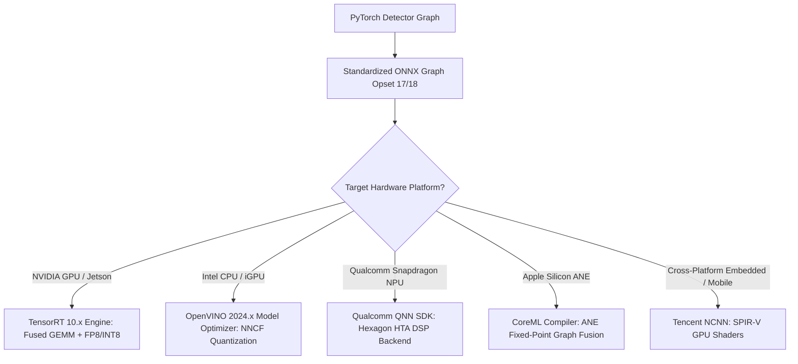

# ⚙️ Object Detection: Backends, Acceleration & Open Research Frontiers

A deep-dive analysis of hardware runtime execution, post-training quantization failure modes, multi-backend graph compilation, and unsolved frontiers in real-time object detection.

Related notes: [[topics/object-detection/00-object-detection-moc|Object Detection MOC]], [[topics/gpu-deployment/00-gpu-deployment-moc|GPU Deployment MOC]].

---

## 1. Execution Backends & Inference Compilers Compared

Deploying modern detectors (YOLOv10/26, RF-DETR, RT-DETRv3) requires selecting the appropriate execution backend based on the target silicon:



### Deep Backend Evaluation Matrix
| Backend Runtime | Target Silicon | Primary Operator Bottlenecks | NMS Implementation Path | Best-Suited Architectures |
| :--- | :--- | :--- | :--- | :--- |
| **NVIDIA TensorRT 10** | RTX, Orin, Blackwell | Deformable Attention, LayerNorm | Fused `EfficientNMS_TRT` plugin or NMS-Free (RF-DETR) | RF-DETR, RT-DETRv3, YOLOv10 |
| **Intel OpenVINO** | Intel Xeon, Core Ultra, Arc | Memory-bandwidth bound Convolutions | OpenVINO `MulticlassNonMaxSuppression` layer | YOLO-NAS, MobileNet-SSD |
| **Qualcomm QNN / SNPE** | Snapdragon 8 Gen 3/4, X Elite | 4D dynamic tensor reshaping, GELU | Offline fixed-size box decoding into DSP vector registers | YOLO11-Nano, Fast-DETR |
| **Apple CoreML / ANE** | M-Series, A-Series (Apple Silicon)| 5D attention matrices falling back to GPU/CPU | In-graph `ArgMax` + TopK thresholding on Neural Engine | YOLOv8/v10, MobileNetV4 |
| **Tencent NCNN (Vulkan)**| ARM Mali, Adreno, Pi 5 VideoCore | High register pressure in large attention kernels | Hand-coded C++ SSE/NEON box coordinate decoding | YOLOX, NanoDet-Plus |

---

## 2. Low-Precision Quantization Mechanics (INT8 & FP8)

### The Quantization Distortion Problem in DETR & Transformers:
Standard ConvNets (YOLO) quantize to INT8 with minimal mAP degradation ($<0.5\%$). However, Transformer detectors (DETR family) suffer catastrophic accuracy drops ($>15\%$ AP drop) under naive Post-Training Quantization (PTQ) due to:
1. **Dynamic Activation Outliers**: Cross-attention keys and values exhibit massive spikes in isolated feature channels.
2. **Bounding Box Regression Coordinate Drift**: Linear quantization of normalized box coordinates $[c_x, c_y, w, h] \in [0, 1]$ into 256 discrete bins introduces spatial quantization noise of $\pm 0.0039$, which translates to a $4\text{ pixel}$ coordinate error on a $1024 \times 1024$ image.

### Production Solution: Mixed-Precision Layer Profiling & SmoothQuant
- Keep sensitive layers (Deformable Attention cross-attention matrices, bounding box regression heads) in **FP16**.
- Quantize heavy feed-forward network (FFN) linear projections and backbone layers to **INT8** or **FP8 (E4M3)** using scale migration:

```python
# Mixed-Precision Layer Exclusion Pattern for TensorRT Quantization
import tensorrt as trt

def configure_mixed_precision_builder(builder_config):
    # Enable FP16 and INT8 modes
    builder_config.set_flag(trt.BuilderFlag.FP16)
    builder_config.set_flag(trt.BuilderFlag.INT8)
    
    # Exclude sensitive coordinate regression layers from INT8 quantization
    for layer_name in ["pred_boxes", "bbox_embed", "reference_points"]:
        layer = network.get_layer_by_name(layer_name)
        if layer:
            layer.precision = trt.DataType.HALF
            layer.set_output_type(0, trt.DataType.HALF)
```

---

## 3. Current Open Problems in Object Detection

### 🔴 Problem 1: Extreme Small Object Detection in Ultra-High-Resolution Imagery
- **The Failure Mode**: In aerial drone surveillance, geospatial satellite monitoring, and high-speed PCB automated optical inspection (AOI), objects of interest occupy tiny pixel dimensions (e.g. $4 \times 4$ to $12 \times 12$ pixels) within a $8192 \times 8192$ frame.
- **Why Standard Models Fail**: Standard convolutional downsampling (stride 32 in ResNet/ConvNeXt) completely obliterates feature activations of objects smaller than $32 \times 32$ pixels before reaching the prediction head.
- **Recent Frontier Solutions (2024–2026)**:
  - **SAHI (Slicing Aided Hyper Inference)**: Slices large frames into overlapping $640 \times 640$ patches with batch stitching. *Trade-off*: Multiplies inference compute by $16\times - 36\times$.
  - **Foveated Dynamic Zoom Transformers**: Two-stage networks where a coarse lightweight backbone predicts high-density heatmaps, and a fine-resolution head attends strictly to candidate clusters.

---

### 🔴 Problem 2: The Non-Maximum Suppression (NMS) End-to-End Latency Gap
- **The Failure Mode**: While deep network forward passes now execute in $<3\text{ ms}$ on modern GPUs, standard Greedy NMS takes $5-15\text{ ms}$ on dense scenes containing thousands of candidates (e.g., dense crowd surveillance or warehouse inventory counting).
- **Why Standard NMS Bottlenecks**: Greedy NMS is inherently sequential ($O(N^2)$ worst-case). It requires sorting candidate boxes by score, computing IoU pairwise against all remaining candidates, and suppressing duplicates sequentially.
- **Recent Frontier Solutions**:
  - **Dual-Label Assignment (YOLOv10 / YOLO26)**: Training with both one-to-many (for feature learning) and one-to-one (Hungarian) heads simultaneously. At test time, discarding the one-to-many head eliminates NMS entirely.
  - **Learned Query Suppressors (RF-DETR)**: Eliminates duplicate candidates inside the Transformer decoder queries, delivering true $O(1)$ post-processing.

---

### 🔴 Problem 3: Open-Vocabulary Hallucination & Novel-Class Attribute Misattribution
- **The Failure Mode**: Open-vocabulary zero-shot detectors (Grounding DINO, GLIP) match image regions to arbitrary text embeddings. When prompted with nuanced compound queries ("person wearing a yellow safety vest and blue hard hat"), the model frequently exhibits **attribute binding failure**: detecting a person wearing a blue shirt and yellow helmet as a positive match.
- **Root Cause**: Contrastive language-image pre-training (CLIP/SigLIP) maps global bag-of-words semantics rather than structured relational syntax.
- **Active Research Direction**: Integrating visual graph neural networks and spatial scene graphs directly into the detector's cross-attention layers to enforce physical compositional binding before thresholding.

---

## 4. Concrete Engineering Upgrade Checklist for Detection Stacks

1. **Audit Hardware Target**:
   - If NVIDIA Tensor Core GPU $\to$ Compile via **TensorRT 10** with `--fp16 --useCudaGraph`.
   - If Mobile ARM / Embedded $\to$ Compile via **Vulkan NCNN** or **Qualcomm QNN** with fixed-size tensors.
2. **Eliminate Greedy NMS**:
   - Upgrade legacy anchor-based models (YOLOv5/v7) to NMS-free dual-assignment architectures (**RF-DETR** or **YOLOv10**).
3. **Prevent INT8 Coordinate Drift**:
   - Explicitly freeze coordinate prediction layers to FP16 when generating PTQ calibration caches.
