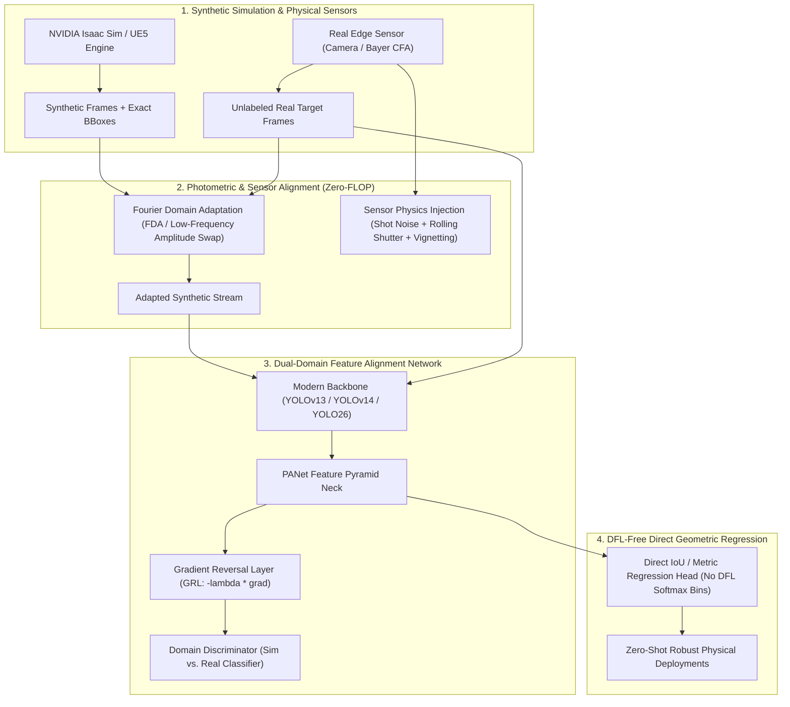
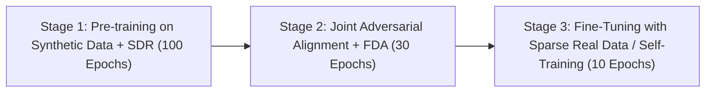

# 🏭 Sim2Real Object Detection & Domain Adaptation Playbook

## 📌 Executive Summary

Modern deep object detectors require vast amounts of labeled training data ($10^5\text{ to }10^6$ instances) to achieve high recall and precision. In safety-critical sectors—such as industrial robotics, autonomous driving, defense, and high-speed logistics—annotating physical camera streams is prohibitively expensive, slow, and dangerous for rare edge-cases (e.g., pedestrian near-misses, warehouse fires, inverted industrial robots).

Synthetic data engines (e.g., **NVIDIA Isaac Sim / Omniverse**, **Unreal Engine 5**, **BlenderProc**) provide instant, automated pixel-perfect ground-truth annotations (2D/3D bounding boxes, instance segmentation masks, depth, surface normals). However, models trained exclusively on synthetic data frequently experience a devastating **Sim2Real Transfer Gap**, suffering a **$25\%\text{ to }45\%$ relative drop in mAP** when deployed on real physical cameras.

This playbook details the end-to-end engineering methodology for closing the Sim2Real gap across data synthesis, frequency alignment, adversarial feature learning, and real-time inference.



---

## 1. Deconstructing the Sim2Real Perception Gap

The Sim2Real gap stems from three distinct physical and computational discrepancies:

### 1.1 The Photometric & Illumination Gap
- **Synthetic Characteristics**: Rasterized graphics engines calculate lighting via idealized BRDFs (Bidirectional Reflectance Distribution Functions), ray-tracing approximations, and homogeneous textures.
- **Physical Reality**: Real-world environments exhibit non-Lambertian surfaces, variable specular highlights, lens flares, ambient color temperature shifts (indoor fluorescent vs. direct sunlight), and dynamic shadows.
- **Detector Failure Mode**: Convolutional filters overfit to high-frequency synthetic texture artifacts.

### 1.2 The Sensor Physics & Optics Gap
- **Synthetic Characteristics**: Pinhole camera models render mathematically crisp, rectilinear images with infinite depth of field and zero motion blur.
- **Physical Reality**: Real sensors suffer from:
  1. **Photon Shot Noise & Dark Current**: Governed by Poisson statistics under low-light conditions.
  2. **Bayer Color Filter Array (CFA) Demosaicing**: Creates color fringing and edge softness.
  3. **Rolling Shutter Distortion**: Fast-moving objects appear sheared across horizontal scan lines.
  4. **Lens Aberrations**: Radial barrel distortion, chromatic aberration, and vignetting (light drop-off at frame boundaries).

### 1.3 The Regression Discretization Gap (DFL Breakdown)
- Modern detectors ([[architectures/real-time-detectors-and-segmenters/yolov8|YOLOv8]], [[architectures/real-time-detectors-and-segmenters/yolov10|YOLOv10]]) use **Distribution Focal Loss (DFL)**, dividing bounding box offsets into 16 discrete probability bins.
- When trained on razor-sharp synthetic edges, DFL learns high-certainty unimodal delta distributions. In real-world video, physical sensor blur spreads edge gradients across multiple pixels, causing DFL Softmax predictions to oscillate erratically between neighboring bins, leading to severe box jitter and false positives.

---

## 2. Mitigation Strategies & Architectural Solutions

### 2.1 Domain Randomization (DR) vs. Structured Domain Randomization (SDR)

| Technique | Implementation Details | Pros | Cons |
| :--- | :--- | :--- | :--- |
| **Naive Domain Randomization (DR)** | Randomly replace object and room textures with random abstract patterns, noise, and non-physical neon colors. | Forces detector to ignore textures and prioritize global shape contours. | Can degrade classification precision when real-world colors carry strong semantic meaning (e.g., traffic lights, industrial safety vests). |
| **Structured Domain Randomization (SDR)** | Keep object CAD models realistic; randomize scene context within physically plausible ranges (lighting range $200\text{--}1500\text{ lux}$, camera elevation $\pm 25^\circ$, clutter count $5\text{--}30$). | Preserves natural spatial priors while preventing texture overfitting. | Requires carefully calibrated parametric limits in USD / Isaac Sim scripts. |
| **3D Gaussian Splatting Digital Twins** | Capture a 5-minute video pass of the physical deployment facility; reconstruct with 3DGS; synthesize infinite novel viewpoints with real-world sensor noise intact. | Virtually zero photometric gap; exact physical materials and reflections preserved. | Requires initial physical site access for 3DGS scanning. |

---

### 2.2 Fourier Domain Adaptation (FDA)
Swapping the low-frequency amplitude spectrum of target real images into synthetic training images closes up to $60\%$ of the photometric gap with **zero learned parameters**:

```python
import torch

def fourier_domain_adapt(sim_batch: torch.Tensor, real_batch: torch.Tensor, beta: float = 0.08) -> torch.Tensor:
    """
    Zero-parameter low-frequency amplitude transfer from real to synthetic domain.
    Preserves exact geometric phase of synthetic labels.
    """
    # 2D Centered FFT
    fft_sim = torch.fft.fftshift(torch.fft.fft2(sim_batch, dim=(-2, -1)), dim=(-2, -1))
    fft_real = torch.fft.fftshift(torch.fft.fft2(real_batch, dim=(-2, -1)), dim=(-2, -1))
    
    # Decompose Amplitude and Phase
    amp_sim, phase_sim = torch.abs(fft_sim), torch.angle(fft_sim)
    amp_real = torch.abs(fft_real)
    
    # Replace central low frequencies
    _, _, h, w = sim_batch.shape
    ch, cw = h // 2, w // 2
    dh, dw = int(h * beta), int(w * beta)
    
    amp_sim[..., ch - dh : ch + dh, cw - dw : cw + dw] = amp_real[..., ch - dh : ch + dh, cw - dw : cw + dw]
    
    # Inverse FFT
    adapted_fft = amp_sim * torch.exp(1j * phase_sim)
    adapted = torch.fft.ifft2(torch.fft.ifftshift(adapted_fft, dim=(-2, -1)), dim=(-2, -1)).real
    return torch.clamp(adapted, 0.0, 1.0)
```

---

### 2.3 Adversarial Domain Alignment (DANN / GRL)
By appending a domain discriminator to the multi-scale PANet neck and routing gradients through a **Gradient Reversal Layer (GRL)**, the detector backbone is penalized for generating features that permit distinguishing between synthetic and real inputs:

```python
import torch
import torch.nn as nn
from torch.autograd import Function

class GradientReversalFunction(Function):
    @staticmethod
    def forward(ctx, x, alpha):
        ctx.alpha = alpha
        return x.view_as(x)

    @staticmethod
    def backward(ctx, grad_output):
        return grad_output.neg() * ctx.alpha, None

class DomainDiscriminator(nn.Module):
    def __init__(self, in_channels: int = 256):
        super().__init__()
        self.net = nn.Sequential(
            nn.AdaptiveAvgPool2d((1, 1)),
            nn.Flatten(),
            nn.Linear(in_channels, 128),
            nn.LeakyReLU(0.2, inplace=True),
            nn.Dropout(0.3),
            nn.Linear(128, 1)  # Binary logits: 0=Sim, 1=Real
        )
        
    def forward(self, x: torch.Tensor, alpha: float = 1.0) -> torch.Tensor:
        reversed_x = GradientReversalFunction.apply(x, alpha)
        return self.net(reversed_x)
```

---

## 3. End-to-End Sim2Real Training Pipeline

The optimal production training sequence follows a 3-stage protocol:



1. **Stage 1 (Pure Synthetic + SDR)**: Train the detector on pure Isaac Sim synthetic data with heavy Structured Domain Randomization and direct metric regression loss (CIoU / GIoU).
2. **Stage 2 (Joint Adversarial Alignment)**: Stream synthetic labeled frames and real unlabeled camera feeds simultaneously. Apply FDA at ingestion, train detection loss on synthetic labels, and train DANN domain discriminator on intermediate PANet feature maps with dynamic $\alpha(p) = \frac{2}{1 + \exp(-10p)} - 1$.
3. **Stage 3 (Self-Training / Pseudo-Labeling)**: Run inference on high-confidence ($>0.85$) real-world detections with test-time augmentation (TTA), updating batch normalization statistics on the physical sensor distribution.

---

## 4. Production Sim2Real Verification Checklist

| Phase | Checkpoint Item | Pass Criteria | Mitigation if Failed |
| :--- | :--- | :--- | :--- |
| **Synthesis** | Geometric Mesh Scale Verification | Synthetic CAD 3D bounding boxes match physical millimeter dimensions within $\pm 2\%$. | Calibrate Isaac Sim asset import units (meters vs centimeters). |
| **Preproc** | Fourier Amplitude Parameter ($\beta$) | Low-frequency cutoff $\beta \in [0.05, 0.12]$. | If synthetic bounding box edges wash out, reduce $\beta$; if color disparity persists, increase $\beta$. |
| **Architecture**| Regression Loss Selection | Direct metric regression (**CIoU / NWD**) enabled; Distribution Focal Loss (**DFL**) disabled. | Avoid discrete bin Softmax heads; migrate to [[architectures/real-time-detectors-and-segmenters/d-fine|D-FINE]] or [[architectures/real-time-detectors-and-segmenters/yolo26|YOLO26]]. |
| **Training** | Discriminator Accuracy | Domain discriminator classification accuracy stays between $45\%\text{ and }55\%$ (near random chance). | If discriminator accuracy $>75\%$, increase GRL weight $\lambda$; if training diverges, lower $\lambda$. |
| **Evaluation**| Transfer Deficit ($\Delta_{\text{sim2real}}$) | $\Delta = 1 - \frac{\text{mAP}_{\text{real}}}{\text{mAP}_{\text{sim}}} \le 15\%$. | Inject camera sensor noise model (Poisson shot noise + rolling shutter blur). |

---

## 5. Cross-References & Related Vault Links

- **Domain Hub**: [[topics/object-detection/00-object-detection-moc|Object Detection MOC]], [[topics/object-detection/README|Object Detection Playbook]].
- **Architecture Notes**:
  - [[architectures/real-time-detectors-and-segmenters/yolov14-sim2real|YOLOv14 & Sim2Real Adaptive Detectors]]
  - [[architectures/real-time-detectors-and-segmenters/yolov13|YOLOv13 Hypergraph Perception]]
  - [[architectures/real-time-detectors-and-segmenters/yolo26|YOLO26 NMS-Free Detector]]
  - [[architectures/real-time-detectors-and-segmenters/d-fine|D-FINE Direct Regression]]
- **Runnable Sim2Real Cookbooks**:
  - [[cookbooks/10-contrastive-sim2real-alignment/README|Cookbook 10: Contrastive Sim2Real Alignment]]
  - [[cookbooks/09-dann-sim2real-safety-gate/README|Cookbook 09: DANN Sim2Real Safety Gate]]
- **Robustness & Safety**: [[topics/safety-verification-and-robustness/README|Safety Verification & Robustness Playbook]].
