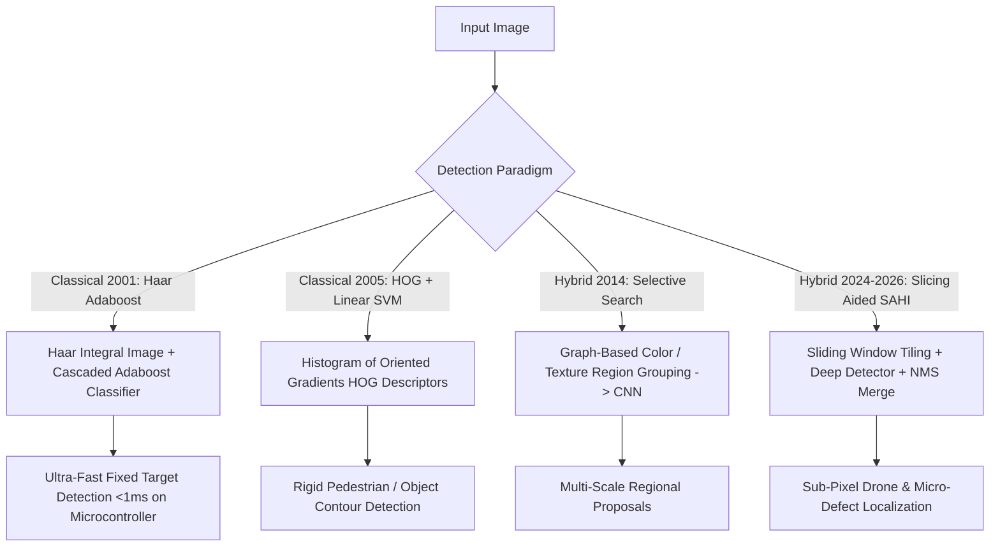

# 📐 Object Detection: Classical Foundations & Hybrid Pipelines

A comprehensive technical analysis of classical geometric vision algorithms, feature descriptors (HOG, Haar, DPM), region proposal mechanisms (Selective Search), and modern hybrid deep-classical detection pipelines.

Related notes: [[topics/object-detection/00-object-detection-moc|Object Detection MOC]], [[topics/object-detection/03-backends-and-open-problems|Detection Backends & Quantization]].

---

## 1. Classical Detection Algorithms vs. Modern Deep Detectors

### Classical vs. Modern Detection Feature Comparison
| Paradigm | Feature Representation | Compute Mechanism | Memory Footprint | Rotation / Scale Invariance | Best Production Role |
| :--- | :--- | :--- | :--- | :--- | :--- |
| **Viola-Jones (Haar)** | Integral image difference rectangles | Cascaded weak classifiers (AdaBoost) | **$<50\text{ KB}$** | Very Poor (Upright only) | Battery-powered toy MCUs, face presence |
| **HOG + Linear SVM** | Local gradient orientation histograms | Sliding window dot products | **$<5\text{ MB}$** | Poor scale, moderate illumination | Low-power automotive pedestrian detection |
| **DPM (Felzenszwalb)**| Deformable Part Models (Spring-energy)| Star-graph dynamic programming | $\sim 20\text{ MB}$ | Moderate (Part articulation) | Articulated object localization |
| **SAHI + RF-DETR** | Deep CNN/ViT features on image patches| Overlapping tile inference + NMM | $\sim 50-200\text{ MB}$| **High (Multi-scale invariance)**| High-res $8K$ drone / satellite / AOI inspection |

---

## 2. Mathematical Formulations: HOG and Integral Images

### 1. Viola-Jones Integral Image Trick:
Computing pixel sums inside any arbitrary rectangular window $D = [x_1, y_1, x_2, y_2]$ requires exactly **4 memory lookups** regardless of window scale:
$$II(x, y) = \sum_{x' \le x, y' \le y} I(x', y')$$
$$\text{Sum}(D) = II(x_2, y_2) - II(x_1-1, y_2) - II(x_2, y_1-1) + II(x_1-1, y_1-1)$$
This allows thousands of multi-scale feature checks to execute within $1\text{ ms}$ on simple ARM Cortex-M microcontrollers without a GPU.

### 2. Histogram of Oriented Gradients (HOG):
Given horizontal and vertical image derivatives $I_x, I_y$:
$$\text{Magnitude: } M(x, y) = \sqrt{I_x^2 + I_y^2}, \quad \text{Orientation: } \theta(x, y) = \arctan\left(\frac{I_y}{I_x}\right)$$
Gradients are binned into 9 orientation bins per $8\times 8$ pixel cell, followed by $L_2$-Hysteresis block normalization:
$$v_{\text{norm}} = \frac{v}{\sqrt{\|v\|_2^2 + \epsilon^2}}$$

---

## 3. Production Hybrid Pattern: Slicing Aided Hyper Inference (SAHI)

When detecting tiny objects ($<16\times 16\text{ px}$) in gigantic images ($>4096\times 4096\text{ px}$):
1. **Classical Tiling**: Extract overlapping sliding windows ($M \times N$ tiles with $20\%$ overlap).
2. **Deep Inference**: Run a high-speed detector (e.g. YOLOv12-S or RF-DETR) independently across all tiles.
3. **Classical Coordinate Remapping**: Offset local tile box coordinates back to global canvas space:
   $$x_{\text{global}} = x_{\text{local}} + x_{\text{tile\_offset}}$$
4. **Non-Maximum Merging (NMM)**: Use classical bounding box IoU graph clustering to merge duplicated cross-boundary detections without dropping edge-straddling instances.
