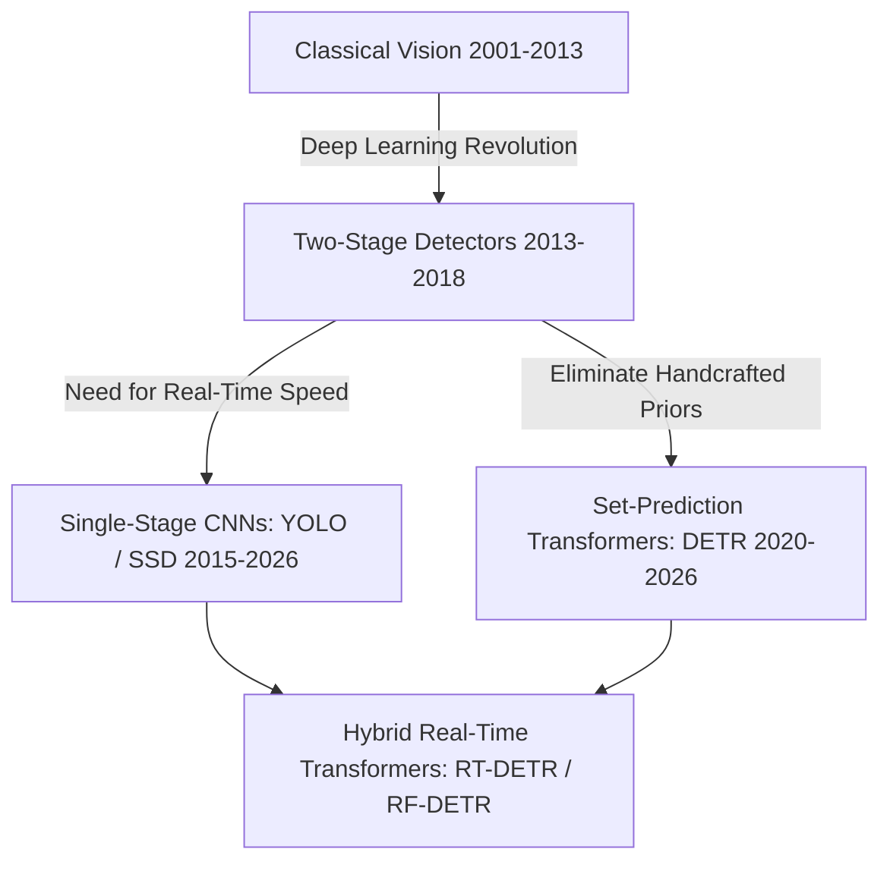
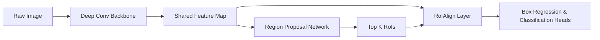
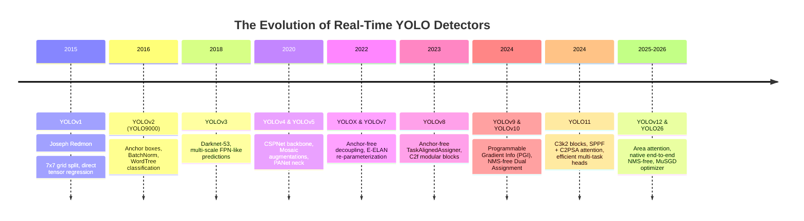
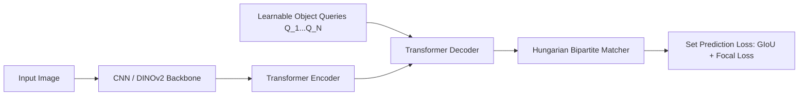

# Object Detection: Historical Evolution, Paradigms & Architectural Lineage

A didactic guide dissecting how 2D object detection evolved from hand-crafted sliding-window filters to anchor-based two-stage detectors, the complete YOLO revolution (YOLOv1 through YOLO11 & YOLO26), and modern set-prediction Transformers (DETR to RF-DETR).

Related notes: [[topics/object-detection/README|Object Detection Playbook]], [[topics/gpu-deployment/README|GPU Deployment]].

---

## 1. The Three Historical Paradigms

### Paradigm 1: Classical Handcrafted Features (2001–2013)
- **Viola-Jones (2001)**: Haar-like rectangular feature wavelets + Integral Images + AdaBoost cascade. Revolutionized real-time face detection on consumer digital cameras.
- **HOG + Deformable Part Models (DPM - Felzenszwalb et al., 2008)**: Histogram of Oriented Gradients measuring edge orientation distributions, evaluated with Latent SVMs.
- *Fundamental Bottleneck*: Hard-coded heuristics failed under non-rigid deformations, scale shifts, and illumination variations.

### Paradigm 2: The Two-Stage Deep Learning Renaissance (2013–2018)
- **R-CNN (Girshick et al., 2014)**: Selective Search proposes ~2,000 region proposals per image -> Warped to fixed 224x224 -> Fed into AlexNet -> Classified via SVMs. (Latency: ~47 seconds/image).
- **Fast R-CNN (2015)**: Runs the ConvNet once across the entire image to extract a shared feature map. Introduced **RoIPool** to extract fixed-size feature vectors from arbitrary proposal coordinates.
- **Faster R-CNN (Ren et al., 2015)**: Replaced external Selective Search with an internal **Region Proposal Network (RPN)** sliding anchor boxes over convolutional features. Established the gold standard for high-accuracy localization.
- **Feature Pyramid Networks (FPN - Lin et al., 2017)**: Top-down pathway with lateral skip connections to build multi-scale semantic feature maps, solving small-object detection.

---

## 2. The YOLO Family Odyssey (YOLOv1 to YOLO11 & YOLO26)

The You Only Look Once (YOLO) lineage represents the quest for maximum frame rate without sacrificing mean Average Precision (mAP).

### Detailed Structural Evolutions
1. **YOLOv1 (Redmon, 2015)**:
   - Formulated detection as a single regression problem from image pixels to bounding box coordinates and class probabilities.
   - Divided image into an $S \times S$ grid ($7 \times 7$). If an object's center fell into a grid cell, that cell was responsible for predicting 2 bounding boxes.
   - *Limitation*: Struggled with small objects clustered together (at most 1 class prediction per cell).
2. **YOLOv2 / YOLO9000 (2016)**:
   - Introduced k-means dimension clusters to discover optimal anchor box aspect ratios automatically. Added Batch Normalization to all convolutional layers and removed fully connected layers.
3. **YOLOv3 (2018)**:
   - Upgraded backbone to Darknet-53 (residual connections). Introduced detection across three distinct spatial scales ($1/32, 1/16, 1/8$) using Feature Pyramid networks, vastly improving small-object recall.
4. **YOLOv4 & YOLOv5 (Bochkovskiy, 2020 / Jocher, Ultralytics, 2020)**:
   - Integrated CSPNet (Cross-Stage Partial connections) to halve computation and memory traffic. Introduced Mosaic data augmentation and Path Aggregation Network (PANet) necks.
5. **YOLOv8 & YOLO11 (Ultralytics, 2023–2024)**:
   - Completely discarded anchor boxes in favor of an **anchor-free split head** (decoupled classification and bounding box regression branches).
   - Replaced C3 with C2f and C3k2 modules, integrating C2PSA (Cross-Stage Attention) to capture global spatial dependencies.
6. **YOLOv10 & YOLO26 (2024–2026)**:
   - **NMS-Free End-to-End Inference**: During training, a one-to-many branch provides rich supervisory signals while a parallel one-to-one branch trains without competition. During deployment, the one-to-many branch is discarded, allowing raw predictions to be accepted directly without non-maximum suppression latency or threshold tuning.

---

## 3. The Transformer Paradigm: DETR to RF-DETR

Traditional detectors relied on hand-crafted components: anchor generation rules, heuristic target assignment (IoU > 0.5), and Non-Maximum Suppression (NMS). Transformers eliminated these components completely.

### Evolution of Detection Transformers:
1. **DETR (Carion et al., 2020)**:
   - Formulated detection as direct set prediction using a Transformer encoder-decoder. Object queries attend to image features via cross-attention and are matched to ground truth using the **Hungarian algorithm**.
   - *Flaws*: Prohibitively slow convergence (500 epochs) and massive computational complexity on high-resolution feature maps ($O(H^2W^2)$ attention).
2. **Deformable DETR (Zhu et al., 2020)**:
   - Introduced **Deformable Attention**: each query attends only to a small fixed set of sampling locations around a reference point across multi-scale feature maps. Sped up training convergence by 10x.
3. **RT-DETR & RT-DETRv2/v3 (Baidu / Lyu et al., 2023–2024)**:
   - Replaced the heavy Transformer encoder with an **Efficient Hybrid Encoder** that decouples intra-scale interaction from cross-scale fusion. Introduced uncertainty-minimal query selection and hierarchical positive supervision in v3.
4. **RF-DETR (Roboflow, 2025–2026)**:
   - Neural Architecture Search tailored specifically around frozen or fine-tuned foundation backbones (**DINOv2/v3**), yielding state-of-the-art accuracy-to-latency trade-offs on custom datasets without massive training epochs.

---

## 4. Key Comparative Decision Matrix

| Dimension | Two-Stage (Faster R-CNN) | Real-time CNN (YOLO11/YOLO26) | Real-time Transformer (RF-DETR / RT-DETRv3) |
| :--- | :--- | :--- | :--- |
| **Inference Latency** | 30–80 ms (Slow) | 1.5–10 ms (Ultra-fast) | 4–12 ms (Very fast) |
| **NMS Post-Processing** | Required (CPU/GPU bound) | Eliminated in v10/26 | Completely NMS-Free |
| **Small Object Sensitivity** | Very High (RoIAlign) | Moderate-High | High (Global Cross-Scale Attention) |
| **Deployment Complexity** | High | Lowest (Standard Conv layers) | Moderate (Requires modern TensorRT/ONNX ops) |
| **Commercial License** | MIT / Apache-2.0 | AGPL-3.0 (Ultralytics) | Apache-2.0 (Permissive) |
