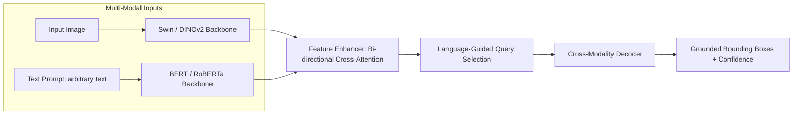

# Grounding DINO: Open-Vocabulary Zero-Shot Object Detection

## 1. Executive Brief & Significance
Traditional object detectors operate under a closed-set paradigm: they can only detect categories explicitly present in their training annotations (e.g. the 80 classes of COCO). 

**Grounding DINO** (Liu et al., IDEA-Research, 2023 / 2024) marries the DINO detection transformer with grounded language pre-training, enabling **Open-Vocabulary Object Detection (OVD)**. Users can query arbitrary natural language prompts (e.g., `"the red ceramic coffee mug with a chipped handle"`, `"defective solder joint on PCB"`), and the model localizes the referent with high spatial precision without task-specific fine-tuning.



---

## 2. Architectural Mechanics: Multi-Stage Cross-Modality Fusion

Grounding DINO performs feature fusion across three distinct phases of the network:

### Phase 1: Feature Enhancer (Early Cross-Attention)
Image feature tokens and text tokens are concatenated and passed through deformable cross-attention layers. Image tokens attend to text tokens, allowing visual features to become conditioned on the prompt semantics early in the forward pass.

### Phase 2: Language-Guided Query Selection
Standard DETRs initialize object queries as static learnable parameters. Grounding DINO selects object queries dynamically based on the highest image-text cross-correlation scores, ensuring queries focus directly on regions relevant to the prompt.

### Phase 3: Cross-Modality Decoder (Late Fusion)
In the Transformer decoder, queries attend to both image features and text embeddings simultaneously, predicting bounding box coordinates and calculating the dot-product similarity with text token representations to output open-vocabulary class logits.

---

## 3. Quantitative Benchmark Profile (Zero-Shot Detection)

| Model Backbone | Pre-Training Data | COCO Zero-Shot AP | LVIS minival Zero-Shot AP | Latency (FP16 ms, A100) | VRAM Footprint |
| :--- | :--- | :--- | :--- | :--- | :--- |
| **Grounding DINO (Swin-T)** | O365 + GoldG | 52.5% | 27.4% | 78.0 ms | ~3.8 GB |
| **Grounding DINO (Swin-B)** | O365 + GoldG + Cap4M | 56.7% | 34.2% | 125.0 ms | ~6.2 GB |
| **Grounding DINO (DINOv2-L)**| Multi-Modal Grounding | 58.4% | 38.6% | 165.0 ms | ~8.9 GB |

---

## 4. Engineering Implementation & Workflow

### A. Setup & Dependencies
```bash
# Clone official repository
git clone https://github.com/IDEA-Research/GroundingDINO.git
cd GroundingDINO

# Install via uv
uv pip install -e .
```

### B. Interactive Python Inference
```python
from groundingdino.util.inference import load_model, load_image, predict, annotate
import cv2

# Load architecture and weights
model = load_model("groundingdino/config/GroundingDINO_SwinT_OGC.py", "weights/groundingdino_swint_ogc.pth")

IMAGE_PATH = "factory_inspection.jpg"
TEXT_PROMPT = "crack on pipe . rusty bolt . oil leak"
BOX_THRESHOLD = 0.35
TEXT_THRESHOLD = 0.25

image_source, image = load_image(IMAGE_PATH)

boxes, logits, phrases = predict(
    model=model,
    image=image,
    caption=TEXT_PROMPT,
    box_threshold=BOX_THRESHOLD,
    text_threshold=TEXT_THRESHOLD,
    device="cuda"
)

annotated_frame = annotate(image_source=image_source, boxes=boxes, logits=logits, phrases=phrases)
cv2.imwrite("annotated_output.jpg", annotated_frame)
```

---

## 5. Commercial Usability & License Analysis
- **License**: **Apache-2.0**
- **Commercial Permissibility**: Fully permissive for proprietary commercial SaaS, automated image tagging platforms, and industrial defect detection pipelines.
- **Production Trade-off**: At 78–165 ms latency, Grounding DINO is too computationally expensive for 60 FPS robotic control loops. It is best deployed as an **automated zero-shot data annotator** or an **anomaly classifier** paired with lightweight edge detectors.
- **Official Repository**: [https://github.com/IDEA-Research/GroundingDINO](https://github.com/IDEA-Research/GroundingDINO)
