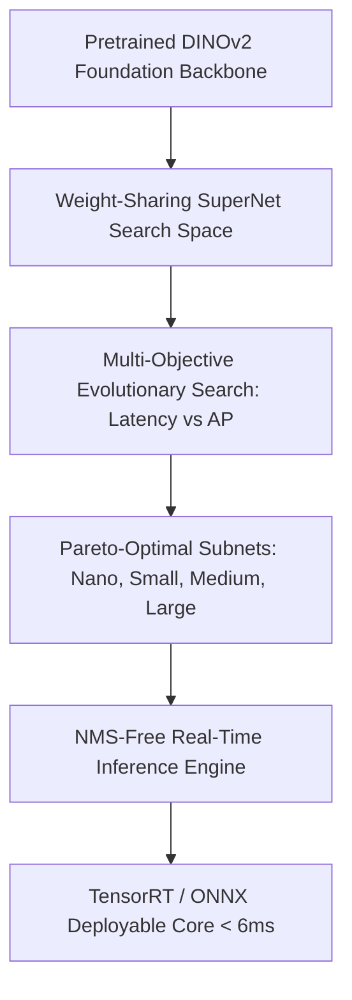
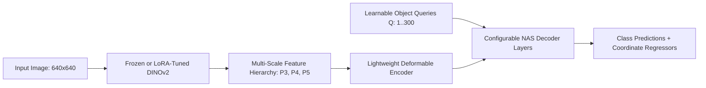

# RF-DETR: Neural Architecture Search for Real-Time Detection Transformers

## 1. Executive Brief & Significance
**RF-DETR** (Roboflow, ICLR 2026 / arXiv:2511.09554) represents a foundational shift in real-time object detection. Prior real-time detectors (such as YOLOv8–YOLO11 or RT-DETRv1/v2) relied on standard convolutional backbones or hand-crafted hybrid encoders trained from scratch. 

RF-DETR bridges large self-supervised vision foundation models (**DINOv2**) with real-time edge constraints by leveraging weight-sharing **Neural Architecture Search (NAS)**. It produces Pareto-optimal sub-networks that deliver higher accuracy on fine-grained and small-object benchmarks (such as Roboflow 100-VL and COCO) while executing under 6 milliseconds on modern GPUs.



---

## 2. Core Architectural Mechanics

### A. DINOv2 Feature Distillation
Unlike standard CNN backbones trained solely on supervised classification labels (ImageNet-1K), DINOv2 embeddings preserve dense geometric patch properties, fine boundaries, and semantic context. RF-DETR leverages these pre-computed representations to dramatically reduce the epochs needed to adapt to downstream custom datasets.

### B. Weight-Sharing SuperNet
Traditional NAS requires retraining hundreds of candidate networks from scratch. RF-DETR trains a single overarching **SuperNet** encompassing variable:
- Decoder layer depths (e.g., 3 to 6 cross-attention layers).
- Multi-scale projection channels (128 to 384 dimensions).
- Feed-Forward Network (FFN) expansion ratios (2x to 4x).

Once the SuperNet converges, an evolutionary search queries the parameter space, sampling sub-networks that fit specific hardware latency budgets without additional fine-tuning.



### C. NMS-Free Bipartite Matching
Following the DETR paradigm, RF-DETR formulates detection as direct set prediction. Using Hungarian matching loss (Pairwise Focal Loss + GIoU Loss), predictions map 1-to-1 with physical objects, completely bypassing non-deterministic Non-Maximum Suppression (NMS) post-processing.

---

## 3. Quantitative Benchmark Profile

| Variant | Backing Backbone | Parameters | GFLOPs | COCO AP (0.50:0.95) | TensorRT FP16 (T4/Orin) | NMS Required |
| :--- | :--- | :--- | :--- | :--- | :--- | :--- |
| **RF-DETR-Nano** | DINOv2-Small (NAS) | 12.4 M | 34.0 G | 48.2% | 2.80 ms | No |
| **RF-DETR-Small**| DINOv2-Small (NAS) | 18.6 M | 52.0 G | 51.4% | 3.90 ms | No |
| **RF-DETR-Base** | DINOv2-Base (NAS) | 28.4 M | 86.0 G | 53.8% | 5.20 ms | No |
| **RF-DETR-Large**| DINOv2-Large (NAS) | 48.0 M | 148.0 G | 55.6% | 8.70 ms | No |

---

## 4. Engineering Implementation & Workflow

### A. Environment & Installation
```bash
# Clone official repository
git clone https://github.com/roboflow/rf-detr.git
cd rf-detr

# Install via uv
uv pip install -e .
```

### B. Minimal Inference & Export Recipe
```python
import torch
from rf_detr import build_rf_detr

# Load pre-trained checkpoint
model = build_rf_detr(model_name="rf_detr_base", pretrained=True)
model.eval().cuda()

dummy_image = torch.randn(1, 3, 640, 640, device="cuda")

with torch.no_grad():
    predictions = model(dummy_image)
    # Output schema: {'pred_logits': [1, 300, num_classes], 'pred_boxes': [1, 300, 4]}

# Export cleanly to ONNX for TensorRT compilation
torch.onnx.export(
    model,
    dummy_image,
    "rf_detr_base.onnx",
    input_names=["images"],
    output_names=["pred_logits", "pred_boxes"],
    opset_version=17,
    dynamic_axes={"images": {0: "batch_size"}}
)
```

---

## 5. Commercial Usability & License Analysis
- **License**: **Apache-2.0**
- **Commercial Permissibility**: Fully approved for closed-source commercial systems, embedded devices, and SaaS services without source code disclosure.
- **Copyleft Threat**: **None**. Unlike Ultralytics models (AGPL-3.0), RF-DETR imposes no viral open-source requirements on proprietary caller applications.
- **Official Repository**: [https://github.com/roboflow/rf-detr](https://github.com/roboflow/rf-detr)
