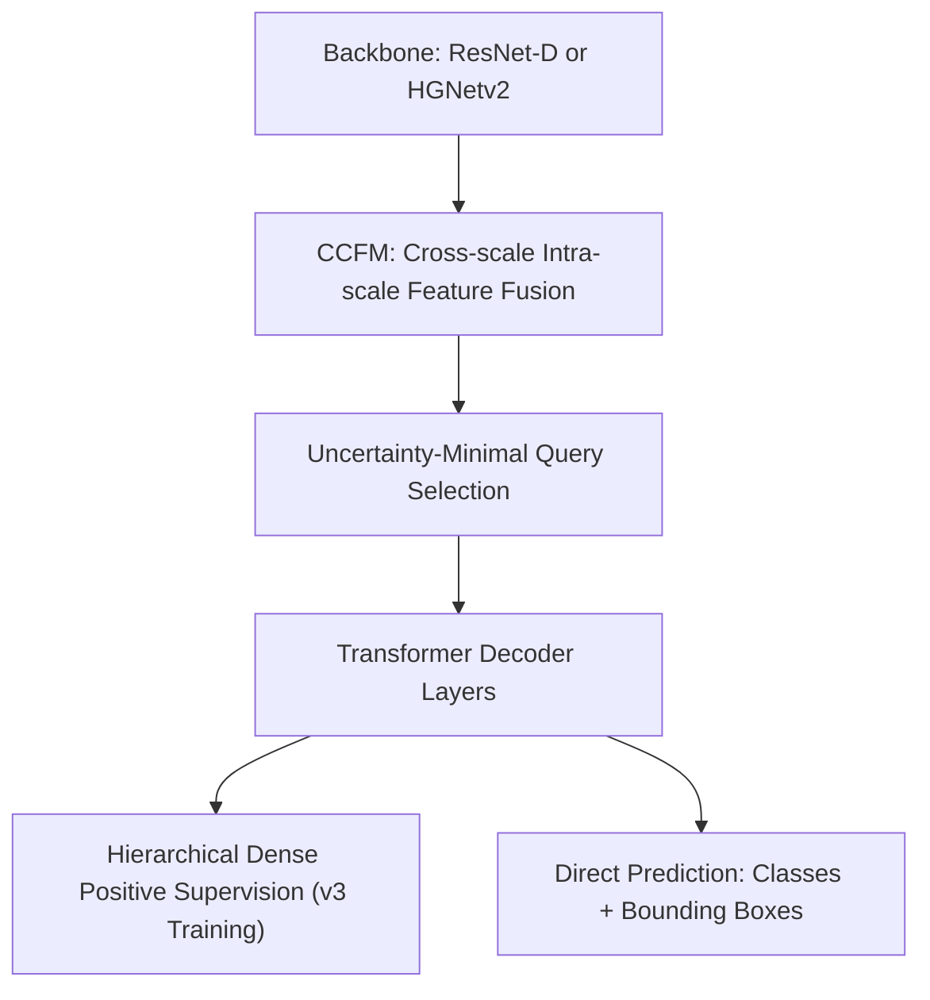
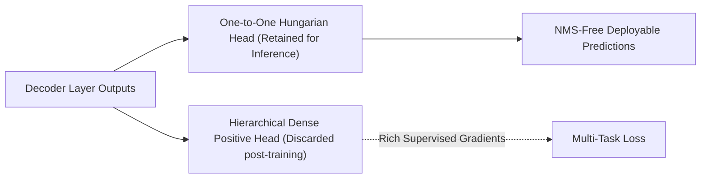

# RT-DETRv2 & RT-DETRv3: Real-Time Detection Transformers

## 1. Executive Brief & Significance
The **RT-DETR** family (Lyu et al., Baidu & Xia et al., 2023–2024) is the pioneer that proved Transformer-based detectors can match and exceed CNN-based YOLOs in real-time inference speed while delivering superior global contextual comprehension.

- **RT-DETRv2** addresses real-world deployment frictions by redesigning the network's operators (removing non-standard `grid_sample` transformations) to ensure zero-overhead compilation in TensorRT, ONNX Runtime, and Vulkan/NCNN.
- **RT-DETRv3** tackles the fundamental theoretical bottleneck of Hungarian matching: **gradient sparsity**. By incorporating *Hierarchical Dense Positive Supervision*, v3 achieves 3x faster training convergence and higher bounding box localization accuracy.



---

## 2. Core Architectural Mechanics

### A. The Efficient Hybrid Encoder (CCFM)
Standard Vision Transformers compute self-attention across all multi-scale feature tokens, leading to quadratic memory scaling ($O(N^2)$). RT-DETR separates this into:
1. **Intra-scale Interaction**: Attention is computed *only* within the high-level feature scale (P5), which has low spatial resolution.
2. **Cross-scale Fusion**: Features across P3, P4, and P5 are merged using lightweight convolutional PANet-style pathways (Cross-scale Feature Fusion Module - CCFM).

### B. Hierarchical Dense Positive Supervision (RT-DETRv3)
Traditional DETR models assign exactly **one** positive query to each ground-truth object via Hungarian bipartite matching. During early training, this sparse gradient causes erratic parameter updates and slow convergence.

RT-DETRv3 introduces auxiliary dense positive anchors during training:
- **Primary Branch**: Strictly one-to-one bipartite matching (retained for zero-NMS inference).
- **Hierarchical Auxiliary Branch**: One-to-many positive assignments matching multiple surrounding candidate queries to each object. Provides rich gradient signals to the encoder and early decoder layers, discarded at test time.



---

## 3. Quantitative Benchmark Profile

| Variant | Backbone | Parameters | GFLOPs | COCO AP (0.50:0.95) | TensorRT FP16 (T4/Orin) | NMS-Free |
| :--- | :--- | :--- | :--- | :--- | :--- | :--- |
| **RT-DETRv2-S** | ResNet18-D | 20.0 M | 60.0 G | 46.5% | 4.10 ms | Yes |
| **RT-DETRv2-M** | ResNet34-D | 31.0 M | 100.0 G | 51.3% | 6.50 ms | Yes |
| **RT-DETRv2-L** | HGNetv2 | 32.0 M | 110.0 G | 53.4% | 8.60 ms | Yes |
| **RT-DETRv2-X** | HGNetv2 | 67.0 M | 234.0 G | 54.8% | 13.60 ms | Yes |
| **RT-DETRv3-L** | HGNetv2 | 31.8 M | 108.0 G | 54.3% | 8.80 ms | Yes |

---

## 4. Engineering Implementation & Workflow

### A. Environment & Setup
```bash
# Clone official repository
git clone https://github.com/lyuwenyu/RT-DETR.git
cd RT-DETR/rtdetrv2_pytorch

# Install requirements via uv
uv pip install -r requirements.txt
```

### B. C++ / TensorRT Deployment Export
```bash
# Export PyTorch checkpoint directly to ONNX
python tools/export_onnx.py -c configs/rtdetrv2/rtdetrv2_r50vd_6x_coco.yml -r checkpoint.pth --check

# Compile directly via trtexec with fixed shapes
trtexec --onnx=rtdetrv2_r50vd.onnx \
        --saveEngine=rtdetrv2_r50vd.engine \
        --fp16 \
        --warmUp=200 \
        --iterations=500
```

---

## 5. Commercial Usability & License Analysis
- **License**: **Apache-2.0**
- **Commercial Permissibility**: Completely open for commercial integration into commercial software, SaaS, embedded automotive hardware, and mobile applications.
- **Official Repositories**:
  - RT-DETR & RT-DETRv2: [https://github.com/lyuwenyu/RT-DETR](https://github.com/lyuwenyu/RT-DETR)
  - RT-DETRv3: [https://github.com/clxia12/RT-DETRv3](https://github.com/clxia12/RT-DETRv3)
