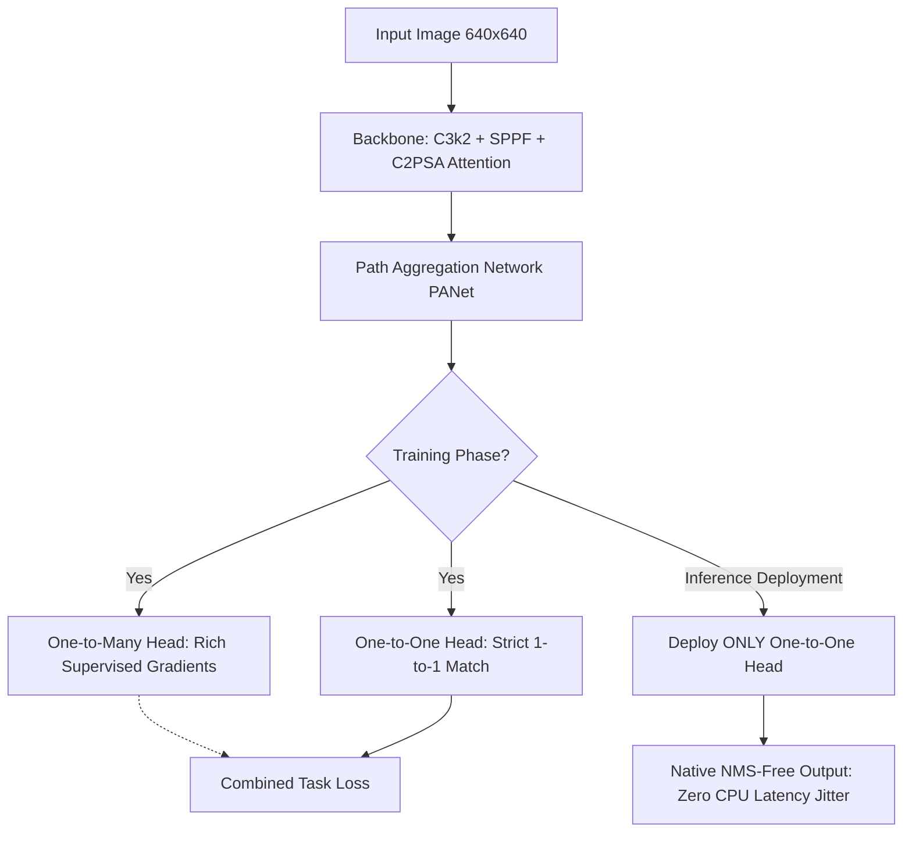

# Modern YOLO Architectures: YOLOv10, YOLO11, and YOLO26

## 1. Executive Brief & Significance
The **YOLO (You Only Look Once)** series remains the most widely deployed computer vision architecture family globally. While early versions (v1–v7) focused on balance between convolution channels and feature pyramids, modern generations (v10, 11, and 26) focus on two primary engineering frontiers:
1. **NMS-Free End-to-End Execution**: Eliminating Non-Maximum Suppression (NMS) latency variance to achieve deterministic real-time inference on edge microprocessors.
2. **Spatial-Channel Attention & Hardware-Aware Optimizers**: Incorporating attention mechanisms (such as C2PSA and Area Attention) alongside advanced optimizers (MuSGD) to reach maximum hardware saturation.



---

## 2. Core Architectural Mechanics Across Recent Generations

### A. YOLOv10: Consistent Dual Assignments (Tsinghua, 2024)
- Traditional YOLOs assign multiple positive anchor predictions to each ground truth bounding box during training to ensure sufficient gradient flow. This necessitates Non-Maximum Suppression (NMS) during inference to discard redundant overlapping boxes.
- YOLOv10 introduced **Consistent Dual Assignments**:
  - Two parallel heads train simultaneously on the same feature maps: one uses one-to-many assignment, while the other uses one-to-one assignment.
  - An alignment metric harmonizes supervision between the two heads.
  - At deployment time, the one-to-many head is pruned, allowing the one-to-one head to run without NMS, saving up to 5–15ms on edge CPUs.

### B. YOLO11: Architectural Refinements (Ultralytics, late 2024)
- Replaced the C2f block with **C3k2** (customizable kernel sizes) and introduced **C2PSA (Cross-Stage Partial Self-Attention)** into the neck.
- Features multi-task unified heads capable of simultaneous Object Detection, Oriented Bounding Boxes (OBB), Instance Segmentation, and Pose Keypoint estimation within a single forward pass.

### C. YOLO26: End-to-End Edge Flagship (Ultralytics, 2026)
- **MuSGD Optimizer**: Specialized momentum-scaled stochastic gradient descent designed for rapid transfer learning on small custom vision datasets.
- **Native Edge NMS-Free Core**: Hardware-tuned for TensorRT, Apple CoreML, and Qualcomm Snapdragon NPU runtimes, achieving sub-2ms FP16 inference on modern embedded boards.

---

## 3. Quantitative SOTA Benchmark Profile (COCO val2017)

| Model Architecture | Parameters | GFLOPs | AP (0.50:0.95) | TensorRT FP16 (T4/Orin) | NMS Post-Processing | License |
| :--- | :--- | :--- | :--- | :--- | :--- | :--- |
| **YOLOv10-N** | 2.3 M | 6.7 G | 38.5% | 1.12 ms | No (NMS-Free) | AGPL-3.0 / Commercial |
| **YOLOv10-S** | 7.2 M | 21.6 G | 46.3% | 2.49 ms | No (NMS-Free) | AGPL-3.0 / Commercial |
| **YOLO11-N** | 2.6 M | 6.5 G | 39.5% | 1.15 ms | Yes (or Export Plugin) | AGPL-3.0 / Commercial |
| **YOLO11-X** | 56.9 M | 194.9 G | 54.7% | 11.20 ms | Yes | AGPL-3.0 / Commercial |
| **YOLO26-N** | 2.5 M | 6.8 G | 40.8% | 1.05 ms | No (Native NMS-Free) | AGPL-3.0 / Commercial |
| **YOLO26-S** | 7.4 M | 22.1 G | 47.9% | 2.30 ms | No (Native NMS-Free) | AGPL-3.0 / Commercial |
| **YOLO26-X** | 58.2 M | 198.0 G | 55.4% | 10.40 ms | No (Native NMS-Free) | AGPL-3.0 / Commercial |

---

## 4. Engineering Implementation & Workflow

### A. Python SDK Inference
```python
from ultralytics import YOLO

# Load model (automatically downloads official weights)
model = YOLO("yolo11n.pt")  # or "yolo26n.pt"

# Run prediction with native streaming generator
results = model.predict(source="camera_feed.mp4", stream=True, conf=0.45, device="cuda:0")

for r in results:
    boxes = r.boxes.xyxy.cpu().numpy()  # Bounding box coordinates
    scores = r.boxes.conf.cpu().numpy()  # Confidence scores
    classes = r.boxes.cls.cpu().numpy()  # Class indices
```

### B. TensorRT FP16 Export for Maximum Edge Throughput
```bash
# Export using Ultralytics CLI with TensorRT engine compilation
yolo export model=yolo11s.pt format=engine half=True device=0
```

---

## 5. Commercial Usability & Legal Considerations
- **License**: **AGPL-3.0** (GNU Affero General Public License v3.0) / **Enterprise Commercial License**.
- **Important Legal Warning**:
  - If you deploy an application incorporating Ultralytics code or pre-trained models within a networked or SaaS commercial environment, **AGPL-3.0 mandates that you open-source your entire backend caller repository under AGPL-3.0**.
  - If building proprietary commercial products without open-sourcing your code, you must either:
    1. Purchase an enterprise commercial exemption license from Ultralytics.
    2. Or standardize on permissively licensed architectures (**Apache-2.0**) such as **RF-DETR** or **RT-DETRv2/v3**.
- **Official Repository**: [https://github.com/ultralytics/ultralytics](https://github.com/ultralytics/ultralytics)
