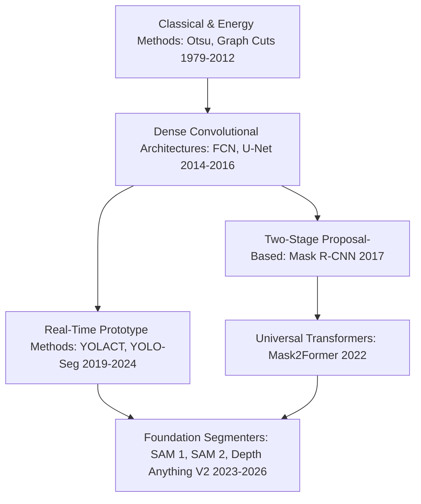
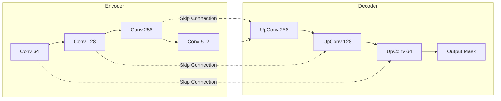
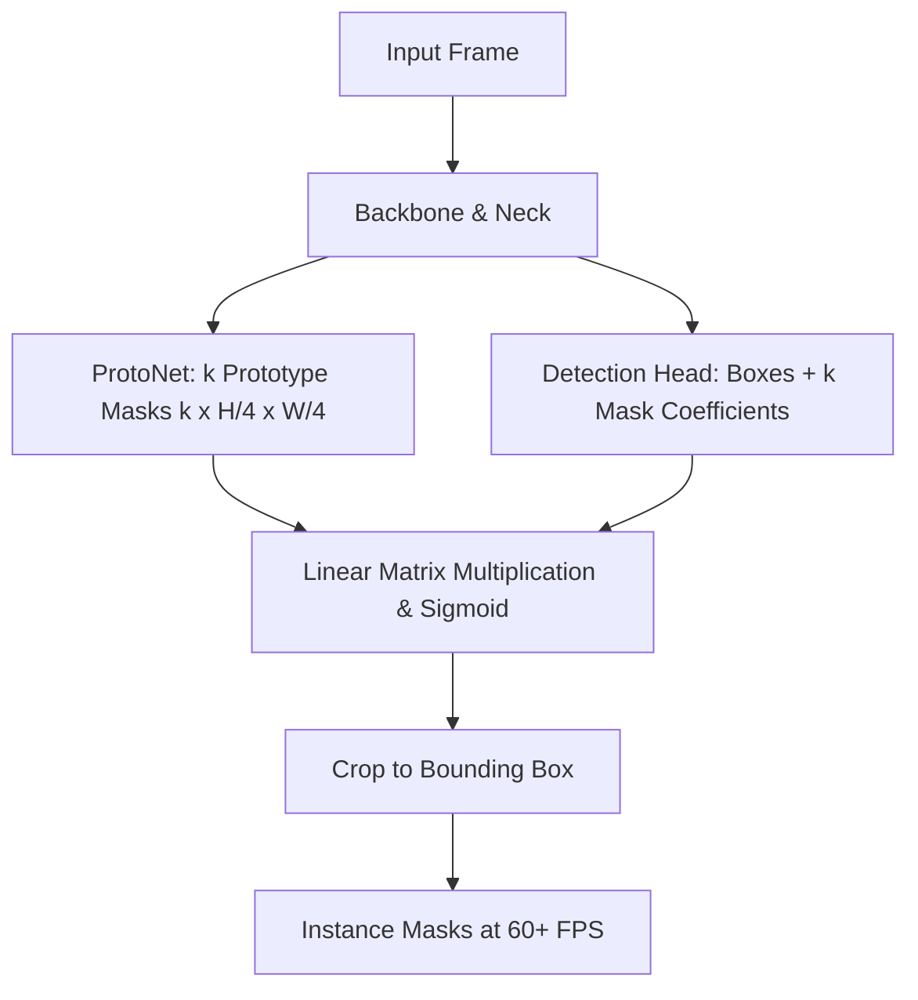
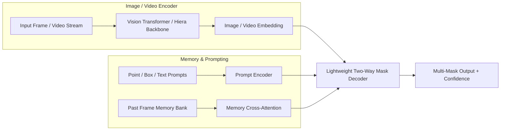
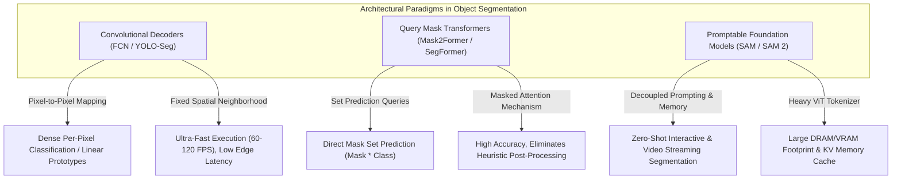

# 📜 Object Segmentation: Historical Evolution & Paradigm Shifts

A didactic deep-dive charting the history of image segmentation: from classical thresholding and Graph Cuts to FCN, U-Net, Mask R-CNN, prototype-based real-time segmentation, and modern foundation models (SAM 1 to SAM 2.1 & Depth Anything V2).

Related notes: [[topics/object-segmentation/00-object-segmentation-moc|Object Segmentation MOC]], [[topics/object-detection/00-object-detection-moc|Object Detection MOC]].

---

## 1. The Three Eras of Segmentation

### Era 1: Classical Energy Minimization & Graph Cuts (1979–2012)
- **Otsu Thresholding (1979)**: Maximizes inter-class variance between foreground and background histograms.
- **Watershed Algorithm**: Interprets grayscale gradients as topographic relief surfaces, flooding valleys to find catchment basin dividing lines.
- **Normalized Cuts & Graph Cuts (Boykov & Jolly, 2001)**: Formulated segmentation as maximum flow / minimum cut on a pixel graph where edge weights reflect color and gradient similarities.
- *Bottleneck*: Lacked semantic understanding; a red car on a red wall could not be segmented.

### Era 2: Deep Fully Convolutional & Encoder-Decoder Networks (2014–2018)
- **FCN (Long et al., 2015)**: Replaced fully connected classification layers with convolutional layers, enabling dense arbitrary-sized output prediction with coarse deconvolutional upsampling.
- **U-Net (Ronneberger et al., 2015)**:
  - Introduced the symmetrical **Encoder-Decoder** structure with **Skip Connections**. Skip connections directly transfer high-resolution spatial feature maps from contracting paths to expanding paths, preventing loss of boundary localization.
- **DeepLab Series (v1–v3+, Chen et al., 2017–2018)**:
  - Introduced **Atrous (Dilated) Convolutions** to expand receptive fields without downsampling or increasing parameter counts. Added **Atrous Spatial Pyramid Pooling (ASPP)** to capture multi-scale context.

---

## 2. Instance Segmentation: Proposal-Based vs Prototype-Based

Instance segmentation requires distinguishing between individual objects of the same class. Two primary paradigms emerged:

### Paradigm A: Detect-Then-Segment (Mask R-CNN, 2017)
1. Predict bounding boxes via Faster R-CNN RPN.
2. Use **RoIAlign** (bilinear interpolation) to extract exact floating-point feature grids without quantization misalignment.
3. Pass aligned RoI features through a tiny FCN branch to output an $m \times m$ binary mask per box.
- *Strength*: Pixel-precise mask quality.
- *Weakness*: Sequential proposal processing makes it slow (5–12 FPS).

### Paradigm B: Real-Time Prototype & Coefficient Matrix (YOLACT & YOLO-Seg, 2019–2024)
Instead of extracting RoIs sequentially, decompose instance segmentation into two parallel tasks:
1. **Protonet Branch**: Generates a dictionary of $k$ global prototype masks ($k \approx 32$) spanning the full image.
2. **Prediction Head**: Predicts bounding boxes and a vector of $k$ **mask coefficients** per detected instance.
3. **Assembly via Linear Combination**:
   $$\text{Mask}_i = \sigma\left(\sum_{j=1}^k c_{i,j} \cdot P_j\right)$$
   Surviving masks are cropped to the predicted bounding box.
- *Strength*: Matrix multiplication of prototypes runs in parallel on GPU at >60–120 FPS.

---

## 3. The Foundation Model Era: SAM, SAM 2, and Depth Anything

The latest revolution treats segmentation as a zero-shot, promptable foundation model.

### Key Milestones:
1. **SAM 1 (Meta FAIR, 2023)**:
   - Trained on 1.1 billion masks (SA-1B). Decoupled heavy image encoding (ViT-H taking ~100ms) from a tiny prompt decoder executing in ~5ms.
   - *Limitation*: Heavy memory footprint; no native temporal understanding for video.
2. **SAM 2 & SAM 2.1 (Meta FAIR, 2024–2025)**:
   - Unified image and streaming video segmentation with a hierarchical **Hiera** backbone.
   - Maintains a **Memory Bank** of past frame spatial embeddings and interaction clicks. Evaluates mask propagation across long sequences at **44 FPS**.
3. **Depth Anything V2 (2024–2025)**:
   - Demonstrates that dense geometric depth estimation is fundamentally continuous spatial segmentation. Employs large-scale synthetic data distillation to eliminate visual artifacts on fine edges.

---

## 4. Intensive Architectural Taxonomy: Convolutional vs Transformer vs Hybrid Sub-Modules

Dense pixel-level segmentation models have evolved from multi-scale convolutional feature pyramids to universal query-based transformer decoders and memory-augmented spatial-temporal foundation models.

### Comparative Sub-Module Architectural Matrix

| Model Name & Year | Architectural Paradigm | Backbone Sub-Module | Neck / Feature Aggregator | Encoder Sub-Module | Decoder / Head Sub-Module | Primary Bottleneck & Edge Suitability |
| :--- | :--- | :--- | :--- | :--- | :--- | :--- |
| **FCN / U-Net** (2015) | Pure ConvNet | Hierarchical VGG-16 / ResNet convolutional stages ($1/2$ to $1/32$ downsampling) | Long-range skip connections concatenating encoder features to decoder | Standard $3\times3$ Convolutions + Max-Pooling | Symmetrical Transposed Convolutions / Bilinear Upsampling + $1\times1$ Per-Pixel Classification Head | **Compute & Edge Friendly**: Low parameter count; high throughput (>100 FPS); struggles with large spatial context and severe boundary ambiguities. |
| **Mask R-CNN** (2017) | Pure ConvNet | ResNet-50 / ResNet-101 hierarchical residual stages | Feature Pyramid Network (FPN, lateral $1\times1$ convs + $3\times3$ anti-aliasing) | Residual Convolutional Blocks with GroupNorm | Multi-Branch Head: RPN + RoIAlign ($7\times7$ & $14\times14$) + $4\times$ Conv Mask Branch predicting $28\times28$ binary masks | **Memory Bandwidth & Latency Bound**: Sequential RoI extraction and RoIAlign feature sampling creates latency bottlenecks (8–15 FPS); unsuited for hard real-time edge video. |
| **YOLACT / YOLO-Seg** (2019–2024) | Pure / Hybrid ConvNet | CSPDarknet (Cross-Stage Partial residual connections with RepConv) | PANet / RepPAN multi-scale feature aggregator | Depthwise & Standard Convolutional Blocks with SiLU activations | Dual-Branch Prototype Head: ProtoNet ($k=32$ global prototype masks) + Fast Assembly Linear Matrix Combination | **Memory Bandwidth Optimized**: Real-time throughput (60–120 FPS); matrix multiplication of prototypes is GPU-bound; lightweight enough for edge NPUs with INT8 quantization. |
| **SegFormer** (2021) | Pure Hierarchical ViT | Mix Transformer (MiT-B0 to B5) with Overlapped Patch Merging | Multi-Scale MLP Aggregator (Linear projection of $C_1, C_2, C_3, C_4$ stages) | Efficient Self-Attention with Spatial Reduction Ratio ($R=8,4,2,1$) | All-MLP Decoder (Feature concatenation + $1\times1$ Conv classification projection) | **Compute & Edge Friendly**: Eliminates heavy positional encodings and complex decoders; MiT-B0 runs at real-time speeds on embedded Jetson devices. |
| **Mask2Former** (2021–2022) | Hybrid CNN-Transformer | Swin Transformer / ResNet-50 hierarchical feature extractor | Multi-Scale Deformable Pixel Decoder (Extracts high-resolution $1/4$ pixel embeddings) | Multi-Scale Deformable Self-Attention Pixel Blocks | Universal Masked-Attention Query Decoder (Learnable queries cross-attend strictly within predicted mask regions) | **Compute & Memory Bound**: Universal architecture for semantic, instance, and panoptic segmentation; high FLOPs and heavy query cross-attention limit edge deployment to high-end GPUs. |
| **SAM (Segment Anything)** (2023) | Pure ViT Foundation | Heavy Isotropic Vision Transformer (ViT-B, ViT-L, ViT-H with Patch16 MAE pre-training) | Lightweight Feature Neck ($1\times1$ Conv + $3\times3$ Conv to output $1/16$ 256-dim embedding) | Standard Multi-Head Self-Attention with Windowed Local/Global Attention Blocks | Two-Way Transformer Decoder (Point/Box Prompt Cross-Attention + Dynamic Hypernetwork Mask MLP) | **Memory & Compute Bound**: ViT-H encoder takes ~100–300 ms on edge hardware (memory bandwidth bound); interactive decoder is lightweight (~5 ms). |
| **SAM 2 / SAM 2.1** (2024–2025) | Hierarchical ViT + Streaming Memory | Hierarchical Hiera Backbone (Window Multi-Head Attention with Multi-Scale feature extraction) | FPN-style Feature Neck outputting multi-scale embeddings ($1/4, 1/8, 1/16$) | Multi-Scale Hierarchical Self-Attention Blocks without complex hand-crafted priors | Two-Way Mask Decoder + Memory Bank (Spatial-Temporal Cross-Attention over past frame memories) | **KV-Cache & Bandwidth Bound**: Real-time streaming video segmentation at 44 FPS; memory bank expansion across long sequences requires periodic cache pruning in edge VRAM. |
| **OneFormer** (2023) | Hybrid Foundation Transformer | Swin-L / DiT Transformer Backbone | Multi-Scale Deformable Pixel Decoder | Contrastive Text-Image Multi-Task Conditioner | Unified Query Decoder with Task Token Conditioning (Universal panoptic/instance/semantic head) | **Compute Bound**: Unifies all segmentation tasks into one framework; high training compute footprint; best suited for workstation/cloud robotics rather than microcontrollers. |
| **VM-UNet / Mamba-Seg** (2024–2025) | State-Space Mamba | Visual State Space Model (VSSM 2D Selective Scan blocks with hierarchical downsampling) | Cross-Scale SSM Skip Aggregator | 2D Selective Scan (SS2D) State-Space Encoder Blocks ($O(N)$ linear memory scaling) | Symmetric Selective Scan Decoder with Patch Expanding Upsampling Layers | **Memory Bandwidth Bound**: Linear memory complexity with global receptive fields; ideal for ultra-high-resolution medical and satellite images; needs custom SSM NPU compilation. |

### Didactic Architectural Trade-Off Analysis

#### 1. Dense Per-Pixel Classification vs. Query-Based Mask Set Prediction
- **Per-Pixel Classification (FCN, U-Net, DeepLab)** treats semantic segmentation as an independent categorical classification at every spatial coordinate $(x, y)$. This formulation is computationally direct, but struggles to model distinct object boundaries, overlapping instances, and panoptic scene coherence.
- **Linear Prototype Assembly (YOLACT, YOLOv8-Seg)** decouples instance geometry from classification by learning a continuous dictionary of $k$ basis masks $\mathbf{P} \in \mathbb{R}^{k \times H/4 \times W/4}$ and regressing per-instance coefficients $\mathbf{c} \in \mathbb{R}^k$. The final instance mask is evaluated as a simple matrix multiplication:
  $$\mathbf{M}_i = \sigma(\mathbf{c}_i \mathbf{P})$$
  This requires zero proposal cropping and executes entirely in parallel on edge tensor cores at >100 FPS.
- **Query-Based Mask Decoders (Mask2Former)** replace per-pixel classification with a universal set of $N$ learnable object queries. Through **Masked Attention**, queries attend *only* to the spatial foreground regions identified in intermediate predictions:
  $$\mathbf{X}_{l} = \text{softmax}\left(\mathcal{M}_{l-1} + \frac{Q_l K_l^T}{\sqrt{d}}\right) V_l + \mathbf{X}_{l-1}$$
  Where $\mathcal{M}_{l-1}(i, j) = 0$ if pixel $j$ falls inside the predicted mask of query $i$, and $-\infty$ otherwise. This enforces fast convergence and sharp object boundaries.

#### 2. Hierarchical vs. Isotropic Backbones in Dense Spatial Segmentation
- **Hierarchical Backbones (ResNet, ConvNeXt, Swin, Hiera)** naturally downsample feature resolutions by factors of $2\times$ at each stage ($1/4, 1/8, 1/16, 1/32$). This multi-scale pyramid is structurally matched to dense segmentation decoders (like FPN or Deformable Pixel Decoders) that require high-resolution feature maps to recover fine thin structures (e.g. power lines, cables, limbs).
- **Isotropic Backbones (ViT-Base/Large/Huge in SAM 1)** maintain a constant feature resolution ($1/16$) across all transformer layers. While isotropic models capture rich global semantics, generating fine $1/1$ spatial masks requires artificial deconvolutional neck layers, which increases memory consumption during high-resolution edge inference.

#### 3. Edge Quantization and Real-Time Deployment Constraints
- **Softmax Attention Memory Footprint**: Standard Transformer attention matrices require $O(H^2W^2)$ memory traffic. For an image of size $1024\times1024$, full attention over $64\times64$ patch tokens creates 16M pairwise scores per head, exhausting edge cache.
- **Linear Conv & ProtoNet Quantization**: Convolutional prototype decoders (YOLO-Seg) map cleanly to INT8 PTQ without dynamic range loss. In contrast, foundation models (SAM, SAM 2) require INT8 quantization for the backbone weights combined with FP16 precision for the prompt decoder's cross-attention layers to prevent degradation on ambiguous prompt points.

