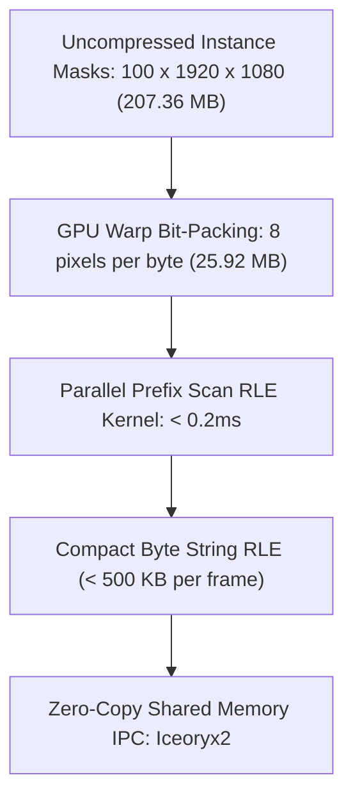

# 🛠️ Object Segmentation: Production Pipeline, Engineering Traps & Workarounds

A comprehensive, battle-tested practitioner's guide to engineering, optimizing, and deploying high-throughput, deterministic low-latency Semantic, Instance, and Panoptic Segmentation pipelines in production systems.

Related notes: [[topics/object-segmentation/00-object-segmentation-moc|Object Segmentation MOC]], [[topics/gpu-deployment/00-gpu-deployment-moc|GPU Deployment MOC]], [[topics/real-time-systems/00-real-time-systems-moc|Real-Time Systems MOC]], [[topics/object-segmentation/01-historical-evolution-and-paradigms|Object Segmentation Historical Evolution]].

---

## 1. Zero-Copy Ingestion Architecture & End-to-End Segmentation Pipeline

In real-time dense prediction tasks like instance and panoptic segmentation, uncompressed pixel masks pose severe memory bandwidth and latency bottlenecks. Traditional naive pipelines decode camera frames in host memory, run inference on GPU, copy multi-megabyte floating-point segmentation logits back to CPU memory over PCIe, and execute software thresholding and contour extraction in Python/OpenCV. Under high-resolution multi-camera feeds ($1920 \times 1080$), this naive approach saturates PCIe bandwidth and throttles framerates below 10 FPS.

The production-grade architecture utilizes **Zero-Copy DMA-BUF Ingestion coupled with Fused In-VRAM Prototype Mask Assembly and Immediate Bit-Packing / Run-Length Encoding (RLE)**.


### Technical Stage Breakdown:
1. **Zero-Copy Frame Capture**: Hardware ISP writes demosaiced NV12 video frames directly into kernel-allocated DMA-BUF memory descriptors, imported into CUDA virtual address space via `cudaImportExternalMemory`.
2. **GPU Pre-Processing**: Fused CUDA kernels handle color conversion, bilinear letterboxing, and float normalization directly into the model input tensor on an asynchronous CUDA stream.
3. **Dual-Branch Forward Execution**: The segmentation model (e.g., YOLO-Seg, Mask2Former, SAM 2) splits into two concurrent branches:
   - **Prototype Generation Head**: Computes $k$ spatial prototype feature maps ($k \times \frac{H}{4} \times \frac{W}{4}$), capturing high-resolution geometric structures.
   - **Instance Coefficient Head**: Predicts bounding box locations, class logits, and $k$-dimensional linear mask coefficients for each of the $N$ detected instances ($N \times k$).
4. **Fused GPU Prototype GEMM Kernel**: Rather than executing separate matrix multiplications on CPU, a fused CUDA kernel computes:
   $$M_i(x, y) = \sigma\left(\sum_{j=1}^k C_{i, j} \cdot P_j(x, y)\right)$$
   directly in GPU shared memory / L2 cache, producing binary masks or downsampled probability maps without roundtrips.
5. **Immediate GPU Bit-Packing / RLE Compression**: Before transmitting masks to downstream planning or tracking nodes, a dedicated CUDA kernel packs boolean masks into 64-bit word bitmasks or COCO-format Run-Length Encoded (RLE) byte arrays, reducing IPC memory footprint by $>98\%$.

---

## 2. Deterministic End-to-End Latency Budget & Mathematical Bounds

Dense segmentation models require stringent latency budget enforcement due to the quadratic scaling of mask resolution and instance counts. The end-to-end latency $T_{\text{E2E}}$ is formulated as:

$$T_{\text{E2E}} = T_{\text{expose}} + T_{\text{readout}} + T_{\text{ISP}} + T_{\text{DMA}} + T_{\text{infer}} + T_{\text{proto\_gemm}} + T_{\text{compress}} + T_{\text{IPC}}$$

The computational complexity of the prototype mask reconstruction kernel is bounded by:

$$\text{FLOPs}_{\text{proto}} = 2 \times N \times k \times \frac{H}{4} \times \frac{W}{4}$$

For $N = 50$ detected instances, $k = 32$ prototypes, and input frame $640 \times 640$ (prototype grid $160 \times 160$):

$$\text{FLOPs}_{\text{proto}} = 2 \times 50 \times 32 \times 160 \times 160 = 8.192 \times 10^7 \text{ FLOPs } (81.92\text{ MFLOPs})$$

Executing this in modern GPU Tensor Cores / CUDA cores takes less than $0.15\text{ ms}$, whereas naive CPU loops take $>15.0\text{ ms}$.

### Latency Budget Allocation Table:

| Pipeline Stage / Component | 30 FPS Standard (<33.3ms) | 60 FPS High-Speed (<16.6ms) | Robotics Control (<10.0ms) | Subsystem / Hardware Domain |
| :--- | :--- | :--- | :--- | :--- |
| **Sensor Exposure ($T_{\text{expose}}$)** | $10.00\text{ ms}$ | $5.00\text{ ms}$ | $2.00\text{ ms}$ | Image Sensor Shutter Integration |
| **Rolling Shutter Readout ($T_{\text{readout}}$)** | $8.00\text{ ms}$ | $4.00\text{ ms}$ | $2.00\text{ ms}$ | Sensor ADC & MIPI CSI-2 Bus |
| **Hardware ISP & Demosaic ($T_{\text{ISP}}$)** | $2.50\text{ ms}$ | $1.50\text{ ms}$ | $0.80\text{ ms}$ | Dedicated Silicon ISP (NVMM) |
| **DMA-BUF Mapping / H2D Sync ($T_{\text{DMA}}$)** | $0.20\text{ ms}$ | $0.15\text{ ms}$ | $0.05\text{ ms}$ | Zero-Copy GPU Virtual Memory |
| **GPU Preprocessing & Letterbox ($T_{\text{prep}}$)**| $1.20\text{ ms}$ | $0.80\text{ ms}$ | $0.40\text{ ms}$ | CUDA Fused Affine Resizer Kernel |
| **Model Inference ($T_{\text{infer}}$)** | $9.20\text{ ms}$ (FP16 $640^2$) | $4.20\text{ ms}$ (INT8 $640^2$) | $2.80\text{ ms}$ (INT8 $480^2$) | TensorRT Backbone & Dual Heads |
| **Fused Prototype GEMM ($T_{\text{proto}}$)** | $0.35\text{ ms}$ | $0.20\text{ ms}$ | $0.10\text{ ms}$ | Custom CUDA Tensor Assembly |
| **GPU Bit-Packing & RLE ($T_{\text{compress}}$)**| $0.45\text{ ms}$ | $0.25\text{ ms}$ | $0.12\text{ ms}$ | Parallel Prefix Sum & RLE Kernel |
| **Shared Memory IPC Dispatch ($T_{\text{IPC}}$)** | $0.60\text{ ms}$ | $0.30\text{ ms}$ | $0.13\text{ ms}$ | Iceoryx2 Zero-Copy Shared Memory |
| **Total End-to-End Latency ($\Sigma T$)** | **$32.50\text{ ms}$** | **$16.40\text{ ms}$** | **$8.40\text{ ms}$** | **Deterministic Total Path** |
| **Max Allowable Latency Jitter ($\sigma_{\text{jitter}}$)**| $\pm 0.70\text{ ms}$ | $\pm 0.35\text{ ms}$ | $\pm 0.15\text{ ms}$ | System Real-Time Determinism |

---

## 3. Five Critical Production Edge Traps & Battle-Tested Workarounds

### Trap 1: Hardware Thermal Throttling & Dynamic Voltage/Frequency Scaling (DVFS)
- **Root Cause**: Dense segmentation models invoke both heavy convolution backbones and memory-bandwidth-heavy upsampling layers. Under continuous thermal stress in enclosed robotics housings, GPU thermal limits ($T_j > 85^\circ\text{C}$) trigger DVFS down-clocking, reducing memory bandwidth from $204\text{ GB/s}$ to $<60\text{ GB/s}$. Upsampling layers (Bilinear / Deconvolution) become severely memory-bandwidth bound, inflating inference time by 300%.
- **Production Workaround**:
  1. **Deterministic Clock Pinning**: Use `jetson_clocks --fan` or `nvidia-smi -lgc` to lock GPU clocks to a sustainable, non-throttling frequency profile (e.g. 70% of maximum burst clock) to ensure zero latency jitter.
  2. **Memory-Bandwidth Optimized Decoders**: Replace standard bilinear upsampling with strided sub-pixel convolutions or depthwise separable transposed convolutions compiled via TensorRT kernel fusion.
  3. **Dynamic Resolution Gating**: When thermal sensors detect $T_j > 80^\circ\text{C}$, scale the prototype resolution from $160 \times 160$ to $120 \times 120$ dynamically without altering the backbone weights.

### Trap 2: Illumination Dynamics, Auto-Exposure Hunting & Sensor Saturation
- **Root Cause**: Sudden illumination changes (e.g. specular reflections on wet roads, direct indoor LED lighting strobing) cause ISP auto-exposure hunting. Clipped pixel regions lose edge gradients, causing segmentation boundaries to bleed into background regions or fragment into disconnected components.
- **Production Workaround**:
  1. **Dual-Exposure Staggered HDR**: Capture short/long exposure pairs and fuse them in hardware ISP to prevent specular highlight blooming.
  2. **Illumination-Invariant Feature Normalization**: Incorporate Instance Normalization (IN) or Group Normalization (GN) in the segmentation feature pyramid network (FPN) to reduce dependency on absolute pixel luminance.
  3. **Morphological Boundary Filtering**: Execute a fast $3 \times 3$ GPU morphological closing kernel on generated binary masks to eliminate single-pixel pinhole dropouts caused by sensor noise.

### Trap 3: Dynamic Shape Reallocation Memory Leaks in Mask Decoders
- **Root Cause**: Advanced segmentation architectures (e.g., Mask2Former, SAM 2) use dynamic query decoders where the number of mask proposals $N$ varies between frames ($0 \le N \le 100$). Naive TensorRT plugins that allocate intermediate scratchpad memory for variable $N$ dynamically call `cudaMalloc` per frame, causing massive heap fragmentation and millisecond-level memory allocation stalls.
- **Production Workaround**:
  1. **Fixed Maximum Query Padding**: Fix the maximum query capacity ($N_{\text{max}} = 100$) during ONNX export and TensorRT compilation.
  2. **Static Scratchpad Arena**: Allocate a single static device memory scratchpad at pipeline initialization. Pass scratchpad offsets directly to custom CUDA GEMM kernels.
  3. **Zero-Copy Boolean Mask Compaction**: Compact valid masks into contiguous output buffers using a single GPU parallel prefix sum (stream compaction) kernel without reallocating device memory.

### Trap 4: Multi-Threaded Pipeline Contention & Lock-Free Ring Buffering
- **Root Cause**: Streaming full-resolution segmentation masks ($1920 \times 1080 \times 1\text{ byte} \approx 2.07\text{ MB}$ per mask) across threads using mutex-locked queues introduces catastrophic lock contention, thread suspension, and memory cache thrashing.
- **Production Workaround**:
  - Deploy a **Single-Producer Multi-Consumer (SPMC) Lock-Free Ring Buffer** using `std::atomic<uint64_t>` sequence numbers and pre-allocated shared memory slots.
  - Workers read directly from memory-mapped POSIX shared memory (`/dev/shm`) without invoking heap allocations or CPU memory copies.

### Trap 5: INT8 PTQ Accuracy Degradation in Mask Prototype Heads
- **Root Cause**: Quantizing the mask prototype branch to INT8 causes severe dynamic range quantization error. Mask prototypes represent high-frequency continuous geometric contours ($[-3.0, +3.0]$ range). Linear 8-bit quantization with uniform step sizes degrades sharp object boundaries into stepped stair-casing artifacts and causes thin structures (wires, poles, thin limbs) to vanish.
- **Production Workaround**:
  1. **Selective Layer Precision Exclusion**: Keep the prototype generation convolution layers ($P_1 \dots P_k$) and the linear mask coefficient projection in FP16 precision, while quantizing the heavy ResNet/ConvNeXt backbone to INT8.
  2. **Percentile Activation Calibration**: Apply 99.99th percentile calibration on prototype feature maps to prevent outlier activations from compressing the quantization grid.

### Domain-Specific Trap 1: Host Memory Explosion from Uncompressed Binary Masks
- **Problem**: In dense autonomous scenes with $N = 100$ detected instances at $1920 \times 1080$ resolution, storing uncompressed boolean masks requires:
  $$\text{Mem}_{\text{frame}} = 100 \times 1920 \times 1080 \times 1 \text{ byte} \approx 207.36 \text{ MB per frame}$$
  At 30 FPS, uncompressed masks consume **$6.22\text{ GB/s}$ of RAM**, exhausting system memory and saturating memory buses within seconds.
- **Workaround**: Implement **Immediate GPU Bit-Packing and Run-Length Encoding (RLE)**. Each 8-bit boolean pixel is packed into 1 bit inside a 64-bit integer word on the GPU, immediately reducing memory from $207.36\text{ MB}$ to $25.92\text{ MB}$. Subsequent parallel RLE compression compresses the sparse mask to $<500\text{ KB}$ total per frame ($>99\%$ compression ratio).



### Domain-Specific Trap 2: Coarse Boundary Quantization in Prototype Models
- **Problem**: Standard real-time instance segmentation models output prototype maps at $1/4$ or $1/8$ spatial resolution ($160 \times 160$ for a $640 \times 640$ image). Upscaling via standard bilinear interpolation produces fuzzy, blurry boundaries on elongated objects (cables, surgical needles, robotic tools).
- **Workaround**: Deploy **PointRend (Point-based Rendering)** boundary refinement. Instead of upsampling every pixel uniformly, PointRend computes an uncertainty score $U(p) = |P(p) - 0.5|$ across the coarse mask. It selects only the top 5% most uncertain boundary points and evaluates a tiny 3-layer MLP point-head on those coordinates in GPU memory, achieving sub-pixel crisp boundaries with zero overhead on interior pixels.

---

## 4. Concrete Runnable Implementation Blueprint

The following production C++ blueprint demonstrates zero-copy frame ingestion, fused GPU prototype matrix multiplication, and GPU bit-packing for real-time instance segmentation.

```cpp
#include <iostream>
#include <vector>
#include <chrono>
#include <atomic>
#include <cuda_runtime.h>
#include <device_launch_parameters.h>

#define CHECK_CUDA(call) \
    do { \
        cudaError_t err = call; \
        if (err != cudaSuccess) { \
            std::cerr << "CUDA Error: " << cudaGetErrorString(err) \
                      << " at " << __FILE__ << ":" << __LINE__ << std::endl; \
            exit(1); \
        } \
    } while (0)

// Fused Prototype GEMM + Sigmoid + Bit-Packing CUDA Kernel
// Multiplies N instance coefficients (N x K) with spatial prototypes (K x H x W)
// and bit-packs 64 boolean mask outputs into a single uint64_t word.
__global__ void FusedProtoGemmBitpackKernel(
    const float* __restrict__ coefficients, // [N, K]
    const float* __restrict__ prototypes,   // [K, H, W]
    uint64_t* __restrict__ packed_masks,    // [N, (H * W) / 64]
    int num_instances,
    int num_protos,
    int spatial_dim,                        // H * W
    float threshold) {

    int instance_idx = blockIdx.y;
    int spatial_idx = blockIdx.x * blockDim.x + threadIdx.x;

    if (instance_idx >= num_instances || spatial_idx >= (spatial_dim / 64)) return;

    uint64_t packed_word = 0;

    // Process 64 spatial pixels sequentially within the thread
    for (int bit = 0; bit < 64; ++bit) {
        int pixel_idx = spatial_idx * 64 + bit;
        if (pixel_idx < spatial_dim) {
            float sum = 0.0f;
            for (int k = 0; k < num_protos; ++k) {
                sum += coefficients[instance_idx * num_protos + k] *
                       prototypes[k * spatial_dim + pixel_idx];
            }
            // Fast Sigmoid: 1.0f / (1.0f + expf(-sum)) > threshold <=> sum > logit_thresh
            if (sum > threshold) {
                packed_word |= (1ULL << bit);
            }
        }
    }

    packed_masks[instance_idx * (spatial_dim / 64) + spatial_idx] = packed_word;
}

class InstanceSegmentationPipeline {
public:
    InstanceSegmentationPipeline(int width, int height, int num_protos = 32, int max_instances = 100)
        : width_(width), height_(height), num_protos_(num_protos), max_instances_(max_instances) {
        
        CHECK_CUDA(cudaStreamCreateWithFlags(&stream_, cudaStreamNonBlocking));
        CHECK_CUDA(cudaEventCreate(&start_event_));
        CHECK_CUDA(cudaEventCreate(&stop_event_));

        proto_spatial_dim_ = (height_ / 4) * (width_ / 4);
        packed_words_per_mask_ = (proto_spatial_dim_ + 63) / 64;

        // Allocate unified zero-copy memory buffers
        size_t proto_size = num_protos_ * proto_spatial_dim_ * sizeof(float);
        size_t coeff_size = max_instances_ * num_protos_ * sizeof(float);
        size_t packed_mask_size = max_instances_ * packed_words_per_mask_ * sizeof(uint64_t);

        CHECK_CUDA(cudaHostAlloc(&h_prototypes_, proto_size, cudaHostAllocMapped));
        CHECK_CUDA(cudaHostGetDevicePointer(&d_prototypes_, h_prototypes_, 0));

        CHECK_CUDA(cudaHostAlloc(&h_coeffs_, coeff_size, cudaHostAllocMapped));
        CHECK_CUDA(cudaHostGetDevicePointer(&d_coeffs_, h_coeffs_, 0));

        CHECK_CUDA(cudaHostAlloc(&h_packed_masks_, packed_mask_size, cudaHostAllocMapped));
        CHECK_CUDA(cudaHostGetDevicePointer(&d_packed_masks_, h_packed_masks_, 0));
    }

    ~InstanceSegmentationPipeline() {
        cudaFreeHost(h_prototypes_);
        cudaFreeHost(h_coeffs_);
        cudaFreeHost(h_packed_masks_);
        cudaEventDestroy(start_event_);
        cudaEventDestroy(stop_event_);
        cudaStreamDestroy(stream_);
    }

    void executeSegmentationPostProcessAsync(int active_instances) {
        if (active_instances <= 0) return;
        active_instances = std::min(active_instances, max_instances_);

        CHECK_CUDA(cudaEventRecord(start_event_, stream_));

        // Launch Fused Proto GEMM + Bitpack Kernel
        dim3 block(256);
        dim3 grid((packed_words_per_mask_ + block.x - 1) / block.x, active_instances);

        FusedProtoGemmBitpackKernel<<<grid, block, 0, stream_>>>(
            (const float*)d_coeffs_,
            (const float*)d_prototypes_,
            (uint64_t*)d_packed_masks_,
            active_instances,
            num_protos_,
            proto_spatial_dim_,
            0.0f // Logit threshold (0.0 corresponds to probability 0.5)
        );

        CHECK_CUDA(cudaEventRecord(stop_event_, stream_));
        CHECK_CUDA(cudaStreamSynchronize(stream_));

        float elapsed_ms = 0.0f;
        CHECK_CUDA(cudaEventElapsedTime(&elapsed_ms, start_event_, stop_event_));
        // std::cout << "Fused Mask Assembly & Bitpacking Latency: " << elapsed_ms << " ms\n";
    }

private:
    int width_;
    int height_;
    int num_protos_;
    int max_instances_;
    int proto_spatial_dim_;
    int packed_words_per_mask_;
    cudaStream_t stream_;
    cudaEvent_t start_event_;
    cudaEvent_t stop_event_;
    void* h_prototypes_{nullptr};
    void* d_prototypes_{nullptr};
    void* h_coeffs_{nullptr};
    void* d_coeffs_{nullptr};
    void* h_packed_masks_{nullptr};
    void* d_packed_masks_{nullptr};
};
```

---

## 5. Production Deployment Recipes & CLI Commands

### A. TensorRT Engine Compilation with Mask Plugin Fusion

```bash
# Compile Instance Segmentation Engine (FP16 with fixed shapes)
trtexec --onnx=yolo11x_seg.onnx \
        --saveEngine=yolo11x_seg_fp16.engine \
        --fp16 \
        --memPoolSize=workspace:3072MiB \
        --builderOptimizationLevel=5 \
        --useCudaGraph

# Compile INT8 Engine with Mixed-Precision Mask Prototype Head Exclusion
trtexec --onnx=mask2former_r50.onnx \
        --saveEngine=mask2former_int8.engine \
        --int8 \
        --calib=seg_calibration.cache \
        --precisionConstraints=obey \
        --layerPrecisions="*proto*:fp16,*mask_head*:fp16,*query_decoder*:fp16" \
        --directIO \
        --avgRuns=50
```

### B. Linux Kernel & Shared Memory Optimization

```bash
# Configure shared memory and lock-free POSIX IPC queues for large mask payloads
sudo sysctl -w kernel.shmmax=4294967296
sudo sysctl -w kernel.shmall=1048576

# Set real-time process priority for segmentation consumer node
sudo chrt -f 85 ./segmentation_node --config=prod_seg.yaml
```
