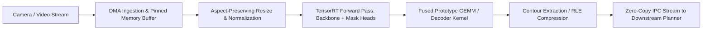
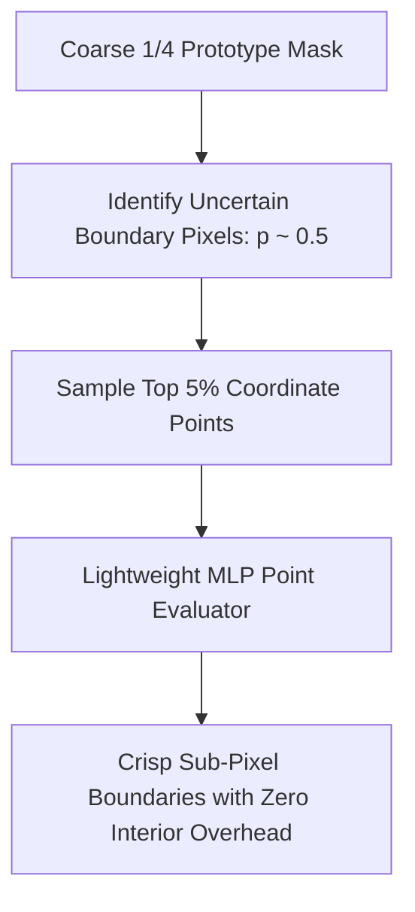

# 🛠️ Object Segmentation: Production Pipeline, Engineering Traps & Workarounds

A practitioner's guide to engineering, optimizing, and deploying high-throughput Semantic, Instance, and Panoptic Segmentation pipelines in production systems.

Related notes: [[topics/object-segmentation/00-object-segmentation-moc|Object Segmentation MOC]], [[topics/gpu-deployment/00-gpu-deployment-moc|GPU Deployment MOC]].

---

## 1. End-to-End Production Pipeline Architecture



### Stage Breakdown:
1. **Sensor Ingest**: Capture video frames into contiguous pinned host buffers (`cudaHostAlloc`) to avoid page faults.
2. **Inference Execution**: Execute the segmentation backbone and prototype branches concurrently on asynchronous CUDA streams.
3. **Mask Assembly (Prototype GEMM)**: Compute the linear matrix multiplication between predicted mask coefficients ($N \times k$) and the spatial prototype tensor ($k \times H/4 \times W/4$) directly inside a fused CUDA/TensorRT kernel.
4. **Compression & Contour Extraction**: Compress floating-point or binary masks immediately using **Run-Length Encoding (RLE)** or vector contours before inter-process communication.

---

## 2. Common Traps, Edge Cases & Hardware Bottlenecks

### Trap 1: Host Memory Explosion from Uncompressed Binary Masks
- **Problem**: In a dense scene with $N = 100$ detected instances on a $1920 \times 1080$ frame, storing uncompressed boolean masks requires:
  $$100 \times 1920 \times 1080 \times 1 \text{ byte} \approx 207 \text{ MB per frame}$$
  At 30 FPS, uncompressed masks consume over **6.2 GB of RAM per second**, crashing host memory in seconds.

### Trap 2: Coarse Boundary Quantization
- **Problem**: Prototype-based architectures (YOLO-Seg) output prototype maps at $1/4$ or $1/8$ spatial resolution. Thin elongated objects (e.g. electrical wires, surgical sutures, distant limbs) suffer from jagged stepping artifacts and disconnected mask fragments.

### Trap 3: Memory Bandwidth Saturation during Full-Resolution Decoding
- **Problem**: Running an end-to-end full-resolution decoder (e.g., $1920 \times 1080$ FCN upsampling layers) is severely memory-bandwidth bound on embedded GPUs, dropping frame rates below 10 FPS.

---

## 3. Battle-Tested Engineering Workarounds

### Workaround 1: Immediate Run-Length Encoding (RLE)
Never serialize or transmit raw 2D numpy arrays. Immediately encode masks into pycocotools-compatible byte strings:

```python
import pycocotools.mask as mask_util
import numpy as np

def compress_binary_mask(binary_mask: np.ndarray) -> dict:
    """
    Compress a 2D binary numpy mask (H, W) into a compact RLE byte structure.
    Reduces memory footprint by 95-99%.
    """
    fortran_mask = np.asfortranarray(binary_mask.astype(np.uint8))
    rle = mask_util.encode(fortran_mask)
    rle["counts"] = rle["counts"].decode("utf-8")  # JSON serializable string
    return rle
```

### Workaround 2: PointRend Boundary Refinement
Instead of upsampling the entire mask uniformly, use **PointRend** (Kirillov et al.):
1. Render the base mask at coarse $1/4$ resolution.
2. Select only the top 5% most uncertain boundary pixels (where mask probability $\approx 0.5$).
3. Compute a tiny point-head MLP only on those selected points, producing crisp boundaries with zero overhead on interior pixels.



### Workaround 3: Downsampled Buffer Streaming
For real-time collision avoidance or robotic path planning, downstream consumers rarely require full 4K mask contours. Maintain mask buffers at downsampled resolution ($480 \times 270$) and upscale on demand using hardware bilinear interpolation.

---

## 4. Production Deployment Recipes

### A. Fused TensorRT Prototype GEMM Plugin
When exporting prototype-based segmentation models (such as YOLOv8-Seg or FastSAM), ensure the prototype matrix multiplication is fused inside the TensorRT engine graph rather than falling back to CPU NumPy:

```bash
# Export segmentation model with end-to-end fused ONNX graph
yolo export model=yolov8s-seg.pt format=engine half=True device=0
```

### B. Lightweight Mobile NPU Inference (MobileSAM)
For low-power microcontrollers and mobile phones:
```bash
# Convert MobileSAM Tiny-ViT encoder to TFLite / ONNX Runtime FP16
python scripts/export_mobilesam.py --model-type vit_t --output mobilesam_tiny.onnx
```
