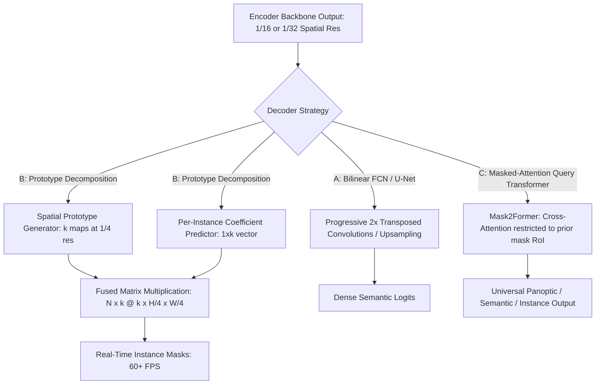
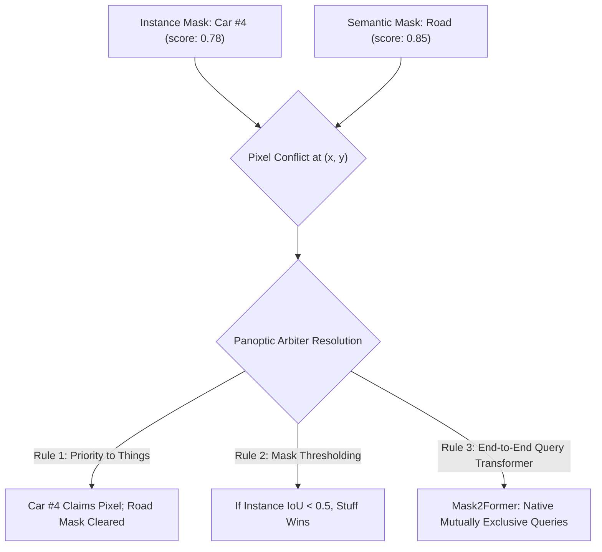

# ⚙️ Object Segmentation: Decoders, Boundary Quantization & Open Frontiers

A deep engineering examination of mask decoder architectures, sub-pixel boundary degradation, real-time panoptic fusion conflicts, and unresolved frontiers in pixel-level vision.

Related notes: [[topics/object-segmentation/00-object-segmentation-moc|Object Segmentation MOC]], [[architectures/foundation-models/sam-2|SAM 2 & 2.1 Deep-Dive]].

---

## 1. Segmentation Decoder Paradigms Compared

The segmentation decoder is responsible for reconstructing dense 2D spatial masks from low-resolution feature embeddings:

### Decoder Architectural Trade-Off Matrix
| Decoder Paradigm | Exemplar Models | Computational Complexity | Edge NPU Suitability | Boundary Edge Fidelity | Memory Bandwidth Pressure |
| :--- | :--- | :--- | :--- | :--- | :--- |
| **Progressive Transposed Conv** | U-Net, DeepLabV3+, HRNet | High ($O(C \cdot H \cdot W)$) | Moderate (Memory bound) | High (Skip connections) | Very High (Large intermediate maps) |
| **Prototype Linear GEMM** | YOLACT, FastSAM, YOLOv8-Seg | **Lowest** ($O(N \cdot k \cdot H/4 \cdot W/4)$)| **Optimal** (Hardware GEMM) | Moderate (Jagged $1/4$ resolution)| **Lowest** (Asynchronous stream) |
| **Masked-Attention Queries** | Mask2Former, OneFormer | High ($O(N_{\text{queries}} \cdot N_{\text{tokens}})$)| Low (Heavy softmax attention) | **Highest** (Dynamic RoI bounds)| High (Attention scratchpads) |

---

## 2. The Prototype Matrix Multiplication Bottleneck & Hardware Fixes

In prototype-based instance segmentation (YOLOv8-Seg, YOLO11-Seg), masks are computed dynamically on GPU:
$$M_i = \sigma\left( \sum_{j=1}^k c_{i, j} \cdot P_j(x, y) \right)$$
Where $c_i \in \mathbb{R}^k$ is the predicted mask coefficient vector for instance $i$, and $P_j \in \mathbb{R}^{H/4 \times W/4}$ are the $k$ learned spatial prototype feature maps (typically $k = 32$).

### The Naive Python Deployment Trap:
Exporting this operation to naive ONNX often produces un-fused elementwise operations:
- A separate broadcast multiplication kernel for each of the $N$ instances.
- For $N = 100$ detections, this launches **100 independent GPU kernels** and performs 100 un-coalesced writes to VRAM.

### Production CUDA / TensorRT Solution:
Flatten the prototype tensor into a 2D matrix:
$$P_{\text{flat}} \in \mathbb{R}^{k \times (H/4 \cdot W/4)}$$
And compute all $N$ masks simultaneously in a single **CUBLAS GEMM** call:
$$M_{\text{all}} = \sigma\left( C \times P_{\text{flat}} \right) \in \mathbb{R}^{N \times (H/4 \cdot W/4)}$$
Then reshape to $[N, H/4, W/4]$ inside a single fused TensorRT plugin.

---

## 3. Current Open Problems in Object Segmentation

### 🔴 Problem 1: Thin-Structure & Sub-Pixel Boundary Disconnection
- **The Failure Mode**: Prototype decoders output mask features at $1/4$ or $1/8$ spatial resolution. When segmenting fine elongated structures (e.g. overhead power cables, medical surgical sutures, robotic wiring harnesses, or distant insect legs), the spatial stride causes the mask to break into disconnected, fragmented blobs.
- **Why Naive Upsampling Fails**: Bilinear or bicubic upsampling smooths the boundaries, but does not recover the missing high-frequency topology.
- **Recent Frontier Solutions (2024–2026)**:
  - **Implicit Neural Boundary Representations (PointRend & SegNeXt)**: Evaluates high-resolution boundary points adaptively with lightweight point MLPs only where mask probability is uncertain ($0.4 < p < 0.6$).
  - **Curvature-Preserving Loss Formulations**: Integrating topological persistence and boundary Laplacian penalties directly into the segmentation training loss.

---

## 4. Panoptic Segmentation Conflict Resolution (Things vs. Stuff)

Panoptic Segmentation requires assigning every single pixel to exactly **one** pair: `(category, instance_id)`.
- **Things**: Countable objects (cars, pedestrians, chairs) with unique instance IDs.
- **Stuff**: Uncountable amorphous background textures (sky, road, vegetation, sand) with `instance_id = 0`.

### The Overlap Conflict Trap:
Independent instance and semantic segmentation heads frequently output overlapping conflicting claims for the same physical pixel $(x, y)$:
- The instance head claims pixel $(x, y)$ belongs to "Car #4" with confidence $0.78$.
- The semantic head claims pixel $(x, y)$ belongs to "Road" with confidence $0.85$.

### Production Panoptic Merge Algorithm:
1. Sort all predicted instance masks in descending order of confidence score.
2. Maintain a canvas buffer initialized to zeros.
3. Paste instance masks onto the canvas sequentially; if an incoming instance overlaps with already pasted instances by more than a threshold $\tau_{\text{overlap}} = 0.3$, truncate the overlapping boundary.
4. Fill remaining unassigned background pixels with the highest-scoring semantic "stuff" class predictions.
5. Filter out tiny disconnected stuff islands (area $< 64\text{ pixels}$).
