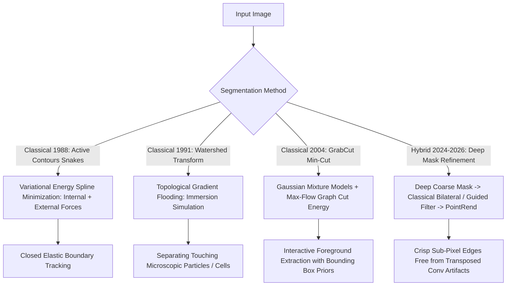

# 📐 Object Segmentation: Classical Contours & Hybrid Pipelines

A rigorous technical analysis of classical energy-minimization segmentation algorithms (Snakes, GrabCut, Watershed) and how they hybridize with modern foundation segmenters (SAM 2, Mask2Former).

Related notes: [[topics/object-segmentation/00-object-segmentation-moc|Object Segmentation MOC]], [[topics/object-segmentation/03-decoders-and-open-problems|Decoders & Boundary Quantization]].

---

## 1. Classical Energy Minimization vs. Deep Mask Decoders

### Segmentation Algorithm Comparison
| Algorithm | Underlying Formulation | Energy Optimization | Handles Touching Instances? | Failure Mode | Best Role |
| :--- | :--- | :--- | :--- | :--- | :--- |
| **Active Contours (Snakes)** | Parametric spline energy $E_{\text{snake}}$ | Euler-Lagrange gradient descent | Poorly | Trapped in local gradient minima | Smooth organ/vessel boundary tracking |
| **Marker-Controlled Watershed** | Morphological flooding simulation | Priority-queue immersion | **Excellent** | Severe over-segmentation without markers | Industrial particle & cell counting |
| **GrabCut** | Min-Cut / Max-Flow on MRF Graph | Boykov-Kolmogorov Graph Cut | Moderate | Color contrast ambiguity | Low-compute bounding-box foreground cutout |
| **SAM 2 + Guided Filter** | Foundation ViT + Linear Time Edge Filter | Attention GEMM + Local Covariance | **Superior** | Dynamic memory cache blowout | Real-time 4K video alpha matting |

---

## 2. Mathematical Formulations: Active Contours & Graph Cut

### 1. Active Contour Spline Energy (Kass, Witkin, Terzopoulos):
A contour parameterized as $v(s) = (x(s), y(s))$ for $s \in [0, 1]$ minimizes the total energy functional:
$$E_{\text{snake}} = \int_0^1 \left( E_{\text{internal}}(v(s)) + E_{\text{image}}(v(s)) + E_{\text{con}}(v(s)) \right) ds$$
- **Internal Elasticity & Rigidity Forces**:
  $$E_{\text{internal}} = \frac{1}{2} \left( \alpha |v'(s)|^2 + \beta |v''(s)|^2 \right)$$
  where $\alpha$ resists stretching (elasticity) and $\beta$ resists bending (stiffness).
- **External Image Attraction Force**:
  $$E_{\text{image}} = -w_{\text{edge}} |\nabla I(x, y)|^2$$

### 2. GrabCut Graph-Cut Formulation:
The image is modeled as a Markov Random Field (MRF) graph where edge capacities between neighboring pixels $p, q$ depend on Euclidean color contrast:
$$V(p, q) = \frac{\gamma}{\|p - q\|} \exp\left( -\beta \|z_p - z_q\|^2 \right)$$
A polynomial-time Max-Flow / Min-Cut algorithm computes the exact global minimum cut separating foreground source $S$ from background sink $T$.

---

## 3. Production Hybrid Pattern: Fast Deep Coarse Mask + Classical Guided Filtering

Deep segmentation networks (e.g. Mask2Former or YOLO-Seg) output masks at $1/4$ resolution ($160\times 160$ for a $640\times 640$ input), resulting in blocky, blurred edges when upsampled.

### The Real-Time Production Fix:
1. Pass low-resolution deep mask $p_{\text{coarse}}$ through a **Classical Guided Filter** (He et al.) using the original high-resolution RGB image $I$ as the guidance guide:
   $$q_i = a_k I_i + b_k \quad \forall i \in \omega_k$$
   where coefficients $(a_k, b_k)$ are solved in closed-form via local linear covariance.
2. The guided filter executes in **$\mathcal{O}(N)$ linear time**, restoring sub-pixel edge alignment on fine wires and hair strands in $<1.5\text{ ms}$ on a GPU without retraining the neural network.
