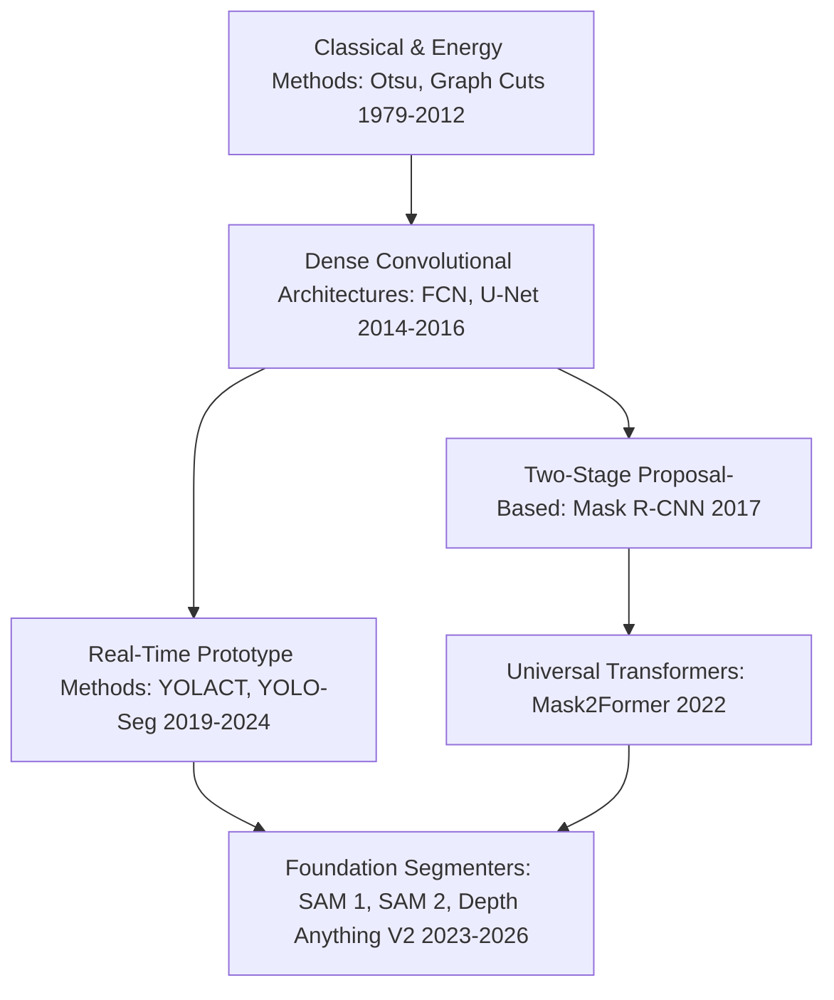
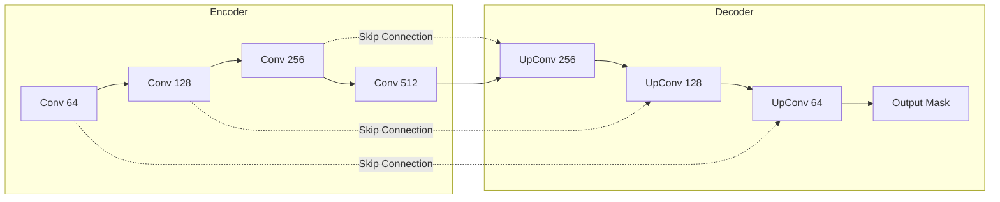
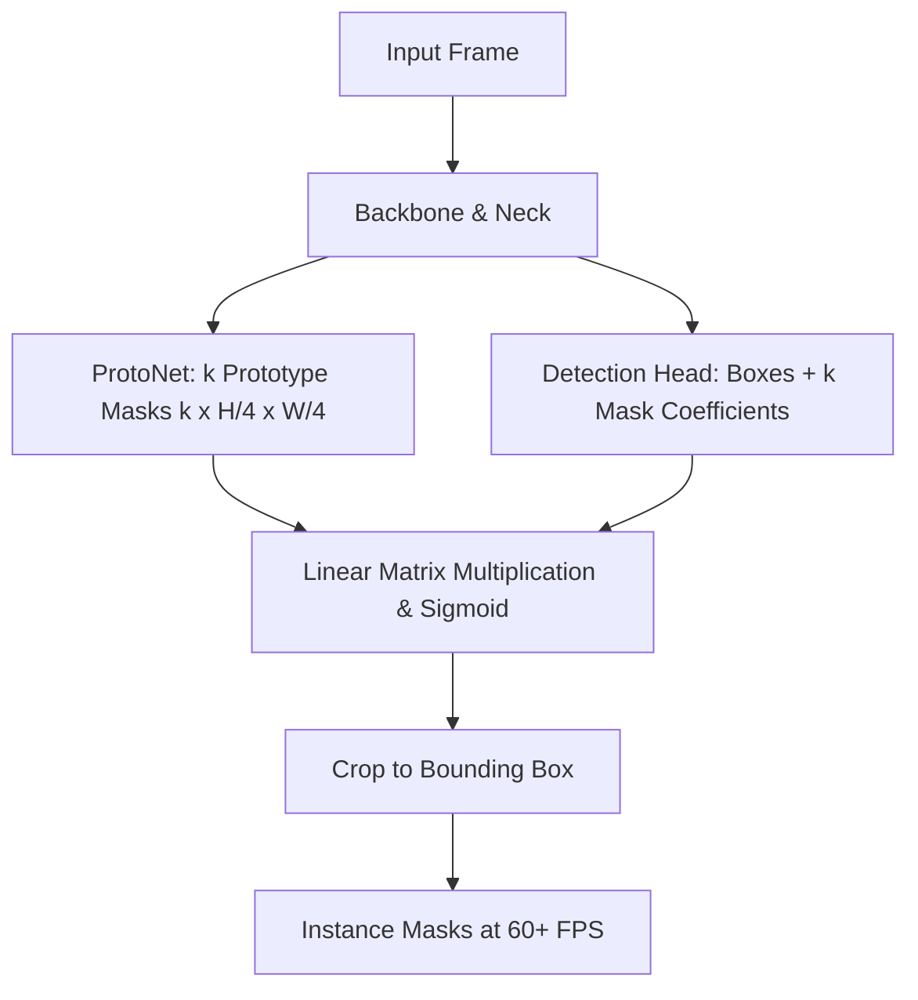
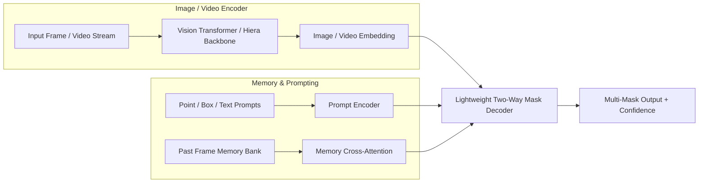

# Object Segmentation: Historical Evolution & Paradigms

A didactic deep-dive charting the history of image segmentation: from classical thresholding and Graph Cuts to FCN, U-Net, Mask R-CNN, prototype-based real-time segmentation, and modern foundation models (SAM 1 to SAM 2.1 & Depth Anything V2).

Related notes: [[topics/object-segmentation/README|Object Segmentation Playbook]], [[topics/object-detection/README|Object Detection]].

---

## 1. The Three Eras of Segmentation

### Era 1: Classical Energy Minimization & Graph Cuts (1979–2012)
- **Otsu Thresholding (1979)**: Maximizes inter-class variance between foreground and background histograms.
- **Watershed Algorithm**: Interprets grayscale gradients as topographic relief surfaces, flooding valleys to find catchment basin dividing lines.
- **Normalized Cuts & Graph Cuts (Boykov & Jolly, 2001)**: Formulated segmentation as maximum flow / minimum cut on a pixel graph where edge weights reflect color and gradient similarities.
- *Bottleneck*: Lacked semantic understanding; a red car on a red wall could not be segmented.

### Era 2: Deep Fully Convolutional & Encoder-Decoder Networks (2014–2018)
- **FCN (Long et al., 2015)**: Replaced fully connected classification layers with convolutional layers, enabling dense arbitrary-sized output prediction with coarse deconvolutional upsampling.
- **U-Net (Ronneberger et al., 2015)**:
  - Introduced the symmetrical **Encoder-Decoder** structure with **Skip Connections**. Skip connections directly transfer high-resolution spatial feature maps from contracting paths to expanding paths, preventing loss of boundary localization.
- **DeepLab Series (v1–v3+, Chen et al., 2017–2018)**:
  - Introduced **Atrous (Dilated) Convolutions** to expand receptive fields without downsampling or increasing parameter counts. Added **Atrous Spatial Pyramid Pooling (ASPP)** to capture multi-scale context.

---

## 2. Instance Segmentation: Proposal-Based vs Prototype-Based

Instance segmentation requires distinguishing between individual objects of the same class. Two primary paradigms emerged:

### Paradigm A: Detect-Then-Segment (Mask R-CNN, 2017)
1. Predict bounding boxes via Faster R-CNN RPN.
2. Use **RoIAlign** (bilinear interpolation) to extract exact floating-point feature grids without quantization misalignment.
3. Pass aligned RoI features through a tiny FCN branch to output an $m \times m$ binary mask per box.
- *Strength*: Pixel-precise mask quality.
- *Weakness*: Sequential proposal processing makes it slow (5–12 FPS).

### Paradigm B: Real-Time Prototype & Coefficient Matrix (YOLACT & YOLO-Seg, 2019–2024)
Instead of extracting RoIs sequentially, decompose instance segmentation into two parallel tasks:
1. **Protonet Branch**: Generates a dictionary of $k$ global prototype masks ($k \approx 32$) spanning the full image.
2. **Prediction Head**: Predicts bounding boxes and a vector of $k$ **mask coefficients** per detected instance.
3. **Assembly via Linear Combination**:
   $$\text{Mask}_i = \sigma\left(\sum_{j=1}^k c_{i,j} \cdot P_j\right)$$
   Surviving masks are cropped to the predicted bounding box.
- *Strength*: Matrix multiplication of prototypes runs in parallel on GPU at >60–120 FPS.

---

## 3. The Foundation Model Era: SAM, SAM 2, and Depth Anything

The latest revolution treats segmentation as a zero-shot, promptable foundation model.

### Key Milestones:
1. **SAM 1 (Meta FAIR, 2023)**:
   - Trained on 1.1 billion masks (SA-1B). Decoupled heavy image encoding (ViT-H taking ~100ms) from a tiny prompt decoder executing in ~5ms.
   - *Limitation*: Heavy memory footprint; no native temporal understanding for video.
2. **SAM 2 & SAM 2.1 (Meta FAIR, 2024–2025)**:
   - Unified image and streaming video segmentation with a hierarchical **Hiera** backbone.
   - Maintains a **Memory Bank** of past frame spatial embeddings and interaction clicks. Evaluates mask propagation across long sequences at **44 FPS**.
3. **Depth Anything V2 (2024–2025)**:
   - Demonstrates that dense geometric depth estimation is fundamentally continuous spatial segmentation. Employs large-scale synthetic data distillation to eliminate visual artifacts on fine edges.
