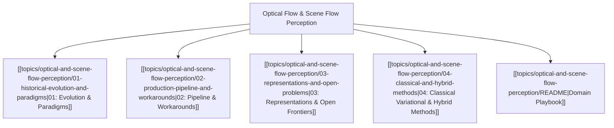

# 🌊 Optical Flow & Scene Flow Perception MOC

## Overview
Optical Flow ($2\text{D}$ pixel displacement vectors $(u, v)$) and Scene Flow ($3\text{D}$ velocity vectors $(v_x, v_y, v_z)$) capture dense continuous motion across physical reality. While tracking follows discrete bounding boxes, flow fields reveal full non-rigid object deformations, fluid dynamics, camera ego-motion, and independent moving object (IMO) segmentation.

---

## 🗺️ Master Domain Map

---

## 📚 Core Chapter Navigation
- [[topics/optical-and-scene-flow-perception/01-historical-evolution-and-paradigms|01: Historical Evolution & Paradigms]]: Horn-Schunck and Lucas-Kanade differential formulations, FlowNet CNNs, RAFT all-pairs 4D correlation volumes, and GMFlow transformer matching.
- [[topics/optical-and-scene-flow-perception/02-production-pipeline-and-workarounds|02: Production Pipeline & Workarounds]]: Mitigating large displacements via iterative pyramid warping, handling textureless aperture problem ambiguities, and forward-backward consistency occlusion masking.
- [[topics/optical-and-scene-flow-perception/03-representations-and-open-problems|03: Representations & Open Frontiers]]: Dense 3D point cloud scene flow (FlowNet3D, HPLFlowNet), self-supervised cycle-consistency losses, and event-assisted zero-motion-blur flow.
- [[topics/optical-and-scene-flow-perception/04-classical-and-hybrid-methods|04: Classical Variational & Hybrid Methods]]: Mathematical derivation of the Horn-Schunck Optical Flow Brightness Constancy Equation ($I_x u + I_y v + I_t = 0$) and hybrid classical epipolar geometry decoupling.
- [[topics/optical-and-scene-flow-perception/README|Domain Playbook]]: RAFT, GMFlow, UniMatch, Open3D Flow, and edge TensorRT/Vulkan deployment.

---

## 🔗 Cross-Domain Obsidian Links
- Crucial for [[topics/video-tracking/00-video-tracking-moc|Video Tracking MOC]] motion compensation.
- Directly informs [[topics/slam-and-spatial-perception/00-slam-and-spatial-perception-moc|SLAM & Spatial Perception MOC]] for visual odometry.
