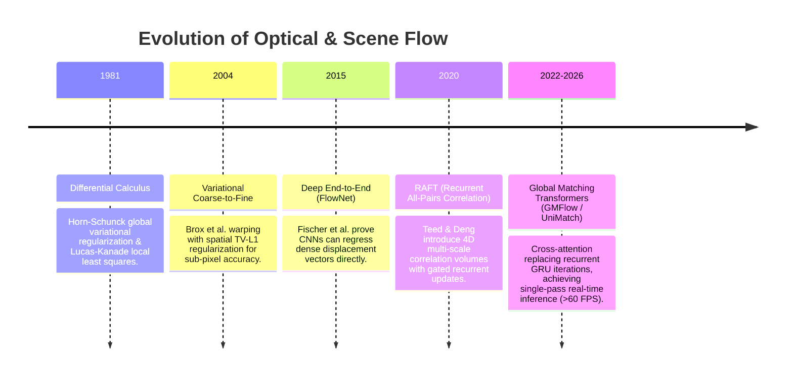

# 📜 Optical & Scene Flow: Historical Evolution & Paradigms

From differential variational formulations to deep all-pairs correlation pyramids and cross-attention matching.

Related notes: [[topics/optical-and-scene-flow-perception/00-optical-and-scene-flow-perception-moc|Optical Flow MOC]].

---

## 1. Timeline of Motion Estimation Breakthroughs

---

## 2. Paradigms & Generational Shifts

- **1st Generation: Differential Formulations (1981–2000s)**:
  - Relied on the Brightness Constancy Assumption $I(x+u, y+v, t+1) = I(x, y, t)$. Assumed motion was infinitesimal ($\Delta x \to 0$); failed completely on rapid displacements without coarse-to-fine pyramids.
- **2nd Generation: Deep Recurrent Multi-Scale Warping (RAFT, 2020)**:
  - Extracted deep features per pixel, constructed a complete $4\text{D}$ correlation volume between all pairs of pixels, and updated flow iteratively via a ConvGRU.
- **3rd Generation: Global Attention & Unification (GMFlow / UniMatch, 2024–2026)**:
  - Formulates flow as cross-frame feature matching via self- and cross-attention transformers. Unifies stereo matching, optical flow, and depth estimation into a single weight-shared foundation model.
