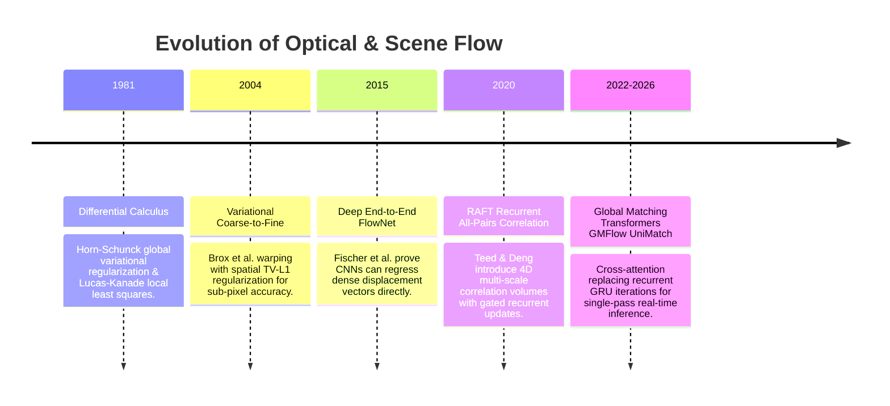

# 📜 Optical & Scene Flow: Historical Evolution & Paradigms

From differential variational formulations to deep all-pairs correlation pyramids and cross-attention matching.

Related notes: [[topics/optical-and-scene-flow-perception/00-optical-and-scene-flow-perception-moc|Optical Flow MOC]].

---

## 1. Timeline of Motion Estimation Breakthroughs

---

## 2. Paradigms & Generational Shifts

### 1st Generation: Differential Calculus Formulations (1981–2004)

Horn & Schunck (1981) and Lucas & Kanade (1981) represent complementary approaches to the same fundamental underconstrained problem. Both rest on the **Brightness Constancy Assumption**:

$$I(x + u\,\Delta t,\; y + v\,\Delta t,\; t + \Delta t) = I(x, y, t)$$

Taylor-expanding and dividing by $\Delta t$ yields the **Optical Flow Constraint Equation (OFCE)**:

$$I_x u + I_y v + I_t = 0$$

This single equation has two unknowns ($u, v$) — the **Aperture Problem**. Every pixel provides one constraint; additional regularization is required.

**Horn-Schunck**: Global smoothness prior — minimize $\|\nabla u\|^2 + \|\nabla v\|^2$ over the entire image, coupling all pixel flow estimates into a single linear system. Smooth flow fields, but blurs real motion discontinuities at object boundaries.

**Lucas-Kanade**: Local constant-flow prior — assume $u, v$ constant in a $5\times5$ or $7\times7$ window and solve the overdetermined system via least squares:

$$\begin{pmatrix} \sum I_x^2 & \sum I_x I_y \\ \sum I_x I_y & \sum I_y^2 \end{pmatrix} \begin{pmatrix} u \\ v \end{pmatrix} = -\begin{pmatrix} \sum I_x I_t \\ \sum I_y I_t \end{pmatrix}$$

The $2\times2$ matrix is the **Harris structure tensor** $\mathbf{M}$. Flow is reliable where $\mathbf{M}$ has two large eigenvalues (corner regions); it is rank-deficient (unobservable) along straight edges (aperture problem) and in textureless regions.

**Limitation shared by both**: First-order Taylor expansion assumes infinitesimal displacements. Typical video at 30 FPS involves displacements of 5–50 pixels per frame — completely violating the linearization assumption. Coarse-to-fine image pyramids (Brox et al. 2004, TV-L1) alleviate this but require expensive iterative warping.

### 2nd Generation: Deep Recurrent Multi-Scale Warping (RAFT, 2020)

RAFT (Teed & Deng, ECCV 2020) overcame the displacement magnitude limitation by constructing a complete **4D correlation volume** between all pixel pairs. The key insight: never warp images; instead precompute all possible matches and learn to look up the right correspondences.

RAFT achieves **F1-all = 17.4%** on KITTI-2015 (percentage of pixels with EPE > 3px AND >5% of true flow), compared to 26.3% for PWC-Net and 31.0% for FlowNet2 — a dramatic advance driven entirely by the all-pairs correlation idea.

### 3rd Generation: Global Attention & Unification (GMFlow / UniMatch, 2022–2026)

GMFlow (Xu et al., CVPR 2022) eliminates iterative GRU updates entirely, replacing them with a single transformer cross-attention operation that directly matches features across the two frames. UniMatch (2023) unifies optical flow, stereo disparity, and depth estimation into a single weight-shared model — three historically separate tasks solved by one architecture.

**Sintel benchmark context** (Final pass, harder rendering): RAFT achieves $1.61\,\text{px}$ average EPE; GMFlow achieves $1.74\,\text{px}$ — slightly worse, but at $4\times$ the inference speed. UniMatch achieves $1.38\,\text{px}$ EPE on Sintel Final as of 2024 — new SOTA.

---

## 3. RAFT 4D Multi-Scale Correlation Pyramid: Deep Technical Walkthrough

RAFT's innovation is worth studying in detail because it established the architecture template for all subsequent learned flow methods.

### Feature Extraction

Both input frames $I_1, I_2 \in \mathbb{R}^{H \times W \times 3}$ are passed through a shared-weight **feature encoder** (6-layer residual CNN with stride 8 downsampling):

$$\mathbf{g}_1 = \text{Encoder}(I_1) \in \mathbb{R}^{H/8 \times W/8 \times 256}$$
$$\mathbf{g}_2 = \text{Encoder}(I_2) \in \mathbb{R}^{H/8 \times W/8 \times 256}$$

A separate **context encoder** (same architecture) processes only $I_1$ and provides context features to the ConvGRU update operator.

### 4D All-Pairs Correlation Volume Construction

The key operation: compute the **inner product between every pixel in $\mathbf{g}_1$ and every pixel in $\mathbf{g}_2$**:

$$C(\mathbf{x}_1, \mathbf{x}_2) = \langle \mathbf{g}_1(\mathbf{x}_1),\; \mathbf{g}_2(\mathbf{x}_2) \rangle \in \mathbb{R}^{(H/8 \times W/8) \times (H/8 \times W/8)}$$

This 4D volume has shape $(H/8, W/8, H/8, W/8)$ — for a $480\times640$ image, that's $60 \times 80 \times 60 \times 80 = 23\text{M}$ entries per frame pair. Building it requires $O(HW \cdot d)$ compute where $d=256$ is the feature dimension.

**Correlation pyramid**: To handle flows at multiple scales, RAFT pools the last two dimensions of $C$ with $2\times$ average pooling at 4 levels, creating a pyramid $\{C^1, C^2, C^4, C^8\}$ where superscript denotes the pooling stride. This allows the GRU to look up coarse ($C^8$, 480× cheaper) vs. fine ($C^1$, full resolution) correspondences at each iteration.

### ConvGRU Iterative Update Mechanism

Starting from zero flow initialization $\mathbf{f}^0 = 0$, RAFT iteratively refines flow over $T = 12$ GRU iterations:

1. **Correlation lookup**: Given current flow estimate $\mathbf{f}^k$, for each pixel $\mathbf{x}_1$ in frame 1, look up a $9\times9$ neighborhood around the warped location $\mathbf{x}_1 + \mathbf{f}^k(\mathbf{x}_1)$ in each pyramid level. Concatenate: $\mathbf{r}^k \in \mathbb{R}^{H/8 \times W/8 \times 4 \times 81}$.
2. **ConvGRU update**: $\mathbf{h}^{k+1}, \Delta\mathbf{f}^{k+1} = \text{GRU}(\mathbf{h}^k, [\mathbf{r}^k, \mathbf{f}^k, \mathbf{z}^k])$ where $\mathbf{z}^k$ is the context feature.
3. **Flow update**: $\mathbf{f}^{k+1} = \mathbf{f}^k + \Delta\mathbf{f}^{k+1}$.
4. **Upsampling**: Final flow is upsampled from $H/8 \times W/8$ to $H \times W$ using a learned convex combination of $3\times3$ grid neighbors.

The GRU acts as a **recurrent optimizer** — each iteration refines the estimate by consulting the correlation pyramid at the current flow hypothesis. RAFT's total parameter count: 5.3M (small), making it deployable on embedded hardware.

---

## 4. GMFlow: Global Cross-Attention Matching

GMFlow replaces RAFT's recurrent correlation lookup with a single cross-attention pass — achieving global context in $O((HW/64)^2 \cdot d)$ compute:

$$\text{Attention}(Q, K, V) = \text{softmax}\!\left(\frac{QK^T}{\sqrt{d}}\right) V$$

where $Q = W_Q \mathbf{g}_1$ and $K = V = W_K \mathbf{g}_2$. The output is a feature map where each pixel in frame 1 holds a weighted blend of all frame 2 features — the weights are the matching probabilities. Converting to flow: $\mathbf{f}(\mathbf{x}_1) = \mathbf{x}_2^* - \mathbf{x}_1$ where $\mathbf{x}_2^* = \text{argmax}_{\mathbf{x}_2} \text{softmax}(Q(\mathbf{x}_1) \cdot K(\mathbf{x}_2)^T / \sqrt{d})$.

**KITTI-2015 benchmark**: GMFlow F1-all = 9.32% (2022 release), vs. RAFT's 5.10%. GMFlow trades $\sim 4\,\text{pp}$ accuracy for $3\times$ faster inference ($8\,\text{ms}$ vs. $24\,\text{ms}$ at $480\times640$ on RTX 3090).
