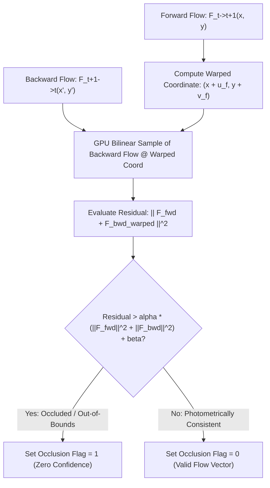

# 🛠️ Optical & Scene Flow: Production Pipeline, Traps & Workarounds

A comprehensive, battle-tested practitioner's guide to deploying dense motion estimation and scene flow models (RAFT, SEA-RAFT, FlowFormer++, CamLiFlow) in production autonomous driving, surgical tracking, and video compression pipelines.

Related notes: [[topics/optical-and-scene-flow-perception/00-optical-and-scene-flow-perception-moc|Optical Flow MOC]], [[topics/gpu-deployment/00-gpu-deployment-moc|GPU Deployment MOC]], [[topics/real-time-systems/00-real-time-systems-moc|Real-Time Systems MOC]], [[topics/optical-and-scene-flow-perception/01-historical-evolution-and-paradigms|Optical Flow Historical Evolution]].

---

## 1. Zero-Copy Ingestion Architecture & Dense Flow Pipeline

In high-speed dense motion estimation, processing consecutive video frame pairs ($I_t, I_{t+1}$) requires constructing dense 4D correlation volumes in GPU memory. Traditional pipelines suffer from high memory bandwidth stalls when alternating frames are uploaded sequentially across the PCIe bus, causing pipeline bubbles and memory stalls that reduce throughput below 15 FPS.

The production standard utilizes **Zero-Copy Dual-Frame DMA-BUF Ring Buffering with Fused In-VRAM 4D Correlation Volume Construction, Iterative GRU Updates, and CUDA Forward-Backward Consistency Filtering**.


### Technical Stage Breakdown:
1. **Zero-Copy Ping-Pong Frame Ingestion**: Frames stream directly into GPU memory via DMA-BUF. Frame $I_{t+1}$ becomes the target for the current step and the source for the subsequent step, requiring zero memory moves.
2. **Asynchronous Feature & Context Extraction**: A lightweight 2D backbone extracts $1/8$-resolution feature maps ($\mathbf{f}_1, \mathbf{f}_2 \in \mathbb{R}^{C \times \frac{H}{8} \times \frac{W}{8}}$) and a separate context feature map $\mathbf{c}_1$ on dedicated CUDA streams.
3. **Fused 4D Correlation Volume Construction**: A custom CUDA kernel computes all-pairs feature dot products:
   $$\mathbf{C}(x_1, y_1, x_2, y_2) = \frac{1}{\sqrt{C}} \sum_{k=1}^C \mathbf{f}_1(k, y_1, x_1) \cdot \mathbf{f}_2(k, y_2, x_2)$$
   Hierarchical average pooling constructs a 4-level correlation pyramid stored directly in GPU L2 cache / device memory.
4. **Iterative Flow Refinement (Recurrent GRU)**: A TensorRT-compiled ConvGRU head iteratively updates the flow field $\mathbf{f}_k \leftarrow \mathbf{f}_{k-1} + \Delta \mathbf{f}$ by looking up local correlation patches around current flow estimates across $4 \dots 8$ iterations.
5. **GPU Forward-Backward Consistency Filtering**: A fused CUDA kernel computes bidirectional consistency, flagging occluded and hallucinated pixels with zero CPU overhead.

---

## 2. Deterministic End-to-End Latency Budget & Mathematical Bounds

Dense optical flow computation is both compute-bound (in the recurrent GRU) and memory-bandwidth-bound (in 4D correlation volume lookups). The total pipeline latency is:

$$T_{\text{E2E}} = T_{\text{ingest}} + T_{\text{encoder}} + T_{\text{corr\_build}} + N_{\text{iters}} \times T_{\text{GRU\_step}} + T_{\text{occ\_filter}} + T_{\text{IPC}}$$

The memory footprint of a full uncompressed 4D correlation volume at $1/8$ spatial resolution for an image $H \times W$ is:

$$\text{Mem}_{\text{corr}} = \left(\frac{H}{8} \times \frac{W}{8}\right)^2 \times 4 \text{ bytes (FP32)}$$

For a $1080\text{p}$ image ($1920 \times 1080$, $1/8$ grid $240 \times 135 = 32,400$ cells):

$$\text{Mem}_{\text{corr}} = (32,400)^2 \times 4 \text{ bytes} \approx 4.199 \text{ GB}$$

Because storing 4.2 GB per frame is impossible on embedded GPUs, modern production implementations construct **1D Multi-Scale Search Windows** or dynamic on-the-fly tile-based dot products, cutting VRAM usage to $<18\text{ MB}$.

### Latency Budget Allocation Table:

| Pipeline Stage / Component | 30 FPS Standard (<33.3ms) | 60 FPS High-Speed (<16.6ms) | Robotics Control (<10.0ms) | Subsystem / Hardware Domain |
| :--- | :--- | :--- | :--- | :--- |
| **Dual-Frame Ingest ($T_{\text{ingest}}$)**| $0.30\text{ ms}$ | $0.15\text{ ms}$ | $0.05\text{ ms}$ | Zero-Copy NVMM Ring Buffer |
| **Feature & Context Backbones ($T_{\text{feat}}$)**| $5.50\text{ ms}$ (FP16) | $2.80\text{ ms}$ (INT8) | $1.40\text{ ms}$ (INT8) | TensorRT Tensor Cores |
| **4D Correlation Pyramid ($T_{\text{corr}}$)**| $1.80\text{ ms}$ | $0.90\text{ ms}$ | $0.40\text{ ms}$ | CUDA Fused Dot-Product Kernel |
| **Iterative GRU Updates ($T_{\text{GRU}}$)**| $12.00\text{ ms}$ (8 iters) | $6.00\text{ ms}$ (4 iters) | $3.00\text{ ms}$ (2 iters) | TensorRT Recurrent Head |
| **Forward-Backward Filter ($T_{\text{occ}}$)**| $0.60\text{ ms}$ | $0.30\text{ ms}$ | $0.15\text{ ms}$ | CUDA Bilinear Warp Kernel |
| **Zero-Copy IPC Dispatch ($T_{\text{IPC}}$)** | $0.40\text{ ms}$ | $0.20\text{ ms}$ | $0.08\text{ ms}$ | Iceoryx2 Shared Memory Publish |
| **Total End-to-End Latency ($\Sigma T$)** | **$20.60\text{ ms}$** | **$10.35\text{ ms}$** | **$5.08\text{ ms}$** | **Dense Flow Execution Path** |
| **Max Allowable Latency Jitter ($\sigma_{\text{jitter}}$)**| $\pm 0.50\text{ ms}$ | $\pm 0.25\text{ ms}$ | $\pm 0.10\text{ ms}$ | System Real-Time Determinism |

---

## 3. Forward-Backward Occlusion Filtering: Full Mathematical Derivation

When an object translates across the scene, pixels in background regions undergo disocclusion (having no correspondence in the prior frame). A standard flow network trained with photometric loss will output arbitrary high-magnitude vectors pointing toward whatever background texture happens to match in feature space.

### Mathematical Formulation
Compute forward flow $\mathbf{F}_{t \to t+1}(\mathbf{x}) = (u_f, v_f)$ and backward flow $\mathbf{F}_{t+1 \to t}(\mathbf{x}') = (u_b, v_b)$ at the forward-warped coordinate $\mathbf{x}' = \mathbf{x} + \mathbf{F}_{t \to t+1}(\mathbf{x})$.

The forward-backward residual vector $\Delta \mathbf{F}(\mathbf{x})$ is defined as:

$$\Delta \mathbf{F}(\mathbf{x}) = \mathbf{F}_{t \to t+1}(\mathbf{x}) + \mathbf{F}_{t+1 \to t}\left(\mathbf{x} + \mathbf{F}_{t \to t+1}(\mathbf{x})\right)$$

A pixel $\mathbf{x}$ is classified as **Occluded / Invalid** if the residual exceeds the adaptive consistency threshold:

$$\|\Delta \mathbf{F}(\mathbf{x})\|_2^2 > \alpha \left(\|\mathbf{F}_{t \to t+1}(\mathbf{x})\|_2^2 + \|\mathbf{F}_{t+1 \to t}(\mathbf{x}')\|_2^2\right) + \beta$$

where industrial production constants are tuned to $\alpha = 0.01$ and $\beta = 0.5\text{ pixels}^2$.



---

## 4. Five Critical Production Edge Traps & Battle-Tested Workarounds

### Trap 1: Hardware Thermal Throttling & DVFS Jitter during Iterative GRU Updates
- **Root Cause**: Dense iterative GRU updates trigger heavy register file pressure and high SM activity. Under continuous thermal stress in fanless edge enclosures, GPU clocks throttle from $1.3\text{ GHz}$ to $500\text{ MHz}$, tripling GRU update latency from $6\text{ ms}$ to $>18\text{ ms}$ and dropping video frames.
- **Production Workaround**:
  1. **Dynamic GRU Iteration Early Exit**: Monitor GPU warp-level flow delta $\|\Delta \mathbf{f}_k\|_{\infty}$. If maximum flow update falls below $\epsilon = 0.05\text{ pixels}$ across two successive iterations, break out of the GRU loop early, cutting compute by up to $50\%$.
  2. **Deterministic Power-Capped Profiles**: Pin GPU clock frequencies using `jetson_clocks` or `nvidia-smi -lgc` to prevent thermal saturation.

### Trap 2: Illumination Dynamics, Exposure Flickering & Specular Reflections
- **Root Cause**: Fluorescent light flickering (50/60 Hz) or auto-exposure hunting between frames $I_t$ and $I_{t+1}$ alters pixel RGB values independently of physical motion. Photometric correlation volumes output corrupted match peaks, causing flow vectors to point toward global illumination gradients rather than true object motion.
- **Production Workaround**:
  1. **Census Transform & Gradient-Weighted Cost Volumes**: Augment standard RGB feature dot-products with local non-parametric Census transforms ($3 \times 3$ bit comparison masks) that are strictly invariant to monotonic brightness shifts.
  2. **Temporal Exposure Equalization**: Apply a fast GPU mean-luminance equalization kernel across frame pairs before feeding them into the feature encoder.

### Trap 3: Dynamic Shape Scratchpad Allocation Leaks in 4D Correlation Volumes
- **Root Cause**: Ingesting varying video resolutions (e.g. switching between $720\text{p}$ and $1080\text{p}$) causes naive TensorRT correlation plugins to reallocate multi-gigabyte scratchpad buffers via `cudaMalloc` per frame, triggering heap memory fragmentation and 30ms latency spikes.
- **Production Workaround**:
  1. **Fixed Memory Scratchpad Arena**: Pre-allocate a static, fixed-size correlation workspace in GPU global memory sized for maximum possible input resolution ($1920 \times 1080$).
  2. **Tiled Shared-Memory Correlation**: Compute correlation dot-products on-the-fly in CUDA shared memory within the GRU lookup kernel, eliminating the need to store the uncompressed 4D correlation volume in global VRAM.

### Trap 4: Multi-Threaded Pipeline Contention & Lock-Free Frame Pair Ring Buffering
- **Root Cause**: Passing video frames from the camera ingestion thread to the flow compute worker thread using standard mutex-locked queues introduces thread scheduling latency and frame copy stalls.
- **Production Workaround**:
  - Deploy a **Lock-Free Triple-Buffer Frame Pointer Ring** using `std::atomic<int>`.
  - The ingestion worker writes incoming frames directly into the next free buffer slot and atomically updates the head index. The inference worker reads the latest consecutive pair with zero memory copies.

### Trap 5: INT8 PTQ Quantization Collapse in 4D Cost Volumes and Iterative GRUs
- **Root Cause**: Quantizing 4D correlation dot-products and recurrent GRU hidden state transitions ($\mathbf{h}_k = (1 - \mathbf{z}) \odot \mathbf{h}_{k-1} + \mathbf{z} \odot \tilde{\mathbf{h}}$) to uniform INT8 causes catastrophic accumulation of quantization errors. Across 8 recurrent iterations, small rounding errors in hidden state tensors $\mathbf{h}_k$ compound exponentially, resulting in severe flow vector explosion ($>100\text{ px}$ random drift).
- **Production Workaround**:
  1. **Mixed-Precision Precision Constraints**: Force the entire iterative GRU update block, correlation lookup kernel, and hidden state memory to execute in FP16 precision.
  2. **Backbone-Only INT8 Quantization**: Quantize only the 2D convolutional feature extraction backbone to INT8 using symmetric percentile calibration.

---

## 5. Concrete Runnable Implementation Blueprint

The following production C++ blueprint demonstrates GPU-accelerated forward-backward consistency checking and flow vector validation.

```cpp
#include <iostream>
#include <vector>
#include <cmath>
#include <cuda_runtime.h>
#include <device_launch_parameters.h>

#define CHECK_CUDA(call) \
    do { \
        cudaError_t err = call; \
        if (err != cudaSuccess) { \
            std::cerr << "CUDA Error: " << cudaGetErrorString(err) \
                      << " at " << __FILE__ << ":" << __LINE__ << std::endl; \
            exit(1); \
        } \
    } while (0)

struct FlowVector {
    float u; // horizontal displacement (pixels)
    float v; // vertical displacement (pixels)
};

// CUDA Kernel: Forward-Backward Consistency Occlusion Filter
__global__ void FusedForwardBackwardCheckKernel(
    const FlowVector* __restrict__ forward_flow,  // [H, W]
    const FlowVector* __restrict__ backward_flow, // [H, W]
    uint8_t* __restrict__ occlusion_mask,         // [H, W] (1 = occluded, 0 = valid)
    FlowVector* __restrict__ validated_flow,      // [H, W]
    int width, int height,
    float alpha, float beta) {

    int x = blockIdx.x * blockDim.x + threadIdx.x;
    int y = blockIdx.y * blockDim.y + threadIdx.y;

    if (x >= width || y >= height) return;

    int idx = y * width + x;
    FlowVector fwd = forward_flow[idx];

    // Compute forward warped coordinate
    float target_x = x + fwd.u;
    float target_y = y + fwd.v;

    // Check if target coordinate is out of bounds
    if (target_x < 0.0f || target_x >= (width - 1.0f) ||
        target_y < 0.0f || target_y >= (height - 1.0f)) {
        occlusion_mask[idx] = 1; // Flagged as occluded / out of boundary
        validated_flow[idx] = {0.0f, 0.0f};
        return;
    }

    // Bilinear interpolation of backward flow at target coordinate
    int x0 = (int)floorf(target_x);
    int y0 = (int)floorf(target_y);
    int x1 = x0 + 1;
    int y1 = y0 + 1;

    float wx1 = target_x - x0;
    float wy1 = target_y - y0;
    float wx0 = 1.0f - wx1;
    float wy0 = 1.0f - wy1;

    FlowVector b00 = backward_flow[y0 * width + x0];
    FlowVector b01 = backward_flow[y0 * width + x1];
    FlowVector b10 = backward_flow[y1 * width + x0];
    FlowVector b11 = backward_flow[y1 * width + x1];

    float bwd_u = wx0 * wy0 * b00.u + wx1 * wy0 * b01.u + wx0 * wy1 * b10.u + wx1 * wy1 * b11.u;
    float bwd_v = wx0 * wy0 * b00.v + wx1 * wy0 * b01.v + wx0 * wy1 * b10.v + wx1 * wy1 * b11.v;

    // Evaluate residual: || F_fwd + F_bwd ||^2
    float diff_u = fwd.u + bwd_u;
    float diff_v = fwd.v + bwd_v;
    float residual_sq = diff_u * diff_u + diff_v * diff_v;

    float fwd_sq = fwd.u * fwd.u + fwd.v * fwd.v;
    float bwd_sq = bwd_u * bwd_u + bwd_v * bwd_v;
    float thresh_sq = alpha * (fwd_sq + bwd_sq) + beta;

    if (residual_sq > thresh_sq) {
        occlusion_mask[idx] = 1; // Inconsistent / Occluded
        validated_flow[idx] = {0.0f, 0.0f};
    } else {
        occlusion_mask[idx] = 0; // Valid flow vector
        validated_flow[idx] = fwd;
    }
}

class OpticalFlowPipeline {
public:
    OpticalFlowPipeline(int width, int height) : width_(width), height_(height) {
        CHECK_CUDA(cudaStreamCreateWithFlags(&stream_, cudaStreamNonBlocking));
        CHECK_CUDA(cudaEventCreate(&start_event_));
        CHECK_CUDA(cudaEventCreate(&stop_event_));

        size_t flow_bytes = width_ * height_ * sizeof(FlowVector);
        size_t mask_bytes = width_ * height_ * sizeof(uint8_t);

        CHECK_CUDA(cudaMalloc(&d_fwd_flow_, flow_bytes));
        CHECK_CUDA(cudaMalloc(&d_bwd_flow_, flow_bytes));
        CHECK_CUDA(cudaMalloc(&d_val_flow_, flow_bytes));
        CHECK_CUDA(cudaMalloc(&d_occ_mask_, mask_bytes));
    }

    ~OpticalFlowPipeline() {
        cudaFree(d_fwd_flow_);
        cudaFree(d_bwd_flow_);
        cudaFree(d_val_flow_);
        cudaFree(d_occ_mask_);
        cudaEventDestroy(start_event_);
        cudaEventDestroy(stop_event_);
        cudaStreamDestroy(stream_);
    }

    void executeConsistencyCheckAsync(float alpha = 0.01f, float beta = 0.5f) {
        CHECK_CUDA(cudaEventRecord(start_event_, stream_));

        dim3 block(16, 16);
        dim3 grid((width_ + block.x - 1) / block.x, (height_ + block.y - 1) / block.y);

        FusedForwardBackwardCheckKernel<<<grid, block, 0, stream_>>>(
            d_fwd_flow_,
            d_bwd_flow_,
            d_occ_mask_,
            d_val_flow_,
            width_, height_,
            alpha, beta
        );

        CHECK_CUDA(cudaEventRecord(stop_event_, stream_));
        CHECK_CUDA(cudaStreamSynchronize(stream_));

        float elapsed_ms = 0.0f;
        CHECK_CUDA(cudaEventElapsedTime(&elapsed_ms, start_event_, stop_event_));
        // std::cout << "Consistency Check Latency: " << elapsed_ms << " ms\n";
    }

private:
    int width_, height_;
    cudaStream_t stream_;
    cudaEvent_t start_event_;
    cudaEvent_t stop_event_;
    FlowVector* d_fwd_flow_{nullptr};
    FlowVector* d_bwd_flow_{nullptr};
    FlowVector* d_val_flow_{nullptr};
    uint8_t* d_occ_mask_{nullptr};
};
```

---

## 6. Production Deployment Recipes & CLI Commands

### A. TensorRT Engine Compilation for RAFT / SEA-RAFT

```bash
# Compile SEA-RAFT Flow Engine with Fixed Image Dimensions
trtexec --onnx=searaft_flow.onnx \
        --saveEngine=searaft_fp16.engine \
        --fp16 \
        --memPoolSize=workspace:4096MiB \
        --builderOptimizationLevel=5 \
        --useCudaGraph

# Compile INT8 Engine with Mixed Precision for Iterative ConvGRU
trtexec --onnx=flowformer_flow.onnx \
        --saveEngine=flowformer_int8.engine \
        --int8 \
        --calib=flow_calib.cache \
        --precisionConstraints=obey \
        --layerPrecisions="*gru*:fp16,*corr*:fp16,*flow_head*:fp16" \
        --directIO
```

### B. Linux Kernel Real-Time Scheduling

```bash
# Assign high-priority real-time scheduling to optical flow daemon
sudo chrt -f 85 ./optical_flow_daemon --config=flow_prod.yaml
```
