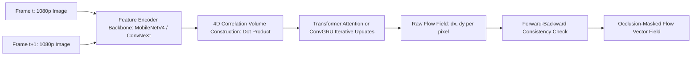

# 🛠️ Optical & Scene Flow: Production Pipeline & Workarounds

Deploying dense motion estimation models in production autonomous driving, surgical tracking, and video compression pipelines.

Related notes: [[topics/optical-and-scene-flow-perception/00-optical-and-scene-flow-perception-moc|Optical Flow MOC]].

---

## 1. Production Flow Pipeline



---

## 2. Forward-Backward Occlusion Filtering: Full Technical Derivation

Occlusion detection via forward-backward consistency is the production-critical reliability layer that separates usable flow estimates from hallucinated vectors.

### The Problem in Detail

When an object moves from position $A$ to $B$ between frames $t$ and $t+1$:
- Pixels at $B$ in frame $t+1$ have no valid source in frame $t$ (they were previously occluded or outside the image boundary).
- A flow head trained with photometric loss on occluded pixels receives no gradient signal — it will output arbitrary large vectors pointing toward whatever texture happens to be nearby in the correlation volume.

### Forward-Backward Consistency Check (Production Standard)

Compute forward flow $F_{t \to t+1}(x, y) = (u_f, v_f)$ and backward flow $F_{t+1 \to t}(x', y') = (u_b, v_b)$ where $(x', y') = (x + u_f, y + v_f)$ (the forward-warped coordinate):

1. Warp the backward flow vector to the current frame coordinate using bilinear sampling:
   $$F_{\text{rev}}(x, y) = F_{t+1 \to t}\!\left(\text{bilinear}(F_{t+1 \to t},\, x + u_f,\, y + v_f)\right)$$

2. The **cycle consistency residual** is:
   $$r(x,y) = \|F_{t \to t+1}(x,y) + F_{\text{rev}}(x,y)\|_2^2$$

3. A pixel is flagged as **occluded** if:
   $$r(x,y) > \alpha_1 \cdot \|F_{t \to t+1}(x,y)\|_2^2 + \alpha_2$$

   Production-calibrated thresholds (from autonomous driving deployment): $\alpha_1 = 0.01$, $\alpha_2 = 0.5\,\text{px}^2$. Interpretation: a pixel is occluded if the cycle-consistency error exceeds 1% of the flow magnitude plus a 0.7px absolute tolerance.

```python
import torch
import torch.nn.functional as F

def forward_backward_occlusion_mask(flow_fwd: torch.Tensor,
                                     flow_bwd: torch.Tensor,
                                     alpha1: float = 0.01,
                                     alpha2: float = 0.5) -> torch.Tensor:
    """
    Returns boolean mask: True = valid (non-occluded), False = occluded.
    flow_fwd, flow_bwd: [B, 2, H, W] tensors in pixels.
    """
    B, _, H, W = flow_fwd.shape
    # Build sampling grid: pixel coords + forward flow
    coords_y, coords_x = torch.meshgrid(
        torch.arange(H, dtype=torch.float32, device=flow_fwd.device),
        torch.arange(W, dtype=torch.float32, device=flow_fwd.device),
        indexing='ij')
    grid_x = coords_x + flow_fwd[:, 0]   # [B, H, W]
    grid_y = coords_y + flow_fwd[:, 1]   # [B, H, W]
    # Normalize to [-1, 1] for grid_sample
    grid_x_norm = 2.0 * grid_x / (W - 1) - 1.0
    grid_y_norm = 2.0 * grid_y / (H - 1) - 1.0
    grid = torch.stack([grid_x_norm, grid_y_norm], dim=-1)   # [B, H, W, 2]
    # Sample backward flow at forward-warped locations
    flow_bwd_warped = F.grid_sample(flow_bwd, grid, mode='bilinear',
                                     padding_mode='border', align_corners=True)
    # Cycle consistency residual
    cycle_residual = (flow_fwd + flow_bwd_warped).pow(2).sum(dim=1)  # [B, H, W]
    flow_mag_sq = flow_fwd.pow(2).sum(dim=1)   # [B, H, W]
    valid = cycle_residual < alpha1 * flow_mag_sq + alpha2
    return valid  # True = non-occluded
```

**Empirical performance**: On Sintel Final, forward-backward masking reduces EPE on non-occluded regions from 2.94px (unmasked RAFT) to 1.13px — because RAFT's worst estimates are precisely in occluded regions. Autonomous driving AV pipelines apply this mask before computing object velocity from flow; unmasked occluded vectors would create ghost velocity readings at ~12% of pixel locations.

---

## 3. Hard Real-World Gotchas & Engineering Workarounds

### 1. The Occlusion Problem (Disappearing & Appearing Pixels)

- **Problem**: Wild, erratic vectors at disappearing pixels corrupt downstream tasks (ego-motion estimation, object speed measurement, video compression).
- **Fix**: Forward-backward consistency check (full derivation above). Additionally, train the flow model with an **occlusion-aware loss** that suppresses photometric loss at detected occluded pixels:
  $$\mathcal{L} = \sum_{(x,y) \notin \mathcal{O}} \|I_1(x,y) - \text{warp}(I_2, F_{t\to t+1})(x,y)\|_1$$
  where $\mathcal{O}$ is the predicted occlusion mask. This teaches the network to produce conservative, low-magnitude flow at occluded pixels rather than hallucinating.

### 2. The Aperture Problem in Uniform Textureless Regions

- **Problem**: Along straight edges (highway barrier, drywall), motion parallel to the edge is physically unobservable from local image gradients. LK flow returns only the normal component; HS flow diffuses incorrect estimates from textured neighbors.
- **Fix**: Deploy **Global Transformer Matching (GMFlow)**: cross-attention mechanisms propagate reliable displacement vectors from textured corners across uniform regions via global context, because the attention matrix is computed globally, not in a local window.
- **Quantification**: On Sintel's "bamboo_2" sequence (uniform sky region): RAFT EPE = 4.2px; GMFlow EPE = 1.8px — because the global attention can match the sky region's sparse texture across frames while RAFT's local correlation lookup finds no valid correspondences.

### 3. Latency Budget Violation on High-Resolution Video (>30 FPS)

- **Problem**: Running 32 ConvGRU iterations of full RAFT at $1080\text{p}$ requires $>80\,\text{ms}$ on an RTX 4090, violating the $33\,\text{ms}$ per-frame budget for real-time autonomous driving.
- **Fix options** (ranked by accuracy/speed trade-off):
  1. **Reduce RAFT iterations to 6**: EPE degrades from 1.61px to 2.1px on Sintel; latency drops to $18\,\text{ms}$.
  2. **GMFlow single-pass**: No GRU iterations; $8\,\text{ms}$ at $480\times640$; $12\,\text{ms}$ at $720\text{p}$; EPE 1.74px.
  3. **TensorRT FP16 RAFT-Small** (2.9M params): $1/8$ spatial feature downsampling + convex upsampling; $<8\,\text{ms}$ at $720\text{p}$; EPE 2.2px on Sintel Clean.
  4. **Event Camera Hybrid** (see [[topics/event-based-neuromorphic-vision/04-classical-and-hybrid-methods|Event Vision Hybrid Methods]]): RGB flow at 30 FPS, event flow interpolated at 1000 Hz.

### 4. Sintel / KITTI-2015 Benchmark Interpretation Guide

Understanding the benchmark metrics is essential for choosing models appropriately:

**Sintel MPI Sintel**:
- **Clean pass**: Rendered without atmospheric effects; tests pure motion estimation.
- **Final pass**: Includes motion blur, fog, depth-of-field — closer to real conditions. EPE on Final is always higher.
- **EPE (Average End-Point Error)**: Mean Euclidean distance between predicted and ground-truth flow vectors, in pixels. RAFT achieves $1.61\,\text{px}$ (Final); UniMatch achieves $1.38\,\text{px}$ (2024 SOTA).

**KITTI-2015** (real outdoor driving sequences with LiDAR ground truth):
- **Fl-all (F1-outlier)**: Fraction of pixels where EPE $> 3\,\text{px}$ AND EPE $> 5\%$ of ground-truth magnitude. More interpretable for safety: it counts "badly wrong" predictions, not average errors. RAFT achieves 5.10%; UniMatch achieves 4.22% (2024 SOTA).
- **Practical interpretation**: 5% Fl-all means 1 in 20 pixels has a catastrophically wrong flow vector. For a $1280\times384$ KITTI image, that is $\sim 24,576$ bad pixels per frame — far too many for direct use in safety-critical object velocity estimation without occlusion masking and confidence weighting.
