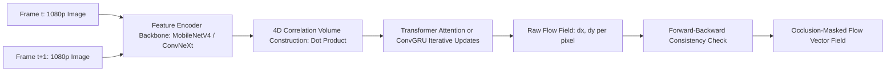

# 🛠️ Optical & Scene Flow: Production Pipeline & Workarounds

Deploying dense motion estimation models in production autonomous driving, surgical tracking, and video compression pipelines.

Related notes: [[topics/optical-and-scene-flow-perception/00-optical-and-scene-flow-perception-moc|Optical Flow MOC]].

---

## 1. Production Flow Pipeline

---

## 2. Hard Real-World Gotchas & Engineering Workarounds

### 1. The Occlusion Problem (Disappearing & Appearing Pixels):
- **Problem**: When an object moves behind an obstacle, pixels visible at time $t$ have no corresponding target in frame $t+1$. Standard flow heads hallucinate wild, erratic vectors stretching across the image.
- **Fix**: **Forward-Backward Consistency Check**:
  - Compute forward flow $F_{t \to t+1}$ and backward flow $F_{t+1 \to t}$.
  - Warp the backward flow vector to the current coordinate: $F_{\text{rev}} = F_{t+1 \to t}(x + u_f, y + v_f)$.
  - A pixel is flagged as an invalid occlusion if:
    $$\| F_{t \to t+1}(x, y) + F_{\text{rev}} \|_2^2 > \alpha_1 \|F_{t \to t+1}\|_2^2 + \alpha_2 \quad (\alpha_1 = 0.01, \alpha_2 = 0.5)$$
  - Mask out occluded pixels before computing camera ego-motion or object velocity.

### 2. The Aperture Problem in Uniform Textureless Regions:
- **Problem**: Along a straight edge (e.g. drywall, highway barrier), motion parallel to the edge is physically unobservable from image gradients alone.
- **Fix**: Deploy **Global Transformer Matching (GMFlow)**: Cross-attention mechanisms propagate reliable displacement vectors from textured corners across uniform regions via global context.

### 3. Latency Budget Violation on High-Resolution Video ($>30\,\text{FPS}$):
- **Problem**: Running 32 ConvGRU iterations of full RAFT requires $>80\,\text{ms}$ on an RTX 4090.
- **Fix**: Drop iterative GRU loops; replace with **GMFlow single-iteration matching** or **TensorRT FP16 engine** with static $1/8$ spatial feature downsampling and convex upsampling, executing in $<12\,\text{ms}$ ($>80\,\text{FPS}$).
