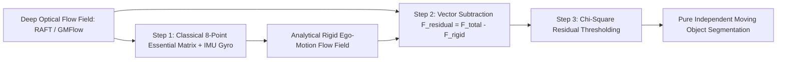

# 📐 Optical & Scene Flow: Classical Variational & Hybrid Methods

Rigorous mathematical derivations of classical differential optical flow (Horn-Schunck, Lucas-Kanade) and hybrid ego-motion epipolar decoupling.

Related notes: [[topics/optical-and-scene-flow-perception/00-optical-and-scene-flow-perception-moc|Optical Flow MOC]], [[topics/slam-and-spatial-perception/04-classical-and-hybrid-methods|SLAM Classical Foundations]].

---

## 1. Classical Differential Calculus: The Horn-Schunck Formulation

### The Optical Flow Brightness Constancy Constraint:
Assuming a physical surface patch retains constant irradiance over an infinitesimal time step $\Delta t$:
$$I(x + \Delta x, y + \Delta y, t + \Delta t) = I(x, y, t)$$
Performing a first-order Taylor series expansion:
$$I(x, y, t) + \frac{\partial I}{\partial x}\Delta x + \frac{\partial I}{\partial y}\Delta y + \frac{\partial I}{\partial t}\Delta t + \mathcal{O}(\Delta^2) = I(x, y, t)$$

Dividing by $\Delta t$ and taking the limit $\Delta t \to 0$ yields the fundamental **Optical Flow Constraint Equation (OFCE)**:
$$I_x u + I_y v + I_t = 0 \quad \text{or} \quad \nabla I \cdot \mathbf{v} + I_t = 0$$
Where $\mathbf{v} = [u, v]^T = \left[\frac{dx}{dt}, \frac{dy}{dt}\right]^T$ is the 2D optical flow velocity.
*Note: Because this is a single linear scalar equation with two unknowns ($u, v$), optical flow is underconstrained at every individual pixel (The Aperture Problem).*

### The Horn-Schunck Global Variational Functional:
To resolve underconstrained flow, Horn & Schunck introduced a global spatial smoothness regularizer $\mathcal{L}_{\text{smooth}} = \|\nabla u\|_2^2 + \|\nabla v\|_2^2$:
$$E(u, v) = \iint \left( (I_x u + I_y v + I_t)^2 + \alpha^2 (u_x^2 + u_y^2 + v_x^2 + v_y^2) \right) dx dy$$

Applying the **Euler-Lagrange equations**:
$$\frac{\partial F}{\partial u} - \frac{\partial}{\partial x}\left(\frac{\partial F}{\partial u_x}\right) - \frac{\partial}{\partial y}\left(\frac{\partial F}{\partial u_y}\right) = 0$$

Yields the coupled iterative Gauss-Seidel update equations:
$$u^{k+1} = \bar{u}^k - \frac{I_x (I_x \bar{u}^k + I_y \bar{v}^k + I_t)}{\alpha^2 + I_x^2 + I_y^2}$$
$$v^{k+1} = \bar{v}^k - \frac{I_y (I_x \bar{u}^k + I_y \bar{v}^k + I_t)}{\alpha^2 + I_x^2 + I_y^2}$$
Where $\bar{u}, \bar{v}$ denote local neighborhood 4-connected spatial averages.

---

## 2. Production Hybrid Pattern: Epipolar Ego-Motion Decoupling

In autonomous driving and drone navigation, total optical flow $F_{\text{total}}$ is a superposition of:
1. **Camera Ego-Motion (Rigid Flow)**: Caused by vehicle velocity ($v, \omega$).
2. **Independent Object Motion (Non-Rigid Flow)**: Pedestrians, other cars, moving machinery.

### Exact Residual Formulation:
Given the camera rotational velocity $\omega = [\omega_x, \omega_y, \omega_z]^T$ and translational velocity $v = [v_x, v_y, v_z]^T$ from vehicle CAN-bus/IMU:
The rigid flow $[u_{\text{rigid}}, v_{\text{rigid}}]^T$ is computed analytically:
$$u_{\text{rigid}} = \frac{x v_z - f v_x}{Z} + \frac{x y}{f} \omega_x - \left( f + \frac{x^2}{f} \right) \omega_y + y \omega_z$$
$$v_{\text{rigid}} = \frac{y v_z - f v_y}{Z} + \left( f + \frac{y^2}{f} \right) \omega_x - \frac{x y}{f} \omega_y - x \omega_z$$
Subtracting $F_{\text{rigid}}$ from the deep flow immediately isolates true moving obstacles with zero false positives from camera ego-rotation.
