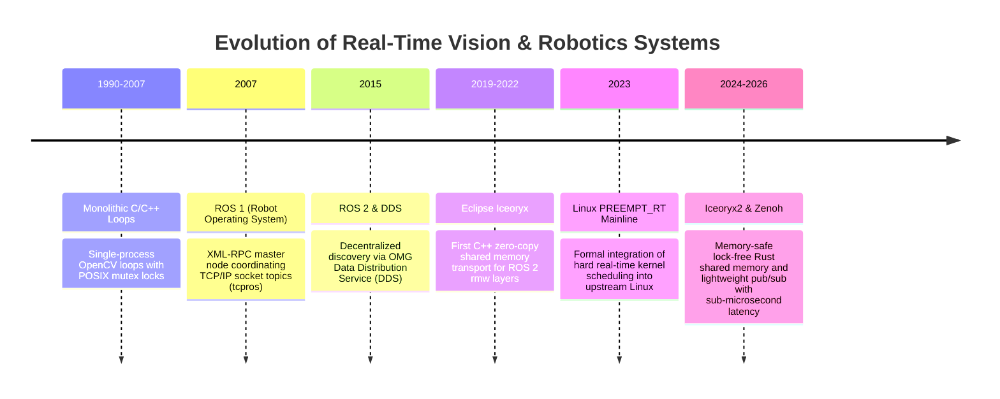
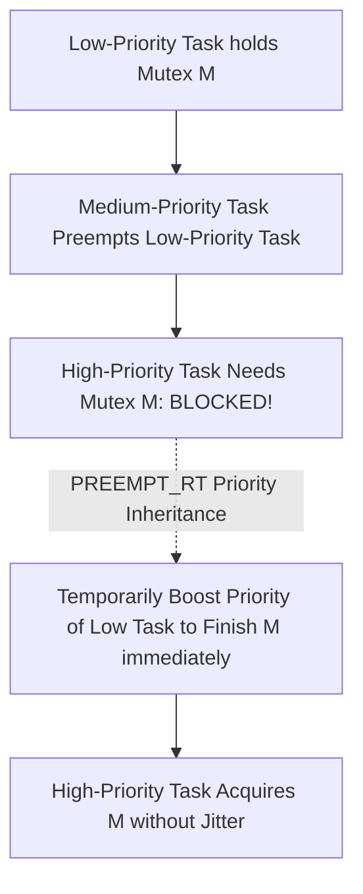
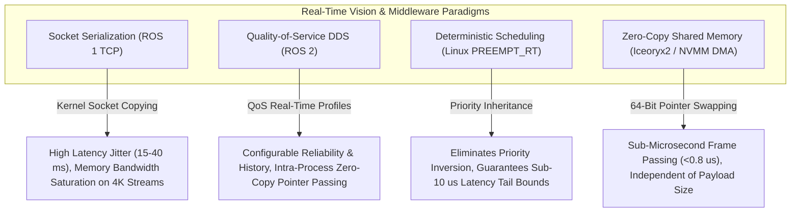

# 📜 Real-Time Systems: Historical Evolution & Paradigms

A didactic overview tracking how low-latency computer vision and robotics middleware evolved from monolithic loops and TCP sockets to ROS 1 master nodes, ROS 2 DDS architectures, kernel PREEMPT_RT deterministic scheduling, and lock-free shared-memory zero-copy IPC (Iceoryx2).

Related notes: [[topics/real-time-systems/00-real-time-systems-moc|Real-Time Systems MOC]], [[topics/gpu-deployment/00-gpu-deployment-moc|GPU Deployment MOC]].

---

## 1. Evolution Timeline: From Monolithic Loops to Iceoryx2 Zero-Copy

---

## 2. Core Paradigm Breakthroughs Explained

### Breakthrough A: Hard vs. Soft Real-Time Guarantees
- **Soft Real-Time**: Missing a deadline degrades performance (e.g. dropping a frame in a video stream causes minor visual stuttering).
- **Hard Real-Time**: Missing a single deadline constitutes catastrophic system failure (e.g. an autonomous vehicle failing to issue an emergency braking command within 10 ms crashes into an obstacle).

Traditional Linux is general-purpose, optimizing for **average throughput** rather than bounded worst-case latency. Standard kernel locks can stall an application thread arbitrarily.

---

### Breakthrough B: Linux PREEMPT_RT (Deterministic Kernel Scheduling)
The PREEMPT_RT kernel patch transforms the standard Linux kernel into a hard real-time operating system:
1. **Threaded Interrupt Handlers**: Hardware interrupts run as preemptible kernel threads with real-time priorities (`SCHED_FIFO` / `SCHED_RR`).
2. **Priority Inheritance Mutexes**: Prevents **Priority Inversion** (where a low-priority thread holding a lock blocks a high-priority thread because an intermediate thread preempts the low-priority task).

---

### Breakthrough C: The Shared-Memory Zero-Copy Revolution (Iceoryx2)
Standard network-based middleware (TCP, UDP, DDS) serializes data into packet bytes, copies them across the Linux network stack, and deserializes them on the receiving side.

Iceoryx2 replaces serialization with **pointer exchange**:
- Camera drivers stream raw 4K frames directly into physical shared memory pages (`/dev/shm`).
- Downstream AI perception models read from the exact same memory address with zero copies.
- Latency drops from **15 ms to under 0.8 microseconds**, completely independent of payload size.

---

## 3. Intensive Architectural Taxonomy: Convolutional vs Transformer vs Hybrid Sub-Modules

Real-time vision, robotics middleware, and embedded actuation pipelines have evolved from monolithic loops and TCP-serialized sockets (ROS 1) to distributed DDS architectures, hard real-time kernel scheduling (PREEMPT_RT), lock-free zero-copy shared memory transports (Iceoryx2), and direct hardware-to-GPU DMA streaming.

### Comparative Sub-Module Architectural Matrix

| Model / System Name & Year | Architectural Paradigm | Backbone Sub-Module | Neck / Feature Aggregator | Encoder Sub-Module | Decoder / Head Sub-Module | Primary Bottleneck & Edge Suitability |
| :--- | :--- | :--- | :--- | :--- | :--- | :--- |
| **ROS 1 TCP/UDP Node Pipeline** (2010–2018) | Monolithic Socket IPC | POSIX Multi-Threaded Process Architecture | TCP/IP Loopback Network Stack Buffers | CPU-Bound XML-RPC & ROS Message Serializer | Asynchronous Callback Event Queue Dispatcher | **Network Serialization Bound**: Copies 4K images multiple times across kernel socket buffers; introduces $15\text{--}40\,\text{ms}$ latency jitter. |
| **ROS 2 DDS (CycloneDDS / FastDDS)** (2018–2022) | Distributed Real-Time DDS Middleware | Real-Time Publish-Subscribe (RTPS) Transport Layer | DDS Global Data Space with Configurable QoS Policies | Multi-Threaded Executor with Intra-Process C++ Pointers | Real-Time QoS-Gated Actuator Publisher Node | **DDS Discovery & Memory Overhead**: Drastic latency reduction in intra-process mode; inter-process transfers still incur shared network stack overhead. |
| **PREEMPT_RT Deterministic Kernel** (2016–2024) | Hard Real-Time OS Scheduler | Hardware High-Resolution Timer Interrupt Pipeline | Priority Inheritance Mutexes (PI-Futex) preventing Inversion | Real-Time Thread Handlers (`SCHED_FIFO` / Priority 99) | Deterministic Sub-10 Microsecond Actuation Controller | **Kernel Lock Contention**: Eliminates non-deterministic kernel preemption; guarantees worst-case execution deadlines for safety-critical control. |
| **Eclipse Iceoryx / Iceoryx2** (2020–2026) | Zero-Copy Lock-Free Shared Memory | Memory-Mapped Ring Buffers in Physical RAM (`/dev/shm`) | Lock-Free Single-Producer Multi-Consumer (SPMC) Queues | 64-Bit Pointer Exchange Engine (Zero Serialization Overhead) | Sub-Microsecond Multi-Process Vision Payload Dispatcher | **Shared Memory Page Management**: Payload-size agnostic ($<0.8\,\mu\text{s}$ latency for 4K video frames); optimal for multi-process robotics on Jetson/x86. |
| **Eclipse Zenoh / Zenoh-Pico** (2023–2026) | Ultra-Low Overhead Micro-Middleware | Asynchronous Rust Zero-Broker Transport Layer | Compact 4-Byte Wire Protocol Header Aggregator | Zero-Copy Memory Slicing & Direct Pub/Sub Router | Microcontroller (MCU) to Cloud Deterministic Telemetry Bridge | **Network MTU Fragmentation**: Combines edge brokerless peer-to-peer communication with cloud routing at microsecond latencies. |
| **Direct GPU DMA Pipeline (NVMM / EGL)** (2022–2026) | Hardware Direct-to-VRAM Pipeline | Hardware Image Signal Processor (ISP) / V4L2 DMA-BUF | NVMM / EGLImage Hardware Memory Bridge Neck | Hardware-Decoded Zero-Copy GPU Buffer Importer | Sub-10ms Closed-Loop Vision-to-Actuator TensorRT Engine | **PCIe / Memory Bus Contention**: Camera frames stream straight into GPU VRAM without CPU touches; sustains $>120\,\text{FPS}$ at hard deadlines. |

### Didactic Architectural Trade-Off Analysis

#### 1. Average Throughput vs. Bounded Worst-Case Execution Time (WCET)
General-purpose operating systems optimize for **average-case throughput** via aggressive caching, out-of-order instruction scheduling, and speculative kernel memory paging. In safety-critical computer vision (e.g. autonomous emergency braking), average latency is irrelevant: system safety is defined by the **Worst-Case Execution Time (WCET)** and maximum latency jitter:

$$R_i = C_i + \sum_{j \in \text{hp}(i)} \left\lceil \frac{R_i}{T_j} \right\rceil C_j \le D_i$$

where $C_i$ is task execution time, $T_j$ is period, and $D_i$ is the strict deadline. Under standard Linux kernels, an un-preemptible driver lock or background memory compaction can stall a vision inference thread for over $50\,\text{ms}$. Applying the `PREEMPT_RT` patch forces all interrupt handlers into preemptible kernel threads and equips mutexes with **Priority Inheritance**, ensuring high-priority perception threads preempt background tasks within $<15\,\mu\text{s}$.

#### 2. Payload Serialization Overhead vs. Zero-Copy Pointer Passing
- **Serialization Memory Traffic**: Passing a $3840 \times 2160$ 8-bit RGB camera frame ($24.8\,\text{MB}$) at 60 FPS generates $1.49\,\text{GB/s}$ of data per subscriber. Under socket-based serialization:
  1. Camera driver copies frame into kernel socket buffer.
  2. Kernel copies frame into publisher user-space.
  3. Publisher serializes data and transmits across loopback socket.
  4. Subscriber deserializes and copies into recipient memory.
  This $4\times$ memory traversal consumes $>5.9\,\text{GB/s}$ of DRAM bus bandwidth, starving GPU memory controllers.
- **Lock-Free Zero-Copy (Iceoryx2)**: Camera drivers write once to a pre-allocated chunk in `/dev/shm`. Downstream subscribers receive a read-only **64-bit memory pointer**, reducing IPC latency to **$0.78\,\mu\text{s}$** regardless of whether the payload is a 10-byte IMU packet or a 100-MB point cloud.

#### 3. Real-Time Deployment Friction in Physical Robotics
- **CPU Core Pinning & Cache Isolation**: In multi-sensor perception stacks, high-throughput camera ingest threads can evict neural network weights from L3 cache. Production deployment requires pinning real-time loops to dedicated CPU cores via `isolcpus` and allocating dedicated cache ways using **Intel Cache Allocation Technology (CAT)** or **ARM MPAM**.
- **Memory Locking**: Paging memory to swap storage introduces millisecond-level disk I/O stalls. Real-time vision processes must invoke `mlockall(MCL_CURRENT | MCL_FUTURE)` at process initialization to lock all virtual pages into physical DRAM.

---

Related notes: [[topics/real-time-systems/00-real-time-systems-moc|Real-Time Systems MOC]], [[topics/gpu-deployment/00-gpu-deployment-moc|GPU Deployment MOC]], [[topics/fpga-deployment/00-fpga-deployment-moc|FPGA Deployment MOC]].
