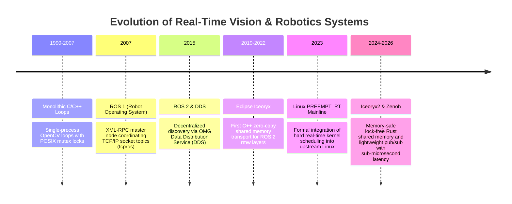
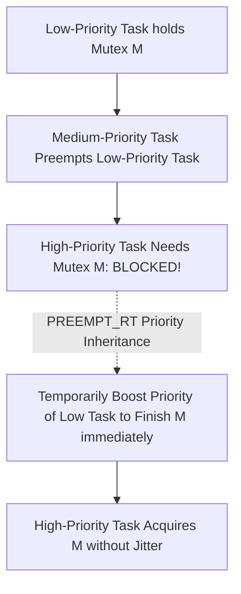

# 📜 Real-Time Systems: Historical Evolution & Paradigms

A didactic overview tracking how low-latency computer vision and robotics middleware evolved from monolithic loops and TCP sockets to ROS 1 master nodes, ROS 2 DDS architectures, kernel PREEMPT_RT deterministic scheduling, and lock-free shared-memory zero-copy IPC (Iceoryx2).

Related notes: [[topics/real-time-systems/00-real-time-systems-moc|Real-Time Systems MOC]], [[topics/gpu-deployment/00-gpu-deployment-moc|GPU Deployment MOC]].

---

## 1. Evolution Timeline: From Monolithic Loops to Iceoryx2 Zero-Copy

---

## 2. Core Paradigm Breakthroughs Explained

### Breakthrough A: Hard vs. Soft Real-Time Guarantees
- **Soft Real-Time**: Missing a deadline degrades performance (e.g. dropping a frame in a video stream causes minor visual stuttering).
- **Hard Real-Time**: Missing a single deadline constitutes catastrophic system failure (e.g. an autonomous vehicle failing to issue an emergency braking command within 10 ms crashes into an obstacle).

Traditional Linux is general-purpose, optimizing for **average throughput** rather than bounded worst-case latency. Standard kernel locks can stall an application thread arbitrarily.

---

### Breakthrough B: Linux PREEMPT_RT (Deterministic Kernel Scheduling)
The PREEMPT_RT kernel patch transforms the standard Linux kernel into a hard real-time operating system:
1. **Threaded Interrupt Handlers**: Hardware interrupts run as preemptible kernel threads with real-time priorities (`SCHED_FIFO` / `SCHED_RR`).
2. **Priority Inheritance Mutexes**: Prevents **Priority Inversion** (where a low-priority thread holding a lock blocks a high-priority thread because an intermediate thread preempts the low-priority task).

---

### Breakthrough C: The Shared-Memory Zero-Copy Revolution (Iceoryx2)
Standard network-based middleware (TCP, UDP, DDS) serializes data into packet bytes, copies them across the Linux network stack, and deserializes them on the receiving side.

Iceoryx2 replaces serialization with **pointer exchange**:
- Camera drivers stream raw 4K frames directly into physical shared memory pages (`/dev/shm`).
- Downstream AI perception models read from the exact same memory address with zero copies.
- Latency drops from **15 ms to under 0.8 microseconds**, completely independent of payload size.
