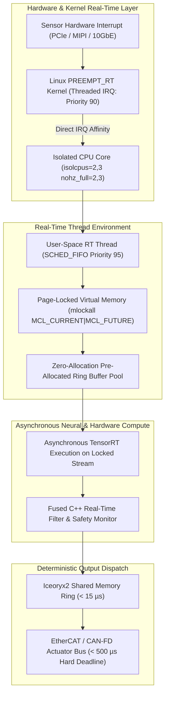

# 🛠️ Real-Time Systems: Production Pipeline, Traps & Workarounds

A practitioner's guide to eliminating latency jitter, configuring Linux `PREEMPT_RT` real-time kernels, isolating CPU cores, locking memory pages, and achieving sub-millisecond determinism for robotic control and autonomous vision.

Related notes: [[topics/real-time-systems/00-real-time-systems-moc|Real-Time Systems MOC]], [[topics/gpu-deployment/02-production-pipeline-and-workarounds|GPU Deployment Playbook]], [[topics/fpga-deployment/02-production-pipeline-and-workarounds|FPGA Deployment Playbook]].

---

## 1. Zero-Jitter Real-Time Ingestion Architecture

Standard Linux distributions prioritize average system throughput over deterministic execution. Kernel interrupt handling, demand-paged virtual memory, dynamic power states, and task scheduling can stall critical vision threads for tens of milliseconds.

Production real-time architectures combine the **Linux `PREEMPT_RT` patchset**, **CPU core isolation (`isolcpus`, `nohz_full`)**, **POSIX real-time thread scheduling (`SCHED_FIFO`)**, and **zero-copy shared memory IPC (`Iceoryx2`)** to create a zero-allocation, deterministic execution pipeline.



### Real-Time Process Memory Layout
To eliminate all runtime page faults, real-time vision processes must pre-fault and lock all virtual memory into physical RAM at startup:

```
+--------------------------------------------------------------------------------+
| Pinned Physical Address Space (mlockall locked)                                |
+--------------------------------------------------------------------------------+
| Static Stack Memory: Pre-faulted 8 MB (Thread Stack)                           |
+--------------------------------------------------------------------------------+
| Pre-Allocated Zero-Copy Frame Ring Buffer Pool (Static Slices)                 |
+--------------------------------------------------------------------------------+
| Pinned CUDA Host Buffers: cudaHostAllocMapped                                  |
+--------------------------------------------------------------------------------+
| Iceoryx2 Lockless Shared Memory Segment (/dev/shm)                             |
+--------------------------------------------------------------------------------+
```

---

## 2. Mathematical Foundations: Response Time Analysis & Scheduling Jitter

### Response Time Analysis (RTA) for Fixed-Priority Preemptive Scheduling
For a set of periodic real-time tasks $\tau_i = (C_i, T_i, D_i)$ where $C_i$ is worst-case computation time, $T_i$ is period, and $D_i \le T_i$ is relative deadline, the worst-case response time $R_i$ is the smallest fixed point satisfying:

$$R_i^{(0)} = C_i$$

$$R_i^{(k+1)} = C_i + \sum_{j \in \text{hp}(i)} \left\lceil \frac{R_i^{(k)}}{T_j} \right\rceil C_j$$

where $\text{hp}(i)$ denotes the set of tasks with higher priority than $\tau_i$. A system is strictly schedulable if and only if $\forall i, R_i \le D_i$.

### Latency Jitter Quantification
Cyclic scheduling jitter $J$ measures deviations from the target period $T_{\text{target}}$:

$$\boxed{J = |t_{\text{actual}} - t_{\text{target}}|}$$

The worst-case execution time bound $T_{\text{WCET}}$ across the entire pipeline is:

$$T_{\text{WCET}} = T_{\text{readout}} + T_{\text{DMA}} + T_{\text{inference}} + T_{\text{postproc}} + T_{\text{IPC}} + J_{\text{kernel}}$$

---

## 3. Deterministic End-to-End Latency Budget Table

The table below outlines worst-case execution times (WCET) across three real-time industrial profiles.

| Pipeline Stage | Hard Real-Time Robotics (1000 Hz / 1.0 ms) | Autonomous Safety Perception (100 Hz / 10.0 ms) | Inline Optical Metrology (30 Hz / 33.3 ms) | Determinism Mechanism |
| :--- | :--- | :--- | :--- | :--- |
| **Sensor IRQ to User-Space Wakeup** | $0.015\,\text{ms}$ ($15\,\mu\text{s}$) | $0.025\,\text{ms}$ ($25\,\mu\text{s}$) | $0.050\,\text{ms}$ | Threaded IRQ `SCHED_FIFO` prio 90 |
| **Zero-Copy DMA Ingestion** | $0.040\,\text{ms}$ | $0.350\,\text{ms}$ | $1.200\,\text{ms}$ | Page-locked HugeTLB memory |
| **TensorRT Async Inference** | $0.650\,\text{ms}$ (Nano QNN) | $5.200\,\text{ms}$ (YOLOv12s INT8) | $18.500\,\text{ms}$ (ViT-Base FP16) | Locked GPU clock + CUDA Graph |
| **Safety Interceptor / CBF Filter** | $0.035\,\text{ms}$ | $0.150\,\text{ms}$ | $0.450\,\text{ms}$ | Real-time OSQP quadratic program |
| **Zero-Copy IPC Serialization** | $0.010\,\text{ms}$ ($10\,\mu\text{s}$) | $0.020\,\text{ms}$ ($20\,\mu\text{s}$) | $0.050\,\text{ms}$ | Iceoryx2 lockless shared memory |
| **Fieldbus Actuation Dispatch** | $0.050\,\text{ms}$ | $0.100\,\text{ms}$ | $0.200\,\text{ms}$ | EtherCAT DC distributed clock sync |
| **Total Pipeline WCET (p50 / p99.99)**| **$0.800\,\text{ms}$ / $0.890\,\text{ms}$** | **$5.845\,\text{ms}$ / $6.450\,\text{ms}$** | **$20.450\,\text{ms}$ / $22.100\,\text{ms}$** | Monitored via `cyclictest` |
| **Hard Real-Time Deadline** | $\le 1.000\,\text{ms}$ | $\le 10.000\,\text{ms}$ | $\le 33.333\,\text{ms}$ | Timing headroom $\ge 11\%$ |

---

## 4. Five Critical Production Edge Traps & Battle-Tested Workarounds

### Trap 1: CPU C-States & Dynamic Frequency Scaling Jitter
- **Failure Mode**: When isolated real-time CPU cores enter low-power sleep states (e.g., C1E, C6) during brief idle pauses between frames, waking back to full execution frequency takes $50$–$150\,\mu\text{s}$, introducing severe timing jitter.
- **Production Workaround**:
  Disable CPU idle states and lock frequency via Linux kernel boot arguments:
  ```bash
  # In /etc/default/grub
  GRUB_CMDLINE_LINUX_DEFAULT="isolcpus=2,3 nohz_full=2,3 rcu_nocbs=2,3 processor.max_cstate=0 intel_idle.max_cstate=0 cpufreq.default_governor=performance"
  ```

---

### Trap 2: Linux Major & Minor Page Fault Latency Spikes
- **Failure Mode**: Dynamic memory allocations (`malloc`, `new`, `std::vector::push_back`) in the real-time loop trigger minor page faults. If the system experiences memory pressure, the kernel swaps pages, causing a major page fault that stalls the real-time vision thread for $10$–$50\,\text{ms}$.
- **Production Workaround**:
  1. Call `mlockall(MCL_CURRENT | MCL_FUTURE)` during process initialization.
  2. Pre-fault the entire stack and heap by touching every byte of pre-allocated buffers before entering the cyclic control loop.

---

### Trap 3: Unbounded Priority Inversion on Shared Mutexes
- **Failure Mode**: A low-priority logging thread acquires a mutex on a shared buffer. A medium-priority worker thread preempts the logging thread. When the high-priority real-time perception thread requests the mutex, it is blocked indefinitely by the medium-priority thread.
- **Production Workaround**:
  Initialize all POSIX mutexes with the **Priority Inheritance Protocol**:
  ```cpp
  pthread_mutexattr_t attr;
  pthread_mutexattr_init(&attr);
  pthread_mutexattr_setprotocol(&attr, PTHREAD_PRIO_INHERIT);
  pthread_mutex_init(&mutex, &attr);
  ```

---

### Trap 4: Floating-Point Denormal Number CPU Stalls
- **Failure Mode**: When neural activations or filter states decay toward zero ($|x| < 1.175 \times 10^{-38}$ in IEEE-754 FP32), standard x86/ARM CPU ALUs switch from hardware execution to microcode trap emulation, increasing instruction latency by up to $100\times$.
- **Production Workaround**:
  Enable Flush-to-Zero (FTZ) and Denormals-Are-Zero (DAZ) in hardware control registers:
  ```cpp
  #include <xmmintrin.h>
  #include <pmmintrin.h>

  // Enable FTZ and DAZ on CPU core
  _MM_SET_FLUSH_ZERO_MODE(_MM_FLUSH_ZERO_ON);
  _MM_SET_DENORMALS_ZERO_MODE(_MM_DENORMALS_ZERO_ON);
  ```

---

### Trap 5: Babbling Idiot Sensor Interrupt Storms
- **Failure Mode**: A damaged camera or optical transceiver enters a faulty oscillation state, firing millions of hardware interrupts per second, saturating CPU interrupt controllers and starving user-space real-time threads.
- **Production Workaround**:
  1. Bind sensor interrupts to dedicated non-isolated housekeeping CPU cores via `/proc/irq/<IRQ_NUM>/smp_affinity`.
  2. Implement hardware rate-limiting watchdogs in the PREEMPT_RT threaded interrupt handler.

---

## 5. Concrete Runnable Implementation Blueprint

The production-grade C++20 snippet below demonstrates complete Linux PREEMPT_RT thread setup, memory page locking, core pinning, priority inheritance, and high-resolution periodic execution with microsecond jitter profiling.

```cpp
#include <iostream>
#include <vector>
#include <chrono>
#include <thread>
#include <cmath>
#include <cstring>
#include <sys/mman.h>
#include <pthread.h>
#include <sched.h>
#include <xmmintrin.h>
#include <pmmintrin.h>

#define STACK_PREFAULT_SIZE (8 * 1024 * 1024) // 8 MB pre-faulted stack

void PrefaultStack() {
    volatile char buffer[STACK_PREFAULT_SIZE];
    std::memset((void*)buffer, 0, sizeof(buffer));
}

class RealTimePeriodicWorker {
private:
    int core_id_;
    int priority_;
    uint64_t period_ns_;
    bool running_ = false;
    std::thread thread_;

    void ThreadLoop() {
        // 1. Lock Memory Pages
        if (mlockall(MCL_CURRENT | MCL_FUTURE) != 0) {
            std::cerr << "Warning: Failed to lock memory pages (need CAP_SYS_NICE or root)" << std::endl;
        }

        // 2. Pre-fault Stack & Enable FTZ/DAZ
        PrefaultStack();
        _MM_SET_FLUSH_ZERO_MODE(_MM_FLUSH_ZERO_ON);
        _MM_SET_DENORMALS_ZERO_MODE(_MM_DENORMALS_ZERO_ON);

        // 3. Set CPU Core Affinity
        cpu_set_t cpuset;
        CPU_ZERO(&cpuset);
        CPU_SET(core_id_, &cpuset);
        pthread_setaffinity_np(pthread_self(), sizeof(cpu_set_t), &cpuset);

        // 4. Set Real-Time SCHED_FIFO Priority
        struct sched_param param;
        param.sched_priority = priority_;
        pthread_setschedparam(pthread_self(), SCHED_FIFO, &param);

        // 5. Periodic Monotonic Execution Loop
        struct timespec next_period;
        clock_gettime(CLOCK_MONOTONIC, &next_period);

        uint64_t max_jitter_ns = 0;
        int iteration = 0;

        while (running_ && iteration < 1000) {
            // Add fixed period to target wakeup time
            next_period.tv_nsec += period_ns_;
            while (next_period.tv_nsec >= 1000000000) {
                next_period.tv_nsec -= 1000000000;
                next_period.tv_sec += 1;
            }

            // High-resolution absolute sleep
            clock_nanosleep(CLOCK_MONOTONIC, TIMER_ABSTIME, &next_period, NULL);

            // Calculate Jitter
            struct timespec now;
            clock_gettime(CLOCK_MONOTONIC, &now);
            int64_t diff_ns = (now.tv_sec - next_period.tv_sec) * 1000000000LL + (now.tv_nsec - next_period.tv_nsec);
            uint64_t jitter = std::abs(diff_ns);
            if (jitter > max_jitter_ns) max_jitter_ns = jitter;

            // Simulated Real-Time Vision Workload (Zero-Allocation)
            volatile double dummy = 0.0;
            for (int k = 0; k < 1000; ++k) dummy += std::sin(k * 0.01);

            iteration++;
        }

        std::cout << "[RT Thread] Completed 1000 cycles on Core " << core_id_
                  << " | Max Observed Jitter: " << (max_jitter_ns / 1000.0) << " us" << std::endl;
    }

public:
    RealTimePeriodicWorker(int core, int priority, uint64_t period_us)
        : core_id_(core), priority_(priority), period_ns_(period_us * 1000) {}

    void Start() {
        running_ = true;
        thread_ = std::thread(&RealTimePeriodicWorker::ThreadLoop, this);
    }

    void Stop() {
        running_ = false;
        if (thread_.joinable()) thread_.join();
    }
};

int main() {
    std::cout << "[Init] Starting PREEMPT_RT Periodic Worker (1 kHz / 1000 us loop)..." << std::endl;
    RealTimePeriodicWorker worker(0, 80, 1000); // Core 0, Prio 80, 1000us period
    worker.Start();
    std::this_thread::sleep_for(std::chrono::milliseconds(1200));
    worker.Stop();
    return 0;
}
```

---

## 6. Summary & Real-Time Deployment Checklist

1. **Kernel Configuration**: Deploy Linux with the `PREEMPT_RT` patchset enabled (`CONFIG_PREEMPT_RT=y`).
2. **Memory Page Pinning**: Always execute `mlockall(MCL_CURRENT | MCL_FUTURE)` and pre-fault memory pools to prevent page faults.
3. **Core Isolation**: Isolate dedicated cores using `isolcpus` and `nohz_full` to keep user-space vision threads unhampered by OS housekeeping.
4. **Denormal Suppression**: Set FTZ and DAZ CPU flags to eliminate floating-point microcode emulation stalls.
