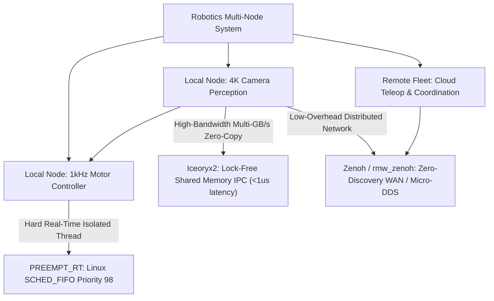

# ⏱️ Real-Time Systems: Preemption, Iceoryx2/Zenoh & Open Frontiers

A deep systems analysis of Linux `PREEMPT_RT` determinism, lock-free zero-copy IPC (`Iceoryx2`), next-generation robot middleware (`Zenoh` / `rmw_zenoh`), and unsolved scheduling interference bottlenecks in real-time robotic systems.

Related notes: [[topics/real-time-systems/00-real-time-systems-moc|Real-Time Systems MOC]], [[architectures/hardware-and-acceleration-runtimes/iceoryx2-and-zenoh|Iceoryx2 & Zenoh Deep-Dive]].

---

## 1. The Modern Real-Time Robotics Middleware Matrix (2025–2026)

Production robotics has shifted from relying solely on CycloneDDS/FastDDS to a decoupled, heterogeneous transport architecture:

### Transport Layer Comparison
| Protocol | Data Plane Mechanism | Discovery Mechanism | Typical Latency | Jitter Variance ($\sigma$) | Best-Fit Domain |
| :--- | :--- | :--- | :--- | :--- | :--- |
| **Traditional DDS (FastDDS)** | UDP / Shared Memory Hybrid | Multicast SPDP | $250-800\mu\text{s}$ | High ($\pm 150\mu\text{s}$) | Standard ROS 2 default setups |
| **Iceoryx2** | Lock-free POSIX Shared Memory | File-descriptor polling | **$<1\mu\text{s}$** | **Near Zero ($<\pm 0.05\mu\text{s}$)** | Local 4K video frames, point clouds |
| **Zenoh (`rmw_zenoh`)** | Pipelined TCP/QUIC/UDP | Peer-to-peer or Broker | $80-150\mu\text{s}$ | Low ($\pm 10\mu\text{s}$) | Heterogeneous fleet, WAN, MCU nodes |

---

## 2. PREEMPT_RT Mechanics: Why It Is Not a "Magic Bullet"

The `PREEMPT_RT` kernel patch converts all in-kernel spinlocks to preemptible sleeping mutexes, allowing high-priority user-space threads (`SCHED_FIFO` or `SCHED_DEADLINE`) to interrupt kernel execution instantly.

### The Three Critical Invariants for Real-Time Determinism:
1. **Zero Dynamic Allocation in Hot Path**: Invoking `malloc()` or `new` triggers the glibc heap lock and potential page faults ($>10\text{ ms}$ stalls). All memory buffers must be pre-allocated and pinned via `mlockall(MCL_CURRENT | MCL_FUTURE)`.
2. **Dedicated CPU Affinity (Core Isolation)**: Real-time threads must be pinned to isolated cores (`isolcpus=2,3` kernel boot parameter) to prevent Linux CFS scheduler load balancers from migrating threads.
3. **Priority Inversion Avoidance**: Ensuring that any low-priority thread holding a shared resource dynamically inherits the high-priority thread's priority (`pthread_mutexattr_setprotocol(&attr, PTHREAD_PRIO_INHERIT)`).

---

## 3. Current Open Problems in Real-Time Robotics Systems

### 🔴 Problem 1: Non-Preemptive ROS 2 Executor "Task Interference"
- **The Failure Mode**: In the standard `SingleThreadedExecutor` or `MultiThreadedExecutor` in ROS 2, long-running callbacks (such as deep learning inference taking 35 ms) execute non-preemptively.
- **Consequence**: When an urgent safety callback arrives (e.g., E-Stop lidar brake message), it is queued behind the heavy AI callback, introducing **30–50 ms latency lag** and causing collisions.
- **Recent Frontier Solutions (2025–2026)**:
  - **Priority-Driven Preemptive Executors (e.g., PiCAS)**: Decoupling callbacks into distinct priority levels with budget enforcement.

---

### 🔴 Problem 2: Heterogeneous GPU/NPU Compute Latency Jitter
- **The Failure Mode**: CPU tasks run deterministically under `PREEMPT_RT`, but offloading inference to an NVIDIA Jetson GPU or NPU introduces non-deterministic driver-level synchronization locks.
- **Consequence**: An inference kernel that takes 10 ms on average can randomly spike to 45 ms due to PCIe bus arbitration and GPU context switching.
- **Recent Frontier Solutions**:
  - **Asynchronous Double-Buffered Ring Queues with Fallback Deadlines**: If GPU inference does not return within its 15 ms deadline, the control loop discards the frame and falls back to a fast predictive Kalman filter estimate.

---

### 🔴 Problem 3: Sensor Alignment "Time-Stamp Jitter Tax"
- **The Failure Mode**: Fusing a 10 Hz LiDAR with a 30 Hz Camera and a 200 Hz IMU requires exact temporal alignment. Discrepancies in PTP (IEEE 1588) hardware clock synchronization create microsecond timestamp drifts.
- **Active Research Direction**:
  - Hardware-triggered shutter synchronization via physical GPIO pulses driven directly by the IMU micro-controller.
