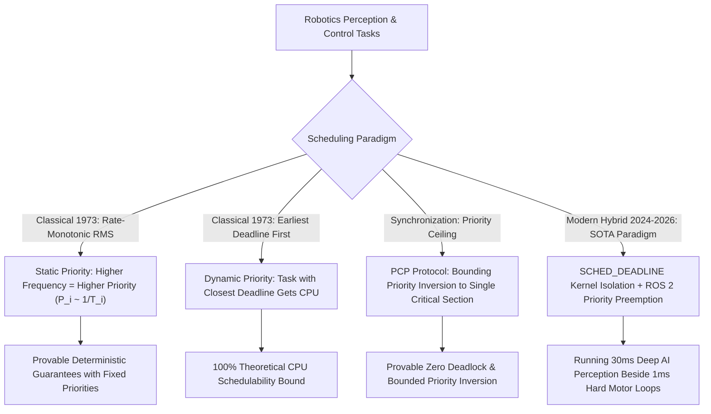

# 📐 Real-Time Systems: Classical Scheduling, Priority Inversion & Hybrids

A deep mathematical treatment of classical real-time scheduling theory (Rate-Monotonic Scheduling - RMS, Earliest Deadline First - EDF), formal schedulability tests (Liu & Layland bounds), synchronization protocols (Priority Ceiling Protocol - PCP), and modern hybrid ROS 2 / PREEMPT_RT architectures.

Related notes: [[topics/real-time-systems/00-real-time-systems-moc|Real-Time Systems MOC]], [[topics/real-time-systems/03-preemption-and-open-problems|Preemption & Open Frontiers]].

---

## 1. Classical Hard Real-Time Scheduling vs. Asynchronous AI Pipelines

### Classical Real-Time Scheduling Paradigms Compared
| Algorithm | Priority Assignment | Maximum Schedulable Utilization $U$ | Overhead | Overload Behavior | Best Application |
| :--- | :--- | :--- | :--- | :--- | :--- |
| **Rate-Monotonic (RMS)** | Static (Proportional to rate $1/T$) | $U \le n(2^{1/n} - 1) \approx 69.3\%$ | **Minimal (Fixed table)** | Predictable (Lowest priority tasks drop) | Avionics, automotive safety microcontrollers |
| **Deadline-Monotonic (DMS)**| Static (Proportional to deadline $1/D$) | Exact Response-Time Analysis | Minimal | Predictable | Systems where deadlines precede periods ($D_i < T_i$) |
| **Earliest Deadline First (EDF)**| Dynamic (Closest absolute deadline) | **$U \le 100\%$** | High (Priority heap maintenance) | Domino-effect cascade failure under overload | Multimedia streaming, soft real-time video |
| **Hybrid (PREEMPT_RT + PiCAS)**| Static Core Pinning + Dynamic Budget | Multi-core Partitioned ($>85\%$) | Low (Hardware isolation) | **Graceful AI Degradation (Fallback states)**| Autonomous driving and industrial robotics |

---

## 2. Mathematical Formulations: Schedulability Bounds & Priority Inversion

### 1. Liu & Layland Schedulability Bound for RMS (1973):
For $n$ independent periodic tasks with execution times $C_i$ and periods $T_i$, total processor utilization is:
$$U = \sum_{i=1}^n \frac{C_i}{T_i}$$
A set of tasks is **guaranteed schedulable** under RMS if total utilization satisfies the sufficient condition:
$$U \le n \left( 2^{1/n} - 1 \right)$$
As $n \to \infty$, the utilization bound asymptotically converges to:
$$\lim_{n \to \infty} n \left( 2^{1/n} - 1 \right) = \ln(2) \approx 0.69315 \quad (69.3\%)$$
If utilization exceeds this bound, schedulability must be tested using exact **Response-Time Analysis (RTA)**:
$$R_i^{(k+1)} = C_i + \sum_{j \in \text{hp}(i)} \left\lceil \frac{R_i^{(k)}}{T_j} \right\rceil C_j \quad \text{until } R_i^{(k+1)} = R_i^{(k)} \le D_i$$

### 2. Mars Pathfinder Priority Inversion Problem & Solution (Sha, Rajkumar, Lehoczky):
- **The Disaster**: A low-priority meteorological task acquired a shared information bus mutex. A high-priority attitude control task preempted, then blocked on the mutex. A medium-priority communications task preempted the low-priority task, causing the high-priority thread to starve and triggering a watchdog system reset.
- **The Priority Ceiling Protocol (PCP) Proof**:
  Every shared resource is assigned a priority ceiling equal to the highest priority task that may lock it. A task can only acquire a lock if its priority is strictly higher than the ceilings of all locks currently held by other tasks.
  $$\text{Maximum Inversion Blocking Time: } B_i \le \max_{k \in \text{resources}} \{ C_{j, k} \}$$
  This mathematically guarantees:
  1. **Zero Deadlocks** (circular wait condition is impossible).
  2. **Bounded Priority Inversion**: A high-priority task is blocked at most **once** by a lower-priority task for the duration of a single critical section.

---

## 3. Production Hybrid Pattern: Partitioned PREEMPT_RT Multi-Rate Clock Isolation

In robotics systems combining a heavy Vision-Language-Action (VLA) model running at $10\text{ Hz}$ with an EtherCAT motor controller running at $1000\text{ Hz}$:

### The Production Real-Time Isolation Architecture:
1. **Physical Core Partitioning**: Use Linux kernel boot arguments `isolcpus=2,3 nohz_full=2,3 rcu_nocbs=2,3` to strip timer interrupts and OS background daemons from cores 2 and 3.
2. **Motor Thread Configuration**: Run the $1000\text{ Hz}$ loop on isolated Core 2 using POSIX real-time FIFO scheduling (`SCHED_FIFO`, priority 98), with pinned pre-allocated memory (`mlockall`).
3. **AI Worker Thread Configuration**: Run the heavy PyTorch / TensorRT inference loop on cores 0 and 1 using standard Linux CFS scheduling (`SCHED_OTHER`) or soft-deadline budget enforcement (`SCHED_DEADLINE`).
4. **Lock-Free Asynchronous Boundary**: Bridge the $10\text{ Hz}$ trajectory planner with the $1000\text{ Hz}$ motor loop via an **Atomic Double-Buffered Ring Buffer** (or Iceoryx2 shared memory), guaranteeing that the motor loop never waits on an AI lock.
