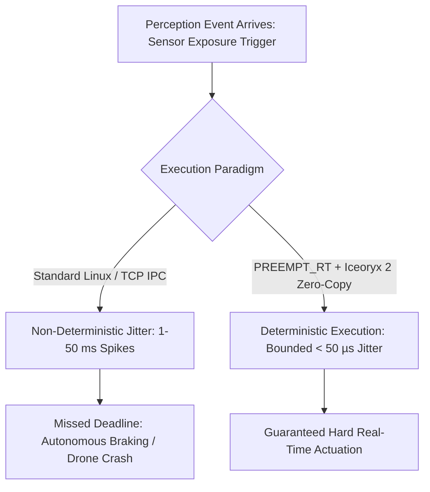
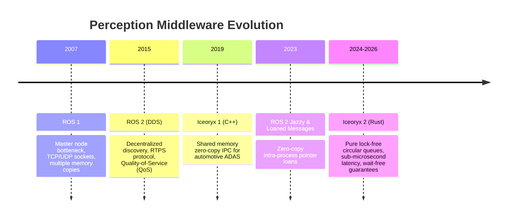

# Real-Time Systems: Historical Evolution & Zero-Copy Middleware

A didactic guide dissecting deterministic low-latency software engineering: examining operating system scheduling jitter, lock-free ring buffers, the evolution of robotics middleware (ROS 1 to ROS 2 Jazzy), and true zero-copy shared memory IPC (Iceoryx 2).

Related notes: [[topics/real-time-systems/README|Real-Time Systems Playbook]], [[topics/gpu-deployment/README|GPU Deployment]].

---

## 1. Hard vs Soft Real-Time: Determinism Over Raw Speed

A common fallacy is confusing **low latency** with **real-time**:
- **High Speed**: Processing a frame in 2ms on average, but occasionally taking 80ms due to an OS page fault or garbage collection pause.
- **Real-Time**: Guaranteed processing in $\le 10\text{ms}$ on *every single frame*, with bounded Worst-Case Execution Time (WCET) and sub-microsecond jitter.



---

## 2. The Evolution of Robotics Middleware: ROS 1 to ROS 2 & Iceoryx 2



### Why ROS 1 Failed Real-Time Demands:
1. **TCP Serialization Overhead**: To send a $1920 \times 1080$ RGB frame (6.2 MB) from camera driver to detector node, ROS 1 serialized the message, copied it into kernel socket buffers, and copied it back into user space. At 60 FPS, this saturates CPU memory bandwidth with copies alone (~750 MB/s).
2. **Global Master Node**: A single point of failure and bottleneck during node initialization.

### The Iceoryx 2 Zero-Copy Mechanism:
Iceoryx 2 replaces network sockets and POSIX mutexes with **lock-free shared memory architectures**:

```mermaid
flowchart LR
    subgraph Producer (Camera Ingestion)
        Loan[Request Memory Chunk Loan from Shm Pool] --> Write[Directly DMA Camera Pixels into Chunk]
        Write --> Send[Publish Pointer Address into Lock-Free Queue]
    end
    subgraph Zero-Copy Shm Pool
        Chunk[(Pre-Allocated Pinned Shared Memory Buffer)]
    end
    subgraph Consumer (TensorRT Worker)
        Receive[Read Pointer Address from Queue] --> Process[Feed Pointer Directly into GPU DMA]
        Process --> Release[Release Chunk Back to Shm Pool]
    end
    Loan -.-> Chunk
    Process -.-> Chunk
```
- **Zero Copies**: The pixel payload never moves. Only a 64-bit memory pointer is passed through an atomic lock-free queue.
- **Deterministic**: Incurring **$<0.82\text{ µs}$** transfer latency regardless of whether the message is a 10-byte timestamp or a 100 MB point cloud.
