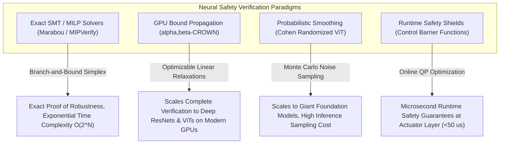

# 📜 Safety Verification & Robustness: Historical Evolution & Paradigms

## 1. The Breakdown of Empirical Testing in Deep Learning

In traditional software engineering, test suites achieving 100% code coverage offer high reliability guarantees. In deep neural networks, however, millions of continuous non-linear parameters mean that achieving 100% accuracy across a test split provides **zero guarantees** regarding neighboring perturbations:

$$\exists\, \delta \text{ with } \|\delta\|_\infty \le \varepsilon \quad \text{s.t.} \quad f(x + \delta) \ne f(x)$$

Adversarial attacks (FGSM, PGD, AutoAttack) proved that imperceptible noise patterns could cause high-confidence vision misclassifications. Szegedy et al. (2014) first demonstrated that an $\ell_\infty$ perturbation of $\varepsilon = 8/255$ (invisible to humans) reliably fools GoogLeNet on ImageNet. The same pixel-level vulnerability was later shown to transfer physically: printed adversarial patches on stop signs caused a Mobileye-class detector to miss 100% of stop sign detections (Eykholt et al., 2018).

The fundamental insufficiency: no finite test set over a continuous input space can provide coverage guarantees. A model with 99.9% empirical accuracy over 100k test images still has $10^{11}$ untested perturbation directions per image.

## 2. The Formal Verification Revolution (2018–2026)

To overcome empirical limitations, computer scientists applied formal methods from program verification to neural networks:

### 2.1 SMT-Based Complete Verifiers (2017–2020)

**Reluplex** (Katz et al., 2017) and **Marabou** (Katz et al., 2019) encoded piece-wise linear ReLU activations into Satisfiability Modulo Theories (SMT) queries. Given a network $f$ and an input region $\mathcal{X} = \{x : \|x - x_0\|_\infty \le \varepsilon\}$, they answer:

*"Does there exist $x \in \mathcal{X}$ such that $\arg\max f(x) \ne c_0$?"*

- **Complete**: Either proves safety (UNSAT) or provides a concrete counterexample (SAT).
- **Limitation**: Runtime scales exponentially with the number of ReLU neurons. A 6-layer, 100-neuron network (toy scale) takes hours; ResNet-50 (25M parameters) is computationally infeasible.

### 2.2 Bound Propagation & Branch-and-Bound: $\alpha,\beta$-CROWN (2020–2026)

**$\alpha,\beta$-CROWN** (Zhang et al., NIPS 2018 CROWN; Xu et al., NeurIPS 2021 $\beta$-CROWN; Wang et al., 2021 $\alpha$-CROWN) overcomes the scalability wall via two key ideas:

1. **Linear Relaxation ($\alpha$-CROWN)**: Replace each non-linear activation with optimizable linear upper and lower bounds. For a ReLU neuron with pre-activation $z \in [l, u]$:
   $$\alpha \cdot z \le \text{ReLU}(z) \le \frac{u}{u-l}(z - l), \quad \alpha \in [0, 1]$$
   Optimize $\alpha$ per neuron via gradient ascent on the dual verification objective. Runs in $\mathcal{O}(\text{forward passes})$ — GPU-parallelizable.

2. **Branch-and-Bound ($\beta$-CROWN)**: When linear relaxation gives an inconclusive bound, split unstable ReLU neurons into two sub-problems (active/inactive), propagating tighter bounds in each sub-domain. $\beta$ parameters encode sub-domain dual variables.

**$\alpha,\beta$-CROWN** has been **VNN-COMP #1 Overall Winner every year from 2021 through 2025**, verifying networks with millions of parameters at millisecond-to-second timescales.

### 2.3 MILP Formulation for Exact Verification

An alternative complete approach encodes the neural network as a **Mixed Integer Linear Program (MILP)**. For each ReLU neuron $i$ with pre-activation $z_i$ and output $\hat{z}_i$:

$$\hat{z}_i \ge z_i, \quad \hat{z}_i \ge 0, \quad \hat{z}_i \le z_i - l_i(1 - b_i), \quad \hat{z}_i \le u_i \cdot b_i$$

where $b_i \in \{0, 1\}$ is a binary variable encoding whether the ReLU is active ($b_i = 1$) or inactive ($b_i = 0$), and $l_i, u_i$ are pre-computed bounds.

The MILP formulation is **NP-hard** (requires solving exponentially many LP relaxations in the worst case), but modern MILP solvers (Gurobi, HiGHS) leverage warm-starting and cutting-plane algorithms to verify small-to-medium networks exactly. Used in safety-critical verification pipelines where **complete proofs are legally required** (e.g., IEC 61508 SIL-3 certification artifacts).

## 3. Control Barrier Functions: Runtime Safety at the Actuation Layer

Formal verifiers certify offline properties of perception networks. A complementary approach provides **online safety guarantees at the control layer**, regardless of what the perception model outputs.

**Control Barrier Functions (CBFs)** (Ames et al., 2014) provide a mathematical framework to guarantee forward invariance of a safe set $\mathcal{C} = \{x : h(x) \ge 0\}$. For a control-affine system $\dot{x} = f(x) + g(x)u$, the CBF condition:

$$\dot{h}(x, u) = \nabla h(x) \cdot (f(x) + g(x)u) \ge -\alpha h(x)$$

guarantees that if the system starts inside $\mathcal{C}$, it never leaves. A real-time **Quadratic Program (QP)** enforces this as the minimal deviation from any proposed control action $u_{\text{deep}}$:

$$u^* = \underset{u}{\arg\min}\; \tfrac{1}{2}\|u - u_{\text{deep}}\|_2^2 \quad \text{s.t.} \; L_f h + L_g h \cdot u + \alpha h \ge 0$$

QP solve time on an embedded ARM Cortex-A78: **< 50 µs** — compatible with 20 kHz actuation loops.

## 4. Regulatory Maturation: ISO 26262, IEC 61508, ISO 21448 & ISO/PAS 8800

### 4.1 ISO 26262 (2011, rev. 2018): Automotive Functional Safety

Defines **Automotive Safety Integrity Levels (ASIL)** A–D based on exposure, controllability, and severity:

| ASIL Level | Probabilistic Metric (PMHF) | Typical Application |
|:-----------|:---------------------------|:--------------------|
| ASIL-A | $< 10^{-6}$ failures/hour | Windshield wiper timing |
| ASIL-B | $< 10^{-7}$ failures/hour | Park assist |
| ASIL-C | $< 10^{-8}$ failures/hour | Emergency brake assist |
| **ASIL-D** | $< 10^{-9}$ failures/hour | Autonomous emergency braking (AEB), steer-by-wire |

ASIL-D requires hardware redundancy, systematic capability SC3 (most stringent software development process), and formal safety cases. No pure neural network perception system has achieved ASIL-D certification for unrestricted open-domain operation as of 2026.

### 4.2 IEC 61508: Functional Safety of E/E/PE Systems

The industrial functional safety standard (robotics, process control, medical devices) defines **Safety Integrity Levels (SIL)** 1–4:

- **SIL-3**: $< 10^{-7}$ dangerous failures/hour (probability of failure on demand: $10^{-4}$ to $10^{-3}$)
- **SIL-4**: $< 10^{-8}$ dangerous failures/hour (highest level, nuclear / critical medical)

IEC 61508:2010 Part 3 (software) requires formal specification and, for SIL-3/4, semi-formal or formal verification methods. This creates a direct requirement for MILP or bound-propagation verification artifacts in certified AI-assisted industrial systems.

### 4.3 ISO 21448 (SOTIF) & ISO/PAS 8800 (2024)

- **ISO 21448** (Safety Of The Intended Functionality): Addresses performance insufficiencies in AI perception — not hardware failures, but cases where the system works as designed but is nonetheless unsafe due to OOD inputs or distributional mismatches.
- **ISO/PAS 8800** (2024): The first unified standard bridging ISO 26262 and ISO 21448 specifically for AI-based automotive systems, introducing concepts of **Operational Design Domain (ODD)** monitoring, anomaly detection at inference time, and requirements for adversarial robustness evaluation using AutoAttack-class tools.

---

## 5. Intensive Architectural Taxonomy: Convolutional vs Transformer vs Hybrid Sub-Modules

Safety verification, formal robustness certification, and runtime safety shielding have progressed from exponential SMT/MILP constraint solvers on toy feedforward networks to GPU-accelerated linear bound propagation ($\alpha,\beta$-CROWN), probabilistic randomized smoothing for vision transformers, and real-time Control Barrier Function (CBF) quadratic program filters.

### Comparative Sub-Module Architectural Matrix

| Model / System Name & Year | Architectural Paradigm | Backbone Sub-Module | Neck / Feature Aggregator | Encoder Sub-Module | Decoder / Head Sub-Module | Primary Bottleneck & Edge Suitability |
| :--- | :--- | :--- | :--- | :--- | :--- | :--- |
| **Reluplex / Marabou** (2017–2020) | SMT-Based Complete Verifier | Piecewise-Linear ReLU Convolutional / MLP Backbone | Simplex Tableau Variable Constraint Aggregator | SMT Branch-and-Bound Split Engine on Unstable ReLU Neurons | Exact Satisfiable (Counterexample) / Unsatisfiable (Certified Safe) Solver | **Exponential Branching Explosion**: Complete verification scaling is $\mathcal{O}(2^N)$ in the number of non-linear ReLU neurons; restricted to small networks ($<10^5$ neurons). |
| **$\alpha,\beta$-CROWN** (2020–2026) | GPU-Accelerated Branch-and-Bound | Arbitrary Vision Backbone (ResNet-18/50, ConvNeXt, ViT) | Optimizable Linear Bound Relaxation Slopes ($\alpha$) | GPU-Parallelized $\beta$-Domain Branch-and-Bound Tree Solver | Certified Output Lower & Upper Bounds ($[\underline{f}(x), \bar{f}(x)]$) | **GPU VRAM Branch Tree Bound**: World-champion complete/incomplete verifier (VNN-COMP SOTA); certifies millions of parameters in minutes on NVIDIA H100. |
| **MIPVerify / Gurobi MILP** (2018–2023) | Mixed-Integer Linear Program (MILP) | Fully Connected / Convolutional ReLU Network | Big-M Reformulation Linear Constraint Neck | Commercial Gurobi Branch-and-Cut Dual Simplex Solver | Exact Minimal Metric Adversarial Distortion Margin ($\epsilon^*$) | **Single-Thread CPU MILP Bound**: Provides exact, mathematically complete adversarial distance bounds; high execution time (hours per image). |
| **Randomized Smoothing (Cohen et al.)** (2019–2024) | Probabilistic Certified Classifier | Pretrained Base Classifier (ResNet-50 / ViT-B/16) | Gaussian Noise Sampling Generator ($\mathcal{N}(0, \sigma^2 \mathbf{I})$) | Monte Carlo Sample Accumulator ($N = 100{,}000$ passes) | Neyman-Pearson Statistical Certified $\mathcal{L}_2$ Robust Radius Head ($R$) | **Monte Carlo Throughput Bound**: Dimension-independent scalability; certifies arbitrary large models; $100\text{k}$ forward passes make online edge use challenging. |
| **Control Barrier Function Shield (CBF-QP)** (2020–2026) | Real-Time Runtime Safety Filter | Vision-Based Policy / 6-DoF Perception State Tracker | Continuous-Time Lie Derivative Jacobian Estimator ($\nabla h(x)$) | Embedded Quadratic Program (QP) Optimizer (OSQP / qpOASES) | Certified Safe Control Output ($u^*(t) = \arg\min \frac{1}{2}\|u - u_{\text{deep}}\|^2$) | **SRAM Optimization Compute Bound**: Guarantees forward invariance of safe state space ($\mathcal{C}$); executes in $<50\,\mu\text{s}$ on embedded ARM microcontrollers. |
| **AutoAttack / RobustBench** (2020–2026) | Standardized Empirical Robustness Suite | Standard & Adversarially Trained Vision Backbones | Multi-Target Step Size Optimization Neck | Ensemble of 4 Diverse Attacks (APGD-CE, APGD-DLR, FAB, Square) | Empirical Worst-Case Adversarial Robust Accuracy Score | **Black-Box Query Latency**: Gold-standard empirical vulnerability benchmark; parameter-free; exposes gradient masking and false security claims. |

### Didactic Architectural Trade-Off Analysis

#### 1. Inductive Bias of Empirical Testing vs. Formal Bound Propagation
Empirical adversarial evaluation (e.g. testing $10{,}000$ PGD attack steps) tests only isolated points on the input manifold $\mathcal{X}$. Because deep neural networks are continuous non-linear mappings with millions of parameters, zero empirical test failures provide **no theoretical guarantee** that an adversarial perturbation does not exist within an infinitesimal neighborhood:

$$B_\epsilon(x_0) = \{ x \mid \|x - x_0\|_p \le \epsilon \}$$

Formal verification replaces point evaluations with **Linear Bound Propagation (CROWN)**. Non-linear activations $\sigma(z)$ (e.g. ReLU, GELU) are enclosed between optimizable linear lower and upper bounding hyperplanes:

$$\underline{\alpha} (z - \underline{z}) + \sigma(\underline{z}) \le \sigma(z) \le \bar{\alpha} (z - \bar{z}) + \sigma(\bar{z})$$

Propagating these linear bounds backwards across all layers produces provable closed-form output bounds $[\underline{f}(x), \bar{f}(x)]$ that mathematically certify the absence of adversarial flip errors within the entire continuous input ball $B_\epsilon(x_0)$.

#### 2. Numerical Precision & Catastrophic Cancellation in Formal Solvers
- **Double Precision (FP64) in MILP**: Exact MILP solvers (Gurobi) require 64-bit floating-point precision. Slight numerical rounding errors ($10^{-9}$) in simplex pivot operations can misclassify an unstable ReLU boundary, invalidating a mathematical safety proof.
- **GPU FP32 Bound Propagation with Interval Arithmetic**: In $\alpha,\beta$-CROWN, intermediate lower and upper bounds are computed using parallelized FP32 matrix operations. To prevent floating-point rounding errors from violating soundness, outward interval rounding mode is enforced at the CUDA kernel level.

#### 3. Real-Time Deployment Friction: Offline Certification vs. Online Safety Shields
- **The Certification Scalability Wall**: Formally verifying a standard ResNet-50 against an $\mathcal{L}_\infty$ perturbation $\epsilon = 1/255$ requires several GPU-hours per image. Consequently, complete formal verification is primarily an **offline design-time compliance artifact** for ISO 26262 / ISO/PAS 8800 audits.
- **Online Safety via Control Barrier Functions (CBFs)**: For real-time physical systems (drones, autonomous vehicles), safety is enforced online at the control layer. A Control Barrier Function Quadratic Program (CBF-QP) accepts the unverified deep perception output $u_{\text{deep}}$ and projects it onto the provably safe control space:

  $$L_f h(x) + L_g h(x) u + \alpha(h(x)) \ge 0$$

  Executing in $<50\,\mu\text{s}$ on an embedded ARM microcontroller, the CBF shield overrides perception hallucinations in real time before unsafe physical actuation occurs.

---

Related notes: [[topics/safety-verification-and-robustness/00-safety-verification-and-robustness-moc|Safety Verification MOC]], [[topics/safety-verification-and-robustness/02-production-pipeline-and-workarounds|Production Pipeline & Workarounds]], [[topics/explainability-and-interpretability/00-explainability-and-interpretability-moc|Explainability MOC]].
