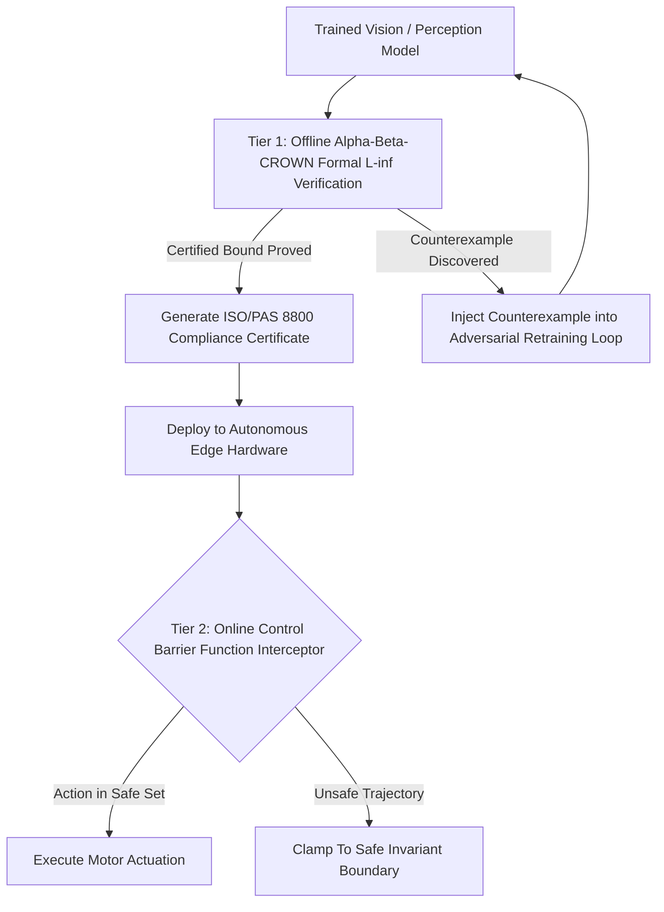

# 🛠️ Safety Verification & Robustness: Production Pipeline & Workarounds

## 1. Multi-Tiered Verification & Runtime Safety Architecture

## 2. Production Engineering Traps & Battle-Tested Workarounds

### Trap 1: The Exponential Scalability Wall of Complete Verifiers
- **The Issue**: Attempting to run complete branch-and-bound verification ($\alpha,\beta$-CROWN) on a multi-layer Transformer or large foundation model times out, rendering certification infeasible.
- **Battle-Tested Workaround**:
  - Partition the system into **High-Integrity vs. Low-Integrity domains**.
  - Let the unverified high-capacity model propose trajectories, but route all proposed actions through a compact, 3-layer neural or analytical **Control Barrier Function (CBF)** that *is* 100% mathematically verified.

### Trap 2: Gradient Masking in Empirical Adversarial Evaluation
- **The Issue**: Developers evaluate models using naive FGSM or standard PGD and report "adversarial robustness," unaware that the network learned non-differentiable or saturated activations that mask gradients without actually preventing attacks.
- **Battle-Tested Workaround**:
  - Always evaluate defenses using **AutoAttack (parameter-free ensemble)**, which integrates gradient-free attacks (Square Attack) and adaptive step-size solvers (APGD-CE, APGD-DLR).
