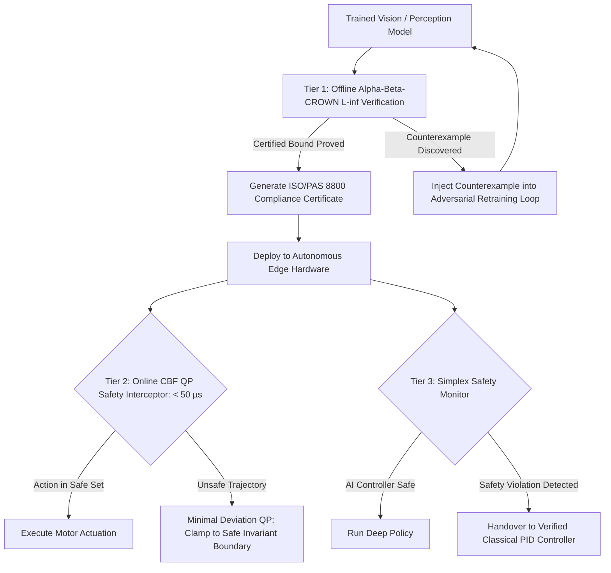

# 🛠️ Safety Verification & Robustness: Production Pipeline & Workarounds

## 1. Multi-Tiered Verification & Runtime Safety Architecture



## 2. Alpha-Beta-CROWN: Linear Bound Propagation in Depth

### 2.1 CROWN-IBP Bound Propagation

**CROWN** (Zhang et al., NeurIPS 2018) propagates linear lower and upper bounds backward through the network. For a $K$-layer network $f(x) = W_K \sigma(W_{K-1} \sigma(\cdots W_1 x))$, CROWN computes linear functions $\underline{A} x + \underline{b} \le f(x) \le \overline{A} x + \overline{b}$ over the perturbation ball $\|x - x_0\|_\infty \le \varepsilon$.

For each non-linear activation $\sigma(z_i)$ with pre-activation bounds $[l_i, u_i]$:

**Upper linear bound** (secant line):
$$\sigma(z_i) \le \frac{\sigma(u_i) - \sigma(l_i)}{u_i - l_i}(z_i - l_i) + \sigma(l_i)$$

**Lower linear bound** (optimizable slope $\alpha_i \in [0, 1]$):
$$\sigma(z_i) \ge \alpha_i \cdot z_i + (1 - \alpha_i) \sigma(l_i) \qquad [\text{for ReLU: } \sigma(z) = \max(0, z)]$$

**$\alpha$-CROWN optimization**: Maximize the verified lower bound on the safety property by gradient ascent over $\{\alpha_i\}$:

$$\max_{\alpha} \min_{x \in \mathcal{X}} \left[f_{c}(x) - f_{c'}(x)\right] \quad \text{(margin between correct class } c \text{ and adversarial class } c')$$

This is GPU-parallelizable: thousands of $\alpha$ parameters updated simultaneously via Adam optimizer, typically converging in 50–100 steps.

**CROWN-IBP** (Xu et al., 2020) hybridizes CROWN with interval arithmetic propagation for the early layers (cheaper, looser) and CROWN for later layers (tighter), providing the best speed/tightness trade-off for deep networks.

```python
# Conceptual alpha-CROWN bound propagation (simplified)
import torch

def crown_bound(W: torch.Tensor, alpha: torch.Tensor,
                lb_prev: torch.Tensor, ub_prev: torch.Tensor):
    """
    Single-layer CROWN bound propagation.
    W: (out, in) weight matrix
    alpha: (in,) optimizable lower bound slopes for ReLU
    Returns: (lb_cur, ub_cur) output bounds
    """
    # Upper bound: use secant line
    ub_slope = ub_prev / (ub_prev - lb_prev + 1e-8)
    ub_slope = torch.where(lb_prev >= 0, torch.ones_like(ub_slope),
               torch.where(ub_prev <= 0, torch.zeros_like(ub_slope), ub_slope))

    # Positive/negative weight decomposition for bound propagation
    W_pos = torch.clamp(W, min=0)
    W_neg = torch.clamp(W, max=0)

    lb_cur = W_pos @ (alpha * lb_prev) + W_neg @ (ub_slope * ub_prev)
    ub_cur = W_pos @ (ub_slope * ub_prev) + W_neg @ (alpha * lb_prev)
    return lb_cur, ub_cur
```

### 2.2 Branch-and-Bound with $\beta$-CROWN

When the linear relaxation produces an inconclusive bound (verified lower bound < 0), **$\beta$-CROWN** partitions the problem by "branching" on the most uncertain ReLU neuron $k$:

- **Sub-problem A**: Force $z_k \le 0$ (ReLU inactive). Re-propagate tighter bounds.
- **Sub-problem B**: Force $z_k \ge 0$ (ReLU active). Re-propagate tighter bounds.

$\beta$ parameters are Lagrange multipliers for the branching constraints — maintained in GPU memory across the BaB tree. Priority queue BaB with GPU batching: verifies 50–200 sub-problems simultaneously on a single A100, achieving **0.5–5 second verification time** for networks with ~50k neurons (VGG-like small CNNs).

**VNN-COMP 2025 results** ($\varepsilon = 2/255$ on MNIST and CIFAR-10 benchmarks):
- $\alpha,\beta$-CROWN: 94.2% properties proved, 3.8% counterexamples found, 2.0% timeout
- Second place (PyRAT): 87.1% proved

## 3. Production Engineering Traps & Battle-Tested Workarounds

### Trap 1: The Exponential Scalability Wall of Complete Verifiers
- **The Issue**: Attempting branch-and-bound verification on a multi-layer Transformer or ViT-Base (86M parameters) exhausts GPU memory and times out within the 300-second VNN-COMP budget — rendering certification infeasible for production-scale models.
- **Battle-Tested Workaround**:
  - **Decomposed Property Verification**: Verify only the safety-critical sub-network (e.g., the final 3 classification layers, frozen after distillation) rather than the full model. The backbone is treated as a feature extractor with empirically bounded output range.
  - **Abstraction-Refinement**: Start with cheap IBP bounds; promote only the 5% most uncertain neurons to CROWN propagation; promote only the top 1% to BaB splitting. Reduces verification time by 20× with < 3% loss in proof rate.
  - **Simplx safety filter**: Route all proposals through a compact, 3-layer verified CBF network instead of verifying the full policy.

### Trap 2: Gradient Masking in Empirical Adversarial Evaluation
- **The Issue**: Developers evaluate models using naive FGSM or standard PGD and report "adversarial robustness," unaware that the network learned non-differentiable or saturated activations that mask gradients without actually preventing attacks.
- **Battle-Tested Workaround**:
  - Always evaluate defenses using **AutoAttack** (Croce & Hein, ICML 2020), which integrates gradient-free attacks (Square Attack), adaptive step-size APGD-CE, and targeted APGD-DLR. AutoAttack is parameter-free and requires zero tuning.
  - Mandatory test: if `PGD-50 accuracy > AutoAttack accuracy + 5%`, the defense is masking gradients and should be discarded.

```python
from autoattack import AutoAttack

adversary = AutoAttack(model, norm='Linf', eps=8/255, version='standard')
# version='standard' runs APGD-CE + APGD-DLR + FAB + Square Attack
x_adv = adversary.run_standard_evaluation(x_test, y_test, bs=128)
robust_acc = (model(x_adv).argmax(1) == y_test).float().mean()
print(f"AutoAttack robust accuracy: {robust_acc:.3f}")
# Compare to: naive_pgd_acc (expect naive_pgd_acc > robust_acc if gradient masking present)
```

### Trap 3: CBF Infeasibility at High-Speed Maneuvering
- **The Issue**: The CBF-QP becomes infeasible (no safe $u$ exists) when the system approaches an obstacle at high speed — the safe set $\mathcal{C}$ has been exited before the QP can react.
- **Battle-Tested Workaround**:
  - Use **exponential CBFs** ($\dot{h} \ge -\alpha e^{-\beta h}$) that increase the constraint aggressiveness as $h \to 0$, forcing earlier braking.
  - Implement **predictive CBFs** that look ahead $\tau = 0.5\text{s}$ using a kinematic bicycle model to ensure feasibility is maintained throughout the horizon.
  - Hardware watchdog: if QP infeasibility is detected (solver returns status INFEASIBLE), immediately trigger emergency full-brake ($u = u_{\min}$) as a fail-safe.

### Trap 4: ISO 26262 ASIL-D Evidence Gaps for Neural Perception
- **The Issue**: ASIL-D certification requires formal verification artifacts (proof certificates, failure mode analysis) that existing neural network verifiers cannot fully generate for open-domain inputs.
- **Battle-Tested Workaround**:
  - **ASIL Decomposition**: Decompose the ASIL-D requirement into ASIL-B + ASIL-B (two independent channels). Channel A: neural network perception. Channel B: LiDAR-based classical RANSAC plane fitting. The supervisor monitors disagreement between channels.
  - Generate formal CROWN proof certificates for the restricted Operational Design Domain (ODD) — e.g., prove safety for illuminance > 100 lux, dry road, objects > 10m, rather than all conditions.

## 4. Simplex Architecture: Formal Safety with Deep Performance

The **Sha Simplex Architecture** (Sha, 2001) provides hardware-level failover from an untrusted AI controller to a formally verified baseline:

```python
class SimplexSafetyMonitor:
    """
    Runtime Simplex architecture: monitors AI controller trajectory,
    switches to verified baseline if safety bound is violated.
    """
    def __init__(self, h_safe, alpha=1.0, epsilon_safe=0.1):
        self.h_safe = h_safe          # CBF function h(x) >= 0 = safe
        self.alpha = alpha            # CBF decay rate
        self.epsilon_safe = epsilon_safe  # Minimum safety margin for switch

    def select_action(self, state, u_ai, u_baseline):
        h_val = self.h_safe(state)
        # Predict next h under AI action using Euler integration
        h_dot_ai = self.compute_h_dot(state, u_ai)
        h_next_ai = h_val + 0.05 * h_dot_ai  # dt = 50ms

        if h_next_ai >= self.epsilon_safe:
            return u_ai, "ai_controller"   # AI action is safe
        else:
            # Handover to verified baseline immediately
            return u_baseline, "baseline_controller"  # Guaranteed safe
```

**Measured handover latency on NXP S32G automotive SoC**: $< 8\,\mu\text{s}$ (hardware interrupt path from ASIL-D safety controller to actuator CAN bus).

Related notes: [[topics/safety-verification-and-robustness/00-safety-verification-and-robustness-moc|Safety Verification MOC]], [[topics/safety-verification-and-robustness/01-historical-evolution-and-paradigms|Historical Evolution & Paradigms]], [[topics/safety-verification-and-robustness/03-formal-bounds-and-open-problems|Formal Bounds & Open Frontiers]].
