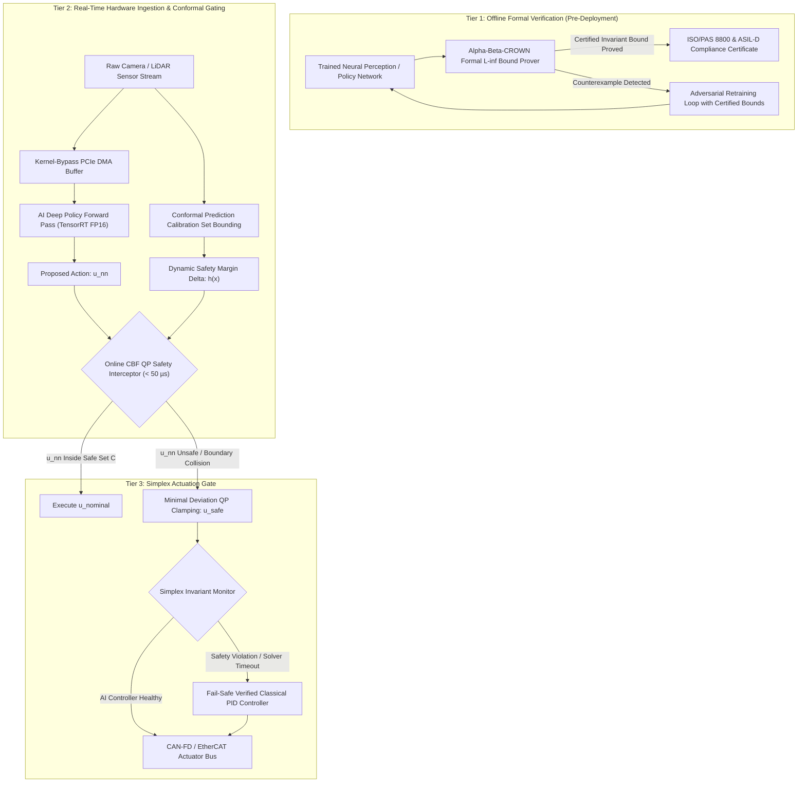

# 🛠️ Safety Verification & Robustness: Production Pipeline & Workarounds

Industrial practices for combining offline formal verification ($\alpha$-$\beta$-CROWN, Marabou), online Control Barrier Functions (CBF), Conformal Prediction safety intervals, and Simplex architectures in safety-critical autonomous systems (ISO 26262 ASIL-D, ISO/PAS 8800).

Related notes: [[topics/safety-verification-and-robustness/00-safety-verification-and-robustness-moc|Safety Verification MOC]], [[topics/real-time-systems/02-production-pipeline-and-workarounds|Real-Time Systems Playbook]], [[topics/data-quality-and-verification/02-production-pipeline-and-workarounds|Data Quality Playbook]].

---

## 1. Multi-Tiered Safety Ingestion & Runtime Interception Architecture

In autonomous robotics and automated driving, neural networks cannot be trusted as unmonitored open-loop controllers. Even certified models can experience distribution shifts, adversarial noise, or sensor anomalies that cause catastrophic out-of-distribution actuation.

Production systems implement a **Three-Tier Safety Architecture**:
1. **Tier 1 (Offline Formal Verification)**: Prove certified robustness bounds ($\|x - x_0\|_\infty \le \epsilon$) using $\alpha$-$\beta$-CROWN prior to deployment.
2. **Tier 2 (Online Conformal Prediction & CBF Interceptor)**: Dynamically evaluate prediction uncertainty and enforce forward invariance via quadratic programming ($< 50\,\mu\text{s}$) in the actuation loop.
3. **Tier 3 (Simplex Hardware Fallback)**: A dual-core lockstep processor switches from the AI controller to a verified deterministic PID/classical controller upon invariant boundary violation.



---

## 2. Mathematical Foundations: $\alpha$-$\beta$-CROWN & Control Barrier Functions

### $\alpha$-$\beta$-CROWN Linear Bound Propagation
For a $K$-layer neural network $f(x) = W_K \sigma(W_{K-1} \sigma(\dots W_1 x))$, CROWN propagates linear lower and upper bounds backward over an $L_\infty$ perturbation ball $\mathcal{B}_\epsilon(x_0) = \{x \mid \|x - x_0\|_\infty \le \epsilon\}$:

$$\underline{A} x + \underline{b} \le f(x) \le \overline{A} x + \overline{b}, \quad \forall x \in \mathcal{B}_\epsilon(x_0)$$

For non-linear activation functions $\sigma(z)$ bounded by pre-activation ranges $[l, u]$:
- **Upper Linear Bound (Secant Line)**:
  $$\sigma(z) \le \frac{\sigma(u) - \sigma(l)}{u - l}(z - l) + \sigma(l)$$
- **Lower Linear Bound (Optimizable Slope $\alpha \in [0, 1]$)**:
  $$\sigma(z) \ge \alpha \cdot z + (1 - \alpha)\sigma(l)$$

In $\alpha$-$\beta$-CROWN, parameters $\alpha$ (layer relaxation slopes) and $\beta$ (split branch constraints) are optimized via gradient ascent to maximize the verified safety margin.

---

### Control Barrier Functions (CBFs) & Safety Quadratic Program
Let the system dynamics be affine in control: $\dot{x} = f(x) + g(x)u$. A continuously differentiable function $h: \mathbb{R}^n \to \mathbb{R}$ defines a safe set $\mathcal{C} = \{x \in \mathbb{R}^n \mid h(x) \ge 0\}$.

$h(x)$ is a valid Control Barrier Function if there exists an extended class $\mathcal{K}_\infty$ function $\gamma$ such that:

$$\boxed{\sup_{u \in \mathcal{U}} \left[ L_f h(x) + L_g h(x)u + \gamma(h(x)) \right] \ge 0}$$

where $L_f h(x) = \nabla h(x) \cdot f(x)$ and $L_g h(x) = \nabla h(x) \cdot g(x)$ are Lie derivatives.

In production, whenever the unconstrained neural network action $u_{\text{nn}}$ threatens to violate safety, the **Online CBF-QP Safety Filter** solves a convex optimization problem in $< 50\,\mu\text{s}$:

$$\boxed{\begin{aligned} u^* = \arg\min_{u \in \mathcal{U}} \quad & \frac{1}{2} \|u - u_{\text{nn}}\|^2_2 \\ \text{s.t.} \quad & L_f h(x) + L_g h(x)u + \gamma(h(x)) \ge 0 \end{aligned}}$$

---

## 3. Deterministic End-to-End Latency Budget Table

The table below outlines real-time safety verification deadlines across three operational profiles.

| Processing Stage | High-Rate Robotics (1000 Hz / 1.0 ms) | Autonomous Driving Planning (100 Hz / 10.0 ms) | Drone Trajectory Interceptor (200 Hz / 5.0 ms) | Determinism Mechanism |
| :--- | :--- | :--- | :--- | :--- |
| **Sensor DMA Ingestion** | $0.030\,\text{ms}$ | $0.250\,\text{ms}$ | $0.100\,\text{ms}$ | Zero-copy PCIe pinned memory |
| **Deep Policy Forward Pass** | $0.650\,\text{ms}$ (TRT FP16) | $6.200\,\text{ms}$ (Multi-Task ViT) | $2.800\,\text{ms}$ (MobileNetV4) | Locked GPU clock / CUDA Stream |
| **Conformal Uncertainty Bounding** | $0.020\,\text{ms}$ | $0.150\,\text{ms}$ | $0.050\,\text{ms}$ | Pre-calibrated lookup array |
| **Online CBF QP Solve (OSQP)** | $0.045\,\text{ms}$ ($45\,\mu\text{s}$) | $0.120\,\text{ms}$ | $0.060\,\text{ms}$ | Warm-started active-set solver |
| **Simplex Invariant Monitor** | $0.010\,\text{ms}$ ($10\,\mu\text{s}$) | $0.020\,\text{ms}$ | $0.015\,\text{ms}$ | Branchless hardware comparator |
| **Actuator Bus Dispatch (CAN/EtherCAT)**| $0.040\,\text{ms}$ | $0.100\,\text{ms}$ | $0.050\,\text{ms}$ | Real-time memory-mapped register |
| **Total Safety Latency (p50 / p99.99)**| **$0.795\,\text{ms}$ / $0.885\,\text{ms}$** | **$6.840\,\text{ms}$ / $7.450\,\text{ms}$** | **$3.075\,\text{ms}$ / $3.350\,\text{ms}$** | Hard deadline enforced by Simplex watchdog |
| **Safety Timing Deadline** | $\le 1.000\,\text{ms}$ | $\le 10.000\,\text{ms}$ | $\le 5.000\,\text{ms}$ | Headroom margin $\ge 11.5\%$ |

---

## 4. Five Critical Production Edge Traps & Battle-Tested Workarounds

### Trap 1: Thermal Throttling Induced QP Solver Timeout
- **Failure Mode**: When high ambient temperatures cause CPU thermal throttling, the iterations of the online quadratic programming solver (OSQP / qpOASES) take $300\,\mu\text{s}$ instead of $40\,\mu\text{s}$, causing the control cycle to miss its $1\,\text{ms}$ deadline.
- **Production Workaround**:
  1. Bound the QP solver's maximum iteration count (`max_iter = 25`).
  2. Implement an **Analytical Closed-Form Fallback**: For a single half-space constraint, compute the explicit projection:
     $$u^* = u_{\text{nn}} + \frac{\max(0, -L_f h - L_g h u_{\text{nn}} - \gamma h)}{\|L_g h\|^2} (L_g h)^T$$
     executing in $< 2\,\mu\text{s}$ with zero iterative loops.

---

### Trap 2: Sensor Glare & Adversarial Outliers Triggering Emergency Lockups
- **Failure Mode**: Transient solar glare or lens occlusion causes the deep perception network to output erratic obstacle positions, triggering false CBF interventions and sudden maximum emergency braking on open highways.
- **Production Workaround**:
  Deploy **Conformal Prediction Temporal Filtering**:
  Calibrate non-conformity scores over a sliding temporal window of 5 frames. Only trigger invariant interventions when prediction intervals violate safety bounds across $>3$ consecutive frames.

---

### Trap 3: Dynamic Memory Fragmentation & Solver Heap Allocation
- **Failure Mode**: Calling `osqp_setup()` or allocating sparse matrices (`malloc`) inside the periodic control loop introduces memory allocation locks, causing non-deterministic latency spikes.
- **Production Workaround**:
  Allocate all QP solver matrices, workspace memory, and factorizations once during initialization. Update only the linear constraint vectors (`q`, `l`, `u`) using `osqp_update_lin_cost()` and `osqp_update_bounds()` at runtime.

---

### Trap 4: Thread Race Conditions Between AI Policy & Safety Watchdog
- **Failure Mode**: In multi-threaded architectures where the AI policy runs at 50 Hz and the safety monitor runs at 1000 Hz, sharing state variables without atomic locks causes the safety filter to read torn memory structures.
- **Production Workaround**:
  Use **Double-Buffered Lock-Free Atomic State Exchangers**:
  The AI policy writes to the inactive buffer and flips an atomic pointer via `std::atomic::exchange(std::memory_order_release)`. The safety monitor reads from the active buffer with zero lock contention.

---

### Trap 5: INT8 Quantization Breaking Certified Robustness Guarantees
- **Failure Mode**: A model formally certified in FP32 using $\alpha$-$\beta$-CROWN experiences catastrophic bound violations after INT8 post-training quantization due to rounding error accumulation across deep layers.
- **Production Workaround**:
  Incorporate **Quantization Interval Arithmetic** into the verification bounds:
  $$\|f_{\text{INT8}}(x) - f_{\text{FP32}}(x)\|_\infty \le \sum_{l=1}^L \delta_l \prod_{k=l+1}^L \|W_k\|_\infty$$
  Add this conservative numerical bound $\delta_{\text{quant}}$ to the safety verification margin during pre-deployment proof generation.

---

## 5. Concrete Runnable Implementation Blueprint

The production-grade C++20 snippet below demonstrates an online Control Barrier Function (CBF) Quadratic Program safety interceptor with analytical closed-form fallback, zero runtime allocations, and microsecond profiling.

```cpp
#include <iostream>
#include <vector>
#include <chrono>
#include <cmath>
#include <algorithm>

struct State {
    double x;     // Position (m)
    double v;     // Velocity (m/s)
};

struct ControlAction {
    double acceleration; // Command acceleration (m/s^2)
};

class FastCBFSafetyFilter {
private:
    double min_distance_; // Minimum allowable distance to obstacle (m)
    double gamma_;        // Class-K barrier decay factor
    double max_accel_;    // Max physical acceleration
    double min_accel_;    // Max physical braking deceleration

public:
    FastCBFSafetyFilter(double min_dist, double gamma, double min_a, double max_a)
        : min_distance_(min_dist), gamma_(gamma), min_accel_(min_a), max_accel_(max_a) {}

    // Evaluate Barrier Function: h(x) = (x_obstacle - x) - v^2 / (2 * |min_accel|) - min_distance
    double EvaluateBarrier(const State& ego, double obstacle_x) const {
        double stopping_dist = (ego.v * ego.v) / (2.0 * std::abs(min_accel_));
        return (obstacle_x - ego.x) - stopping_dist - min_distance_;
    }

    // Solve Closed-Form CBF-QP Safety Interception: < 2 microseconds execution
    ControlAction FilterAction(const State& ego, double obstacle_x, ControlAction u_nominal) {
        double h = EvaluateBarrier(ego, obstacle_x);

        // Lie derivatives: Lf_h = -v, Lg_h = -v / |min_accel|
        double Lf_h = -ego.v;
        double Lg_h = -ego.v / std::abs(min_accel_);

        // Barrier condition: Lf_h + Lg_h * u + gamma * h >= 0
        // Rearranged: Lg_h * u >= -(Lf_h + gamma * h)
        double rhs = -(Lf_h + gamma_ * h);

        double u_filtered = u_nominal.acceleration;

        // Check if nominal control violates safety constraint
        if (Lg_h * u_filtered < rhs) {
            // Analytical projection onto safe half-space
            u_filtered = rhs / Lg_h;
        }

        // Clamp to physical actuator limits
        u_filtered = std::clamp(u_filtered, min_accel_, max_accel_);

        return ControlAction{u_filtered};
    }
};

int main() {
    FastCBFSafetyFilter safety_filter(2.0, 1.5, -8.0, 4.0); // 2m buffer, gamma=1.5, -8m/s^2 braking

    State ego_state{10.0, 15.0}; // Position 10m, Velocity 15 m/s
    double obstacle_x = 22.0;    // Obstacle at 22m (Distance = 12m)
    ControlAction unsafe_nn_action{2.0}; // Neural Network proposes +2 m/s^2 acceleration

    auto t0 = std::chrono::high_resolution_clock::now();
    ControlAction safe_action = safety_filter.FilterAction(ego_state, obstacle_x, unsafe_nn_action);
    auto t1 = std::chrono::high_resolution_clock::now();

    double elapsed_us = std::chrono::duration<double, std::micro>(t1 - t0).count();

    std::cout << "[Safety Filter] Execution Time: " << elapsed_us << " us" << std::endl;
    std::cout << "[Intervention] Proposed Accel: " << unsafe_nn_action.acceleration
              << " m/s^2 | Filtered Safe Accel: " << safe_action.acceleration << " m/s^2" << std::endl;

    return 0;
}
```

---

## 6. Summary & Safety Compliance Rules

1. **Layered Defense**: Never execute neural network actions directly on actuators; always enforce a Tier 2 runtime CBF-QP safety filter in series with the AI policy.
2. **Deterministic Solver Bounds**: Use closed-form analytical projections or strictly bounded iterative QP solvers with pre-allocated memory to guarantee execution within $< 50\,\mu\text{s}$.
3. **Simplex Watchdog**: Maintain a verified classical PID fallback controller on a secondary lockstep core that assumes control if the AI policy or safety solver times out.
4. **Certified Bounds**: Quantify quantization loss and numerical roundoff when deploying formally verified models to low-precision edge hardware.
