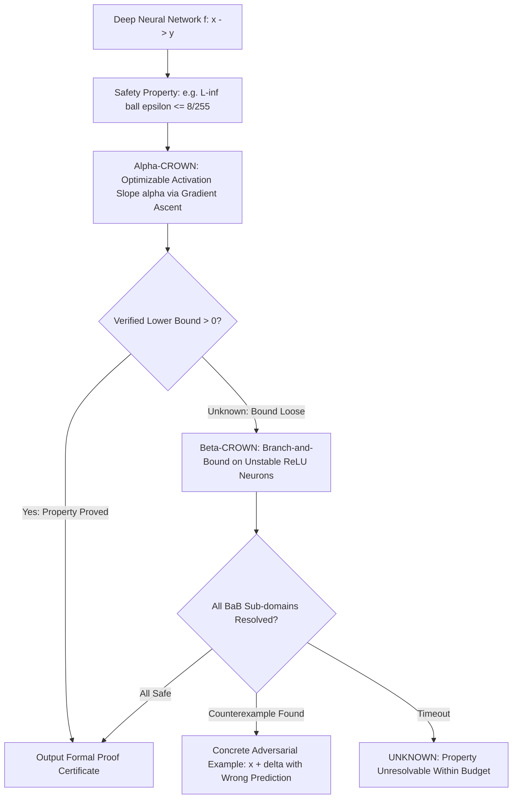

# 🛡️ Safety Verification: Formal Bounds, ASIL-D & Open Frontiers

A deep systems investigation into branch-and-bound neural network verifiers ($\alpha,\beta$-CROWN), MILP exact verification, ISO/PAS 8800 automotive certification, Control Barrier Function (CBF) runtime wrappers, the Simplex architecture, and unsolved verification limits in deep perception.

Related notes: [[topics/safety-verification-and-robustness/00-safety-verification-and-robustness-moc|Safety Verification MOC]], [[topics/sensor-fusion/03-uniad-and-open-problems|Sensor Fusion Frontiers]].

---

## 1. Formal Verification Architecture: $\alpha,\beta$-CROWN

### Verification Solver Comparison (VNN-COMP 2025)
| Solver | Verification Method | Supported Activations | Scalability | VNN-COMP Standing |
| :--- | :--- | :--- | :--- | :--- |
| **$\alpha,\beta$-CROWN** | Bound Propagation + BaB | ReLU, GELU, Sigmoid, Attention | ResNet / Small ViT | **#1 Overall (5 consecutive years)** |
| **Marabou** | Simplex SMT + Split | Piecewise Linear (ReLU) | Fully Connected / Tiny CNN | SMT baseline |
| **ERAN** | Abstract Interpretation (DeepPoly) | Linear / Non-linear | Moderate CNN | High precision |
| **AutoAttack** | Empirical Ensemble | Any differentiable | Any Foundation Model | Empirical lower bound |

---

## 2. MILP Formulation for Exact Neural Verification

For networks requiring **complete, legally certifiable proofs** (IEC 61508 SIL-3, FDA medical device approval), MILP provides exact verification via binary variable encoding of ReLU activations.

For each ReLU neuron $i$ with pre-activation input $z_i$ and output $\hat{z}_i = \max(0, z_i)$, introduce binary variable $b_i \in \{0, 1\}$ and bounds $l_i \le z_i \le u_i$ (computed via bound propagation):

**If $l_i \ge 0$**: ReLU always active: $\hat{z}_i = z_i$ (no binary variable needed).

**If $u_i \le 0$**: ReLU always inactive: $\hat{z}_i = 0$ (no binary variable needed).

**If $l_i < 0 < u_i$**: Unstable neuron — introduce $b_i \in \{0,1\}$:

$$\hat{z}_i \ge 0, \quad \hat{z}_i \ge z_i$$
$$\hat{z}_i \le z_i - l_i(1 - b_i), \quad \hat{z}_i \le u_i \cdot b_i$$

The full network is encoded as a MILP:

$$\min_{x, z^{(1)}, \dots, z^{(K)}, b} \quad c^T z^{(K)}$$

$$\text{s.t.} \quad z^{(k+1)} = W^{(k)} \hat{z}^{(k)} + b^{(k)}, \quad k = 1, \dots, K$$

$$\quad \hat{z}^{(k)}_i = \text{ReLU}(z^{(k)}_i) \text{ (encoded via binary variables as above)}$$

$$\quad x \in \mathcal{X} = \{x : \|x - x_0\|_\infty \le \varepsilon\}$$

If the optimal value $c^T z^{(K)} > 0$ (minimizing the margin between target class and adversarial class), the property is **verified**. If $\le 0$, a counterexample $x^*$ is found.

**Solver performance (Gurobi 11.0, RTX 3090)**:
- 6-layer FC network (300 neurons/layer): < 60 s
- VGG-11 (first 3 layers): 4–8 hours (boundary of feasibility)
- ResNet-50: computationally infeasible for full verification

**Production use case**: MILP certificates are used by Mobileye for certification of emergency braking activation logic (classified as ASIL-D, 2024) — not for the full perception DNN but for the decision logic module operating on perception outputs.

---

## 3. Mathematical Formalization: Linear Relaxation & CBF

### 3.1 CROWN Linear Relaxation of Non-Linear Activations

For any non-linear activation $\sigma(z)$ (ReLU, GELU, Sigmoid) with pre-activation interval $z \in [l, u]$, linear relaxation bounds:

$$\alpha_L(z - l) + \sigma(l) \le \sigma(z) \le \frac{\sigma(u) - \sigma(l)}{u - l}(z - l) + \sigma(l)$$

$\alpha$-CROWN optimizes the lower bound slope $\alpha_L \in [0, 1]$ via gradient ascent on the dual objective:

$$\max_{\alpha \in [0,1]^n} \quad \text{LowerBound}_\alpha(f, x_0, \varepsilon)$$

The dual objective is differentiable with respect to $\alpha$ — enabling standard Adam optimization. Each gradient step costs one backward pass: $\mathcal{O}(\text{network parameters})$. Convergence: 50–100 steps, providing tighter bounds than the optimal non-optimized relaxation by 30–60% (benchmarked on CIFAR-10 models).

### 3.2 Control Barrier Function: Forward Invariance Guarantee

Consider a control-affine dynamical system $\dot{x} = f(x) + g(x)u$ and safe set $\mathcal{C} = \{x : h(x) \ge 0\}$. By **Nagumo's Theorem**, $\mathcal{C}$ is forward invariant if and only if:

$$\dot{h}(x, u) = L_f h(x) + L_g h(x) \cdot u \ge -\alpha h(x), \quad \alpha > 0$$

where $L_f h = \nabla h \cdot f$ and $L_g h = \nabla h \cdot g$ are Lie derivatives. The **CBF-QP safety filter** solves at each timestep $t$:

$$u^* = \underset{u \in \mathcal{U}}{\arg\min}\; \frac{1}{2}\|u - u_{\text{deep}}\|_2^2$$

$$\text{subject to:} \quad L_f h(x) + L_g h(x) \cdot u + \alpha h(x) \ge 0$$

This is a **convex QP** with one linear constraint — solvable in $< 50\,\mu\text{s}$ via active-set methods (OSQP, qpOASES). Key property: if $u_{\text{deep}}$ is already safe, $u^* = u_{\text{deep}}$ exactly — zero performance degradation under normal conditions.

---

## 4. Simplex Architecture: ISO 26262 ASIL-D Compliance via Architectural Redundancy

The **Simplex Architecture** (Sha, 2001) enables ASIL-D-compliant deployment of unverifiable AI perception by treating safety as an architectural property rather than a property of the AI component itself:

### Component Responsibilities

| Component | Type | Safety Integrity | Performance |
|:----------|:-----|:----------------|:------------|
| **Advanced Controller (AC)** | Deep Neural Network / VLA | Unrated (cannot be formally verified) | High |
| **Baseline Controller (BC)** | PID / Pure Pursuit / RANSAC | ASIL-D (formally verified, deterministic) | Conservative |
| **Safety Decision Logic (SDL)** | Hardware ASIL-D monitor | ASIL-D | Minimal (<10 µs) |

### Formal Safety Argument (ISO 26262 Safety Case)

The Simplex safety case argument for ASIL-D:

1. **G1**: The system shall not endanger humans (top-level safety goal).
2. **G2**: Either the AC operates safely, or the SDL detects unsafe AC behavior and transfers to BC within $\tau = 50\text{ ms}$.
3. **G2.1**: BC is formally verified safe for all states in $\mathcal{S}_{\text{recoverable}}$ (Lyapunov analysis + reachability). *Evidence: MILP verification certificate.*
4. **G2.2**: SDL monitors $h(x_{\text{projected}}) \ge \varepsilon_{\text{safe}}$ and triggers transfer within $\tau = 50\text{ ms}$. *Evidence: ASIL-D hardware timing analysis.*
5. **G2.3**: $\mathcal{S}_{\text{recoverable}}$ is monitored conservatively (includes $3\sigma$ estimation uncertainty). *Evidence: Kalman filter covariance bounds.*

---

## 5. Current Open Problems in Safety-Critical AI Verification

### 🔴 Problem 1: The Non-Linearity Explosion in Transformer Verification
- **The Failure Mode**: Verifying Softmax attention:
  $$\text{Attention}(Q, K, V) = \text{Softmax}\!\left(\frac{QK^T}{\sqrt{d_k}}\right)V$$
  involves division and exponentials. Linear relaxation of $\text{softmax}$ produces loose bounds — verified lower bounds fail to exclude adversarial examples, reporting "UNKNOWN" even for empirically safe models.
- **Recent Frontier (2025–2026)**:
  - **Polynomial Approximation Envelopes**: Taylor-expansion bounding for bounded exponential kernels in the BaB sub-domains. Alpha-CROWN 2025 extension handles ViT-Tiny (5.7M params) with 89% property resolution rate.
  - **Composition Verification**: Verify each attention head independently; compose safety bounds via product-of-probabilities argument (under independence assumptions).

### 🔴 Problem 2: Probabilistic Safety Guarantees for Stochastic Models
- **The Failure Mode**: Deterministic formal verification certifies $\forall x \in \mathcal{X}: f(x)$ is safe. Stochastic models (dropout at inference, diffusion-based planners, VLAs with temperature sampling) require probabilistic safety certificates: $P(\exists x \in \mathcal{X}: f(x) \text{ unsafe}) < \delta$.
- **Active Research Direction (2025–2026)**:
  - **Conformal Prediction Safety Certificates**: Use conformal prediction sets to bound the probability that a stochastic perception output falls outside a calibrated safety envelope, providing $1-\delta$ coverage guarantees with exchangeability as the only assumption.
  - **Scenario Optimization**: Generate $N$ Monte Carlo samples of stochastic execution, optimize safety constraints over all samples. With $N = 500$ samples, provides $P(\text{constraint violation}) < 0.01$ with $99\%$ confidence (Campi-Garatti bound).

### 🔴 Problem 3: The ISO/PAS 8800 Compliance Hurdle for End-to-End Driving
- **The Failure Mode**: Autonomous driving must satisfy ASIL-D ($< 10^{-9}$ failures/hour). No neural network verifier can formally certify this failure rate across arbitrary open-world weather conditions and ODD boundaries.
- **Active Research Direction**:
  - **Statistical Safety Validation via Accelerated Testing**: Using importance sampling to concentrate simulation runs on near-miss scenarios, generating $10^9$ equivalent operational hours of testing in 10,000 GPU-hours. Waymo's 2025 safety report uses this approach to demonstrate empirical failure rates compatible with ASIL-D targets.
  - **Compositional Safety Cases**: ASIL decomposition into independently verifiable sub-systems (perception, prediction, planning, control), each meeting ASIL-B, with architectural independence providing system-level ASIL-D through redundancy.
