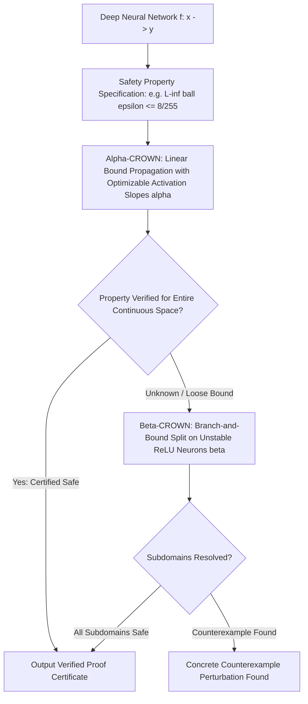

# 🛡️ Safety Verification: Formal Bounds, ASIL-D & Open Frontiers

A deep systems investigation into branch-and-bound neural network verifiers ($\alpha,\beta$-CROWN), ISO/PAS 8800 automotive certification, Control Barrier Function (CBF) runtime wrappers, and unsolved verification limits in deep perception.

Related notes: [[topics/safety-verification-and-robustness/00-safety-verification-and-robustness-moc|Safety Verification MOC]], [[topics/sensor-fusion/03-uniad-and-open-problems|Sensor Fusion Frontiers]].

---

## 1. Formal Verification Architecture: $\alpha,\beta$-CROWN

### Verification Solver Comparison
| Solver | Verification Method | Supported Activations | Scalability Tier | VNN-COMP Standing |
| :--- | :--- | :--- | :--- | :--- |
| **$\alpha,\beta$-CROWN** | Bound Propagation + Branch & Bound | ReLU, GELU, Sigmoid, Attention | ResNet / Small ViT | **#1 Overall Winner** |
| **Marabou** | Simplex SMT + Split-and-Conquer | Piecewise Linear (ReLU) | Fully Connected / Tiny CNN | SMT Standard |
| **ERAN** | Abstract Interpretation (DeepZ / DeepPoly)| Linear / Non-linear | Moderate CNN | High Precision |
| **AutoAttack** | Empirical Ensemble (APGD + Square) | Any differentiable network | Any Foundation Model | Empirical Baseline |

---

## 2. Mathematical Formalization: Linear Relaxation of Neurons

For any non-linear activation $\sigma(x)$ (e.g., ReLU), linear relaxation bounds the neuron between upper and lower linear functions over the input interval $[l, u]$:

$$\alpha_L (x - l) + \sigma(l) \le \sigma(x) \le \frac{\sigma(u) - \sigma(l)}{u - l}(x - l) + \sigma(l)$$

$\alpha$-CROWN optimizes the slope parameters $\alpha_L \in [0, 1]$ using gradient ascent on the dual objective, producing tighter bounds than standard interval arithmetic without requiring exponential branch-and-bound splitting.

---

## 3. Current Open Problems in Safety-Critical AI Verification

### 🔴 Problem 1: The Non-Linearity Explosion in Transformer Verification
- **The Failure Mode**: Verifying Softmax attention layers:
  $$\text{Attention}(Q, K, V) = \text{Softmax}\left(\frac{QK^T}{\sqrt{d_k}}\right)V$$
  involves division and exponential terms that produce loose upper/lower bounds during linear relaxation.
- **Consequence**: Verifiers report "UNKNOWN" (cannot prove safety) even when the model is empirically safe.
- **Recent Frontier Solutions (2025–2026)**:
  - **Polynomial Approximation Envelopes**: Taylor-expansion bounding for bounded exponential kernels with GPU-accelerated branch-and-bound.

---

### 🔴 Problem 2: The ISO/PAS 8800 Compliance Hurdle for End-to-End Driving
- **The Failure Mode**: Autonomous driving software must satisfy ASIL-D functional safety metrics ($<10^{-9}$ failures/hour). No neural network verifier can formally certify this failure rate across arbitrary open-world weather conditions.
- **Active Research Direction**:
  - **Simplex Architecture Pattern**: An untrusted AI perception model runs in parallel with a simple, formally verified classical LiDAR distance checker. An ASIL-D rated safety switch triggers a fail-safe stop if the AI commands violate the classical bounds.
