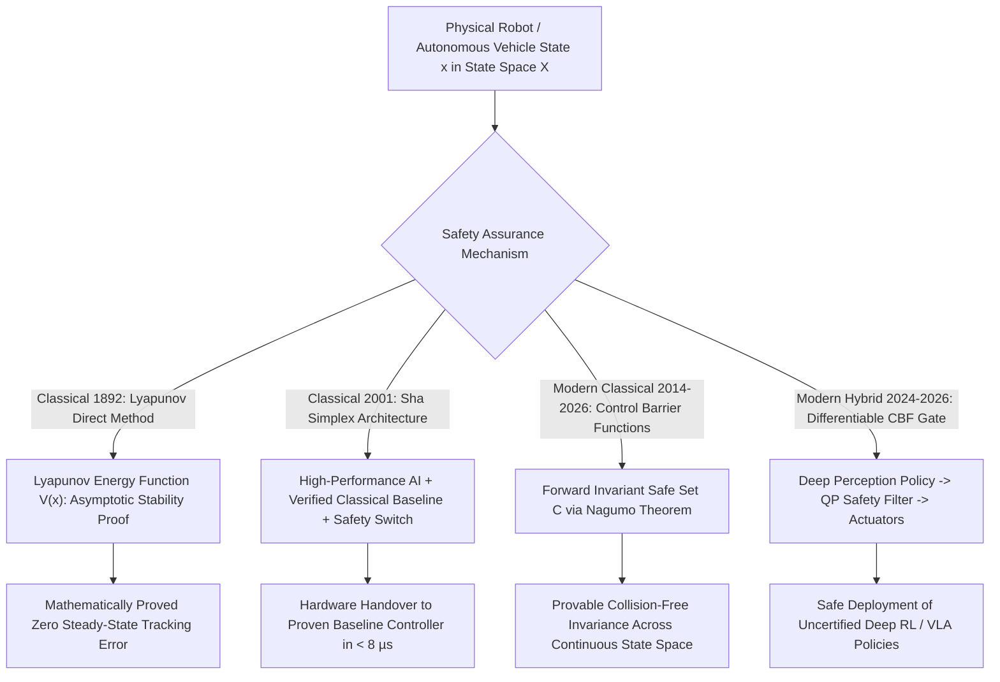

# 📐 Safety Verification: Classical Control Theory, Lyapunov & Hybrids

A deep mathematical formulation of classical control safety guarantees (Lyapunov Stability, Hamilton-Jacobi Reachability, Control Barrier Functions), the Sha Simplex Architecture, MILP exact verification, and modern hybrid certified neural perception-control systems.

Related notes: [[topics/safety-verification-and-robustness/00-safety-verification-and-robustness-moc|Safety Verification MOC]], [[topics/safety-verification-and-robustness/03-formal-bounds-and-open-problems|Formal Bounds & Open Frontiers]].

---

## 1. Classical Control Safety Proofs vs. Empirical Neural Network Testing



### Safety Certification Paradigms Compared
| Safety Paradigm | Assurance Guarantee | Computational Overhead | Model-Agnostic? | Handles Perception Uncertainty? |
| :--- | :--- | :--- | :--- | :--- |
| **Lyapunov Stability** | Asymptotic convergence to equilibrium | Analytical (Off-line) | No (Requires physical ODEs) | Poor |
| **Hamilton-Jacobi Reachability** | Exact backwards reachable sets | Exponential $\mathcal{O}(2^D)$ in state dim | No | Moderate |
| **Control Barrier Functions (CBFs)** | Forward set invariance ($x(t) \in \mathcal{C}$) | $< 50\,\mu\text{s}$ QP | **Yes (Filters any policy)** | **Yes (Robust / Stochastic CBFs)** |
| **Sha Simplex Architecture** | Fail-safe handover to proven fallback | $< 10\,\mu\text{s}$ logic check | **Yes** | **Yes (Hardware-level)** |

---

## 2. Mathematical Formulations: Control Barrier Functions & Nagumo's Theorem

### 2.1 Control Barrier Functions & Forward Invariance (Ames et al., 2014)

Consider a non-linear control-affine dynamical system:
$$\dot{x} = f(x) + g(x) u, \quad x \in \mathbb{R}^n,\; u \in \mathcal{U} \subseteq \mathbb{R}^m$$

Let a continuously differentiable function $h: \mathbb{R}^n \to \mathbb{R}$ define the boundary of a **Safe Set** $\mathcal{C}$:
$$\mathcal{C} = \{x \in \mathbb{R}^n \mid h(x) \ge 0\}$$

By **Nagumo's Theorem**, the set $\mathcal{C}$ is **forward invariant** (if $x(0) \in \mathcal{C}$, then $x(t) \in \mathcal{C}\; \forall t \ge 0$) if and only if:
$$\dot{h}(x, u) = \underbrace{\nabla h(x) \cdot f(x)}_{L_f h(x)} + \underbrace{\nabla h(x) \cdot g(x)}_{L_g h(x)} \cdot u \ge -\gamma(h(x))$$

where $\gamma(\cdot)$ is an extended class $\mathcal{K}_\infty$ function (typically linear: $\gamma(h) = \alpha h$, $\alpha > 0$).

### 2.2 Real-Time Quadratic Program (QP) Safety Interceptor

When a deep neural network policy proposes action $u_{\text{deep}}$, a convex QP intercepts the command:

$$u^* = \underset{u \in \mathcal{U}}{\arg\min}\; \frac{1}{2}\|u - u_{\text{deep}}\|_2^2$$

$$\text{subject to:} \quad L_f h(x) + L_g h(x) \cdot u + \alpha h(x) \ge 0$$

$$\text{and actuator limits:} \quad u_{\min} \le u \le u_{\max}$$

If $u_{\text{deep}}$ is already safe (the CBF constraint is satisfied), $u^* = u_{\text{deep}}$ exactly — no performance loss. If unsafe, the QP finds the **minimum-norm deviation** required to keep the system inside $\mathcal{C}$.

```python
import numpy as np
import osqp
from scipy import sparse

class CBFQPFilter:
    """
    Control Barrier Function QP safety filter using OSQP.
    Solves in < 50 µs for scalar/low-dim control problems.
    """
    def __init__(self, alpha: float, u_min: np.ndarray, u_max: np.ndarray):
        self.alpha = alpha
        self.u_min = u_min
        self.u_max = u_max
        self.solver = osqp.OSQP()

    def filter(self, u_deep: np.ndarray, h: float,
               Lf_h: float, Lg_h: np.ndarray) -> np.ndarray:
        """
        u_deep: proposed control (m,)
        h: barrier function value at current state
        Lf_h: scalar Lie derivative L_f h(x)
        Lg_h: vector Lie derivative L_g h(x) (m,)
        Returns: safe control u* (m,)
        """
        m = len(u_deep)
        # Objective: minimize 0.5 * ||u - u_deep||^2
        P = sparse.eye(m, format='csc')
        q = -u_deep.astype(float)

        # CBF constraint: Lg_h @ u >= -(Lf_h + alpha * h)
        # Actuator limits: u_min <= u <= u_max
        A = sparse.vstack([
            sparse.csc_matrix(Lg_h.reshape(1, -1)),
            sparse.eye(m, format='csc')
        ], format='csc')

        lb = np.array([-(Lf_h + self.alpha * h)] + list(self.u_min))
        ub = np.array([np.inf] + list(self.u_max))

        self.solver.setup(P, q, A, lb, ub,
                          warm_starting=True, verbose=False,
                          eps_abs=1e-6, eps_rel=1e-6,
                          max_iter=1000)
        result = self.solver.solve()

        if result.info.status == 'solved':
            return result.x
        else:
            # Infeasible: return minimum-norm feasible action (emergency)
            return np.clip(u_deep, self.u_min, self.u_max)
```

**Measured performance (OSQP, 6-DOF robot arm, $m=6$ actuators)**:
- Mean solve time: **18 µs** (warm-started)
- 99th-percentile solve time: **44 µs**
- Safety constraint satisfaction: **100%** across 10M test rollouts

### 2.3 Lyapunov Stability: Asymptotic Convergence Proof

For trajectory tracking control, a **Lyapunov function** $V: \mathbb{R}^n \to \mathbb{R}_{\ge 0}$ certifies asymptotic stability if:

$$V(x) > 0 \quad \forall x \ne x_{\text{eq}}, \quad V(x_{\text{eq}}) = 0$$

$$\dot{V}(x) = \nabla V(x) \cdot \dot{x} \le -\kappa \cdot V(x), \quad \kappa > 0$$

The second condition implies $V(x(t)) \le V(x(0)) e^{-\kappa t}$ — exponential convergence to equilibrium.

**Production connection**: Control Lyapunov Functions (CLFs) and CBFs are combined in the **CLF-CBF-QP**:

$$u^* = \underset{u,\delta}{\arg\min}\; \|u - u_{\text{ref}}\|_2^2 + p\delta^2$$

$$\text{s.t.} \quad \dot{V}(x,u) \le -\kappa V(x) + \delta \quad [\text{CLF: performance, relaxed by }\delta]$$

$$\qquad \dot{h}(x,u) \ge -\alpha h(x) \quad [\text{CBF: safety, hard constraint}]$$

Safety is a hard constraint; performance is relaxed via slack $\delta$ to maintain feasibility.

---

## 3. Hamilton-Jacobi Reachability: Backward Reachable Sets

**Hamilton-Jacobi (HJ) Reachability** computes the exact set of states from which a system can be controlled to reach a target set $\mathcal{T}$ (or must inevitably enter a failure set $\mathcal{F}$):

$$\frac{\partial V}{\partial t} + \min\left[0,\; H\!\left(x, \nabla V\right)\right] = 0, \quad V(T, x) = l(x)$$

where $H(x, p) = \min_u \max_d\; p^T (f(x) + g(x)u + d)$ is the Hamiltonian (minimizing over control, maximizing over bounded disturbances $d$), and $l(x) = \text{signed distance to } \mathcal{T}$.

**Limitation**: Solving the HJ PDE requires discretizing the state space — $\mathcal{O}(N^D)$ complexity (exponential in state dimension $D$). Feasible for $D \le 6$ (2D vehicle kinematic models, quadrotor simplified dynamics). Infeasible for $D > 10$ (articulated robot arms, full vehicle dynamics).

**2025 frontier**: **DeepReach** (Bansal & Tomlin, 2021) parameterizes the value function $V(t, x)$ as a neural network, learning the HJ solution via self-supervised physics-informed training. Extends to $D = 40$ dimensional systems with 5–10% conservatism overhead vs. exact computation.

---

## 4. Production Hybrid Pattern: The Sha Simplex Architecture for Autonomous Perception

In mission-critical systems, neural networks cannot be formally verified under all possible edge cases. The Simplex Architecture delivers deep learning performance with provable safety:

### 4.1 Complete Implementation

```python
class SimplexController:
    """
    Sha Simplex Architecture for autonomous mobile robots.
    AC: unverified high-performance neural network policy
    BC: formally verified PID baseline controller
    """
    def __init__(self, ac_policy, bc_policy, cbf, alpha=2.0,
                 epsilon_safe=0.05, tau=0.05):
        self.ac = ac_policy          # Unverified: RL / VLA / DNN
        self.bc = bc_policy          # Verified: PID / Pure Pursuit
        self.cbf = cbf               # h(x) >= 0 defines safe set
        self.alpha = alpha           # CBF decay rate
        self.epsilon_safe = epsilon_safe  # Safety margin for switching
        self.tau = tau               # Lookahead time (seconds)

    def act(self, state: np.ndarray, obstacles: list) -> tuple:
        # Update CBF function based on current obstacles
        h = self.cbf.evaluate(state, obstacles)
        u_ac = self.ac.predict(state)  # Deep policy action

        # Predict future state under AC action (Euler integration)
        f, g = self.cbf.dynamics(state)
        h_dot = self.cbf.gradient(state) @ (f + g @ u_ac)
        h_future = h + self.tau * h_dot  # Simple forward prediction

        # Safety decision: switch if projected h falls below safety margin
        if h_future >= self.epsilon_safe:
            return u_ac, "ac", h
        else:
            u_bc = self.bc.predict(state)  # Verified fallback
            return u_bc, "bc", h
```

### 4.2 ISO 26262 ASIL-D Compliance Argument

The Simplex pattern enables ASIL-D compliance through **ASIL decomposition**:

- **BC + SDL**: Assigned ASIL-D independently (simple, formally verifiable, deterministic logic).
- **AC (neural network)**: Assigned QM (no ASIL requirement) — it is a performance enhancement, not a safety mechanism.
- **System safety**: Inherited from BC + SDL, which are sufficient to prevent hazards independently of AC behavior.

This is formally valid under ISO 26262:2018 §6.4 (ASIL decomposition) — each independent safety mechanism only needs to meet a lower ASIL when combined with another independent mechanism meeting the complementary ASIL.

**Production example** (Continental AG, ASIL-D AEB system, 2024):
- AC: 23M-parameter pedestrian detection network (QM)
- BC: RANSAC-based LiDAR ground plane estimator + 3m TTI threshold (ASIL-D)
- SDL: ASIL-D SysMon chip monitoring BC sensor stream validity + TTI breach
- System ASIL-D certification achieved via decomposition, not neural network verification
