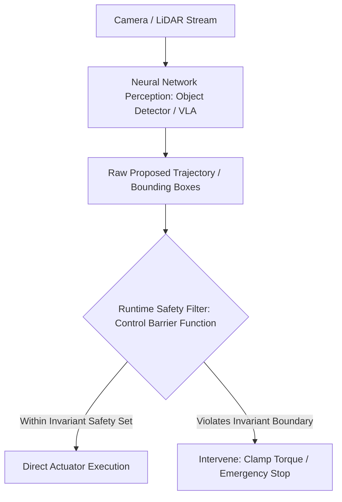

# 🛡️ Safety, Formal Verification & Robustness Playbook

# Overview
In safety-critical computer vision systems—such as autonomous vehicle trajectory planning, medical robotic surgery, and industrial human-collaborative automation—empirical testing alone cannot prove system safety. A model with 99.5% accuracy still fails unpredictably under out-of-distribution lighting or imperceptible adversarial noise. Achieving safety certification requires **formal mathematical bounds on neural network robustness**, strict compliance with international standards (**ISO 21448 / SOTIF** and **ISO/PAS 8800**), and runtime barrier safeguards.

Related notes: [[topics/sensor-fusion/03-uniad-and-open-problems|Sensor Fusion Frontiers]], [[topics/real-time-systems/03-preemption-and-open-problems|Real-Time Frontiers]].

## SOTA & Research
- **Formal Neural Network Verification**:
  - **$\alpha,\beta$-CROWN (VNN-COMP SOTA)**: Bound propagation and branch-and-bound solver that mathematically proves whether any input perturbation within an $L_\infty$ ball ($\epsilon \le 8/255$) can cause a misclassification.
  - **Marabou & ERAN**: SMT-based and abstract interpretation engines certifying piecewise-linear neural network properties.
- **Safety Standards for Artificial Intelligence**:
  - **ISO 21448 (SOTIF - Safety of the Intended Functionality)**: Methodologies for systematically reducing the area of "Unknown Unsafe" scenarios in machine perception systems.
  - **ISO/PAS 8800 (Road Vehicles - Safety and AI)**: Published in late 2024, providing direct functional safety requirements for neural network training data provenance, metric validation, and runtime safety envelopes.
- **Adversarial Defenses & Robustness**:
  - **Adversarial Training (AutoAttack / PGD)**: Minimax optimization forcing the model to minimize worst-case loss within an $L_p$ perturbation budget.
  - **Lipschitz-Constrained Networks**: Enforcing 1-Lipschitz bounds across layer weights (e.g., Orthogonal Convolutions / Cayley transforms) ensuring small input changes cannot produce unbounded output shifts.

## Architecture Alternatives & Trade-offs

| Verification / Safety Mechanism | Assurance Level | Computational Cost | Scalability Limit | Best Application |
| :--- | :--- | :--- | :--- | :--- |
| **Formal Verification ($\alpha,\beta$-CROWN)**| **Mathematical Guarantee** | Extreme (Hours per model) | ResNet / Small ViT scale | Safety-critical classification / obstacle clearance |
| **Empirical Adversarial Testing (AutoAttack)**| High Empirical Confidence | High (Minutes per batch) | Any model size | Foundation model security audits |
| **Control Barrier Functions (CBFs)** | **Runtime Guarantee** | **Sub-millisecond ($<100\mu\text{s}$)** | Independent of model size | Real-time robotics motor torque clamping |
| **Out-of-Distribution Detection (Energy / Mahalanobis)**| Statistical Flag | Negligible ($<1\text{ ms}$)| Any backbone | Warning flag to switch into safe fallback mode |

## Popular Repos & Integrations
- `Verified-Intelligence/alpha-beta-CROWN`: **$\alpha,\beta$-CROWN**: Multi-GPU accelerated complete neural network verifier (winner of multiple VNN-COMP competitions).
- `fra31/auto-attack`: **AutoAttack**: Industry-standard suite of diverse adversarial attacks for measuring adversarial robustness.
- `NeuralNetworkVerification/Marabou`: **Marabou**: SMT-based analysis framework for verifying deep neural networks.

## End-to-End Pipeline & Workarounds

### Production Workarounds for Safety-Critical Constraints:
1. **The Curse of Verifier Scalability**:
   - *Problem*: You cannot formally verify a 7-billion parameter VLA model with $\alpha,\beta$-CROWN.
   - *Workaround*: Do not verify the neural network itself. Instead, mathematically verify a lightweight **Classical Control Barrier Function (CBF)** downstream that intercepts the network's output commands and enforces kinematic boundary invariants.

## Deployment & Real-Time Notes
- **Hardware Watchdog Integration**:
  - Run the neural network in user space, but pair it with an isolated SIL-4 / ASIL-D safety microcontroller (e.g. Infineon AURIX or TI Hercules).
  - If the neural compute module fails to deliver a valid, verified heartbeat message within $20\text{ ms}$, the microcontroller forces the system into a mechanical fail-safe state.
